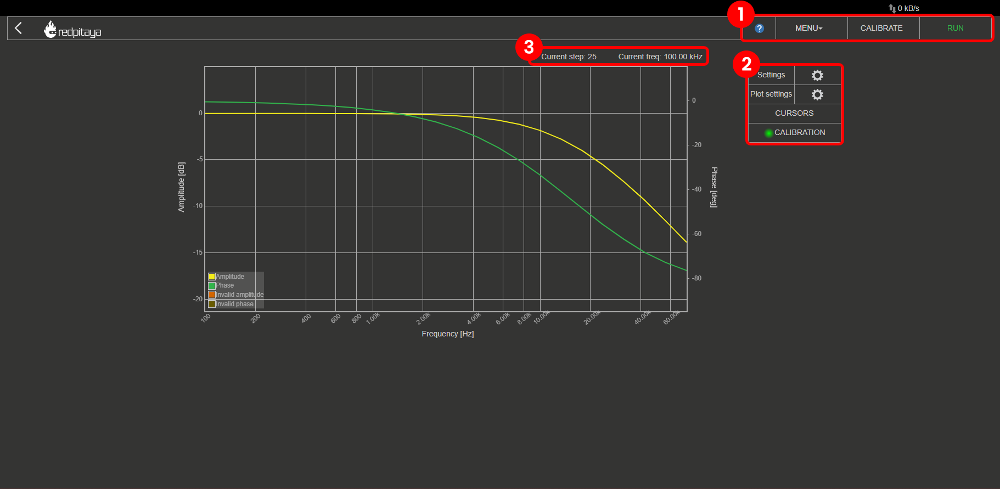
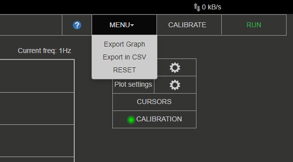
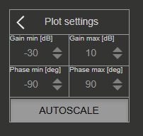
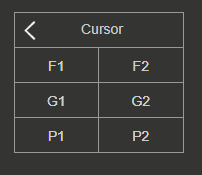
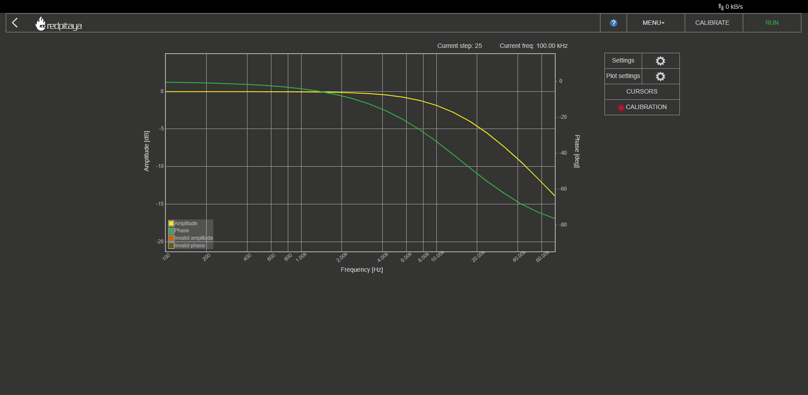

.. _bode_app:

#############
Bode Analyzer
#############

.. figure:: img/01_iPad_Combo_Bode.jpg
    :width: 1600

This application will turn your Red Pitaya into an affordable Bode analyzer. It is the perfect tool for educators, students, makers, hobbyists, and professionals seeking affordable, highly functional test and measurement equipment.

The Bode analyzer is an ideal application for measuring the frequency responses of passive and active filters, complex impedances, and any other electronic circuit. The Gain/Phase frequency response can be used to completely characterise any device under test. You can perform linear and logarithmic sweeps. Gain and phase can be measured from 1 Hz to 60 MHz.
The basic user interface enables quick interaction and parameter settings. The Bode analyzer can be used for the measurement of the stability of control circuits such as the DC/DC converters in power supplies, the influence of termination on amplifiers or filters, ultrasonic and piezoelectric systems, and similar.

The application is web-based and doesn't require the installation of any native software. Users can access them via any web browser (Google Chrome is recommended) using their smartphone, tablet or a PC running any popular operating system (MAC, Linux, Windows, Android, and iOS).

The graphical user interface of the Bode analyzer application is divided into 4 areas:

#. **Top settings menu:** Export data, Calibration, and Start or Stop the measurements.
#. **Measurement control pannel:** Set the measurement parameters, Plot settings, and put cursors on the main graph area.
#. **Current measurement data:** The current step number and frequency of generated pulses required for the measurement.
#. **Main graph area:** Main graph area is divided into Gain and Phase frequency response plots of the DUT (device under test).

Features
*********

The main features of the Bode analyzer application are:

   -   Measured parameters: Gain, Phase
   -   The Bode analyzer application will enable you to measure the gain and phase frequency response for the desired DUT (device under test).
   -   The frequency sweep range of the Bode analyzer application is from 1 Hz to 60 MHz with a 1 Hz resolution.
   -   Linear and logarithmic frequency sweep modes are available. The logarithmic sweep mode (scale) enables measurements in a large frequency range, while the linear sweep mode is used for measurements in a small frequency range.
   -   Excitation signal parameters (amplitude and DC bias) can be adjusted to make measurements in different sensitivities and conditions (amplifiers, etc.).
   -   The calibration function enables calibrating long leads and removing leads' and cables' effects on final measurements. The calibration will also calibrate your Red Pitaya if any parasitic effects are present. Bode calibration data is stored in **/tmp/ba_calib.data**.

To open the Bode analyzer, click on the coresponding icon in the main web interface:

.. figure:: img/Bode_analyzer.png
	:width: 800

Top settings menu
==================

Top settings menu contains the following functionality:

#. **Question mark button:** Leads to Bode analyzer documenatation webpage (here)
#. **Menu dropdown:**

	- *Export data:* Export the currently displayed data as either a “Graph” or a “CSV file”. If graph is chosen, a screenshot of the application is taken and automatically downloads via the browser. Otherwise, a CSV file with data is donwloaded from the board.
	- *Reset:* Resets all Bode analyzer application settings back to default.

#. **Calibrate button:** Start the calibration for the current setup.
#. **Stop/Run button:** Start and stop the measurement.

Measurement control panel
==========================

Here we can set measurement parameters such as the frequency range, scale, number of steps, excitation signal amplitude, excitation signal DC bias, and averaging number.

Settings
---------

.. figure:: img/Bode_analyzer_settings.png
	:width: 300

- **Start frequency [Hz]:** The Bode analyzer starts measuring the DUT frequency response at this frequency.
- **End frequency [Hz]:** The Bode analyzer ends measuring the DUT frequency response at this frequency.
- **Steps:** Number of measurements performed. The frequency range between **Start frequency** and **End frequency** is divided according to the **Scale** setting and measurements are performed at each point.
- **Scale:** Either liner or logarithmic sweep mode (scale). The logarithmic sweep mode enables measurements in a large frequency range, while the linear sweep mode is used for measurements in a small frequency range.
- **Analysis:** Determines how the calculations will be performed. Either U/I (voltage/current) or FFT.

At each frequency point Red Pitaya sends out a burst signal with **Period number** periods, one=way amplitude of **Amplitdue [V]**, offset **DC bias[V]**, and the frequency recalculated from the settings above.
The **Averaging** deterimines wheter the final measurement is an average of all sent pulses or not.

- **Period number:** Number of signal periods in a single measurement.
- **Amplitude [V]:** Excitation signal amplitude.
- **DC bias [V]:** Excitation signal DC bias (offset).
- **Averaging:** When ``1`` the result of each measurement is an average of all sent signal periods.
- **Invalid input data:** Button to show invalid measurements on the graph.
- **Analysis input threshold ppV:** Measured responses smaller than this setting will be treated as the minimal threshold value (for caluclation purposes).

.. note::

	The sum of **Amplitdue** and **DC bias** is capped at 1 Volt. For example, if Amplitude is set to 0.4 V, the DC bias can be set to a maximum of 0.6 V.

Plot settings
--------------

Settings for the plot.

- **Gain min, Gain max [dB]:** Minimum and maximum value on the amplitude axis (Y-axis, left side).
- **Phase min, Phase max [deg]:** Minimum and manxumum value on the phase axis (Y-axis, right side).
- **Autoscale:** When selected, the two settings above are ignored and calculated automatically from the measurements.

Cursor settings
---------------

Up to two cursors can be put on each of the axis. **F** stands for frequency, **G** for gain, and **P** for phase. The cursors each show the current value and the absolute difference between the two cursors on the same axis.
Cursors can be moved with *Click+Drag*.

Calibration
============

For optimal results, it is recommended to perform the Bode analyzer calibration each time the measurement setup is changed.
The calibration function enables calibrating long leads and removing leads' and cables' effects on final measurements. The calibration will also calibrate your Red Pitaya if any parasitic effects are present. Bode calibration data is stored in **/tmp/ba_calib.data**.

When uncalibrated, a **Red** light appears next to the **Calibration** status in the *Measurement control pannel*.

#. To perform the calibration, click on the **Calibrate** button in the *Top settings menu*. The following windows will pop up:

	.. figure:: img/Bode_analyzer_calibration_menu.png
		:width: 600

#. Check your setup and make sure all the connections correspond to the ones shown in the picture:

	- **IN1** connected to the input of the DUT (measures generated pulses).
	- **IN2** connected to the output of the DUT (measures filtered pulses).
	- **OUT1** connected to the input of the DUT (generates signal pulses).
	- **SHORT the input and ouput of DUT** with a wire.

	.. note::

		For optimal results use 50 Ω termination on the OUT1.

#. Click on the **Calibrate** button in the bottom-right of the calibration screen. The **Reset Calibration** button deletes any stored Bode calibration data. 
#. The calibration will go through the full frequency range of Red Pitaya (1 Hz to 62.5 MHz) in logarithmic mode and 500 points. Wait for the calibration to finish.
#. Once the calibration is complete a **Green** light appears next to the **Calibration** status in the *Measurement control pannel*.

	.. figure:: img/Bode_analyzer_calibrated.png
		:width: 800

#. **Disconnect the SHORT between input and ouput of DUT**.
#. Configure the settings and start the measurements.

Specifications
=============== 

  +--------------------------------------------+-------------------------------+--------------------------------+--------------------------------+
  |                                            | STEMlab 125-10 (discontinued) | | STEMlab 125-14               | SIGNALlab 250-12               |
  |                                            |                               | | STEMlab 125-14 Z7020         |                                |
  +--------------------------------------------+-------------------------------+--------------------------------+--------------------------------+
  | Frequency span                             | 1 Hz - 50 MHz                 | 1 Hz - 60 MHz                  | 1 Hz - 60 MHz                  |
  +--------------------------------------------+-------------------------------+--------------------------------+--------------------------------+
  | Frequency resolution                       | 1 Hz                          | 1 Hz                           | 1 Hz                           |
  +--------------------------------------------+-------------------------------+--------------------------------+--------------------------------+
  | Excitation signal amplitude                | 0 - 1 V                       | 0 - 1 V                        | 0 - 1 V                        |
  +--------------------------------------------+-------------------------------+--------------------------------+--------------------------------+
  | Excitation signal DC bias                  | 0 - 1 V (max 1 V - Amplit.)   | 0 - 1 V (max 1 V - Amplit.)    | 0 - 1 V (max 1 V - Amplit.)    |
  +--------------------------------------------+-------------------------------+--------------------------------+--------------------------------+
  | Resolution                                 | 10 bit                        | 14 bit                         | 12 bit                         |
  +--------------------------------------------+-------------------------------+--------------------------------+--------------------------------+
  | Maximum number of steps per measurement    | 1000                          | 1000                           | 1000                           |
  +--------------------------------------------+-------------------------------+--------------------------------+--------------------------------+
  | Max input amplitude                        | | ± 1 V (LV jumper settings), | |  ± 1 V (LV jumper settings), | |  ± 1 V (Low Gain),           |
  |                                            | | ± 20 V (HV jumper settings) | |  ± 20 V (HV jumper settings) | |  ± 20 V (High Gain)          |
  +--------------------------------------------+-------------------------------+--------------------------------+--------------------------------+
  | Measured parameters                        | Gain, Phase                   | Gain, Phase                    | Gain, Phase                    |
  +--------------------------------------------+-------------------------------+--------------------------------+--------------------------------+
  | Frequency sweep modes                      | Linear/Logarithmic            | Linear/Logarithmic             | Linear/Logarithmic             |
  +--------------------------------------------+-------------------------------+--------------------------------+--------------------------------+
  | Analysis modes                             | U/I, FFT                      | U/I, FFT                       | U/I, FFT                       |
  +--------------------------------------------+-------------------------------+--------------------------------+--------------------------------+

.. note::

    Please take care that the jumpers behind the :ref:`analog inputs <anain>` are set to the correct input range!

Source code
============

The |bode_anal_source_code| is available on our GitHub.

.. |bode_anal_source_code| raw:: html

  <a href="https://github.com/RedPitaya/RedPitaya/tree/master/apps-tools/ba_pro" target="_blank">Bode Analyzer source code</a>

