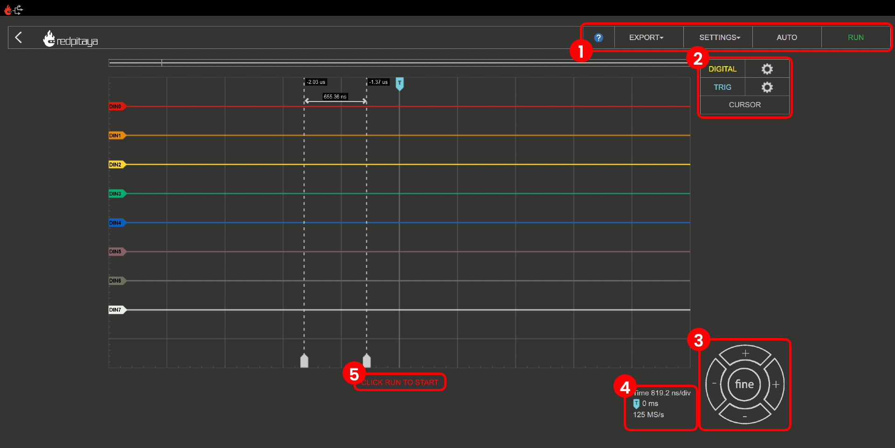
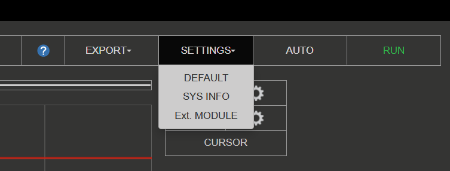
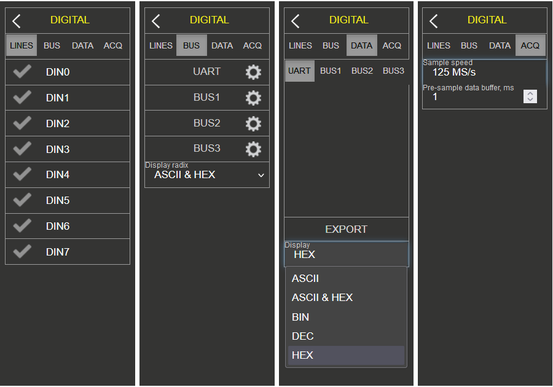
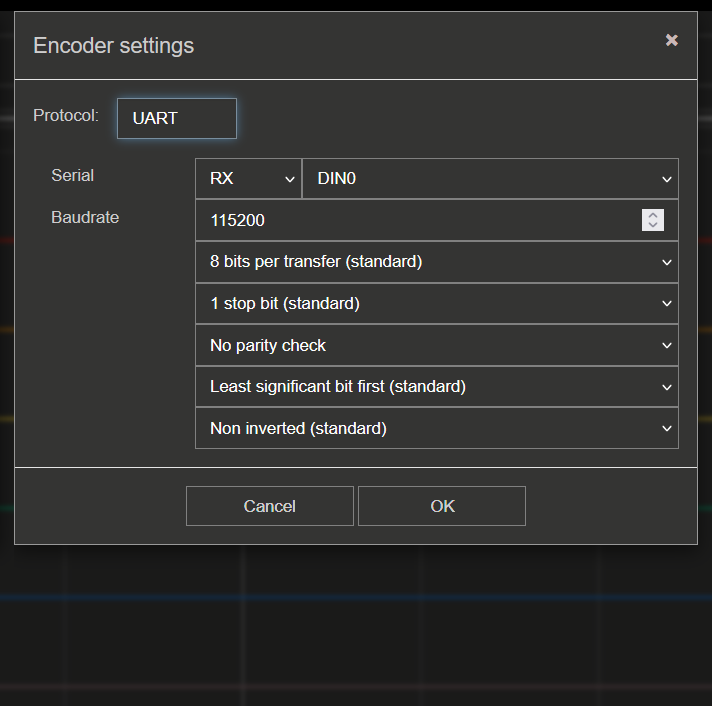
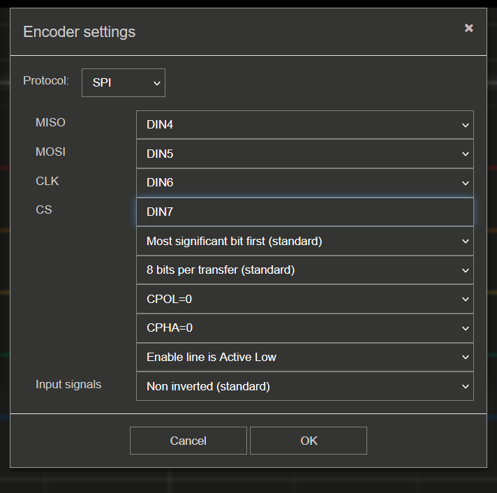
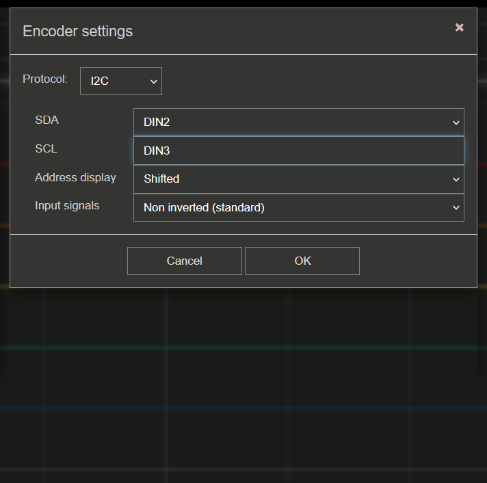
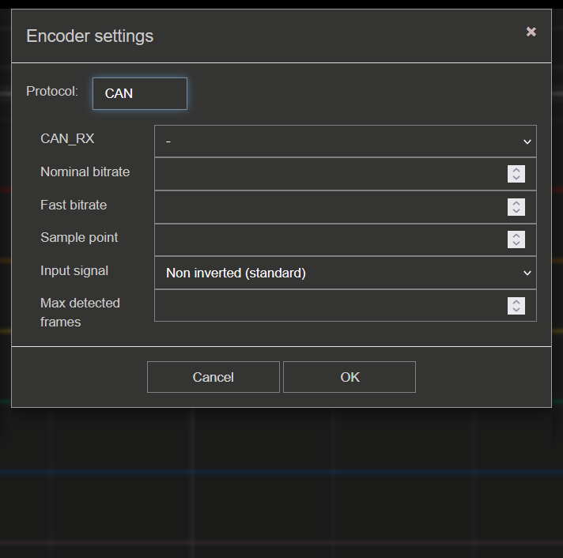
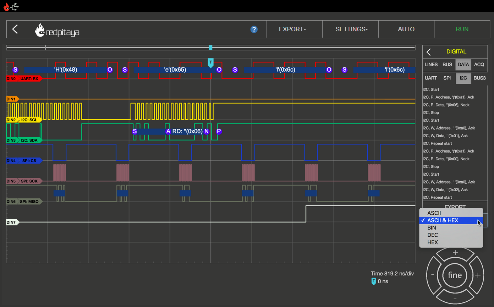
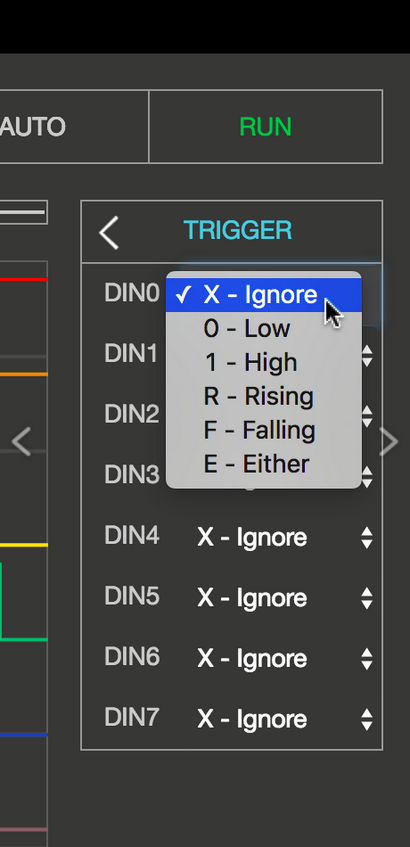
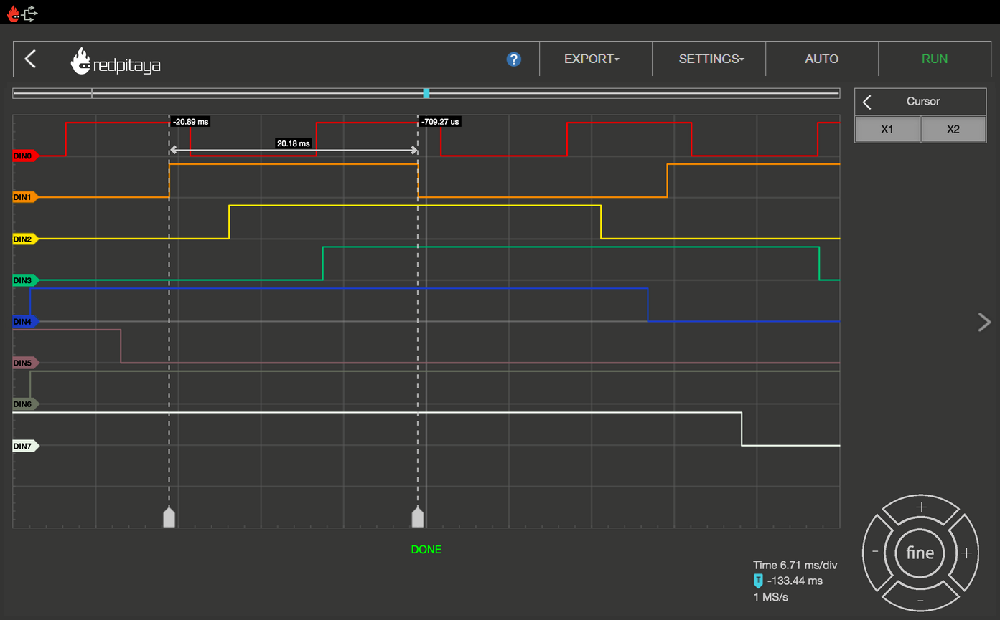

.. _la_app:

Logic Analyzer
##############

.. figure:: img/01_LA_ipad.jpg
	:width: 1600

The Logic Analyzer is used for analyzing digital signals. From binary signals, such as GPIO outputs of the Raspberry Pi or Arduino board, to analyzing different buses (I2C, SPI, UART and CAN) and decoding the transmitted data.
The application is web-based and doesn't require the installation of any native software. Users can access them via any web browser (Google Chrome is recommended) using their smartphone, tablet or a PC running any popular operating system (MAC, Linux, Windows, Android, and iOS).

Out-of-the-box it can be used to analyze digital signals up to 3.3 V. For higher voltage levels, an extension module is available that extends the voltage range to 5 V and provides protection for the GPIO pins. The Logic Analyzer application is available on all Red Pitaya models.

The user interface consists of the following elements:

    1. **Top Settings Menu:** Includes basic functions such as settings, export data, auto-scaling and run/stop measurements.
    #. **Digital / Trigger:** This menu allows you to configure the digital inputs and trigger settings.
    #. **Axis Control Panel:** Pressing the horizontal ± buttons changes the scale of the time axis (X axis). The vertical ± buttons change the amplitude axis (Y axis) and thus the displayed voltage range of the signal.
    #. **Time and Trigger Info:** Displays the current time frame per division, trigger position and sampling rate.
    #. **Status Display:** Displays information about the current recording status (stop, wait, ready).

Features
********

Top Settings Menu
=================

Provides contol over the Logic analyzer application. The blue question mark leads to this exact documentation page.

|

Settings
---------

    * **Default** - Resets the settings to the default values.
    * **Sys info** - Displays information on Red Pitaya board (FPS, data throughput, CPU load, memory usage).
    * **Ext. Module** - Check if the LA extension module is connected (inverses the logic levels).
    * **Stop/Run** - Stops/Starts the data acquisition/Logic analyzer. When STOP, the application ignores any trigger conditions.

Export
------

Exports the currently displayed data as either a "Graph" or a "File". If graph is chosen, a screenshot of the application is taken and automatically downloads via the browser. Otherwise, the data is exported in either WAV, CSV, or TDMS format, with the ability to normalize the data and export the view.

Autoscale
---------

Automatically sets up the Logic analyzer graph to best display the input signal.

Digital signal settings
=======================

The Logic Analyzer application can capture up to 8 different digital signals. The signals are displayed as binary values (0 or 1). The digital settings are accessible by clicking the gear icon next to the "DIGITAL" selection field.

The digital settings are split into four sections:

    * **Lines** - Enable or disable the individual digital channels.
    * **Bus** - Assign digital channels to a particular bus and configure the bus decoding settings.
    * **Data** - Display the decoded data of one or more busses in a table format.
    * **Acq** - Set the sample rate and pre-sample data buffer.

As long as no bus systems have been configured, the channels operate as purely digital inputs and correspondingly show progress. The **ACQ** tab opens the selection field for the sample rate settings. 

.. note::

    The sample rate (in the **Acq** tab) should be set to at least twice the baudrate of the measured digital signal.

.. note::

    The sample rate has a significant influence on the time section, which can be represented. The memory depth of the Logic Analyzer application is 1 MS, so it can store and display 1,000,000 binary values. From this, it is clear that the sampling rate determines how many values are recorded per second.
    If we chose the highest sampling rate (125 MS/s), 125,000,000 values would be recorded per second. Since 1,000,000 values can be stored in the time memory, we get a 0.008-second time window. With a sampling rate of 1 MS/s, the time window of the recorded signal will be one full second.

.. figure:: img/10_LA_trigger_setting.png
    :width: 1000

When the pre-sample data buffer value is set, the trigger event of the recording is located. This makes particular sense if you want to find out what happened before the defined trigger event. To illustrate with an example, the sample rate is set to 4 MS/s. The stored time segment thus amounts to approximately 0.25 s = 250 ms.
If the pre-sample data buffer is set to 10 ms, then the recorded signal shows what has happened 10 ms before the event and 240 ms after the event.

Lines
-----

The channels can be activated or deactivated by simply clicking the check mark. 

Bus encoder settings
--------------------

Select the desired decoding protocol. Up to different four buses can be defined. The available decoding protocols are UART, SPI, I2C and CAN. By selecting the desired protocol, the settings menu for the selected protocol is opened.

**UART**

The following settings can be adjusted:

    * **Serial line** - Select the digital channel that represents the TX or RX signal.
    * **Baud rate** - Set the baud rate of the UART signal.
    * **Data bits** - Set the number of data bits in the UART signal (5, 6, 7, 8, 9).
    * **Stop bits** - Set the number of stop bits in the UART signal (0, 0.5, 1, 1.5, 2).
    * **Parity** - Set the parity of the UART signal (None, Even, Odd, Mark, Space).
    * **Bit order** - Set the bit order of the UART signal (LSB first, MSB first).
    * **Polarity** - Set the polarity of the UART signal (Normal, Inverted).

**SPI**

The following settings can be adjusted:

    * **Input signals** - Select the digital channels that represent the MOSI, MISO, SCK, and CS signals.
    * **Bit order** - Set the bit order of the SPI signal (LSB first, MSB first).
    * **Data bits** - Set the number of data bits in the SPI signal (7, 8, 9).
    * **Clock polarity** - Set the clock polarity of the SPI signal (Low, High).
    * **Clock phase** - Set the clock phase of the SPI signal (Leading, Trailing).
    * **Enable** - Set the enable signal of the SPI signal (Low, High).
    * **Polarity** - Set the polarity of the SPI signals (Normal, Inverted).

**I2C**

The following settings can be adjusted:

    * **Input signals** - Select the digital channels that represent the SDA and SCL signals.
    * **Address display** - Set the address display of the I2C signal (shifted, unshifted).
    * **Polarity** - Set the polarity of the I2C signals (Normal, Inverted).

**CAN**

The following settings can be adjusted:

    * **Input signals** - Select the digital channels that represent the CAN_RX and CAN_TX signals.
    * **Nominal bit rate** - Set the nominal bit rate of the CAN signal.
    * **Fast bit rate** - Set the fast bit rate of the CAN signal.
    * **Sample point** - Set the sample point of the CAN signal.
    * **Polarity** - Set the polarity of the CAN signals (Normal, Inverted).
    * **Max detected frames** - Set the maximum number of detected frames.

Data
----

The decoded data of one or more busses can be displayed in a table format. The data can be displayed in ASCII, ASCII & HEX, DEC, BIN, or HEX format.

|

Trigger settings
================

The trigger settings are accessible by clicking the gear icon next to the "TRIG" selection field.

The trigger settings allow you to define the conditions under which data acquisition starts. Each digital channel can be set as a trigger source with specific criteria. The following trigger types are available:

    * **X - Ignore** - No event.
    * **0 - Low** - Low level.
    * **1 - High** - High level.
    * **R - Rising** - Rising edge.
    * **F - Falling** - Falling edge.
    * **E - Either** - Edge change (rising or falling edge).

The trigger condition is met when all digital channel trigger sources are in the desired state (only "AND" mode is available currently).

For acquisition to start, the trigger source and rising/falling/either edge need to be defined.

By clicking the **RUN** button, the recording is started. The status display informs you whether the process is still running (**WAITING**) or has already been completed (**DONE**). After finishing the acquisition, the results are displayed in a graph.
Additional trigger options, LOW and HIGH, are used for the so-called pattern triggering. For example, if you set the trigger source to be DIN0 - Rising edge (to have one channel defined as a trigger source with a rising or falling edge is a mandatory condition for the acquisition to start), 
DIN1 to HIGH and DIN2 to LOW, this will cause such behaviour that the application logic will wait for the state where DIN0 goes from 0 to 1, DIN1 is 1, and DIN2 is 0 to start the acquisition.

Cursors
========

As with the Oscilloscope, the Logic Analyzer App also provides CURSORS for quick measurements. Because there are no variable amplitude readings but only discrete signal levels, the cursors are available exclusively for the X-axis.
When enabled, the cursors will show the relative time to zero point (trigger event) and the difference between the two.

|

Hardware/Connections
********************

The Logic Analyser extension module is recommended for maximum performance of the Logic Analyzer application and protection of your Red Pitaya board. Using the LA extension module is straightforward; plug it into your Red Pitaya and connect the leads to the desired measurement points.

.. figure:: img/12_LA_probes.png
	:width: 1000

To use the Logic Analyzer without the extension module, you need to be more careful in connecting the logic analyser probes to the :ref:`E1 <E1_orig_gen>` on the Red Pitaya board (**3V3 logic ONLY**). The pins used for the logic analyser board are shown in the picture below.

The direct use of the GPIO :ref:`E1 <E1_orig_gen>` pins of the Red Pitaya board works on any Red Pitaya model. A connection example is shown in the image below (left).
    
.. figure:: img/13_LA_connect.png
	:width: 1000

|

Specifications
**************

.. table::
    :widths: 30 40 40

    +-------------------------+--------------------------+--------------------------+
    |                         | **Direct E1 connection** | **LA extension module**  |
    +=========================+==========================+==========================+
    | Channels                | 8                        | 8                        |
    +-------------------------+--------------------------+--------------------------+
    | Sampling rate (max.)    | 125 Msps                 | 125 Msps                 |
    +-------------------------+--------------------------+--------------------------+
    | Maximum Input Frequency | 50 MHz                   | 50 MHz                   |
    +-------------------------+--------------------------+--------------------------+
    | Supported bus protocols | I2C, SPI, UART, CAN      | I2C, SPI, UART, CAN      |
    +-------------------------+--------------------------+--------------------------+
    | Input voltage           | 3.3 V                    | 2.5 ... 5.5 V            |
    +-------------------------+--------------------------+--------------------------+
    | Overvoltage protection  | N/A                      | Integrated               |
    +-------------------------+--------------------------+--------------------------+
    | Level thresholds        | | 0.8V (low)             | | 0.8V (low)             |
    |                         | | 2.0V (high)            | | 2.0V (high)            |
    +-------------------------+--------------------------+--------------------------+
    | Input impedance         | 100 kΩ, 3 pF             | 100 kΩ, 3 pF             |
    +-------------------------+--------------------------+--------------------------+
    | Trigger types           | Level, edge, pattern     | Level, edge, pattern     |
    +-------------------------+--------------------------+--------------------------+
    | Memory depth            | 1 MS (typical)           | 1 MS (typical)           |
    +-------------------------+--------------------------+--------------------------+
    | Sampling interval       | 8 ns                     | 8 ns                     |
    +-------------------------+--------------------------+--------------------------+
    | Minimum pulse duration  | 10 ns                    | 10 ns                    |
    +-------------------------+--------------------------+--------------------------+

How to decode bus data?
***********************

Here is a quick tutorial on how to decode bus data using the Logic Analyzer application.

1. **Extension module** - If the LA extension module to the Red Pitaya board, check the "Ext. Module" box in the settings menu. This will invert the logic levels and protect the GPIO pins.
#. **Connect the probes** - Connect the probes to the desired measurement points.
#. **Select the digital channels** - In the "DIGITAL" menu, select the desired digital channels. Up to 8 channels can be selected.
#. **Configure the bus** - In the "BUS" menu, select the desired bus protocol (I2C, SPI, UART, CAN). Configure the bus settings (e.g., baud rate, data bits, etc.).
#. **Set trigger** - In the "TRIGGER" menu, configure the trigger condition.
#. **Start the measurement** - Click the "RUN" button to start the data acquisition. The status display will show "WAITING" until the trigger condition is met, and then "DONE" once the acquisition is complete.

|

The caputred data is detected automatically and decoded acording to the selected format.
The decoded data is placed as a separate layer in the graph directly on the signal and is available in table format in the *DIGITAL DATA* menu.

Source code
************

The `Logic Analyzer source code <https://github.com/RedPitaya/RedPitaya/tree/master/apps-tools/la_pro>`_ is available on our GitHub.

