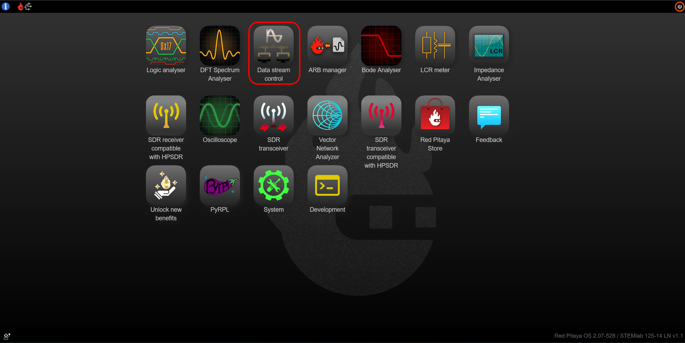

.. _streaming_top:

#########
Streaming
#########

The Streaming application enables users to stream data from Red Pitaya to:

    * A file saved on the Red Pitaya SD card
    * A file saved on a remote computer via the ethernet protocol (UDP or TCP).

The user can set:

    * The sampling frequency (rate)
    * Input channel count (Channel 1, Channel 2, or Both (4 Channels for STEMlab 125-14 4-Input))
    * Input channel resolution (8 or 16 bits)
    * Input attenuation (HV/LV mode) (for 125-xx, a switch of the jumper is required)
    * Whether to use the calibration or not (for 125-xx, the filter is also calibrated)
    * RAW / Volts mode
    * The number of samples or unlimited sampling

Streamed data can be stored into:

    * Standard audio WAV file format
    * Technical Data Management Streaming (TDMS) file format
    * Fast and compact binary format (BIN). It can be converted to CSV format.

Max. streaming speeds (per board) are limited to:

    * 10 MB/s for streaming to an SD card (SD card class 10 is recommended for optimal streaming performance)
    * 20 MB/s for streaming over 1 Gbit network (A :ref:`direct connection <dir_cab_connect>` is recommended to achieve the best streaming performance)

.. note::

   The maximum continuous streaming speeds (per board) are limited to the total input data rate, not the network transfer rates. If the maximum data rate is exceeded, the data pipeline inside Red Pitaya starts to clog, which leads to unpredictable behaviour.
   Here are a few examples of maximum data rates:

      - One channel, 8-bits per sample: Max sampling frequency 20 MHz.
      - One channel, 16-bits per sample: Max sampling frequency 10 MHz.
      - Two channels, 8-bits per sample: Max sampling frequency per channel 10 MHz (assuming same frequencies for both channels)
      - Two channels, 16-bits per sample: Max sampling frequency per channel 5 MHz (assuming same frequencies for both channels)

   If acquiring a limited amount of samples in a short duration, it is possible to reach higher sampling frequencies (up to the sampling speed of fast analog inputs).

**Minumum streamed data size**

To increase the efficiency of the application, there is a minimum data size that can be sent through the network. This can have a big impact at high decimation values, as it takes a long time to fill a chunck. If the stream is stopped before a chunck is completed, the data is discarded and the saved file has a size of **0 b**.

Here are the minimum chunck limitations sorted by file type and units:

.. list-table::
   :widths: 20 20 20
   :header-rows: 1

   * - File type \\ Units
     - VOLTS
     - RAW
   * - WAV 
     - 128.043 kb
     - 64.043 kb
   * - TDMS
     - 128.133 kb
     - 64.133 kb
   * - BIN
     - 64.090 kb
     - 64.090 kb

.. note::

   We plan to expand the functionality by adding the generation to the Streaming application in the future. For now, it is possible for a user to implement it by themselves.

Getting started with the Red Pitaya streaming feature
=======================================================

Run the Streaming app from the Red Pitaya Web interface

Stream locally to a file on Red Pitaya's SD card
=================================================

.. tabs::

    .. group-tab:: OS version 2.00-15 or older

        #. Configure the stream properties & click **RUN**

            .. figure:: img/settings.png
                :width: 800
            
            Example: streaming on ch1, 8-bit resolution, 5.208 MS/s into TDMS file format

        #. Press **STOP** to stop streaming

        #. Click *Browse* to open the data file directory. Each data stream is split into three sections; *DATA* (collected data stream), *.log* (data log of the specific stream), *.log.lost* (report on lost packets). Click on the selected file to download it from Red Pitaya to the computer.

            .. figure:: img/capture.png
                :width: 800
                :align: center

        #. Open the file in a program that supports the selected file format, visualisation, and processing, such as |DIAdem| for TDMS files, or |Audacity| for WAV.

            .. figure:: img/diadem_tdms_file_viewer.png
                :width: 800
                :align: center

    .. group-tab:: OS version 2.00-23 or newer

        #. Configure the stream properties & click **RUN**

            .. figure:: img/Streaming_app_local.png
                :width: 1000
            
            Example: streaming on CH1 and CH2, 8-bit resolution, 100 ksps into WAV file format

        #. Press **STOP** to stop streaming

        #. Check the *Files on SD card* section for the data files. Each data file has three buttons; *LOG* (data log of the specific stream), *LOST* (report on lost packets), and *DOWNLOAD* (collected data stream). Click on the selected file to download it from Red Pitaya to the computer.

            .. figure:: img/Streaming_app_local.png
                :width: 1000
                :align: center

        #. Open the file in a program that supports the selected file format, visualisation, and processing, such as |DIAdem| for TDMS files, or |Audacity| for WAV.

            .. figure:: img/diadem_tdms_file_viewer.png
                :width: 800
                :align: center

Streaming to a remote computer via Command Line or Terminal
=============================================================

.. tabs::

    .. group-tab:: OS version 2.00-15 or older

        #. Download the streaming client for your computer. Clients are located on the board itself and can be downloaded from there.

            .. figure:: img/download_client.png
                :width: 800
                :align: center

        #. Configure the stream properties & click **RUN**

                .. figure:: img/tcp_settings.png
                    :width: 300
                    :align: center

                Example: streaming on CH1, 16-bit resolution 5 Msps, TCP

        #. Execute the *streaming client* via *Command Line or Terminal* on a remote computer (copy the IP address from the web interface and choose the required file format).

                .. tabs::

                    .. group-tab:: WAV

                        .. code-block:: console

                            rpsa_client.exe -h 192.168.1.29 -p TCP -f ./ -t wav

                        .. figure:: img/tcp_client.png
                            :width: 600
                            :align: center

                        Data streaming can be stopped by pressing *Ctrl+C*.

                        The created wav file can be read or viewed in |Audacity| or another program that supports WAV file type:

                        .. figure:: img/audacity.png
                            :width: 600
                            :align: center

                    .. group-tab:: TDMS

                        .. code-block:: console

                            rpsa_client.exe -h 192.168.1.29 -p TCP -f ./ -t tdms

                        .. figure:: img/tcp_client2.png
                            :width: 600
                            :align: center

                        Data streaming can be stopped by pressing *Ctrl+C*.

                        The created tdms file can be read or viewed in |DIAdem| or another program that supports TDMS file type.

                        .. figure:: img/diadem_tdms_file_viewer.png
                            :width: 600
                            :align: center

                    .. group-tab:: CSV

                        .. code-block:: console

                            rpsa_client.exe -h 192.168.1.29 -p TCP -f ./ -t csv -s 100000 -v

                        .. figure:: img/tcp_client3.png
                            :width: 600
                            :align: center

                        The application saves data from the board in binary (BIN) format.

                        .. figure:: img/csv_list.png
                            :width: 600
                            :align: center

                        The binary file can be converted using the *convert_tool* application.

                        .. figure:: img/csv_list.png
                            :width: 600
                            :align: center

                        The created CSV file can be opened with any text editor, spreadsheet editor, or any other application that supports the CSV file type:

                        .. figure:: img/csv_view.png
                            :width: 600
                            :align: center

                        .. note::

                            Using the *convert_tool application* you can also see the structure of the received file and the state of the file.

                            .. figure:: img/csv_state.png
                                :width: 600
                                :align: center

    .. group-tab:: OS version 2.00-23 or newer

        #. Download the *command line streaming client* for your computer. Clients are located on the board itself and can be downloaded from there.

            .. figure:: img/Streaming_app_cmd_clients.png
                :width: 1000
                :align: center

        #. Configure the stream properties & click **RUN**

                .. figure:: img/Streaming_app_network.png
                    :width: 1000
                    :align: center

                Example: streaming on CH1 and CH2, 16-bit resolution, 100 ksps, TCP 

        #. Execute the *streaming client* via *Command Line or Terminal* on a remote computer (copy the IP address from the web interface and choose the required file format).

                .. tabs::

                    .. group-tab:: WAV

                        .. code-block:: console

                            rpsa_client.exe -h 192.168.1.29 -p TCP -f ./ -t wav

                        .. figure:: img/tcp_client.png
                            :width: 600
                            :align: center

                        Data streaming can be stopped by pressing *Ctrl+C*.

                        The created wav file can be read or viewed in |Audacity| or another program that supports WAV file type:

                        .. figure:: img/audacity.png
                            :width: 600
                            :align: center

                    .. group-tab:: TDMS

                        .. code-block:: console

                            rpsa_client.exe -h 192.168.1.29 -p TCP -f ./ -t tdms

                        .. figure:: img/tcp_client2.png
                            :width: 600
                            :align: center

                        Data streaming can be stopped by pressing *Ctrl+C*.

                        The created tdms file can be read or viewed in |DIAdem| or another program that supports TDMS file type.

                        .. figure:: img/diadem_tdms_file_viewer.png
                            :width: 600
                            :align: center

                    .. group-tab:: CSV

                        .. code-block:: console

                            rpsa_client.exe -h 192.168.1.29 -p TCP -f ./ -t csv -s 100000 -v

                        .. figure:: img/tcp_client3.png
                            :width: 600
                            :align: center

                        The application saves data from the board in binary (BIN) format.

                        .. figure:: img/csv_list.png
                            :width: 600
                            :align: center

                        The binary file can be converted using the *convert_tool* application.

                        .. figure:: img/csv_list.png
                            :width: 600
                            :align: center

                        The created CSV file can be opened with any text editor, spreadsheet editor, or any other application that supports the CSV file type:

                        .. figure:: img/csv_view.png
                            :width: 600
                            :align: center

                        .. note::

                            Using the *convert_tool application* you can also see the structure of the received file and the state of the file.

                            .. figure:: img/csv_state.png
                                :width: 600
                                :align: center

.. |DIAdem| raw:: html

    <a href="https://www.ni.com/en-us/shop/data-acquisition-and-control/application-software-for-data-acquisition-and-control-category/what-is-diadem.html" target="_blank">DIAdem</a>

.. |Audacity| raw:: html

    <a href="https://www.audacityteam.org" target="_blank">Audacity</a>

Instructions for the rpsa_client
-----------------------------------

1. **Detect Mode**

	This mode allows you to determine the IP addresses that are in the network in streaming mode. By default, the search takes 5 seconds.

	Options:

   	.. code-block:: console

		rpsa_client.exe -d [-p PORT] [-t SEC]
		rpsa_client.exe --detect [--port=PORT] [--timeout=SEC]

		--detect               -d           Enable broadcast search.
		--port=PORT            -p PORT      Port for broadcast (Default: 8902).
		--timeout=SEC          -t SEC       Timeout(Default: 5 sec).

2. **Configuration Mode**

	This mode allows you to get or set the configuration on the boards.

	Options:

	.. code-block:: console

        rpsa_client.exe -c -h IPs [-p PORT] -g V|VV|F [-v]
        rpsa_client.exe -c -h IPs [-p PORT] -s M|F [-f FILE] [-v]
        rpsa_client.exe --config --hosts=IPs [--port=PORT] --get=V|VV|F [--verbose]
        rpsa_client.exe --config --hosts=IPs [--port=PORT] --set=M|F [--config_file=FILE] [--verbose]

        --config               -c           Enable config mode.
        --hosts=IP,...         -h IP,...    You can specify one or more board IP addresses through a separator - ','
                                            Example: --hosts=127.0.0.1 or --hosts=127.0.0.1,127.0.0.2
                                                      -h 127.0.0.1     or  -h 127.0.0.1,127.0.0.2,127.0.0.3
        --port=PORT            -p PORT      Port for configuration server (Default: 8901).
        --get=V|V1|VV|F        -g V|V1|VV|F Requests configurations from all boards.
                                            Keys: V  = Displays on the screen in json format.
                                                  V1 = Displays on the screen in json format (only data).
                                                  VV = Displays on the screen in a format with decoding values.
                                                  F  = Saves to a config files.
        --set=M|F              -s M|F       Sets configurations for all boards.
                                            Keys: M  = Sets values only to memory without saving to file.
                                                  F  = Sets configuration and saves to file on remote boards.
        --config_file=FILE     -f FILE      Configuration file for setting values on boards (Default: config.json).
        --verbose              -v           Displays service information.

3. **Remote control Mode**
      
    This mode allows you to control streaming as a client.

    Options:

	.. code-block:: console
            
		rpsa_client.exe -r -h IPs [-p PORT] -m start|stop|start_stop|start_dac|stop_dac|start_stop_dac [-t MSEC] [-v]
        rpsa_client.exe --remote --hosts=IPs [--port=PORT] --mode=start|stop|start_stop|start_dac|stop_dac|start_stop_dac [--timeout=MSEC] [--verbose]

        --remote               -r           Enable remote control mode.
        --hosts=IP,...         -h IP,...    You can specify one or more board IP addresses through a separator - ','
                                            Example: --hosts=127.0.0.1 or --hosts=127.0.0.1,127.0.0.2
                                                      -h 127.0.0.1     or  -h 127.0.0.1,127.0.0.2,127.0.0.3
        --port=PORT            -p PORT      Port for configuration server (Default: 8901).
        --mode=MODE            -m MODE      Commands for managing servers.
                                             Keys: start = Starts the server.
                                                   stop = Stop the server.
                                                   start_stop = Sends a start command at the end of the timeout sends a stop command.
                                                   start_dac = Starts the DAC server.
                                                   stop_dac = Stop the DAC server.
                                                   start_stop_dac = Sends a start command at the end of the timeout sends a stop command for DAC mode.
        --timeout=MSEC         -t MSEC      Timeout (Default: 1000 ms). Used only in conjunction with the start_stop command.
        --verbose              -v           Displays service information.

4. **Streaming Mode**

    This mode allows you to control streaming as a client, and also captures data in network streaming mode.

    Options:

   .. code-block:: console

        rpsa_client.exe -s -h IPs [-p PORT] [-c PORT] -f tdms|wav|csv|bin [-d NAME] [-m raw|volt] [-l SAMPLES] [-t MSEC] [-v] [-b TD|F]
        rpsa_client.exe --streaming --hosts=IPs [--port=PORT] [--config_port=PORT] --format=tdms|wav|csv|bin [--dir=NAME] [--limit=SAMPLES] [--mode=raw|volt] [--timeout=MSEC] [--verbose] [--benchmark=TD|F]

        --streaming            -s           Enable streaming mode.
        --hosts=IP,...         -h IP,...    You can specify one or more board IP addresses through a separator - ','
                                            Example: --hosts=127.0.0.1 or --hosts=127.0.0.1,127.0.0.2
                                                      -h 127.0.0.1     or  -h 127.0.0.1,127.0.0.2,127.0.0.3
        --port=PORT            -p PORT      Port for streaming server (Default: 8900).
        --config_port=PORT     -c PORT      Port for configuration server (Default: 8901).
        --format=FORMAT        -f FORMAT    The format in which the data will be saved.
                                            Keys: tdsm = NI TDMS File Format.
                                                  wav = Waveform Audio File Format.
                                                  csv = Text file that uses a comma to separate values.
                                                  bin = Binary format.
        --dir=NAME             -d NAME      Path to the directory where to save files.
        --limit=SAMPLES        -l SAMPLES   Sample limit [1-2147483647] (no limit by default).
        --mode=MODE            -m MODE      Convert values in volts (store as ADC raw data by default).
                                            Keys: raw = 8/16 Bit binary raw format.
                                                  volt = Converts binary integer format to floating point format.
                                                         Measured in volts. In wav format, it is limited from -1 to 1.
        --timeout=MSEC         -t MSEC      Stops recording after a specified amount of time.
        --verbose              -v           Displays service information.
        --benchmark=MODE       -b MODE      Starts the throughput test mode at the current settings.
                                            Keys: TD = Adds validation of data. Works only in network test mode.
                                                  F  = Full system performance testing.

5. **DAC streaming Mode**

    This mode allows you to generate output data using a signal from a file.

    Options:

   .. code-block:: console

        rpsa_client.exe -o -h IPs [-p PORT] [-c PORT] -f tdms|wav -d FILE_NAME [-r inf|COUNT] [-m SIZE] [-v] [-b]
        rpsa_client.exe --out_streaming --hosts=IPs [--port=PORT] [--config_port=PORT] --format=tdms|wav --data=FILE_NAME [--repeat=inf|COUNT] [--memory SIZE] [--verbose] [--benchmark]
        rpsa_client.exe -oc CONFIG_FILE
        rpsa_client.exe --out_streaming_conf CONFIG_FILE

        --out_streaming        -o           Enable dac streaming mode.
        --out_streaming_conf   -oc          Enable dac streaming mode.
        --hosts=IP,...         -h IP,...    You can specify one or more board IP addresses through a separator - ','
                                            Example: --hosts=127.0.0.1 or --hosts=127.0.0.1,127.0.0.2
                                                      -h 127.0.0.1     or  -h 127.0.0.1,127.0.0.2,127.0.0.3
        --port=PORT            -p PORT      Port for dac streaming server (Default: 8903).
        --config_port=PORT     -c PORT      Port for configuration server (Default: 8901).
        --format=FORMAT        -f FORMAT    The format in which the data will be used.
                                            Keys: tdsm = NI TDMS File Format.
                                                  wav = Waveform Audio File Format.
        --data=FILE_NAME       -d FILE_NAME Path to the file for streaming.
        --memory=SIZE          -m SIZE      Use RAM cache.
                                                Example: --mmemory 1048576 or --memory 1M or --memory 1024k
                                                         -m 1048576 or -m 1M or -m 1024k
                                                Default: 1M bytes
        --repeat=inf|COUNT     -r inf|COUNT The number of times the file has been resent.
                                            Keys: inf is an infinite number of times.
                                               COUNT - value from [1 ... 1000000]
        --verbose              -v           Displays service information.
        --benchmark            -b           Starts the throughput test mode at the current settings.

Streaming to a remote computer via Desktop Application (Linux, Windows)
=========================================================================

.. note::

    The streaming client application currently does not work on Windows 11. This issue will be fixed in the future.

The other option for streaming is utilyzing the Desktop Application.

#. Download the client application

    .. tabs::

        .. group-tab:: OS version 2.00-15 or older

            Files with clients are available |Streaming Client|.

        .. group-tab:: OS version 2.00.23 or newer

            Files with clients are in the Streaming Application (Data Stream Control). You can download it from Red Pitaya itself.

            .. figure:: img/Streaming_app_desktop_client.png
                :width: 1000
                :align: center

#. Unzip and run the client

    - For Linux clients, after unpacking, the files (rpsa_client_qt.sh, bin/rpsa_client_qt) must be made executable.

        .. figure:: img/qt1.png
            :width: 800
            :align: center

    - For Windows clients, you need to grant access to the network.

        .. note::

           It is possible that an Antivirus program might block the desktop client. If you experience this issue, we recommend whitelisting the Streaming Client folder.

#. Once the Desktop application is running it automatically detects boards on the network, if the Streaming Application is running on them. The boards and the client must be on the same network.

    .. figure:: img/qt2.png
        :width: 1000
        :align: center

.. |Streaming Client| raw:: html

    <a href="https://downloads.redpitaya.com/downloads/Clients/streaming/desktop/" target="_blank">here</a>

Source code
==============

The `Streaming application source code<https://github.com/RedPitaya/RedPitaya/tree/master/apps-tools/streaming_manager>`_ is available on our GitHub.

