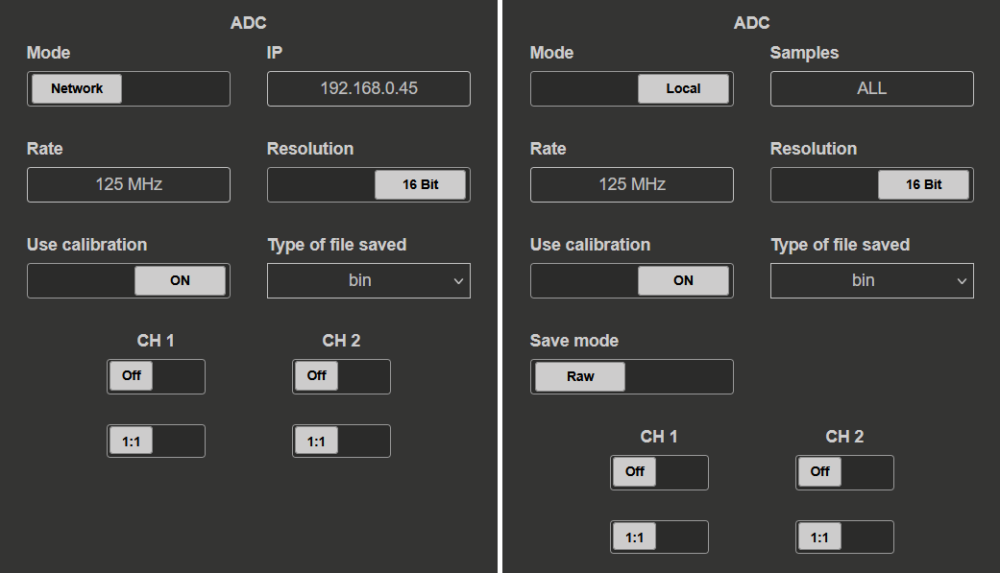
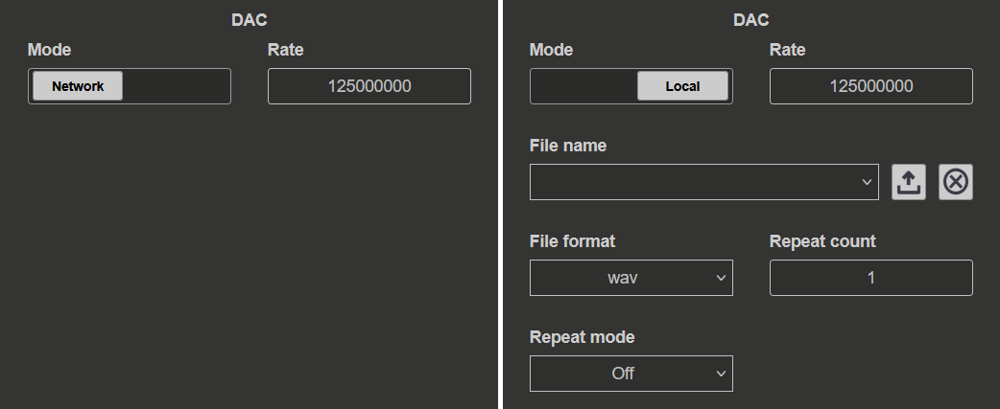
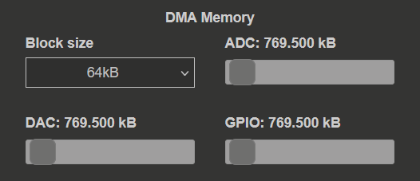

.. _streaming_top:

#########################
Data stream control
#########################

Data stream control (also called the Streaming application) unlocks the capability to stream data between Red Pitaya and the computer. This functionality can be extended by synchronising multiple boards together to create a multi-channel system (:ref:`X-channel system <x-ch_streaming>` and :ref:`Click Shield synchronisation <click_shield_sync>`) which are covered in a later section.

.. figure:: img/streaming_app_features.png
    :width: 1000
    :align: center

|

The application interface is divided into the following sections:

1. **ADC streaming configuration:** Configuration of the ADC streaming settings, such as streaming mode, sampling frequency, input channel select and file format.
#. **DAC streaming configuration:** Configuration of the DAC streaming settings, such as streaming mode and output data rate.
#. **DMA memory configuration:** Determines the minimal block size for streaming and :ref:`Deep Memory Mode <deepMemoryMode>` reserved memory management.
#. **Streaming status:** Controls for starting and stopping the streaming process. The status of the streaming process is also displayed here.
#. **Files on the SD card:** List of files saved on the SD card (acquired data and logs) and buttons for managing them.
#. **PC Clients:** List of downloadable clients for streaming desktop applications (Windows, Linux), command line clients (Windows, Linux) and console client for Red Pitaya itself.

The Streaming application can be started:

1. From the Red Pitaya Web interface.

    .. figure:: img/redpitaya_main_page.png
        :width: 600
        :align: center

#. From inside the Red Pitaya Linux OS by running the **/opt/redpitaya/bin/streaming-server.run.sh**. For example, when connected through :ref:`SSH <ssh>`.
#. Alternatively, when using the remote command line client, the application can be started by loading the **stream_app** FPGA image:

    .. code-block:: bash

        overlay.sh stream_app

Once the Streaming application (or the coresponding FPGA image) is loaded, LED 2 will turn on and LED 0 will blink, indicating that the application is running.

.. contents:: Contents
    :local:
    :backlinks: top

|

Features
**********

The Streaming application is designed to provide a simple and efficient way to stream data between Red Pitaya and a computer. It supports both ADC and DAC streaming, allowing users to acquire data from the fast analog inputs and generate signals on the fast analog outputs.
The application uses the reserved memory region that is shared with the :ref:`Deep Memory Mode <deepMemoryMode>` to temporarily store the data that is streamed to and from the board. This allows for efficient data transfer and processing, while also providing a flexible and scalable solution for a wide range of applications.

Here are the main features of the Streaming application:

* Continuous data streaming from Red Pitaya fast analog inputs (:ref:`maximum ADC data streaming rate limitions <streaming_limits>`):
    
    * Remotely to a computer via the TCP ethernet protocol (:ref:`max 62.5 MB/s <streaming_limits>`).
    * Locally to a file on the Red Pitaya SD card (:ref:`max 10 MB/s <streaming_limits>`).

* Continuous data streaming to Red Pitaya fast analog outputs (:ref:`maximum DAC data streaming rate limitations <streaming_limits>`):

    * Remotely from a file on a computer via the TCP ethernet protocol (:ref:`max 5 MHz DAC rate <streaming_limits>`).
    * Locally from a file on the Red Pitaya SD card (:ref:`See <streaming_limits>`).

* GPIO data streaming (**Future development**):

    * The groundwork for GPIO data streaming is already implemented and will be released in a future update.

.. note::

    The Streaming application supports only continuous data streaming and does not have triggering capabilities. The data is streamed continuously from the moment the application is started until it is stopped.

.. _adc_streaming_configuration:

ADC streaming configuration
============================

The ADC configuration section allows the user to set the parameters for the data acquisition process. The settings depent on the selected **Mode** (*Network* or *Local*).

.. tabs::

    .. group-tab:: Network

        The user can set:

        * **IP address:** The IP address of the Red Pitaya board.  
        * **Rate:** The sampling frequency (rate). Should be calculated from the selected settings and the :ref:`data streming limitation <streaming_limits>`.
        * **Resolution:** Input channel resolution (8 or 16 bits). Determines the number of Bytes per sample (1 or 2) [#f1]_.
        * **Use calibration:** Select whether the input calibration should be used or not.
        * **Type of file saved:** Select the file format for the saved data. The following formats are supported:
            
            * WAV (standard audio file format) (maximum WAV file size is 4 GB),
            * TDMS (Technical Data Management Streaming file format),
            * BIN (Fast and compact binary format). It can be converted to CSV format using the `convert_tool` application.
        
        * **Input channels:** Select the input channels to be used for data acquisition by turning on the corresponding switches. The following options are available:
            
            * Channel 1 (CH1),
            * Channel 2 (CH2),
            * Channel 3 (CH3) - *STEMlab 125-14 4-Input only*,
            * Channel 4 (CH4) - *STEMlab 125-14 4-Input only*.

        * **Input attenuation:** For each channel select the input attenuation mode. The following options are available:
            
            * 1:20 - HV (high voltage mode),
            * 1:1 - LV (low voltage mode).

        The *Save mode* setting is specified on the remote client side.

        .. note::

            Older OS versions also include the **Port** setting, where the user can specify the network port number for the data streaming.

    .. group-tab:: Local

        The user can set:

        * **Samples:** Number of samples to be acquired (*ALL* for unlimited sampling)
        * **Rate:** The sampling frequency (rate). Should be calculated from the selected settings and the :ref:`data streming limitation <streaming_limits>`.
        * **Resolution:** Input channel resolution (8 or 16 bits). Determines the number of Bytes per sample (1 or 2) [#f1]_.
        * **Use calibration:** Select whether the input calibration should be used or not.
        * **Type of file saved:** Select the file format for the saved data. The following formats are supported:
            
            * WAV (standard audio file format) (maximum WAV file size is 4 GB),
            * TDMS (Technical Data Management Streaming file format),
            * BIN (Fast and compact binary format). It can be converted to CSV format using the `convert_tool` application.

        * **Save mode:** Select the save mode for the data. The following modes are supported:
            
            * RAW (raw data in ADC counts),
            * VOLTS (data converted to Volts).
        
        * **Input channels:** Select the input channels to be used for data acquisition by turning on the corresponding switches. The following options are available:
            
            * Channel 1 (CH1),
            * Channel 2 (CH2),
            * Channel 3 (CH3) - *STEMlab 125-14 4-Input only*,
            * Channel 4 (CH4) - *STEMlab 125-14 4-Input only*.

        * **Input attenuation:** For each channel select the input attenuation mode. The following options are available:
            
            * 1:20 - HV (high voltage mode),
            * 1:1 - LV (low voltage mode).

.. _dac_streaming_configuration:

DAC streaming configuration
============================

The DAC configuration section allows the user to set the parameters for the data generation process. The settings depent on the selected **Mode** (*Network* or *Local*).

.. tabs::

    .. group-tab:: Network

        The user can set:

        * **Rate:** The DAC sample output frequency (rate). Should be selected according to the :ref:`data streming limitations <streaming_limits>`.

        The other settings are specified in the configuration file located in */root/.config/redpitaya/apps/streaming/streaming_config.json*. The file can be updated manually or through the :ref:`Command Line Client <stream_command_client>`.

    .. group-tab:: Local

        The user can set:

        * **Rate:** The DAC sample output frequency (rate). Should be selected according to the :ref:`data streming limitations <streaming_limits>`.
        * **File name:** Select the file to be used for data generation from the dropdown menu. The file must be in WAV or TDMS format. The two buttons are used for file upload and deleting the selected file.
        * **File format:** Select the file format of the file used for the data generation. The following formats are supported:
            
            * WAV (standard audio file format),
            * TDMS (Technical Data Management Streaming file format).

        * **Repeat mode:** Select the repeat mode for the data generation. The following modes are supported:
            
            * **Off:** The file is generated once then the streaming stops. 
            * **On:** The file is generated *Repeat count* times then the streaming stops.
            * **Infinity:** The file is continuously generated until the streaming is stopped.

        * **Repeat count:** How many times the should the file be repeated.

WAV and TDMS file formats can have up to two channel signals at the same time. While **Channel select** is not available, the first channel will be generated on OUT1 and the second channel on OUT2.

.. note::

    Currently, the only supported format are RAW 16-bit samples. In the future we will also support other formats and 8-bit mode.

To prevent data loss when generating small data files at a high DAC frequency, only one memory block will be sent and generated if the data file size is smaller than the memory block size. Otherwise, the data will be sent and generated a *repetition* number of times.
This means that the DAC streaming has two modes of operation:

* **One-pack mode:** If the data file size is smaller than the reserved memory block size, there is only a single data transfer between the board and computer and the data can be generated at the full 125 MS/s. The generation data is be stored in the DMM memory together with the specified number of repetitions.
* **True streaming mode:** If the data file size is larger than the reserved memory block size, then the data is streamed from the computer to the board. To achieve the best performance, we recommend setting the block size to 8 MB and have the signal fit into the DMM region completely.

.. note::

    Remote data generation is currently possible only through the :ref:`Command Line Client <stream_command_client>`. The desktop application currently does not support this feature.

DAC streaming example
----------------------

Here is an example of how to generate a sine wave signal on the DAC outputs using the command line client. We are assuming that the command line client is already installed on the computer and enough DMM memory is reserved for the DAC streaming.

#. **Create a custom waveform.** Here we create a sine wave signal made of 1024 samples.

    .. code-block:: Python

        N = 1024                                        # Number of samples in a period
        num_periods = 1                                 # Number of periods in the signal
        num_bits = 16
        max_val = 2**(num_bits-1) - 1                   #  32767
        min_val = -2**(num_bits-1)                      # -32768

        t = np.linspace(0, 1, N*num_periods)*2*np.pi
        y = np.sin(num_periods*t)*max_val               # FPGA divides the signal by 4.

        # Save y as a .wav file
        sample_rate = 44100                             # (Doesn't matter) Standard audio sample rate
        y_signed16 = np.int16(y)

        plt.plot(y_signed16)                            # Double-check with plot
        plt.title('Custom waveform')
        plt.show()

        wavfile.write('arb_waveform_signed16.wav', sample_rate, y_signed16)
    
#. **Establish SSH connection.** Connect to the Red Pitaya board using SSH. For example, using the command line:

    .. code-block:: console

        ssh root@<IP_ADDRESS or .LOCAL_ADDRESS>

#. **Load the FPGA and start the streaming application.** We must load the FPGA first, then start the streaming application. The FPGA image can be loaded using the `overlay.sh` command.

    .. code-block:: console

        redpitaya> overlay.sh stream_app
        redpitaya> streaming-server

#. **Get the configuration file.** Open a new terminal or CMD window and navigate to the directory where the command line client is installed. Get the configuration file from the Red Pitaya board. The downloaded configuration file is located in the *configs* folder of the command line client.

    .. code-block:: console

        computer> .\rpsa_client.exe -c -g F

#. **Edit the configuration file.** Open the configuration file using your favourite code editor and edit the DAC streaming parameters. We are using 8 MiB block size and 100 MiB of the DMM region for the DAC streaming. The *dac_rate* is set to 125 MHz, since our waveform is very short.

    .. code-block:: console

        {
            "adc_streaming" : 
            {
                "adc_decimation" : 125,
                "adc_pass_mode" : "NET",
                "channel_ac_dc_1" : "DC",
                "channel_ac_dc_2" : "DC",
                "channel_ac_dc_3" : "DC",
                "channel_ac_dc_4" : "DC",
                "channel_attenuator_1" : "A_1_1",
                "channel_attenuator_2" : "A_1_1",
                "channel_attenuator_3" : "A_1_1",
                "channel_attenuator_4" : "A_1_1",
                "channel_state_1" : "OFF",
                "channel_state_2" : "ON",
                "channel_state_3" : "OFF",
                "channel_state_4" : "OFF",
                "data_type_sd" : "RAW",
                "format_sd" : "BIN",
                "resolution" : "BIT_16",
                "samples_limit_sd" : 0,
                "use_calib" : "ON"
            },
            "dac_streaming" : 
            {
                "channel_gain_1" : "X1",
                "channel_gain_2" : "X1",
                "dac_pass_mode" : "DAC_NET",
                "dac_rate" : 125000000,
                "file_sd" : "arb_waveform2_signed16.wav",
                "file_type_sd" : "WAV",
                "repeat" : "DAC_REP_ON",
                "repeatCount" : 1
            },
            "memory_manager" : 
            {
                "adc_size" : 0,
                "block_size" : 8388608,
                "dac_size" : 104857600,
                "gpio_size" : 0
            }
        }

    .. note::

        1 MiB = 1024*1024 Bytes = 2^20 Bytes = 1048576 Bytes. We are using Mebibytes (MiB) instead of Megabytes (MB) to avoid confusion with the decimal system.

#. **Upload the configuration file.** Upload the edited configuration file to the Red Pitaya board using the command line client.

    .. code-block:: console

        computer> .\rpsa_client.exe -c -s F -f .\configs\config_dac.json

#. **Start the DAC streaming.** Start the DAC streaming using the command line client. The DAC streaming will start generating the sine wave signal on the OUT1.

    .. code-block:: console

        computer> .\rpsa_client.exe -o -f wav -d <path_to_wav_file>\arb_waveform2_signed16.wav -r inf

ADC and DAC streaming configuration
====================================

ADC and DAC streaming can work simultaneously, allowing the user to acquire data from the fast analog inputs and generate signals on the fast analog outputs at the same time.

.. note::
    
    Please note that the load on the processor will increase and the maximum performance of each mode will decrease.

DMM memory configuration
===========================

In this section, the user can specify the following settings:

* **Block size:** The size of packets (chunks) of data that are streamed over the network. It is selected from the dropdown menu. The default value is 64 kB.
  Lower values are recommended for low sampling rates (chunck are filled faster), while higher values are recommended for higher sampling rates (minimizing the amount of packets).
* **ADC:** The size of the memory reserved for the ADC data streaming. The default value is 769.5 kB.
* **DAC:** The size of the memory reserved for the DAC data streaming. The default value is 769.5 kB.
* **GPIO:** The size of the memory reserved for the GPIO data streaming. The default value is 769.5 kB.

The block size represents the minimum size of the memory block that can be sent over the internet. This size is set in the FPGA and then transmitted to the desktop application over the network.
Block sizes can range from 2 kB to 8 MB.

The block size should be determined by the streaming speed.

* Use **small block sizes for low streaming speeds**. Although small block sizes require more data to be transferred over the network, they also take less time to fill, especially at higher decimation values.
* Use **large block sizes for high streaming speeds**. Large block sizes enable maximum network transfer performance (fewer transmissions over the network for the same amount of data), but take longer to fill (filling an 8 MB block at 10 kS/s will take some time). For a streaming frequency of 62.5 MHz, use a block size of at least 4 MB.

The memory manager features three sliders (ADC, DAC and GPIO) that set the amount of memory allocated to each mode.
You can use the sliders to select the required memory size. You can specify either the entire volume of reserved memory or part of it.
For example, if you allocate the entire volume to ADC streaming, you won't be able to use another mode as there won't be enough memory.
When running ADC and DAC simultaneously, the memory must be allocated proportionally.

.. note::

    GPIO streaming mode is not yet implemented.

If a slider number appears in red, there is not enough memory reserved for the selected setting. Use the slider to adjust the reserved memory amount until the value changes back to white.

The reserved :ref:`Deep Memory Mode <deepMemoryMode>` memory default size is 32 MB and can be changed under the :ref:`System info settings <system_info>` or :ref:`by manually chaging the size <DMM_change_reserved_memory>`.

Streaming status
===================

.. figure:: img/streaming_status.png
    :width: 600

The streaming status section displays the current status of the ADC and DAC streaming process (GPIO will be added in the future). Each section has the following options:

* **Status circle:** Indicates the current status of the streaming process. The circle is green when the streaming is running and red when it is stopped.
* **Start and stop buttons:** Start and stop the streaming process.
* **Status message:** Displays the current status of the streaming process as well as any error messages that may occur during the streaming process.

If the status message is red, it indicates that an error has occurred. The error message will provide information about the cause of the error and how to resolve it. Here are some common error messages and how to resolve them:

* *Not enough memory* - Check the reserved memory settings and increase the reserved memory size if neccessary. For DAC streaming, make sure that a file is selected for data generation.

Files on the SD card
====================

.. figure:: img/streaming_sd_card_files.png
    :width: 600

This section displays all the files saved on the SD card. Each file has three buttons:

* **Log:** Download the data log file. This file contains information about the streaming process, such as the number of samples acquired, the sampling frequency, and any error messages that may occur during the streaming process.
* **Lost:** Download the lost packets file. This file contains information about any lost packets during the streaming process. It is recommended to check this file after each streaming session to ensure that no data was lost.
* **Download:** Download the data file. This file contains the acquired data stream. The file format is determined by the selected settings in the ADC configuration section.

Each file name includes the date and time of the data acquisition process (*data_file_<acquired_date>_<acquired_time>*), which can be used to identify the file later. Additionally, the file type and size are displayed next to the file name.

In the bottom right corner, there are two buttons:

* **Refresh:** Refresh the file list on the SD card.
* **Delete all:** Delete all files on the SD card. This action is irreversible and should be used with caution.

When streaming ADC data in local mode, both the amount of data captured on the FPGA and the amount saved to the SD card are displayed.

PC Clients
==================

.. figure:: img/streaming_pc_clients.png
    :width: 600

The PC clients section is located in the bottom left corner of the application. It contains a list of downloadable clients for streaming desktop application (Windows, Linux), command line clients (Windows, Linux) and console client for Red Pitaya itself.
The clients are used to stream data from the Red Pitaya board to a remote computer or to control the streaming process from a remote computer.

*   **Desktop client (Windows, Linux):** The desktop client is a graphical user interface (GUI) application that allows the user to stream data from one or more Red Pitaya boards to a computer on the same local network.
    The desktop client, downloadable by clicking the green monitor icon, is available for Windows (*WIN*) and Linux (*LIN*) operating systems. The desktop client is recommended for users who prefer a GUI application for streaming data.
    See the :ref:`Streaming to a remote computer via Desktop Application <stream_desktop_app>` section for more information.
*   **Command line client (Windows, Linux):** The command line client is a command line application that allows the user to stream data from one or more Red Pitaya boards to a computer on the same local network.
    The command line client, downloadable by clicking the green terminal icon, is available for Windows (*WIN*) and Linux (*LIN*) operating systems. The command line client is recommended for users who prefer a command line application for streaming data.
    See the :ref:`Streaming to a remote computer via Command Line or Terminal <stream_command_client>` section for more information.
*   **Red Pitaya command line client:** The final icon is a console client for Red Pitaya itself. This client is used for streaming data to and from the SD card on the Red Pitaya board itself.
    See the :ref:`Red Pitaya command line client <stream_command_client>` section for more information.

The blue question mark icon leads to this documentation page.

Configuration information
==========================

The settings for ADC streaming have fixed values that are set in the application:

* 18900 - ADC streaming server.
* 18901 - Configuration Server.
* 18902 - Broadcast server.
* 18903 - DAC streaming server.

Configuration can be set over the WEB interface UI, which is afterwards stored in **/root/.streaming_config** or **/root/.config/redpitaya/apps/streaming/streaming_config.json** (for version 2.00) on the Red Pitaya.

.. tabs::

    .. group-tab:: OS version IN DEV or newer

        The configuration file has been updated to make all settings more user-friendly, but it is now incompatible with older versions.

        .. code-block:: console

            {
                "adc_streaming" : 
                {
                    "adc_decimation" : 2,
                    "adc_pass_mode" : "FILE",
                    "channel_ac_dc_1" : "DC",
                    "channel_ac_dc_2" : "DC",
                    "channel_ac_dc_3" : "DC",
                    "channel_ac_dc_4" : "DC",
                    "channel_attenuator_1" : "A_1_1",
                    "channel_attenuator_2" : "A_1_1",
                    "channel_attenuator_3" : "A_1_1",
                    "channel_attenuator_4" : "A_1_1",
                    "channel_state_1" : "ON",
                    "channel_state_2" : "OFF",
                    "channel_state_3" : "OFF",
                    "channel_state_4" : "OFF",
                    "data_type_sd" : "RAW",
                    "format_sd" : "WAV",
                    "resolution" : "BIT_8",
                    "samples_limit_sd" : 1000000,
                    "use_calib" : "ON"
                },
                "dac_streaming" : 
                {
                    "channel_gain_1" : "X1",
                    "channel_gain_2" : "X1",
                    "dac_pass_mode" : "DAC_FILE",
                    "dac_rate" : 125000000,
                    "file_sd" : "sine.wav",
                    "file_type_sd" : "WAV",
                    "repeat" : "DAC_REP_OFF",
                    "repeatCount" : 1
                },
                "memory_manager" : 
                {
                    "adc_size" : 134217728,
                    "block_size" : 8388608,
                    "dac_size" : 134217728,
                    "gpio_size" : 134217728
                }
            }

.. note::

    The "Memory Manager" file sizes are in Bytes.
    1 MiB = 1024*1024 Bytes = 2^20 Bytes = 1048576 Bytes. We are using Mebibytes (MiB) instead of Megabytes (MB) to avoid confusion with the decimal system.

|

How does it work?
*******************

The streaming application uses the following data transfer path.

.. TODO add picture of the data path

*Inputs ==> FPGA ==> DDR ==> Processor ==> PHY ==> Network ==> PC*

The FPGA streams data directly from the fast analog inputs to the DDR memory. Two ping pong buffers are used to store the data in the DDR memory. FPGA first fills one buffer while the other is being read by the processor.
Once the buffer is full the FPGA raises a "buffer full" flag. Then the FPGA checks whether the processor has finished reading the data from the second buffer. If yes, then it starts overwriting the second buffer. 
Otherwise, it reports buffer overwrite error (which causes the processor to discard the read data and results in data loss) and starts overwriting the second buffer. This allows for continuous data streaming without any interruptions.
The processor reads the data from the DDR memory and converts it into Ethernet packets, which are then sent over the network to the remote computer. The data is streamed in chunks (packets) of a specified size, which can be configured in the application settings.

The logic for DAC streaming is symetrical to the ADC streaming, but since the pipeline is reversed, the client that receives the data on the Red Pitaya isn't the large, high-speed buffer on the computer (ADC streaming), so the expected performance is lower than for ADC streaming.

.. _streaming_limits:

Data streaming limitations
***************************

The streaming application has some limitations that should be considered when configuring the data acquisition and generation process. These limitations are related to the maximum data rates and the minimum streamed data size.
Using multiple streaming modes simultaneously (e.g. ADC and DAC streaming) also affects the maximum data rate.

Data rate limitations
======================

The maximum data rates (per board) are determined by the hardware capabilities of the Red Pitaya board and the network transfer rates. The following limitations apply:

    * 10 MB/s for streaming to an SD card (SD card class 10 is recommended for optimal streaming performance).
    * 62.5 MB/s for streaming over 1 Gbit network (:ref:`connecting the board to a router <LAN>` is recommended to achieve the best streaming performance). This setting depends on the client.

The main limiting factor for the maximum data rate is the processor which reads the data from the DDR and converts it into Ethernet packets. If the data rate exceeds the maximum data rate, the processor will not be able to keep up with the incoming data stream (reading the buffer before the FPGA overwrites it), leading to packet loss and consequently missing data.

Additionally, any extra processing done by the processor (e.g. data conversion, web interface updates, etc.) will also affect the maximum data rate. The more processing that is done, the lower the maximum data rate will be.

Highest possible data rate
----------------------------

The highest possible data rate is achieved using:

1. The `Command line client <Remote streaming (command line client)>`_,
2. **RAW** data format,
3. **Binary** file type.

This is the most efficient way to transfer data as no data converion is performed before it is sent over the network. The web interface should be closed to avoid any extra processing.

Calculating the maximum sampling frequency
-------------------------------------------

The following calculation can be used to determine the maximum sampling frequency:

.. TODO check math formula

.. math::

    f_{S, max} = \frac{v_{max}}{N \times Bps}

Where:

    * :math:`v_{max}` - is the maximum data rate for the selected streaming mode (10 MB/s for local streaming, 62.5 MB/s for network streaming).
    * :math:`N` - is the number of input channels selected for data acquisition (1, 2, 3 or 4).
    * :math:`Bps` - (Bytes per sample) is the number of bytes used to represent each sample (1 for 8-bit resolution, 2 for 16-bit resolution).

.. note::

    If acquiring a limited amount of samples in a short duration, it is possible to reach higher sampling frequencies (up to the sampling speed of fast analog inputs).

Packet size limitations
========================

To increase the efficiency of the application, there is a minimum data packet (chunck) size that can be sent through the network. This can have a big impact at high decimation values,
as it may take a long time to fill a chunck before sending it over the network. If the stream is stopped before a chunck is full, the acquired data is discarded. Consequently, the save file can have a size of **0 bits**.

Here are the minimum chunck limitations sorted by file type and units:

+--------------------+-----------------+----------------+----------------+
| File type \\ Units | WAV             | TDMS           | BIN            |
+====================+=================+================+================+
| VOLTS              | 128.043 kb      | 128.133 kb     | 64.090 kb      |
+--------------------+-----------------+----------------+----------------+
| RAW                | 64.043 kb       | 64.133 kb      | 64.090 kb      |
+--------------------+-----------------+----------------+----------------+

Data generation limitations
============================

The data generation process is subjected to the same data rate limitations as for the ADC streaming described above, but since the buffer on the Red Pitaya is not a large, high-speed buffer which the computer has access to for ADC streaming, the expected performance is lower than for ADC streaming.
The network USB card, if used, can also limit the maximum data rate.

When generating data from a file, we recommend setting the block size to 8 MB to ensure a high quality of the generated signal. To achieve the best performance, the generated file size should fit into the DMM memory size, so that the entire file can be loaded into the memory before the generation starts.
Since the DAC streaming also includes a C++ program, there may be inconsistencies in the generated signal if the file size is too small. To avoid the variations in the generated signal, the file should include at least 1024 samples per channel.

Ideally, the signal should fit completely into the specified block size.

Here are limitations for the **dac_rate** variable for each of the two modes:

* **One-pack mode**: The maximum **dac_rate** is 125 MHz (125 MS/s).
* **True streaming mode**: The maximum stable **dac_rate** is about 5 MHz (5 MS/s) for 16-bit resolution. Setting the DAC rate higher may result in data loss and unstable signal generation.

.. note::

    The DAC streaming is currently limited to 16-bit resolution and the WAV or TDMS file format.
    The WAV file format has a maximum size of 4 GB, which limits the maximum number of samples that can be generated to approximately 268 million samples (for 16-bit resolution).

.. ! TODO: Document the new fast streaming feature and prepare the examples

|

Streaming options
******************

In this section, we will describe the different options for streaming data from Red Pitaya to a remote computer or to a file on the Red Pitaya SD card. Here is a list of the available options:

.. toctree::
    :maxdepth: 1

    stream_options/stream_local.rst
    stream_options/stream_command_line.rst
    stream_options/stream_desktop_api.rst
    stream_options/stream_redpitaya_linux.rst

Compatibility
===============

Red Pitaya boards are compatible with any computer operating system. However, the same cannot be said for the streaming client applications which are meant to run on the computer, which are available for Linux and Windows operating systems. Any specific requirements for the operating systems are listed below.

* **Windows 11** - Please use Red Pitaya OS 2.05-37 or newer as older streaming client versions are incompatible with Windows 11.

.. _multiboard_stream:

Multiboard streaming
***********************

To stream data from multiple Red Pitaya board simultaneously, turn on the streaming application (or load the ``stream_app`` FPGA image) on each board. Then either download the :ref:`desktop client application <stream_desktop_app>` or the :ref:`command line client <stream_command_client>` to your computer.

Both the desktop application and the command line client will detect all Red Pitaya boards on the same local network that are running the streaming application and allow for simultaneously starting and stopping the streaming process on all boards.

Please check the :ref:`Multiboard synchronisation section <multiboard_sync>` for more information on synchronising multiple boards and available hardware configuration options.

Source code
************

The `Streaming application source code <https://github.com/RedPitaya/RedPitaya/tree/master/apps-tools/streaming_manager>`_ is available on our GitHub.

.. substitutions

.. |DIAdem| raw:: html

    <a href="https://www.ni.com/en-us/shop/data-acquisition-and-control/application-software-for-data-acquisition-and-control-category/what-is-diadem.html" target="_blank">DIAdem</a>

.. |Audacity| raw:: html

    <a href="https://www.audacityteam.org" target="_blank">Audacity</a>

.. |Streaming Client| raw:: html

    <a href="https://downloads.redpitaya.com/downloads/Clients/streaming/desktop/" target="_blank">here</a>

.. |br| raw:: html

     

.. rubric:: Footnotes

.. [#f1] The number of Bytes per sample is determined by the selected resolution. For 8-bit resolution, 1 Byte is used per sample. For 16-bit resolution, 2 Bytes are used per sample. The board resolution still applies (e.g. for 14-bit resolution, 2 Bytes are used per sample (the extra bits represent padding)).
