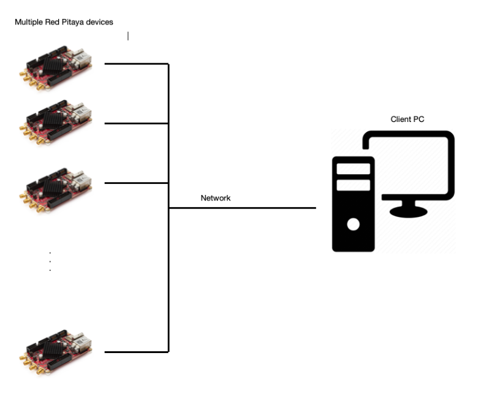
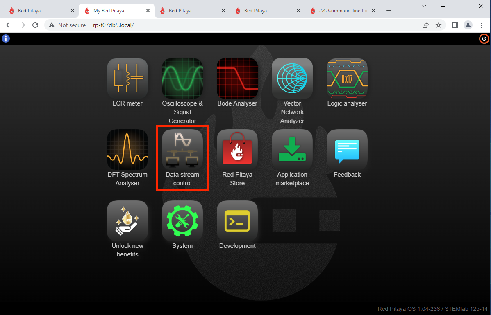
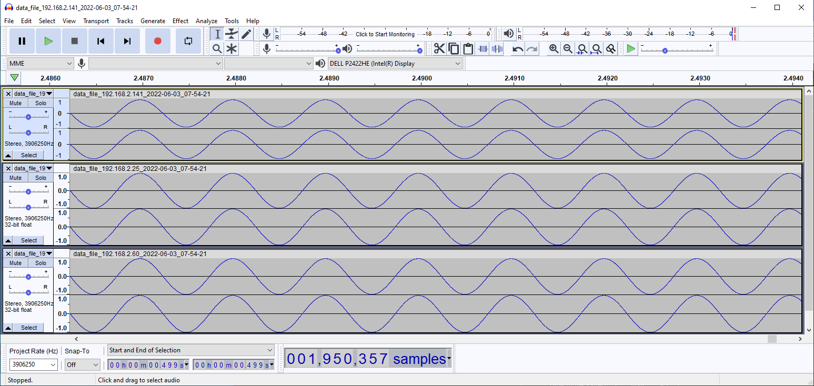

.. _mch_streaming_top:

#######################
X-Channel Streaming
#######################

.. |br| raw:: html

     

.. note::

    We have decided to use PRIMARY and SECONDARY device terminology instead of the standard MASTER and SLAVE device.

********
Overview
********

X-Channel streaming is suitable for applications that require multiple acquisition or generation channels.

Red Pitaya X-Channel streaming software provides the ability to stream analog and digital signals to client PCs from several Red Pitaya devices simultaneously, with a synchronised clock and trigger among all Red Pitayas in the system.

Streaming can be done in both directions. Users can stream acquired analog and digital signals from Red Pitaya devices to a client computer or stream analog and digital signals from the client to Red Pitaya device outputs. The X-Channel streaming software also provides the ability to control streaming completely remotely from client PCs.

.. note::

    The upstream to X-channel (synchronised generation) is currently under development.

*****
Setup
*****

**What do I need before I start?**

The Red Pitaya STEMlab 125-14 X-Channel System consists of multiple Low-Noise STEMlab 125-14 devices that are modified for clock and trigger synchronization and also comes with SATA synchronisation cables and software that supports X-Channel RF signal acquisition and generation.

.. figure:: img/Master_and_slaves.jpg
    :width: 70%

Notice that the Red Pitaya STEMlab 125-14 X-Channel System includes two types of devices:

    * one STEMlab 125-14 PRIMARY device (Low-Noise STEMlab 125-14 device)
    * one or more Low-Noise STEMlab 125-14 SECONDARY devices denoted by an "S" sticker

In order to achieve synchronization, the PRIMARY device provides a clock and trigger over the SATA S1 connector that is then connected to the S2 of the SECONDARY 1 board. SECONDARY 1 then passes the clock forward to SECONDARY 2, SECONDARY 2 to SECONDARY 3, and so on (SECONDARY N to SECONDARY N+1). This way, we can achieve synchronisation of all boards in the system.

.. note::

    **PRIMARY and SECONDARY boards do use different OS-es!**

    The PRIMARY runs the standard Red Pitaya device OS, while SECONDARY boards require a special OS that only supports X-channel streaming.

    Due to frequent OS updates, it is recommended to always use the :ref:`latest OS <prepareSD>`.

***********
Setting-up
***********

    #.  Connect all Red Pitayas to the same network via ethernet cables (switch or router that is connected to the client PC).

        .. note::

            Make sure that your network can provide enough throughput for all the data you are about to stream. It is also recommended to use a dedicated network only for the X-channel system.

    #.  Connect the SATA cables between the PRIMARY and SECONDARY devices.

        PRIMARY SATA S1 -> SECONDARY 1 SATA S2

        SECONDARY 1 SATA S1 -> SECONDARY 2 SATA S2

        SECONDARY 2 SATA S1 -> SECONDARY 3 SATA S2

        ...

    #.  Connect the power supply to the Red Pitaya board.

.. figure:: img/Master_and_slaves_2.jpg
    :width: 70%

*******************************************************************
Download and install an X-channel streaming client on your computer
*******************************************************************

1. Connect to the PRIMARY board by entering the URL from the sticker into a web browser and launching the streaming app.

2. Click the "Clients" button to get the client app for Linux or Windows and download it to your client's computer.

.. figure:: img/download_client.png
    :width: 70%

*****************
Use case examples
*****************

**Simultaneous acquisition of 6 input signals.**

In this example, we will acquire data from all 3 RP units, which gives us 6 RF input channels.

.. code-block:: shell-session

    PRIMARY_IP=192.168.2.141, SECONDARY1_IP=192.168.2.60 SECONDARY2_IP=192.168.2.25

1.  Open the streaming app on the PRIMARY and all SECONDARY boards via the WEB interface.

    .. note::

        The Streaming app can also be started via ssh by running **/opt/redpitaya/bin/streaming-server.run.sh** on the Red Pitaya.

2.  Configure the streaming parameters and configuration.

Configuration can be set over the WEB interface UI, which is then stored in **/root/.streaming_config** or **/root/.config/redpitaya/apps/streaming/streaming_config.json** (for version 2.00) on the Red Pitaya.

In this example, we will show how to set configuration remotely using an already prepared |test configuration| that will set all PRIMARY and SECONDARY devices to these settings.

.. |test configuration| raw:: html

    <a href="https://downloads.redpitaya.com/doc/streaming/test.conf" target="_blank">test.conf</a>

.. figure:: img/settings.png
    :width: 80%

.. code-block:: shell-session

    rpsa_client.exe -c -h 192.168.2.141,192.168.2.60,192.168.2.25 -s F -f test.conf -v

    2022.06.02-15.20.21.173:  Connected: 192.168.2.141
    2022.06.02-15.20.21.176:  Connected: 192.168.2.25
    2022.06.02-15.20.21.178:  Connected: 192.168.2.60
    2022.06.02-15.20.21.278:  Send configuration to: 192.168.2.141
    2022.06.02-15.20.21.291:  Send configuration to: 192.168.2.25
    2022.06.02-15.20.21.291:  SET: 192.168.2.141 [OK]
    2022.06.02-15.20.21.303:  Send configuration to: 192.168.2.60
    2022.06.02-15.20.21.309:  Send configuration save command to: 192.168.2.141
    2022.06.02-15.20.21.324:  SET: 192.168.2.25 [OK]
    2022.06.02-15.20.21.332:  Send configuration save command to: 192.168.2.25
    2022.06.02-15.20.21.337:  SET: 192.168.2.60 [OK]
    2022.06.02-15.20.21.343:  Send configuration save command to: 192.168.2.60
    2022.06.02-15.20.21.350:  SAVE TO FILE: 192.168.2.141 [OK]
    2022.06.02-15.20.21.357:  SAVE TO FILE: 192.168.2.25 [OK]
    2022.06.02-15.20.21.363:  SAVE TO FILE: 192.168.2.60 [OK]

3. Start the X-channel streaming of 6 inputs

.. code-block:: shell-session

    --streaming --host PRIMARY IP, SECONDARY1 IP, SECONDARY2 IP, --format=wav --dir=NAME
    --limit=SAMPLES

    rpsa_client.exe -s -h 192.168.2.141,192.168.2.60,192.168.2.25 -f wav -d ./acq -l 10000000 -v

    2022.06.02-15.25.00.795:  Connected: 192.168.2.141
    2022.06.02-15.25.00.798:  Connected: 192.168.2.25
    2022.06.02-15.25.00.804:  Connected: 192.168.2.60
    2022.06.02-15.25.00.907:  Send stop command to master board 192.168.2.141
    2022.06.02-15.25.00.925:  Streaming stopped: 192.168.2.141 [OK]
    2022.06.02-15.25.01.32:  Send stop command to slave board 192.168.2.25
    2022.06.02-15.25.01.36:  Send stop command to slave board 192.168.2.60
    2022.06.02-15.25.01.37:  Streaming stopped: 192.168.2.25 [OK]
    2022.06.02-15.25.01.45:  Streaming stopped: 192.168.2.60 [OK]
    2022.06.02-15.25.01.156:  Send start command to slave board: 192.168.2.25
    2022.06.02-15.25.01.169:  Send start command to slave board: 192.168.2.60
    2022.06.02-15.25.01.286:  Streaming started: 192.168.2.25 TCP mode [OK]
    2022.06.02-15.25.01.307:  Streaming started: 192.168.2.60 TCP mode [OK]
    2022.06.02-15.25.01.407:  Send start command to master board: 192.168.2.141
    2022.06.02-15.25.01.542:  Streaming started: 192.168.2.141 TCP mode [OK]
    2022.06.02-15.25.01.639:  Send start ADC command to slave board: 192.168.2.25
    Run write to: ./1/data_file_192.168.2.25_2022-06-02_13-25-00.wav
    Run write to: ./1/data_file_192.168.2.60_2022-06-02_13-25-00.wav
    Run write to: ./1/data_file_192.168.2.141_2022-06-02_13-25-00.wav
    2022.06.02-15.25.01.659:  Send start ADC command to slave board: 192.168.2.60
    2022.06.02-15.25.01.660:  ADC is run: 192.168.2.25
    Available physical memory: 16260 Mb
    Used physical memory: 8130 Mb
    Available physical memory: 16260 Mb
    Used physical memory: 8130 Mb
    Available physical memory: 16260 Mb
    2022.06.02-15.25.01.741:  Connect 192.168.2.25
    2022.06.02-15.25.01.730:  ADC is run: 192.168.2.60
    Used physical memory: 8130 Mb
    2022.06.02-15.25.01.752:  Connect 192.168.2.141
    2022.06.02-15.25.01.764:  Connect 192.168.2.60
    2022.06.02-15.25.01.826:  Send start ADC command to master board: 192.168.2.141
    2022.06.02-15.25.01.834:  ADC is run: 192.168.2.141
    2022.06.02-15.25.04.402:  Error 192.168.2.25
    2022.06.02-15.25.04.408:  Error 192.168.2.141
    2022.06.02-15.25.04.410:  Error 192.168.2.60
    2022.06.02-15.25.04.415:  Send stop command to master board 192.168.2.141
    2022.06.02-15.25.04.420:  Streaming stopped: 192.168.2.141 [OK]
    2022.06.02-15.25.04.422:  Streaming stopped: 192.168.2.141 [OK]
    2022.06.02-15.25.04.526:  Send stop command to slave board 192.168.2.25
    2022.06.02-15.25.04.529:  Send stop command to slave board 192.168.2.60
    2022.06.02-15.25.04.530:  Streaming stopped: 192.168.2.25 [OK]
    2022.06.02-15.25.04.533:  Streaming stopped: 192.168.2.60 [OK]
    2022.06.02-15.25.04.536:  Streaming stopped: 192.168.2.25 [OK]
    2022.06.02-15.25.04.545:  Streaming stopped: 192.168.2.60 [OK]

    2022.06.02-15.25.04.635 Total time: 0:0:2.794
    =====================================================================================================================
    Host              | Bytes all         | Bandwidth         |    Samples CH1    |    Samples CH2    |      Lost        |
    +--------------------------------------------------------------------------------------------------------------------|
    192.168.2.141     | 38.188 Mb         | 13.668 MB/s       | 10010624          | 10010624          |                  |
                      +...................+...................+...................+...................+ 0                |
                      |Lost in UDP: 0                         |Lost in file: 0                        |                  |
                      +...................+...................+...................+...................+                  |
    192.168.2.25      | 38.188 Mb         | 13.668 MB/s       | 10010624          | 10010624          |                  |
                      +...................+...................+...................+...................+ 0                |
                      |Lost in UDP: 0                         |Lost in file: 0                        |                  |
                      +...................+...................+...................+...................+                  |
    192.168.2.60      | 38.188 Mb         | 13.668 MB/s       | 10010624          | 10010624          |                  |
                      +...................+...................+...................+...................+ 0                |
                      |Lost in UDP: 0                         |Lost in file: 0                        |                  |
                      +...................+...................+...................+...................+                  |
    =====================================================================================================================

4. To view acquired data, drag the .wav files from **/acq** to |Audacity|.

.. |Audacity| raw:: html

    <a href="https://www.audacityteam.org" target="_blank">Audacity</a>

In this example, a 1 kHz sinewave signal was connected to all 6 inputs.
