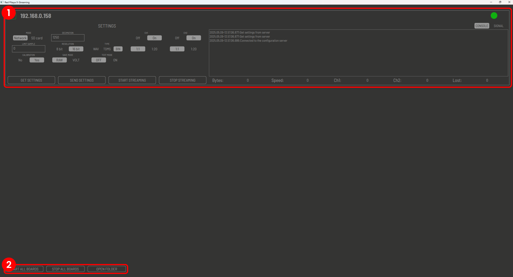
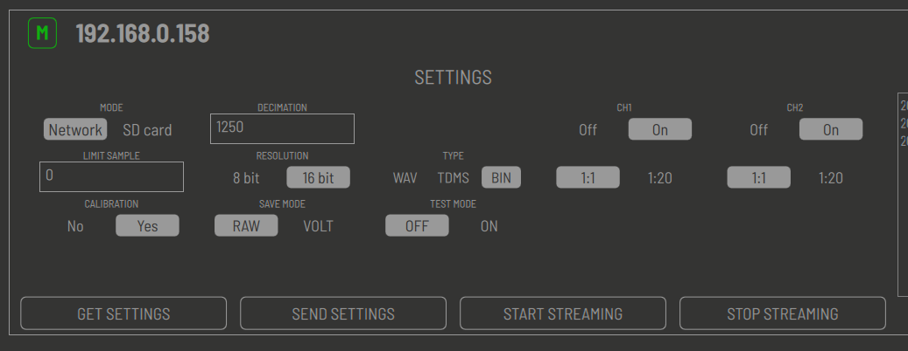
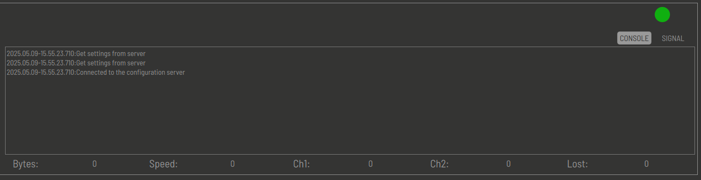

.. _stream_desktop_app:

Remote streaming (Desktop application)
=======================================

When using the remote streaming option, the data is streamed to a remote computer over the network. This option is useful for applications where the necessary data processing exceeds the capabilities of the Red Pitaya board and must therefor be done with more powerful tools on a remote computer.

The desktop application is available for Windows and Linux operating systems and supports :ref:`Multiboard streaming <multiboard_stream>`.

.. note::

    The stream options should be configured from the Desktop application and not from the web interface as the web interface does not necessarily reflect the actual settings of the streaming application.

    Use the "Get settings" button to get the current settings from each board.

#. **Download the desktop client application.**

    .. tabs::

        .. group-tab:: OS version 2.00-15 or older

            Files with clients are available |Streaming Client|.

        .. group-tab:: OS version 2.00.23 or newer

            Files with clients are in the *Streaming Application (Data Stream Control)*. You can download it from Red Pitaya itself.

            .. figure:: ../img/streaming_desktop_clients_200_23.png
                :width: 1000
                :align: center

#. **Unzip and run the application.**

    .. tabs::

        .. group-tab:: Linux
        
            After unpacking, enable the execution of the following files:
    
            * *rpsa_client_qt.sh*.
            * *bin/rpsa_client_qt*.

                .. figure:: ../img/qt1.png
                    :width: 800
                    :align: center

        .. group-tab:: Windowns
    
            Running the streaming desktop application should trigger a firewall warning (allowing access to the local network), which should be confirmed for proper operation.

            .. note::

                It is possible that an Antivirus program may (temporarily) block the desktop client. If you experience this issue, we recommend whitelisting the *Streaming Client* folder.

    Once running, the desktop application automatically detects Red Pitaya boards on the same local network which are running the Streaming Application (or have the *stream_app* FPGA image loaded). The boards and the client must be on the same network.

    .. figure:: ../img/qt2.png
        :width: 1000
        :align: center

#. **Configure stream settings.** Select the desired settings for each board then hit the **Send settings** button to apply the settings to the board.

#. **Start streaming.** The desktop application allows you to start and stop the streaming process for each detected board individually or for all boards at once. The streamed data is saved in the same directory as the desktop application.

Desktop client application
---------------------------

The GUI of desktop client application is split into the following sections:

1. **Board list:** The list of detected Red Pitaya boards on the same local network running the Streaming Application. Each detected board in the list has configurable settings that match the ones in the streaming application.
#. **Streaming settings:** Common settings for all detected boards.

Board list
~~~~~~~~~~~

The board list displays all detected Red Pitaya boards on the same local network running the Streaming Application. Red Pitaya boards that are not running the *Streaming Application* or the *stream_app* FPGA image will not be detected. For optimal performance, the boards should be connected to a router.

Two types of boards are detected as indicated by the icon in the top left corner:

    * **M** - Master or primary board.
    * **S** - Slave or secondary board.

The colour of the icon (as well as the dot in the top right corner) indicates the current status of the board:

    * **Green** - The board is ready to stream data.
    * **Red** - The board was available at some point since the start of the application, but is currently unavailable (either not running the *Streaming application* or is not connected to the network).

Beside the status icon, the IP address of the board is displayed.

In addition to the settings in the streaming application, the following settings are available:

 * **Test Mode:** Special mode for testing the desktop application. It is not recommended to use this mode for normal operation.

Four buttons are located across the bottom of each board settings section:

* **Get settings:** Get the current streaming application settings from the board. Pressing this button will fetch the current settings of the board and apply them to the desktop application.
* **Send settings:** Send the current streaming application settings to the board. When updating the settings in the desktop application, clicking the **send settings** button will ensure that the settings in the desktop application are sent to the board.
* **Start streaming:** Start the streaming process for the selected board. The streaming process will start immediately after clicking this button.
* **Stop streaming:** Stop the streaming process for the selected board. The streaming process will stop immediately after clicking this button.

For descritption of all other settings, please refer to the :ref:`ADC streaming configuration <adc_streaming_configuration>` and :ref:`DAC streaming configuration <dac_streaming_configuration>` sections.

With the button in the top right corner, you can switch between the console and the signal windows which thake up the right side of each board listing.

* The console section displays the current status of the streaming process as well as any error messages that may occur during the streaming process.
* The signal section displays the acquired data stream while the streaming process is running. The displayed signal should be used only as a reference and should not be used for any measurements or analysis.

The rest of the bottom part of the board box is used to display the statistics of the streaming process:

* **Bytes:** Number of bytes received from the board.
* **Speed:** Current data transfer speed in MB/s.
* **Ch1:** Number of samples received from channel 1.
* **Ch2:** Number of samples received from channel 2.
* **Lost:** Number of lost samples during the streaming process.

Streaming settings
~~~~~~~~~~~~~~~~~~~

The streaming settings section displays the common settings for all detected boards:

* **Start all boards:** Start the streaming process for all detected boards. The streaming process will start immediately after clicking this button.
* **Stop all boards:** Stop the streaming process for all detected boards. The streaming process will stop immediately after clicking this button.
* **Open folder:** Open the folder where the streamed data is saved. The folder is automatically created in the same directory as the desktop application when the streaming process is started.

With each stream, three files are created:

1. **Data file:** The data file contains the acquired data stream. The file format is determined by the selected settings in the ADC configuration section.
2. **Lost log file:** The lost log file contains information about any lost packets during the streaming process. It is recommended to check this file after each streaming session to ensure that no data was lost.
3. **Log file:** The log file contains information about the streaming process, such as the number of samples acquired, the sampling frequency, and any error messages that may occur during the streaming process.

The three files are named **data_file_<board_IP>_<date>_<time>.<file type>**, where the date and time are the date and time of the data acquisition process. The file type is determined by the selected settings in the ADC configuration section.

.. substitutions

.. |DIAdem| raw:: html

    <a href="https://www.ni.com/en-us/shop/data-acquisition-and-control/application-software-for-data-acquisition-and-control-category/what-is-diadem.html" target="_blank">DIAdem</a>

.. |Audacity| raw:: html

    <a href="https://www.audacityteam.org" target="_blank">Audacity</a>

.. |Streaming Client| raw:: html

    <a href="https://downloads.redpitaya.com/downloads/Clients/streaming/desktop/" target="_blank">here</a>

.. |br| raw:: html

     

