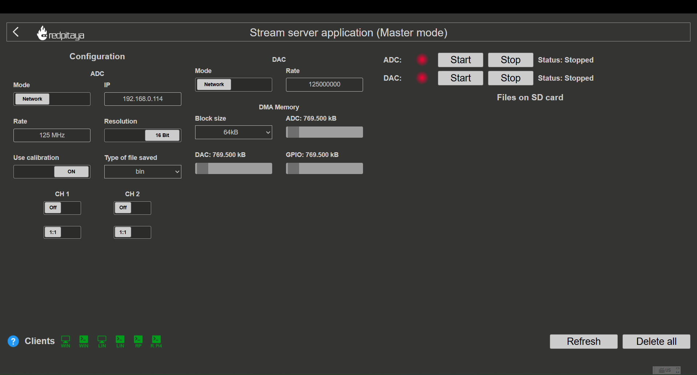
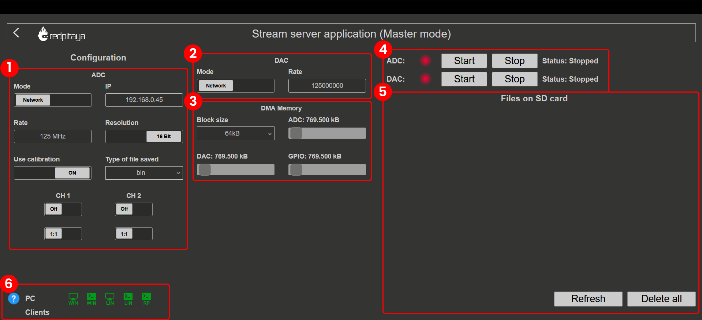

.. _streaming_top:

#########################
Data stream control
#########################

Data stream control (also called the Streaming application) unlocks the capability to stream data between Red Pitaya and the computer. 
This functionality can be extended by synchronising multiple boards together to create a multi-channel system (:ref:`X-channel system <x-ch_streaming>` 
and :ref:`Click Shield synchronisation <click_shield_sync>`).

.. contents:: Table of contents
    :local:
    :backlinks: top

|

Overview
**********

The Streaming application is designed to provide a simple and efficient way to stream data between Red Pitaya and a computer. It supports 
both ADC and DAC streaming, allowing users to acquire data from the fast analog inputs and generate signals on the fast analog outputs.

The application uses the reserved memory region that is shared with the :ref:`Deep Memory Mode <deepMemoryMode>` to temporarily store the 
data that is streamed to and from the board. This allows for efficient data transfer and processing, while also providing a flexible and 
scalable solution for a wide range of applications.

Key features
=============

* **Continuous data streaming from Red Pitaya fast analog inputs** (:ref:`maximum ADC data streaming rate limitations <streaming_limits>`):
    
    * Remotely to a computer via the TCP ethernet protocol (:ref:`max 62.5 MB/s <streaming_limits>`).
    * Locally to a file on the Red Pitaya SD card (:ref:`max 10 MB/s <streaming_limits>`).

* **Continuous data streaming to Red Pitaya fast analog outputs** (:ref:`maximum DAC data streaming rate limitations <streaming_limits>`):

    * Remotely from a file on a computer via the TCP ethernet protocol (:ref:`max 5 MHz DAC rate <streaming_limits>`).
    * Locally from a file on the Red Pitaya SD card (:ref:`See data streaming limitations <streaming_limits>`).

* **GPIO data streaming** (**Future development**):

    * The groundwork for GPIO data streaming is already implemented and will be released in a future update.

* **Multi-board synchronisation** for multi-channel systems

.. note::

    The Streaming application supports only continuous data streaming and does not have triggering capabilities. The data is streamed 
    continuously from the moment the application is started until it is stopped.

|

Quick start
============

The Streaming application can be started in three ways:

1.  **From the Red Pitaya Web interface**

    .. figure:: img/redpitaya_main_page.png
        :width: 600
        :align: center

#.  **From inside the Red Pitaya Linux OS** (:ref:`SSH connection <ssh>`) by loading the **stream_app** FPGA image and running **streaming-server**.

    .. code-block:: bash

        overlay.sh stream_app
        streaming-server

Once the streaming server is running, LED 2 will turn on and LED 0 will blink, indicating that the application is ready.

|

Application interface
=======================

The application interface is divided into the following sections:

1.  **ADC streaming configuration:** Configuration of the ADC streaming settings, such as streaming mode, sampling frequency, input 
    channel select and file format. See :ref:`ADC Configuration <stream_adc_config>`.

#.  **DAC streaming configuration:** Configuration of the DAC streaming settings, such as streaming mode and output data rate. See 
    :ref:`DAC Configuration <stream_dac_config>`.

#.  **DMA memory configuration:** Determines the minimal block size for streaming and :ref:`Deep Memory Mode <deepMemoryMode>` reserved 
    memory management. See :ref:`Memory Configuration <stream_memory_config>`.

#.  **Streaming status:** Controls for starting and stopping the streaming process. The status of the streaming process is also 
    displayed here. See :ref:`Web Interface Usage <stream_web_interface_usage>`.

#.  **Files on the SD card:** List of files saved on the SD card (acquired data and logs) and buttons for managing them. See 
    :ref:`Web Interface Usage <stream_web_interface_usage>`.

#.  **PC Clients:** List of downloadable clients for streaming desktop applications (Windows, Linux), command line clients (Windows, 
    Linux) and console client for Red Pitaya itself. See :ref:`Web Interface Usage <stream_web_interface_usage>`.

|

Documentation structure
========================

This documentation is organized into the following sections:

.. toctree::
    :maxdepth: 2

    Configuration <configuration/configuration_top>
    Usage guides <usage/usage_top>
    Reference <reference/reference_top>
    Advanced topics <advanced/advanced_top>

|

Getting help
=============

* Check the :ref:`Data Streaming Limitations <streaming_limits>` section to understand performance constraints
* Learn about :ref:`Performance Optimization <streaming_performance_optimization>` to achieve maximum streaming rates
* Review the :ref:`Examples <examples_streaming>` for practical use cases
* Visit the :rp-github:`Streaming application source code <RedPitaya/tree/master/apps-tools/streaming_manager>` on GitHub
* Refer to the :ref:`Technical Details <streaming_technical_details>` section to understand how the application works

|

Compatibility
===============

Red Pitaya boards are compatible with any computer operating system. However, the same cannot be said for the streaming client 
applications which are meant to run on the computer, which are available for Linux and Windows operating systems. Any specific 
requirements for the operating systems are listed below. We always recommend using the :ref:`latest version of the OS <prepareSD>` 
and the streaming client application to ensure the best performance and compatibility.

* **Windows 11** - Please use Red Pitaya OS 2.05-37 or newer as older streaming client versions are incompatible with Windows 11.

|