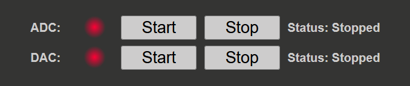
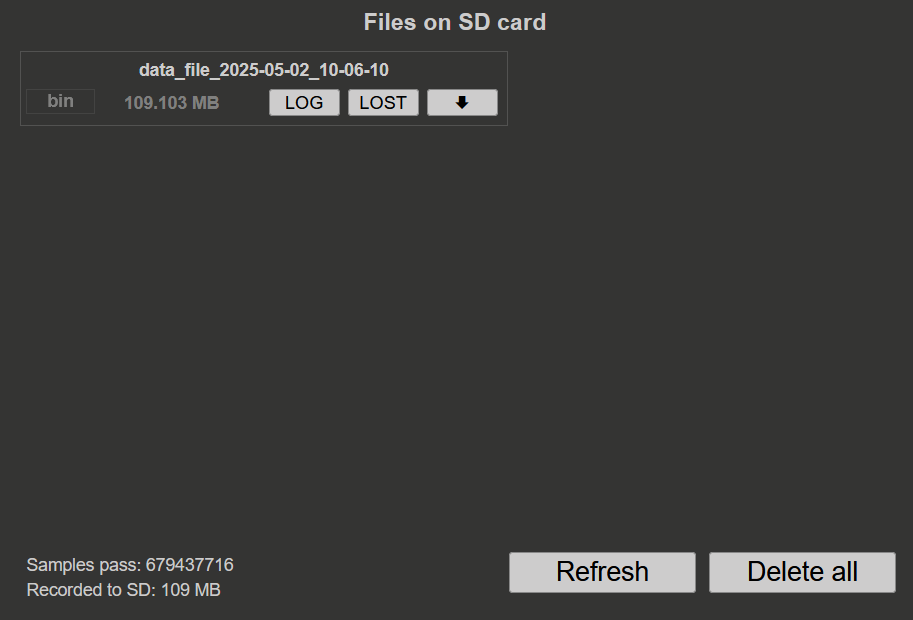
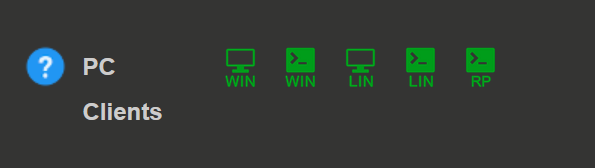

.. _stream_web_interface_usage:

#########################
Web interface usage
#########################

This section describes the web interface elements for controlling and monitoring the streaming process.

.. contents:: Table of contents
    :local:
    :backlinks: top

|

.. _streaming_status:

Streaming status
*****************

The streaming status section displays the current status of the ADC and DAC streaming process (GPIO will be added in the future). 
Each section has the following options:

Status indicators
==================

* **Status circle:** Indicates the current status of the streaming process
    
    * **Green:** Streaming is active
    * **Red:** Streaming is not active

* **Status message:** Displays the current status of the streaming process as well as any error messages that may occur

|

Control buttons
================

* **Start button:** Begin the streaming process for the selected mode
* **Stop button:** Stop the active streaming process

|

Error messages
===============

If the status message is red, it indicates that an error has occurred. The error message will provide information about the cause of 
the error and how to resolve it.

Common error messages
-----------------------

**"Not enough memory"**

* **Cause:** Insufficient memory allocated for the streaming mode
* **Solutions:**
    
    * Check the reserved memory settings in :ref:`Memory Configuration <stream_memory_config>`
    * Increase the reserved memory size
    * For DAC streaming, ensure a file is selected for data generation
    * Reduce memory allocation for other modes

**"Buffer overwrite"**

* **Cause:** Data rate exceeds system capabilities
* **Solutions:**
    
    * Reduce sampling frequency
    * Use fewer channels
    * Increase block size (for high-speed streaming)
    * Check :ref:`Data Streaming Limitations <streaming_limits>`

**"Configuration error"**

* **Cause:** Invalid configuration parameters
* **Solutions:**
    
    * Review :ref:`ADC Configuration <stream_adc_config>` or :ref:`DAC Configuration <stream_dac_config>`
    * Ensure all required settings are properly configured
    * Check configuration file syntax (if manually edited)

|

.. _streaming_sd_files:

Files on the SD card
*********************

This section displays all the files saved on the SD card during local streaming operations.

File information
=================

Each file entry displays:

* **File name:** Includes date and time (*data_file_<acquired_date>_<acquired_time>*)
* **File type:** Format of the saved file (WAV, TDMS, BIN)
* **File size:** Size of the file in bytes or appropriate units

When streaming ADC data in local mode, both the amount of data captured on the FPGA and the amount saved to the SD card are 
displayed.

|

File operations
================

Each file has three buttons:

Log button
-----------

* **Function:** Download the data log file
* **Contents:** Information about the streaming process:
    
    * Number of samples acquired
    * Sampling frequency
    * Start and end timestamps
    * Any error messages during streaming
    * Configuration parameters used

Lost button
------------

* **Function:** Download the lost packets file
* **Contents:** Information about any lost packets during the streaming process
* **Usage:** Check this file after each streaming session to ensure data integrity

.. note::

    It is recommended to check the lost packets file after each streaming session to verify that no data was lost during the 
    acquisition.

Download button
----------------

* **Function:** Download the data file
* **Contents:** The acquired data stream
* **Format:** Determined by the selected settings in the :ref:`ADC Configuration <stream_adc_config>` section

|

File management
================

Refresh button
---------------

* **Location:** Bottom right corner
* **Function:** Refresh the file list to show newly created files
* **Usage:** Click after completing a streaming session to update the file list

Delete all button
------------------

* **Location:** Bottom right corner
* **Function:** Delete all files on the SD card
* **Warning:** This action is irreversible. Use with caution.

.. warning::

    The "Delete all" operation permanently removes all streaming data and logs from the SD card. Ensure you have downloaded any important files before using this function.

|

.. _streaming_pc_clients:

PC Clients
***********

The PC clients section is located in the bottom left corner of the application. It contains downloadable clients for streaming 
data to a remote computer, Red Pitaya or another external device (like Raspberry Pi).

Available clients
==================

Desktop client (Windows, Linux)
---------------------------------

* **Icon:** Green monitor icon
* **Platforms:** Windows (WIN) and Linux (LIN)
* **Type:** Graphical user interface (GUI) application
* **Capabilities:**
    
    * Stream data from one or more Red Pitaya boards
    * Works on the same local network
    * Visual monitoring and control
    * Multi-board synchronization

* **Recommended for:** Users who prefer a GUI application for streaming data
* **Documentation:** See :ref:`Streaming to a remote computer via Desktop Application <stream_desktop_app>`

|

Command line client (Windows, Linux)
--------------------------------------

* **Icon:** Green terminal icon
* **Platforms:** Windows (WIN) and Linux (LIN)
* **Type:** Command line application
* **Capabilities:**
    
    * Stream data from one or more Red Pitaya boards
    * Scriptable and automatable
    * Advanced configuration options
    * Remote DAC streaming support
    * Multi-board synchronization

* **Recommended for:** Users who prefer command line tools or need automation
* **Documentation:** See :ref:`Streaming to a remote computer via Command Line or Terminal <stream_command_client>`

|

Red Pitaya command line client
--------------------------------

* **Icon:** Console icon
* **Platform:** Red Pitaya Linux
* **Type:** Console client
* **Capabilities:**
    
    * Stream data to and from the SD card
    * Local control without network
    * Direct access to Red Pitaya storage

* **Recommended for:** Local operations via SSH
* **Documentation:** See :ref:`Red Pitaya command line client <stream_command_client>`

|

Raspberry Pi command line client
--------------------------------

* **Icon:** Console icon
* **Platform:** Raspberry Pi Linux
* **Type:** Console client
* **Capabilities:**
    
    * Stream data to and from the Raspberry Pi
    * Local network control

* **Recommended for:** Limited speed local network operations
* **Documentation:** See :ref:`Red Pitaya command line client <stream_command_client>`

|

Documentation
==============

* **Icon:** Blue question mark
* **Function:** Opens this documentation page
* **Usage:** Quick access to help and reference materials

|

Next steps
***********

* Download and install the :ref:`Desktop Client <stream_desktop_app>` for graphical control
* Try the :ref:`Command Line Client <stream_command_client>` for advanced features
* Learn about :ref:`Local Streaming <streaming_local>` to save data directly to the SD card
* Explore :ref:`Examples <streaming_examples_top>` for practical use cases
