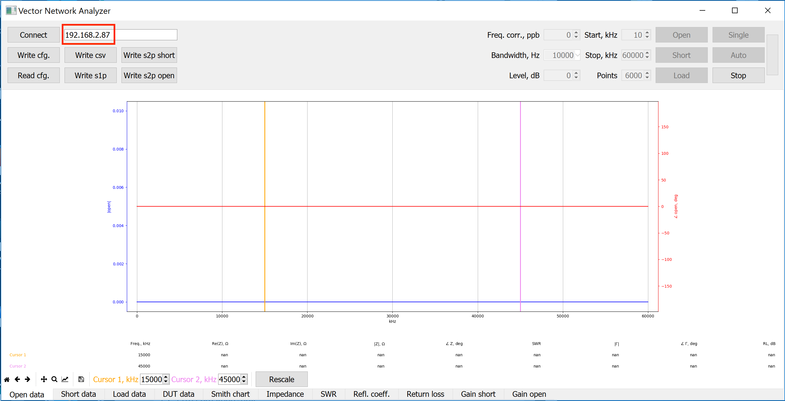

.. _vna_extension:

#######################
Vector Network Analyzer
#######################

.. note::

    The VNA application is a 3rd party application created and maintained by Pavel Demin and the SDR community. The application in the official Red Pitaya OS is ported from the community Alpine Linux image.
    For the access to the latest community updates, please check the |red_pitaya_notes_vna|.

********************************
What do I need before I start?
********************************

1. VNA application requirements:

    *   Windows or Linux-based personal computer (PC).

2. The following accessories and materials are available in the Red Pitaya store:

    *   any kit that includes a STEMlab 125-14, SDRlab 122-16, or 125-10 (discontinued) board
    *   Vector Network Analyzer bridge module

*****************************************************
Start using Red Pitaya as a Vector Network Analyser
*****************************************************

Connect Vector Network Analyzer bridge to the Red Pitaya
========================================================

    *   Connect the VNA module's OUT to the Red Pitaya IN1
    *   Connect the VNA module's IN to the Red Pitaya OUT1.
    *   Set the IN1 jumpers on the Red Pitaya to the LV position.

.. figure::  img/vna_bridge_module_connections.png
   :align: center
   :width: 600

Install & run network Vector Network Analyzer control app
=========================================================

Windows users only
------------------

    #. Open the VNA application
    #. Download and unpack the Windows |official_os_client|.
    #. Run the ``vna.exe`` program located in the *control* directory.
    #. Type in the IP address of the Red Pitaya board and press the *Connect* button.
    #. Perform calibration and measurements.

.. note::

    To get access to the latest community version of the VNA, please check out |red_pitaya_notes_vna|. The installation instructions differ only slightly:

    #. Open the VNA application
    #. Head to |red_pitaya_notes_vna|. There you can read more about the inner workings of the application as well as find links to other useful information.
    #. Find the **Getting started with MS Windows** section and follow the bullet points. **SKIP the first three points** if you are using official Red Pitaya OS! 
    #. Download and unpack the *release zip folder* from the link above to your computer.
    #. Run the ``vna.exe`` program located in the *control* directory.
    #. Type in the IP address of the Red Pitaya board and press the *Connect* button.
    #. Perform calibration and measurements.

.. |red_pitaya_notes_vna| raw:: html

   <a href="https://pavel-demin.github.io/red-pitaya-notes/vna/" target="_blank">Pavel Demin's Red Pitaya Notes VNA page</a>

.. |official_os_client| raw:: html

   <a href="https://downloads.redpitaya.com/downloads/Clients/vna/" target="_blank">control client</a>

Linux users only
----------------

    #. Open the VNA application
    #. Download and unpack the Linux |official_os_client|.
    #. Install |Python 3| and all the required libraries:

        .. code-block:: shell-session

            sudo apt-get install python3-dev python3-pip python3-numpy python3-pyqt5 libfreetype6-dev
            sudo pip3 install matplotlib mpldatacursor

    #. Run the control program:

        .. code-block:: shell-session

            cd /vna/client
            python3 vna.py

    #. Type in the IP address of the Red Pitaya board and press the *Connect* button.
    #. Perform calibration and measurements.

.. |Python 3| raw:: html

   <a href="https://www.python.org/" target="_blank">Python 3</a>

.. note::

    To get access to the latest community version of the VNA, please check out |red_pitaya_notes_vna|. The installation instructions differ only slightly:

    #. Open the VNA application
    #. Head to |red_pitaya_notes_vna|. There you can read more about the inner workings of the application as well as find links to other useful information.
    #. Find the **Getting started with GNU/Linux** section and follow the bullet points. **SKIP the first three points** if you are using official Red Pitaya OS! 
    #. Install |Python 3| and all the required libraries:

        .. code-block:: shell-session

            apt-get install python3-numpy python3-matplotlib python3-pyqt5

    #. Clone the source code repository to your computer:

        .. code-block:: shell-session

            git clone https://github.com/pavel-demin/red-pitaya-notes

    #. Run the control program:

        .. code-block:: shell-session

            cd red-pitaya-notes/projects/vna/client
            python3 vna.py

    #. Type in the IP address of the Red Pitaya board and press the *Connect* button.
    #. Perform calibration and measurements.

Type in the IP or URL address of the Red Pitaya board
=====================================================

Connect by entering the Red Pitaya's IP:
----------------------------------------

To find the IP address of your Red Pitaya board, first connect to Red Pitaya by following these :ref:`instructions <quick_start>`.

Then go to **System->Network Manager**. The IP is written next to the label.
Address: xxx.xxx.xxx.xxx .

.. figure::  img/network_manager_icon.png
    :width: 150 px
    :align: center

Connect by entering RedPitaya URL:
----------------------------------

.. figure::  img/1_url.png
    :align: center
    :width: 600

Run the Vector Network Analyzer application on the Red Pitaya
=============================================================

.. figure::  img/vna_icon.png
    :width:  150px
    :align: center

Click "Connect" inside the Vector Network Analyzer control app
==============================================================

.. figure::  img/2_connect.png
    :align: center
    :width: 600

***************************************
Perform calibration and start measuring
***************************************

.. note::

   On SDRlab 122-16 the VNA module works for frequencies above 500 kHz. Please start the calibration process at 500 kHz (ignore calibration values in the pictrures).

    .. figure::  img/3_calibrate.png
        :align: center
        :width: 600

#. Connect the SMA OPEN calibration connector marked with the letter O to the DUT SMA connector of the network vector analyzer bridge module. Click the button "Open" and wait for the calibration procedure to complete.

    .. figure:: img/04_Calibration_O.jpg
        :align: center
        :width: 600

#. Connect the SMA SHORT calibration connector marked with the letter S to the DUT SMA connector of the network vector analyzer bridge module. Click the button "Short" and wait for the calibration procedure to complete.

    .. figure:: img/03_Calibration_S.jpg
        :align: center
        :width: 600

#. Connect the SMA LOAD calibration connector marked with the letter L to the DUT SMA connector of the network vector analyzer bridge module. Click the button "Load" and wait for the calibration procedure to complete.

    .. figure:: img/05_Calibration_L.jpg
        :align: center
        :width: 600

#. Select the Smith chart tab at the bottom and then click the Single button to perform a single measurement of the DUT. A dot in the middle of the Smith chart circle (@ 50 Ohm) will indicate that VNA is properly measuring the reference 50 Ohm LOAD.

    .. figure::  img/4-load_DUT_smith_chart.png
        :align: center
        :width: 600

#. Disconnect the LOAD SMA connector and connect whatever DUT you'd like to measure.

    .. figure::  img/07_Product_Combo.jpg
        :align: center
        :width: 600

Examples:
=========

#. Measurement of a 21-meter vertical antenna
    The antenna is not properly tuned (at frequency 14, 21 MHz, SWR should be = 1.5).

    .. figure::  img/antenna.png
        :align: center
        :width: 600

#. 20-meter bandpass filter for HAM RADIO
    SWR is better than 1.5 between the start and stop band frequencies, and the filter load is around 50 Ohm.

.. figure::  img/bandpass_filter.png
    :align: center
    :width: 600

.. figure::  img/bandpass_filter_smith_chart.png
    :align: center
    :width: 600

Author & Source
===============

.. admonition:: Credits

    | The original developer of the Vector Network Analyzer Red Pitaya application is Pavel Demin.
    | Repositories used by our builds:

        *   `Red Pitaya Notes <https://pavel-demin.github.io/red-pitaya-notes/>`_

Pavel Demin has developed several other SDR applications that are compatible with the Red Pitaya board. These applications are available in the Pavel Demin's Alpine Linux OS image.
For more information on these applications, please refer to the `Red Pitaya Notes <https://pavel-demin.github.io/red-pitaya-notes/>`_.

