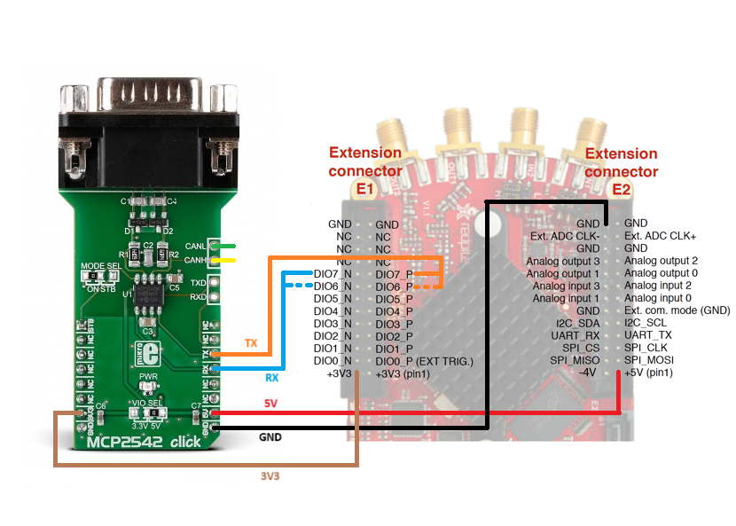
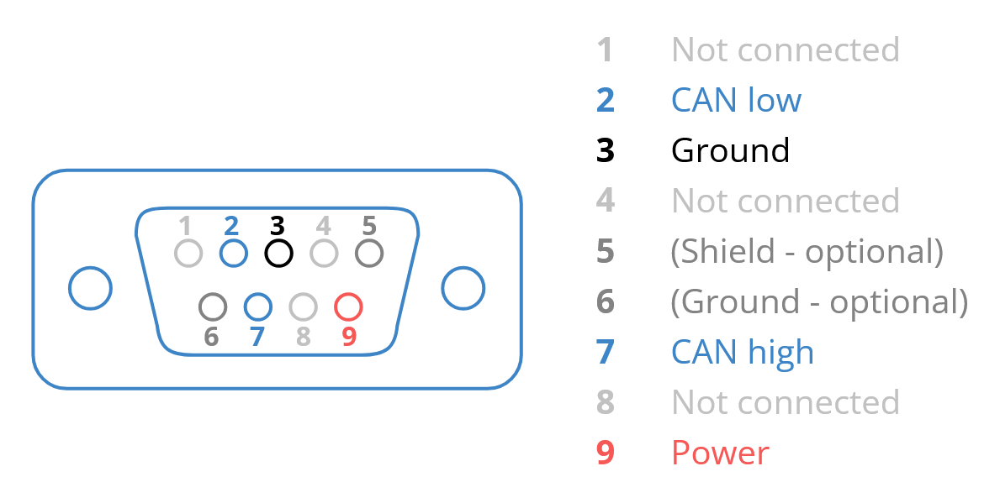

.. _canLoopback_example:

CAN Loopback
############

Description
============

This example demonstrates communication using the Red Pitaya CAN interface. The code below simulates a loopback by sending a message from the CAN socket.

Required hardware
==================

    - Red Pitaya

.. figure:: ../general_img/RedPitaya_general.png

|

Require software
================

- **2.04-35 or higher OS**

.. note::

    This code is written for **2.04-35 or higher OS**. For older OS versions, please check when specific commands were released (a note is added to each command introduced in 2.00 or higher verisons).

Connections
============

Although the CAN transceiver is not required for this example because the loopback mode connects the TX and RX pins on the FPGA level, the connection instructions are still included.

Connecting the MCP2452 Click Board (or another CAN transciever) to the Red Pitaya: 

- TX pins of the CAN transceivers to the CAN RX pins on the Red Pitaya
- RX pins of the CAN transceivers to the CAN TX pins on the Red Pitaya
- Connect the power and ground pins
- Use a DB-9 (or a different) cable to connect the CAN transceiver to an external CAN bus or to another MPC2542 click board

.. note::

    - **CAN0** - TX == DIO7_N, RX == DIO7_P
    - **CAN1** - TX == DIO6_N, RX == DIO6_P

Here is the CAN pinout for the DB-9 connector:

    Image source: |can-intro|

.. |can-intro| raw:: html

  <a href="https://www.csselectronics.com/pages/can-bus-simple-intro-tutorial" target="_blank">CSS Electronics</a>

SCPI Code Examples
====================

.. note::

  This code is written for **2.04-35 or higher OS**. For older OS versions, please check when specific commands were released (a note is added to each command introduced in 2.00 or higher verisons).

Code - MATLAB®
---------------

.. include:: ../matlab.inc

.. code-block:: matlab
    
    %% Define Red Pitaya as TCP/IP object
    clc
    close all
    IP = 'rp-f0a235.local';           % IP of your Red Pitaya
    port = 5000;
    RP = tcpclient(IP, port);

    % Variables
    bitrate = 200000;
    can_id = 123;
    timeout_rx = 2000;
    can_mode = 'LOOPBACK';
    can_data = [1 2 3];

    %% Open connection with your Red Pitaya
    RP.ByteOrder = 'big-endian';
    configureTerminator(RP,'CR/LF');
    flush(RP);
    fprintf('Start\n');

    % INIT CAN %
    writeline(RP, 'CAN:FPGA ON');

    % CAN 0 SETUP %
    writeline(RP, 'CAN0:STOP');
    writeline(RP, append('CAN0:BITRate ', num2str(bitrate)));
    writeline(RP, append('CAN0:MODE ', can_mode,',ON'));

    % Start and open the CAN0 interface %
    writeline(RP, 'CAN0:START');
    writeline(RP, 'CAN0:OPEN');

    % Send and read data %
    writeline(RP, append('CAN0:Send', num2str(can_id), ' ', strjoin(compose('%d',can_data),',')));

    rx_data = writeread(RP, append('CAN0:Read:Timeout', num2str(timeout_rx), '?'))

    % Close the interface %
    writeline(RP, 'CAN0:CLOSE');
    fprintf('End program\n');
    clear RP;

Code - Python
---------------

**Using SCPI commands:**

.. code-block:: python

    #!/usr/bin/python3
    
    import numpy as np
    import redpitaya_scpi as scpi
    
    IP = 'rp-f0a235.local'
    
    can_bus = 0
    bitrate = 200000
    can_id = 123
    timeout_rx = 2000
    can_mode = "loopback"
    
    tx_buffer = np.arange(3)
    print(f"Data: {np.array2string(tx_buffer, separator=',').replace('[','').replace(']','')}")
    
    rp = scpi.scpi(IP)
    
    # INIT CAN #
    rp.tx_txt('CAN:FPGA ON')
    print("CAN:FPGA ON")
    rp.check_error()
    
    ## CAN 0 SETUP ##
    # GPIO (N7,P7) 
    rp.tx_txt(f'CAN{can_bus}:STOP')
    rp.check_error()
    
    rp.tx_txt(f'CAN{can_bus}:BITRate {bitrate}')
    rp.check_error()
    
    rp.tx_txt(f'CAN{can_bus}:MODE {can_mode.upper()},ON')
    rp.check_error()
    
    # Start and open the CAN0 interface
    rp.tx_txt(f'CAN{can_bus}:START')
    rp.check_error()
    
    rp.tx_txt(f'CAN{can_bus}:OPEN')
    rp.check_error()
    
    # Send and read data
    rp.tx_txt(f'CAN{can_bus}:Send{can_id} {np.array2string(tx_buffer, separator=',').replace('[','').replace(']','')}')
    rp.check_error()
    
    rp.tx_txt(f'CAN{can_bus}:Read:Timeout{timeout_rx}?')
    print(f"Read data: {rp.rx_txt()}")
    
    # Close the interface
    rp.tx_txt(f'CAN{can_bus}:CLOSE')
    rp.check_error()
    rp.close()

.. include:: ../python_scpi_note.inc

API Code Examples
====================

.. include:: ../c_code_note.inc

Code - C++
-------------

.. include:: ../c_code_note.inc

.. code-block:: cpp

    /* @brief This is a simple application for testing CAN communication on a Red Pitaya
    *
    * (c) Red Pitaya  http://www.redpitaya.com
    *
    * This part of code is written in C++ programming language.
    * Please visit https://en.wikipedia.org/wiki/C%2B%2B
    * for more details on the language used herein.
    */
    
    #include <stdio.h>
    #include <stdlib.h>
    #include <string.h>
    #include "rp_hw_can.h"
    
    int main(int argc, char *argv[]){
    
        int res;
        int bitrate = 200000;
    
        int can_id = 123;
    
        int timeout_rx = 2000;
    
        unsigned char tx_buffer[8];
        memset(tx_buffer, '0', 8);
    
        tx_buffer[0] = '1';
        tx_buffer[1] = '2';
        tx_buffer[2] = '3';
        tx_buffer[3] = '4';
        tx_buffer[4] = '5';
    
        printf("Tx buffer data: %s\n", tx_buffer);
    
        /* INIT CAN */
        res = rp_CanSetFPGAEnable(true);
        printf("Init result: %d\n",res);
    
        /* CAN 0 SETUP */
        // GPIO (N7,P7) 
        res = rp_CanStop(RP_CAN_0);                 // set can0 interface to DOWN for configuration
        printf("Stop can0: %d\n",res);
    
        res = rp_CanSetBitrate(RP_CAN_0, bitrate);    // set can0 bitrate
        printf("Set bitrate: %d\n",res);
    
        res = rp_CanSetControllerMode(RP_CAN_0,RP_CAN_MODE_LOOPBACK,true);  // set loopback mode
        printf("Set loopback mode ON: %d\n",res);
    
        /* Start and open the CAN0 interface*/
        res = rp_CanStart(RP_CAN_0);            // set can0 interface to UP
        printf("Start can0: %d\n",res);
    
        res = rp_CanOpen(RP_CAN_0);             // open socket for can0
        printf("Open socket: %d\n",res);
    
        /* Send and read data */
        res = rp_CanSend(RP_CAN_0, can_id, tx_buffer, 3, false, false, 0);  // write buffer to can0
        printf("Write result: %d\n",res);
    
        rp_can_frame_t frame;
        res = rp_CanRead(RP_CAN_0, timeout_rx, &frame);     // read frame from can0
        printf("Read result: %d\n",res);   
        printf("Can ID: %d data: %d,%d,%d\n",frame.can_id,frame.data[0],frame.data[1],frame.data[2]);
        
        /* Close the interface */
        res = rp_CanClose(RP_CAN_0);            // close socket for can0
        printf("Close can0 result: %d\n",res);
        return 0;
    }

Code - Python API
-------------------

.. code-block:: python

    #!/usr/bin/env python3
    
    """ Python API example of CAN communication """
    
    import numpy as np
    import rp
    import rp_hw_can
    
    # Variables
    
    can = rp_hw_can.RP_CAN_0                    # RP_CAN_0 == DIO7_P, DIO7_N ### RP_CAN_1 == DIO6_P, DIO6_N
    can_id = 123
    can_bitrate = 200000                        # 1 - 10000000
    can_mode = rp_hw_can.RP_CAN_MODE_LOOPBACK   # RP_CAN_MODE_LOOPBACK, RP_CAN_MODE_LISTENONLY, 
                                                # RP_CAN_MODE_3_SAMPLES, RP_CAN_MODE_ONE_SHOT,
                                                # RP_CAN_MODE_BERR_REPORTING
                                                
    can_extended_frame = False                  # Extended can frame (True/False)
    can_rtr = False                             # Remote request frame (True/False)
    can_tx_timeout = 0                          # Timeout in milliseconds (0 == disabled)
    can_rx_timeout = 0
    
    tx_buffer = np.arange(8, dtype=np.uint8)
    rx_buffer = np.zeros(8, dtype=np.uint8)
    
    print(f"TX data: {tx_buffer}")
    print(f"RX data: {rx_buffer}")
    
    rp.rp_Init()
    
    ### Init CAN ###
    
    rp_hw_can.rp_CanSetFPGAEnable(True)                     # Init CAN in FPGA - pass the data from CAN controller to GPIO
    
    ### CAN 0 Setup ###
    rp_hw_can.rp_CanStop(can)                               # Set CAN state to DOWN for configuration
    
    rp_hw_can.rp_CanSetBitrate(can, can_bitrate)            # Set bitrate
    rp_hw_can.rp_CanSetControllerMode(can, can_mode, True)  # Set controller mode
    
    ### Start and open the CAN0 interface ###
    rp_hw_can.rp_CanStart(can)                              # Start CAN interface (line to UP)
    rp_hw_can.rp_CanOpen(can)                               # Open socket for CAN
    print("CAN ready")
    ### Send and receive data ###
    
    # Write buffer to CAN
    print(rp_hw_can.rp_CanSendNP(can, can_id, can_extended_frame, can_rtr, can_tx_timeout, tx_buffer))
    print(f"Data sent: {tx_buffer}")
    
    # Read frame from CAN
    print(rp_hw_can.rp_CanReadNP(can, can_rx_timeout, rx_buffer))
    print(f"Data received: {rx_buffer}")
    
    ### Close socket ###
    rp_hw_can.rp_CanClose(can)
    
    # Release resources
    print("Program END")
    rp.rp_Release()
    

