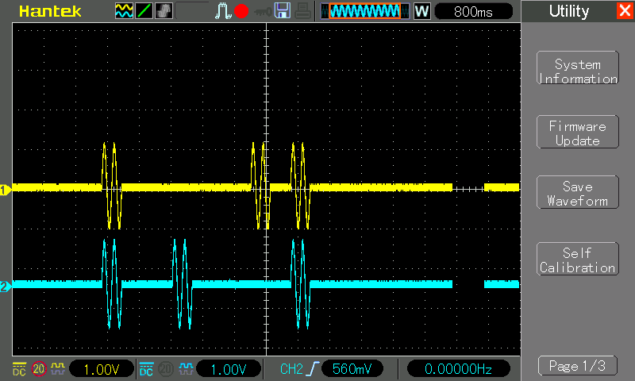

Generate two burst asynced signal
#################################

Description
***********

This example shows how to program Red Pitaya to generate two asynced analog signals. Voltage and frequency ranges depends on Red Pitaya model.

Required hardware
*****************

    - Red Pitaya device

.. figure:: output_y49qDi.gif

Code - MATLAB®
**************

The code is written in MATLAB. In the code we use SCPI commands and TCP/IP communication. Copy code to MATLAB editor
and press run.

.. code-block:: matlab

    %% Define Red Pitaya as TCP/IP object
    clc
    clear all
    close all
    IP= '192.168.1.106'; % Input IP of your Red Pitaya...
    port = 5000; % If you are using WiFi then IP is:
    tcpipObj=tcpip(IP, port);

    fopen(tcpipObj);
    tcpipObj.Terminator = 'CR/LF';

    %% The example generate sine bursts every 0.5 seconds indefinety
    fprintf(tcpipObj,'GEN:RST');

    fprintf(tcpipObj,'SOUR1:FUNC SINE');
    fprintf(tcpipObj,'SOUR1:FREQ:FIX 4'); % Set frequency of output signal
    fprintf(tcpipObj,'SOUR1:VOLT 1'); % Set amplitude of output signal

    fprintf(tcpipObj,'SOUR1:BURS:STAT BURST'); % Set burst mode to ON
    fprintf(tcpipObj,'SOUR1:BURS:NCYC 2'); % Set 1 pulses of sine wave
    fprintf(tcpipObj,'SOUR1:BURS:NOR 1'); % Infinity number of sine wave pulses
    fprintf(tcpipObj,'SOUR1:BURS:INT:PER 5000'); % Set time of burst period in microseconds = 5 * 1/Frequency * 1000000

    fprintf(tcpipObj,'SOUR2:FUNC SINE');
    fprintf(tcpipObj,'SOUR2:FREQ:FIX 4'); % Set frequency of output signal
    fprintf(tcpipObj,'SOUR2:VOLT 1'); % Set amplitude of output signal

    fprintf(tcpipObj,'SOUR2:BURS:STAT BURST'); % Set burst mode to ON
    fprintf(tcpipObj,'SOUR2:BURS:NCYC 2'); % Set 1 pulses of sine wave
    fprintf(tcpipObj,'SOUR2:BURS:NOR 1'); % Infinity number of sine wave pulses
    fprintf(tcpipObj,'SOUR2:BURS:INT:PER 5000'); % Set time of burst period in microseconds = 5 * 1/Frequency * 1000000
    fprintf(tcpipObj,'OUTPUT:STATE ON'); % Set output to ON
    pause(2)
    fprintf(tcpipObj,'SOUR1:TRIG:INT');
    pause(2)
    fprintf(tcpipObj,'SOUR2:TRIG:INT');
    pause(1)
    fprintf(tcpipObj,'SOUR:TRIG:INT');

    %% Close connection with Red Pitaya

    fclose(tcpipObj);

Code - C
********

.. note::

    C code examples don't require the use of the SCPI server, we have included them here to demonstrate how the same functionality can be achieved with different programming languages. 
    Instructions on how to compile the code are here -> `link <https://redpitaya.readthedocs.io/en/latest/developerGuide/comC.html>`_

.. code-block:: c

    /* Red Pitaya C API example Generating signal pulse on an external trigger 
    * This application generates a specific signal */

    #include <stdio.h>
    #include <stdlib.h>
    #include <unistd.h>

    #include "rp.h"

    int main(int argc, char **argv){
        /* Print error, if rp_Init() function failed */
        if(rp_Init() != RP_OK){
                fprintf(stderr, "Rp api init failed!\n");
        }

        rp_GenWaveform(RP_CH_1, RP_WAVEFORM_SINE);
        rp_GenFreq(RP_CH_1, 4);
        rp_GenAmp(RP_CH_1, 1.0);

         rp_GenWaveform(RP_CH_2, RP_WAVEFORM_SINE);
        rp_GenFreq(RP_CH_2, 4);
        rp_GenAmp(RP_CH_2, 1.0);

        rp_GenMode(RP_CH_1, RP_GEN_MODE_BURST);
        rp_GenBurstCount(RP_CH_1, 2);
        rp_GenBurstRepetitions(RP_CH_1, 1);
        rp_GenBurstPeriod(RP_CH_1, 5000);

        rp_GenMode(RP_CH_2, RP_GEN_MODE_BURST);
        rp_GenBurstCount(RP_CH_2, 2);
        rp_GenBurstRepetitions(RP_CH_2, 1);
        rp_GenBurstPeriod(RP_CH_2, 5000);
        
        rp_GenOutEnableSync(true);
        sleep(2);
        rp_GenTrigger(RP_CH_1);
        sleep(2);
        rp_GenTrigger(RP_CH_2);
        sleep(1);
        rp_GenTrigger(3); // Gen trigger on both channels
        rp_Release();
    }

Code - Python
*************

.. code-block:: python

    #!/usr/bin/python

    import sys
    import time
    import redpitaya_scpi as scpi

    rp_s = scpi.scpi(sys.argv[1])

    wave_form = 'sine'
    freq = 4
    ampl = 1

    rp_s.tx_txt('GEN:RST')
    rp_s.tx_txt('SOUR1:FUNC ' + str(wave_form).upper())
    rp_s.tx_txt('SOUR1:FREQ:FIX ' + str(freq))
    rp_s.tx_txt('SOUR1:VOLT ' + str(ampl))

    rp_s.tx_txt('SOUR2:FUNC ' + str(wave_form).upper())
    rp_s.tx_txt('SOUR2:FREQ:FIX ' + str(freq))
    rp_s.tx_txt('SOUR2:VOLT ' + str(ampl))

    rp_s.tx_txt('SOUR1:BURS:STAT BURST')
    rp_s.tx_txt('SOUR1:BURS:NCYC 2')
    rp_s.tx_txt('SOUR1:BURS:NOR 1')
    rp_s.tx_txt('SOUR1:BURS:INT:PER 5000')

    rp_s.tx_txt('SOUR2:BURS:STAT BURST')
    rp_s.tx_txt('SOUR2:BURS:NCYC 2')
    rp_s.tx_txt('SOUR2:BURS:NOR 1')
    rp_s.tx_txt('SOUR2:BURS:INT:PER 5000')

    rp_s.tx_txt('OUTPUT:STATE ON')
    time.sleep(2)
    rp_s.tx_txt('SOUR1:TRIG:INT')
    time.sleep(2)
    rp_s.tx_txt('SOUR2:TRIG:INT')
    time.sleep(1)
    rp_s.tx_txt('SOUR:TRIG:INT')

