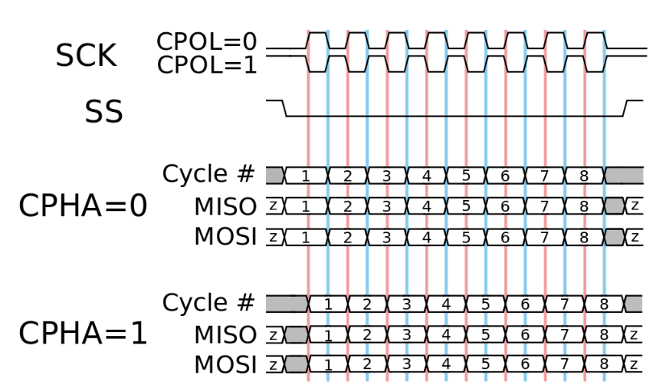

.. _commands_spi:

====
SPI
====

Functionality overview
------------------------

Red Pitaya SPI does not use the standard ``cpol`` and ``cpha`` parameters, instead the mode can be one of the following:

* ``LISL`` - Low idle level, sample on leading edge - equivalent to ``cpol=0, cpha=0``
* ``LIST`` - Low idle level, sample on trailing edge - equivalent to ``cpol=0, cpha=1``
* ``HISL`` - High idle level, sample on leading edge - equivalent to ``cpol=1, cpha=0``
* ``HIST`` - High idle level, sample on trailing edge - equivalent to ``cpol=1, cpha=1``

    SPI modes (`Image source <https://digilent.com/blog/wp-content/uploads/2018/09/SPI_timing_diagram.svg_.png>`_)

The SPI commands feature three different function to configure the buffers for messages (using SCPI commands for explanation, but the same applies to the API commands).

* ``SPI:MSG<n>:TX<m>:RX`` - Creates both the read (receive) and write (send) buffers for the specified message.
* ``SPI:MSG<n>:TX<m>`` - Creates only the write buffer for the specified message. Deletes any previously created read buffer for the same message.
* ``SPI:MSG<n>:RX<m>`` - Creates only the read buffer for the specified message. Deletes any previously created write buffer for the same message.

In the background (API commands) all the commands call the same function ``rp_SPI_SetBufferForMessage()`` which initializes the data for both the buffers for sending and receiving at the same time.
Calling the function multiple times for the same message will delete the previous buffers and create new ones. This means that to create both the buffers for sending and receiving you have to use the ``SPI:MSG<n>:TX<m>:RX`` command.
Calling the ``SPI:MSG<n>:TX<m>`` command and then the ``SPI:MSG<n>:RX<m>`` command will first create the buffer for sending (and not initialize the receiving buffer), then the second command will delete the previously created buffer for sending and create a new one for receiving.
Consequently, it is impossible to create both the buffers for sending and receiving using a sequence of ``SPI:MSG<n>:TX<m>`` and ``SPI:MSG<n>:RX<m>`` commands as one of the buffers will never be initialized, resulting in an error when trying to read or write data (for SCPI commands this can result in an infinite loop when attempting to read the data from a nonexisting buffer).

Adding the ``:CS`` suffix (or setting the *cs_change* to ``true``) to the command will toggle the CS line after sending/receiving the message. For most basic applications this is not needed.

Important notes
----------------

* The SPI device path on Gen 2 boards is "/dev/spidev2.0" instead of the classic "/dev/spidev1.0".

Code examples
-----------------

Here are some examples of how to use the SPI commands on Red Pitaya:

* :ref:`Digital communication examples <examples_digcom>`.

Parameters and command table
-----------------------------

**Parameter options:**

- ``<mode> = {LISL, LIST, HISL, HIST}``  Default: ``LISL``
- ``<cs_mode> = {NORMAL, HIGH}``  Default: ``NORMAL``
- ``<bits> = {7, 8}``  Default: ``8``
- ``<speed> = {1...100000000}`` Default: ``50000000``
- ``<data> = {XXX, ... | #HXX, ... | #QXXX, ... | #BXXXXXXXX, ... }`` Array of data separated by commas

   - ``XXX`` = Dec format
   - ``#HXX`` = Hex format
   - ``#QXXX`` = Oct format
   - ``#BXXXXXXXX`` = Bin format

**Available Jupyter and API macros:**

- SPI mode - ``RP_SPI_MODE_LISL, RP_SPI_MODE_LIST, RP_SPI_MODE_HISL, RP_SPI_MODE_HIST``
- SPI bit order - ``RP_SPI_ORDER_BIT_MSB, RP_SPI_ORDER_BIT_LSB``
- SPI state - ``RP_SPI_STATE_NOT, RP_SPI_STATE_READY``
- SPI CS mode - ``RP_SPI_CS_NORMAL, RP_SPI_CS_HIGH``

.. tabularcolumns:: |p{50mm}|p{50mm}|p{60mm}|p{30mm}|

+--------------------------------------------+---------------------------------------------------------------------------------------------------------------------------+------------------------------------------------------------------------------------+--------------------+
| SCPI                                       | API, Jupyter                                                                                                              | DESCRIPTION                                                                        |  ECOSYSTEM         |
+============================================+===========================================================================================================================+====================================================================================+====================+
| | ``SPI:INIT``                             | | C++: ``rp_SPI_Init()``                                                                                                  | Initializes the API for working with SPI.                                          | 1.04-18 and up     |
| | Example:                                 | |                                                                                                                         |                                                                                    |                    |
| | ``SPI:INIT``                             | | Python: ``rp_SPI_Init()``                                                                                               |                                                                                    |                    |
| |                                          | |                                                                                                                         |                                                                                    |                    |
+--------------------------------------------+---------------------------------------------------------------------------------------------------------------------------+------------------------------------------------------------------------------------+--------------------+
| | ``SPI:INIT:DEV <path>``                  | | C++: ``rp_SPI_InitDevice(const char *device)``                                                                          | | Initializes the API for working with SPI. ``<path>`` - Path to the SPI device.   | 1.04-18 and up     |
| | Example:                                 | |                                                                                                                         | | On some boards, it may be different from the standard: /dev/spidev1.0            |                    |
| | ``SPI:INIT:DEV "/dev/spidev1.0"``        | | Python: ``rp_SPI_InitDevice(<device>)``                                                                                 | |                                                                                  |                    |
| |                                          | |                                                                                                                         | | Shoulld be set to /dev/spidev2.0 on Gen 2 boards.                                |                    |
+--------------------------------------------+---------------------------------------------------------------------------------------------------------------------------+------------------------------------------------------------------------------------+--------------------+
| | ``SPI:RELEASE``                          | | C++: ``rp_SPI_Release()``                                                                                               | Releases all used resources.                                                       | 1.04-18 and up     |
| | Example:                                 | |                                                                                                                         |                                                                                    |                    |
| |                                          | | Python: ``rp_SPI_Release()``                                                                                            |                                                                                    |                    |
| | ``SPI:RELEASE``                          | |                                                                                                                         |                                                                                    |                    |
+--------------------------------------------+---------------------------------------------------------------------------------------------------------------------------+------------------------------------------------------------------------------------+--------------------+
| | ``SPI:SETtings:DEFault``                 | | C++: ``rp_SPI_SetDefaultSettings()``                                                                                    | Sets the settings for SPI to default values.                                       | 1.04-18 and up     |
| | Example:                                 | |                                                                                                                         |                                                                                    |                    |
| | ``SPI:SETtings:DEFault``                 | | Python: ``rp_SPI_SetDefaultSettings()``                                                                                 |                                                                                    |                    |
| |                                          | |                                                                                                                         |                                                                                    |                    |
+--------------------------------------------+---------------------------------------------------------------------------------------------------------------------------+------------------------------------------------------------------------------------+--------------------+
| | ``SPI:SETtings:SET``                     | | C++: ``rp_SPI_SetSettings()``                                                                                           | | Sets the specified settings for SPI.                                             | 1.04-18 and up     |
| | Example:                                 | |                                                                                                                         | | Executed after specifying the parameters of communication.                       |                    |
| | ``SPI:SETtings:SET``                     | | Python: ``rp_SPI_SetSettings()``                                                                                        | |                                                                                  |                    |
| |                                          | |                                                                                                                         | |                                                                                  |                    |
+--------------------------------------------+---------------------------------------------------------------------------------------------------------------------------+------------------------------------------------------------------------------------+--------------------+
| | ``SPI:SETtings:GET``                     | | C++: ``rp_SPI_GetSettings()``                                                                                           | Gets the specified SPI settings.                                                   | 1.04-18 and up     |
| | Example:                                 | |                                                                                                                         |                                                                                    |                    |
| | ``SPI:SETtings:GET``                     | | Python: ``rp_SPI_GetSettings()``                                                                                        |                                                                                    |                    |
| |                                          | |                                                                                                                         |                                                                                    |                    |
+--------------------------------------------+---------------------------------------------------------------------------------------------------------------------------+------------------------------------------------------------------------------------+--------------------+
| | ``SPI:SETtings:MODE <mode>``             | | C++: ``rp_SPI_SetMode(rp_spi_mode_t mode)``                                                                             | | Sets the mode for SPI.                                                           | 1.04-18 and up     |
| | Example:                                 | |                                                                                                                         | | - LISL = Low idle level, Sample on leading edge                                  |                    |
| | ``SPI:SETtings:MODE LIST``               | | Python: ``rp_SPI_SetMode(<mode>)``                                                                                      | | - LIST = Low idle level, Sample on trailing edge                                 |                    |
| |                                          | |                                                                                                                         | | - HISL = High idle level, Sample on leading edge                                 |                    |
| |                                          | |                                                                                                                         | | - HIST = High idle level, Sample on trailing edge                                |                    |
+--------------------------------------------+---------------------------------------------------------------------------------------------------------------------------+------------------------------------------------------------------------------------+--------------------+
| | ``SPI:SETtings:MODE?`` > ``<mode>``      | | C++: ``rp_SPI_GetMode(rp_spi_mode_t *mode)``                                                                            | Gets the specified mode for SPI.                                                   | 1.04-18 and up     |
| | Example:                                 | |                                                                                                                         |                                                                                    |                    |
| | ``SPI:SETtings:MODE?`` > ``LIST``        | | Python: ``rp_SPI_GetMode()``                                                                                            |                                                                                    |                    |
| |                                          | |                                                                                                                         |                                                                                    |                    |
+--------------------------------------------+---------------------------------------------------------------------------------------------------------------------------+------------------------------------------------------------------------------------+--------------------+
| | ``SPI:SETtings:CSMODE <cs_mode>``        | | C++: ``rp_SPI_SetCSMode(rp_spi_cs_mode_t cs_mode)``                                                                     | | Sets the mode for CS.                                                            | 2.00-18 and up     |
| | Example:                                 | |                                                                                                                         | | - NORMAL = After the message is transmitted,                                     |                    |
| | ``SPI:SETtings:CSMODE NORMAL``           | | Python: ``rp_SPI_SetCSMode(<cs_mode>)``                                                                                 | | the CS line is set to the HIGH state.                                            |                    |
| |                                          | |                                                                                                                         | | - HIGH = After the message has been transmitted,                                 |                    |
| |                                          | |                                                                                                                         | | the CS line is set to the LOW state.                                             |                    |
+--------------------------------------------+---------------------------------------------------------------------------------------------------------------------------+------------------------------------------------------------------------------------+--------------------+
| | ``SPI:SETtings:CSMODE?`` > ``<cs_mode>`` | | C++: ``rp_SPI_GetCSMode(rp_spi_cs_mode_t *cs_mode)``                                                                    | Gets the specified CS mode for SPI.                                                | 2.00-18 and up     |
| | Example:                                 | |                                                                                                                         |                                                                                    |                    |
| | ``SPI:SETtings:CSMODE?`` > ``NORMAL``    | | Python: ``rp_SPI_GetCSMode()``                                                                                          |                                                                                    |                    |
| |                                          | |                                                                                                                         |                                                                                    |                    |
+--------------------------------------------+---------------------------------------------------------------------------------------------------------------------------+------------------------------------------------------------------------------------+--------------------+
| | - (NA)                                   | | C++: ``rp_SPI_SetOrderBit(rp_spi_order_bit_t order)``                                                                   | Set SPI bit order.                                                                 | 2.04-35 and up     |
| |                                          | |                                                                                                                         |                                                                                    |                    |
| |                                          | | Python: ``rp_SPI_SetOrderBit(<order>)``                                                                                 |                                                                                    |                    |
| |                                          | |                                                                                                                         |                                                                                    |                    |
+--------------------------------------------+---------------------------------------------------------------------------------------------------------------------------+------------------------------------------------------------------------------------+--------------------+
| | - (NA)                                   | | C++: ``rp_SPI_GetOrderBit(rp_spi_order_bit_t *order)``                                                                  | Get SPI bit order.                                                                 | 2.04-35 and up     |
| |                                          | |                                                                                                                         |                                                                                    |                    |
| |                                          | | Python: ``rp_SPI_GetOrderBit()``                                                                                        |                                                                                    |                    |
| |                                          | |                                                                                                                         |                                                                                    |                    |
+--------------------------------------------+---------------------------------------------------------------------------------------------------------------------------+------------------------------------------------------------------------------------+--------------------+
| | ``SPI:SETtings:SPEED <speed>``           | | C++: ``rp_SPI_SetSpeed(int speed)``                                                                                     | Sets the speed of the SPI connection.                                              | 1.04-18 and up     |
| | Example:                                 | |                                                                                                                         |                                                                                    |                    |
| | ``SPI:SETtings:SPEED 1000000``           | | Python: ``rp_SPI_SetSpeed(<speed>)``                                                                                    |                                                                                    |                    |
| |                                          | |                                                                                                                         |                                                                                    |                    |
+--------------------------------------------+---------------------------------------------------------------------------------------------------------------------------+------------------------------------------------------------------------------------+--------------------+
| | ``SPI:SETings:SPEED?`` > ``<speed>``     | | C++: ``rp_SPI_GetSpeed(int *speed)``                                                                                    | Gets the speed of the SPI connection.                                              | 1.04-18 and up     |
| | Example:                                 | |                                                                                                                         |                                                                                    |                    |
| | ``SPI:SETtings:SPEED?`` > ``1000000``    | | Python: ``rp_SPI_GetSpeed()``                                                                                           |                                                                                    |                    |
| |                                          | |                                                                                                                         |                                                                                    |                    |
+--------------------------------------------+---------------------------------------------------------------------------------------------------------------------------+------------------------------------------------------------------------------------+--------------------+
| | ``SPI:SETtings:WORD <bits>``             | | C++: ``rp_SPI_SetWordLen(int len)``                                                                                     | Specifies the length of the word in bits. Must be greater than or equal to 7.      | 1.04-18 and up     |
| | Example:                                 | |                                                                                                                         |                                                                                    |                    |
| | ``SPI:SETtings:WORD 8``                  | | Python: ``rp_SPI_SetWordLen(<len>)``                                                                                    |                                                                                    |                    |
| |                                          | |                                                                                                                         |                                                                                    |                    |
+--------------------------------------------+---------------------------------------------------------------------------------------------------------------------------+------------------------------------------------------------------------------------+--------------------+
| | ``SPI:SETtings:WORD?`` > ``<bits>``      | | C++: ``rp_SPI_GetWordLen(int *len)``                                                                                    | Returns the length of a word.                                                      | 1.04-18 and up     |
| | Example:                                 | |                                                                                                                         |                                                                                    |                    |
| | ``SPI:SETtings:WORD?`` > ``8``           | | Python: ``rp_SPI_GetWordLen()``                                                                                         |                                                                                    |                    |
| |                                          | |                                                                                                                         |                                                                                    |                    |
+--------------------------------------------+---------------------------------------------------------------------------------------------------------------------------+------------------------------------------------------------------------------------+--------------------+
| | ``SPI:MSG:CREATE <n>``                   | | C++: ``rp_SPI_CreateMessage(size_t len)``                                                                               | | Creates a message queue for SPI (reserves the space for data buffers)            | 1.04-18 and up     |
| | Example:                                 | |                                                                                                                         | | Once created, they need to be initialized.                                       |                    |
| | ``SPI:MSG:CREATE 1``                     | | Python: ``rp_SPI_CreateMessage(<len>)``                                                                                 | | ``<n>`` - The number of messages in the queue.                                   |                    |
|                                            | |                                                                                                                         | | The message queue can operate within a single CS state switch.                   |                    |
+--------------------------------------------+---------------------------------------------------------------------------------------------------------------------------+------------------------------------------------------------------------------------+--------------------+
| | ``SPI:MSG:DEL``                          | | C++: ``rp_SPI_DestoryMessage()``                                                                                        | Deletes all messages and data buffers allocated for them.                          | 1.04-18 and up     |
| | Example:                                 | |                                                                                                                         |                                                                                    |                    |
| | ``SPI:MSG:DEL``                          | | Python: ``rp_SPI_DestoryMessage()``                                                                                     |                                                                                    |                    |
| |                                          | |                                                                                                                         |                                                                                    |                    |
+--------------------------------------------+---------------------------------------------------------------------------------------------------------------------------+------------------------------------------------------------------------------------+--------------------+
| | ``SPI:MSG:SIZE?`` > ``<n>``              | | C++: ``rp_SPI_GetMessageLen(size_t *len)``                                                                              | Returns the length of the message queue.                                           | 1.04-18 and up     |
| | Example:                                 | |                                                                                                                         |                                                                                    |                    |
| | ``SPI:MSG:SIZE?`` > ``1``                | | Python: ``rp_SPI_GetMessageLen()``                                                                                      |                                                                                    |                    |
| |                                          | |                                                                                                                         |                                                                                    |                    |
+--------------------------------------------+---------------------------------------------------------------------------------------------------------------------------+------------------------------------------------------------------------------------+--------------------+
| | ``SPI:MSG<n>:TX<m> <data>``              | | C++: ``rp_SPI_SetBufferForMessage(size_t msg,const uint8_t *tx_buffer,bool init_rx_buffer,size_t len, bool cs_change)`` | | Sets data for the write buffer for the specified message.                        | 1.04-18 and up     |
| | ``SPI:MSG<n>:TX<m>:CS <data>``           | |                                                                                                                         | | CS - Toggles CS state after sending/receiving this message.                      |                    |
| | Example:                                 | | Python: ``rp_SPI_SetBufferForMessage(<msg>, <tx_buffer>, <init_rx_buffer>, <len>, <cs_change>)``                        | | ``<n>`` - index of message 0 <= n < msg queue size.                              |                    |
| | ``SPI:MSG0:TX4 1,2,3,4``                 | |                                                                                                                         | | ``<m>`` - TX buffer length.                                                      |                    |
| | ``SPI:MSG1:TX3:CS 2,3,4``                | |                                                                                                                         | | Sends ``<m>`` 'bytes' from message ``<n>``. No data is received.                 |                    |
| |                                          | |                                                                                                                         | |                                                                                  |                    |
+--------------------------------------------+---------------------------------------------------------------------------------------------------------------------------+------------------------------------------------------------------------------------+--------------------+
| | ``SPI:MSG<n>:TX<m>:RX <data>``           | | C++: ``rp_SPI_SetBufferForMessage(size_t msg,const uint8_t *tx_buffer,bool init_rx_buffer,size_t len, bool cs_change)`` | | Sets data for the read and write buffers for the specified message.              | 1.04-18 and up     |
| | ``SPI:MSG<n>:TX<m>:RX:CS <data>``        | |                                                                                                                         | | CS - Toggles CS state after sending/receiving this message.                      |                    |
| | Example:                                 | | Python: ``rp_SPI_SetBufferForMessage(<msg>, <tx_buffer>, <init_rx_buffer>, <len>, <cs_change>)``                        | | ``<n>`` - index of message 0 <= n < msg queue size.                              |                    |
| | ``SPI:MSG0:TX4:RX 1,2,3,4``              | |                                                                                                                         | | ``<m>`` - TX buffer length.                                                      |                    |
| | ``SPI:MSG1:TX3:RX:CS 2,3,4``             | |                                                                                                                         | | The read buffer is also created with the same length and initialized with zeros. |                    |
| |                                          | |                                                                                                                         | |                                                                                  |                    |
| |                                          | |                                                                                                                         | | Sends ``<m>`` 'bytes' from message ``<n>`` and receives the same amount of data  |                    |
| |                                          | |                                                                                                                         | |  from the dataline                                                               |                    |
+--------------------------------------------+---------------------------------------------------------------------------------------------------------------------------+------------------------------------------------------------------------------------+--------------------+
| | ``SPI:MSG<n>:RX<m>``                     | | C++: ``rp_SPI_SetBufferForMessage(size_t msg,const uint8_t *tx_buffer,bool init_rx_buffer,size_t len, bool cs_change)`` | | Initializes a buffer for reading the specified message.                          | 1.04-18 and up     |
| | ``SPI:MSG<n>:RX<m>:CS``                  | |                                                                                                                         | | CS - Toggles CS state after receiving message.                                   |                    |
| | Example:                                 | | Python: ``rp_SPI_SetBufferForMessage(<msg>, <tx_buffer>, <init_rx_buffer>, <len>, <cs_change>)``                        | | ``<n>`` - index of message 0 <= n < msg queue size.                              |                    |
| | ``SPI:MSG0:RX4``                         | |                                                                                                                         | | ``<m>`` - RX buffer length.                                                      |                    |
| | ``SPI:MSG1:RX5:CS``                      | |                                                                                                                         | |                                                                                  |                    |
| |                                          | |                                                                                                                         | | Receives ``<m>`` 'bytes' into message ``<n>``. No data is transmitted.           |                    |
| |                                          | |                                                                                                                         | |                                                                                  |                    |
+--------------------------------------------+---------------------------------------------------------------------------------------------------------------------------+------------------------------------------------------------------------------------+--------------------+
| | ``SPI:MSG<n>:RX?`` > ``<data>``          | | C++: ``rp_SPI_GetRxBuffer(size_t msg, const uint8_t **buffer, size_t *len)``                                            | Returns a read buffer for the specified message.                                   | 1.04-18 and up     |
| | Example:                                 | |                                                                                                                         |                                                                                    |                    |
| | ``SPI:MSG1:RX?`` > ``{2,4,5}``           | | Python: ``rp_SPI_GetRxBuffer(<msg>)``                                                                                   |                                                                                    |                    |
| |                                          | |                                                                                                                         |                                                                                    |                    |
+--------------------------------------------+---------------------------------------------------------------------------------------------------------------------------+------------------------------------------------------------------------------------+--------------------+
| | ``SPI:MSG<n>:TX?`` > ``<data>``          | | C++: ``rp_SPI_GetTxBuffer(size_t msg, const uint8_t **buffer, size_t *len)``                                            | Returns the write buffer for the specified message.                                | 1.04-18 and up     |
| | Example:                                 | |                                                                                                                         |                                                                                    |                    |
| | ``SPI:MSG1:TX?`` > ``{2,4,5}``           | | Python: ``rp_SPI_GetTxBuffer(<msg>)``                                                                                   |                                                                                    |                    |
| |                                          | |                                                                                                                         |                                                                                    |                    |
+--------------------------------------------+---------------------------------------------------------------------------------------------------------------------------+------------------------------------------------------------------------------------+--------------------+
| | ``SPI:MSG<n>:CS?`` > ``ON|OFF``          | | C++: ``rp_SPI_GetCSChangeState(size_t msg, bool *cs_change)``                                                           | Returns the setting for CS mode for the specified message.                         | 1.04-18 and up     |
| | Example:                                 | |                                                                                                                         |                                                                                    |                    |
| | ``SPI:MSG1:CS?`` > ``ON``                | | Python: ``rp_SPI_GetCSChangeState(<msg>)``                                                                              |                                                                                    |                    |
| |                                          | |                                                                                                                         |                                                                                    |                    |
+--------------------------------------------+---------------------------------------------------------------------------------------------------------------------------+------------------------------------------------------------------------------------+--------------------+
| | ``SPI:PASS``                             | | C++: ``rp_SPI_ReadWrite()``                                                                                             | Sends the prepared messages to the SPI device.                                     | 1.04-18 and up     |
| | Example:                                 | |                                                                                                                         |                                                                                    |                    |
| | ``SPI:PASS``                             | | Python: ``rp_SPI_ReadWrite()``                                                                                          |                                                                                    |                    |
| |                                          | |                                                                                                                         |                                                                                    |                    |
+--------------------------------------------+---------------------------------------------------------------------------------------------------------------------------+------------------------------------------------------------------------------------+--------------------+
| | - (NA)                                   | | C++: NA                                                                                                                 | Creates a buffer for sending and receiving data.                                   | 2.04-35 and up     |
| |                                          | |                                                                                                                         |                                                                                    |                    |
| |                                          | | Python: ``Buffer(<size>)``                                                                                              |                                                                                    |                    |
| |                                          | |                                                                                                                         |                                                                                    |                    |
+--------------------------------------------+---------------------------------------------------------------------------------------------------------------------------+------------------------------------------------------------------------------------+--------------------+

|

* :ref:`Back to top <commands_spi>`
* :ref:`Back to command list <command_list>`
