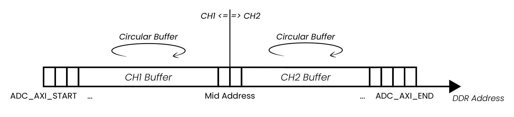

.. _deepMemoryMode:

#######################
Deep Memory Mode (DMM)
#######################

Deep Memory Mode (DMM) encompasses the Deep Memory Acquisition (DMA) and the Deep Memory Generation (DMG). It enables the user to utilize the full potential of Red Pitaya's DDR3 RAM for data 
acquisition and generation. The Deep Memory Acquisition allows for high-speed data capture, while the Deep Memory Generation enables the generation of complex waveforms with extended memory capabilities.

All Deep Memory Mode features use direct memory access (commonly labelled with DMA) to the Red Pitaya's DDR3 RAM, allowing for high-speed data transfer and processing. The allocated RAM region is 
also referred to as the DMM region and is shared between the acquisition and generation features. The DMM region can be configured by the user, but it is recommended to leave at least 100 MB of DDR 
for proper operation of the Linux OS.

.. contents::
   :local:
   :backlinks: top

|

.. _deepMemoryAcq:

Deep Memory Acquisition (DMA)
==============================

Description
-----------

Deep memory acquisition is a special type of data acquisition that allows the user to stream data directly into Red Pitaya's DDR3 RAM at full sampling speed of 125 MS/s (depending on board model).
The buffer length is variable and can be specified by the user (must be a multiple of 64 Bytes), but cannot exceed the size of the allocated RAM region. The amount of dedicated RAM can be increased 
by the user, but it is recommended to leave at least 100 MB of DDR for proper operation of the Linux OS. Deep memory acquisition is based on the `AXI protocol (AXI DMA and AXI4-Stream)`_. 
The Deep Memory Acquisition uses Direct Memory Access (twice the acronym, double the meaning).

Once the acquisition is complete, Red Pitaya needs some time to transfer the entire file to the computer (RAM needs to be cleared) before the acquisition can be reset.
DMA can be configured using SCPI, Python API and C++ API commands.

DMA operates in two modes:

* **One buffer mode** — Data is captured into the DDR memory buffer at the full ADC sampling speed (up to 125 MS/s). Once the buffer is full, acquisition stops and the data can be transferred to the 
  computer. This is the mode used when configuring DMA via **SCPI, Python API, or C++ API commands**.
* **True streaming mode** — Data is continuously streamed from the FPGA through DDR memory and over the network to the host computer. The data rate in this mode is limited to :ref:`62.5 MB/s <streaming_limits>`. 
  True streaming mode is **only available through the** :ref:`streaming command line client <stream_command_client>` **of the** :ref:`Data Stream Control application <streaming_top>`. True streaming mode 
  requires significantly more reserved DDR memory than one buffer mode — both the application and API code will warn you if insufficient memory is reserved.

**Features**

* Deep Memory Acquisition can work in parallel with regular data capture mode in v0.94 FPGA, only the triggers are common for both modes.
* By default, the RAM memory region allocated for the DMM is set to 32 MB (maximum space to capture data from all input channels).
* **One buffer mode** runs at the full ADC core clock speed (up to 125 MS/s for STEMlab 125-14); used with SCPI, Python API, and C++ API.
* **True streaming mode** is limited to :ref:`62.5 MB/s <streaming_limits>` and is only available via the :ref:`streaming command line client <stream_command_client>`.
* True streaming mode requires significantly more reserved memory than one buffer mode; warnings are issued when insufficient memory is reserved.
* The reserved memory can be assigned to only one buffer, thereby allocating all memory to a single channel.
* Can run in parallel with Deep Memory Generation.

.. note::

    **Shared resources** - the reserved memory region is shared between the Deep Memory Acquisition and Deep Memory Generation. If you are using both features, the total size of the reserved 
    region must be less than (or equal to) the size of the allocated memory region.

|

Required hardware
------------------

* Any Red Pitaya device.

Required software
------------------

* Red Pitaya OS 2.00-18 or higher.
* FPGA v0.94 image.

|

Functionality
-----------------

Here is a representation of how the DMA data saving functions:

For easier explanation, the start and end addresses of the DMA buffer are labeled as **ADC_AXI_START** and **ADC_AXI_END**. The data is saved in 32-bit chunks (4 Bytes per sample). The **ADC_AXI_START** 
points to the start of the first Byte of the first sample, and **ADC_AXI_END** points to the first Byte of the last sample of DDR reserved for the DMA. The size of the whole buffer is **ADC_AXI_SIZE**. 
All the labels are just for representation and do not reference any macros.

The starting address of the DMA buffer (**ADC_AXI_START**) and the size of the DMA buffer (**ADC_AXI_SIZE**) are acquired through the **rp_AcqAxiGetMemoryRegion** function.

The memory region can capture data from a single channel (the whole memory is allocated to a single channel), or it can be split between multiple input channels (CH1 (IN1) and CH2 (IN2)) (also CH3 and 
CH4 on *STEMlab 125-14 4-Input*) by passing the following parameters to the *rp_AcqAxiSetBuffer()* function:

    * Captured channel number (*RP_CH_1* or *RP_CH_2*) (also *RP_CH_3* or *RP_CH_4* for *STEMlab 125-14 4-Input*).
    * Start address.
    * Number of samples (to be captured).

In the example below, the memory region is split between both channels, where 1024 samples are captured on each channel.

The **Mid Address** in the picture above represents the starting point of the *Channel 2 buffer* inside the reserved DMM region and is set to *ADC_AXI_START + (ADC_AXI_SIZE/2)* (both channels can 
capture the same amount of data).

Once the acquisition is complete, the data is acquired through the *rp_AcqAxiGetDataRaw* or *rp_AcqAxiGetDataV* functions by passing the following parameters:

    * Channel number.
    * Address of triggering moment (by using the ``rp_AcqAxiGetWritePointerAtTrig`` function).
    * Data size.
    * Location where to store the data (start address of buffer). An integer buffer is used to store RAW values and a float buffer for values in Volts.

.. note::

    Depending on the size of the acquired data and how much DDR memory is reserved for the Deep Memory Acquisition, the data transfer from DDR might take a while.
    Here are a few tips to speed things up:

    * **SCPI commands** - acquire the data in **RAW binary** format (``ACQ:DATA:FORMAT BIN``, ``ACQ:AXI:DATA:UNITS RAW``). With the latest OS versions, we have optimized the SCPI server to transfer 
      the **RAW binary** data in binary format, which is much faster than transferring it as a string (any other combination - VOTLS, ASCII). This method is still slightly slower than creating a 
      custom TCP server with optimized commands using the Python or C++ API, but not by much.
    * **Python API**:

        * Use the new functions ``rp_AcqAxiGetDataRawNP(channel, pos, np_buffer)`` and ``rp_AcqAxiGetDataVNP(channel, pos, np_buffer)`` that return the data as a Numpy buffer directly.
        * The fastest possible acquisition is achieved by using the ``rp_AcqAxiGetDataRawDirect(channel, pos, size)``, which directly returns the memory region without copying it to a Numpy buffer.

    * **Python or C++ API** - to transfer the data to the computer establish a `websocket TCP connection`_ with the Red Pitaya and transfer the data over the socket. This is slightly faster than 
      **RAW BIN** SCPI and much faster than **VOLTS ASCII** using the SCPI commands as we avoid the overhead of string and voltage conversion. Custom TCP server (perhaps based on the SCPI server) 
      can be created using the Python or C++ API to handle the data transfer.

Once finished, please do not forget to free the resources and reserved memory locations. Otherwise, the performance of your Red Pitaya can decrease over time.

|

.. _deepMemoryGen:

Deep Memory Generation (DMG)
==============================

Description
-----------

Deep memory generation is a special type of data generation that allows the user to stream data directly from Red Pitaya's DDR3 RAM to the fast analog outputs. The buffer length is variable and
can be specified by the user (at least 128 Bytes), but cannot exceed the size of the allocated DMM region. The amount of dedicated RAM can be increased by the user, but it is recommended to
leave at least 100 MB of DDR for proper operation of the Linux OS. Deep memory generation is based on the `AXI protocol (AXI DMA and AXI4-Stream)`_.

DMG operates in two modes:

* **One buffer mode** — The waveform is loaded into the DDR memory buffer and played back continuously at the full DAC core clock speed (125 MHz). The output frequency of a periodic
  signal depends on the number of complete signal periods encoded in the buffer and the buffer size:

  .. math::

      f_{out} = \frac{f_{clock} \times N_{periods}}{N_{samples}}

  Because every sample is clocked to the DAC at the full core rate (125 MHz), users are free to encode **multiple periods within the buffer** to generate higher-frequency signals.
  With a single period per buffer the minimum buffer of 64 samples sets a lower bound on the output frequency:

  .. math::

      f_{out,\ 1\ period} = \frac{125\ \text{MHz}}{64} \approx 1.953\ \text{MHz}

  The practical upper limit is the Nyquist frequency of the DAC (62.5 MHz for STEMlab 125-14, since at least 2 samples per period are required).
  This is the mode used when configuring DMG via **Python API or C++ API commands**.

* **True streaming mode** — The waveform is continuously streamed from the host computer through the network to the DAC outputs. The data rate in this mode is limited to
  :ref:`62.5 MB/s <streaming_limits>`. **The output waveform is held constant between two consecutive samples** (zero-order hold — no interpolation is implemented in the FPGA to
  compensate for the slower throughput of true streaming mode). True streaming mode is **only available through the** :ref:`streaming command line client <stream_command_client>` **of the**
  :ref:`Data Stream Control application <streaming_top>`. True streaming mode requires significantly more reserved DDR memory than one buffer mode — both the application and
  API code will warn you if insufficient memory is reserved.

DMG can be configured using Python API and C++ API commands. SCPI command support will be added in the future.

**Features**

* Deep Memory Generation can generate custom waveforms with variable buffer length.
* By default, the RAM memory region allocated for the DMM is set to 32 MB (maximum space to store data for all output channels).
* **One buffer mode** runs at the full DAC core clock speed (125 MHz); used with Python API and C++ API. Output frequency is :math:`f_{clock} \times N_{periods} / N_{samples}` — with 
  the minimum 64-sample buffer and a single period this gives 1.953 MHz, but higher frequencies are achievable by encoding multiple periods in the buffer (practical ceiling: Nyquist 
  frequency of the DAC, 62.5 MHz for STEMlab 125-14).
* **True streaming mode** is limited to :ref:`62.5 MB/s <streaming_limits>` and is only available via the :ref:`streaming command line client <stream_command_client>`.
* In true streaming mode data arrives in buffers (length set in the config file); the maximum average processing rate is 62.5 MB/s. The effective hold time per sample is set by 
  ``dac_rate``. If the configured ``dac_rate`` exceeds the sustainable network throughput, gaps appear between buffers during which the DAC holds the last sample value. No FPGA 
  interpolation is performed.
* True streaming mode requires significantly more reserved memory than one buffer mode; warnings are issued when insufficient memory is reserved.
* The reserved memory can be assigned to only one buffer, thereby allocating all memory to a single output channel.
* Can run in parallel with Deep Memory Acquisition.

.. note::

    **Shared resources** - the reserved memory region is shared between the Deep Memory Acquisition and Deep Memory Generation. If you are using both features, the total size of the reserved 
    region must be less than (or equal to) the size of the allocated memory region.

.. note::

    **Waveform Template and Amplitude** - DMG waveforms are defined as **templates** with normalized values. The actual output voltage is determined by the **amplitude multiplier** set separately via ``SOUR<n>:VOLT`` command. The formula used by the FPGA is:
    
    **Output = (Waveform Template Value × Calibrated Amplitude Multiplier) + Calibration Offset**
    
    - Waveform template values must be in the range ``-1`` to ``1`` (where 1 = max DAC value, -1 = min DAC value)
    - The FPGA multiplies the template by a calibrated amplitude multiplier and adds a calibration offset
    - The FPGA does not inherently know the DAC's full-scale voltage; calibration values are used to ensure correct output
    - Ensure that all waveform data sent to DMG is properly normalized to the ``[-1, 1]`` range before loading into memory

|

Required hardware
------------------

* Any Red Pitaya device.

Required software
------------------

* Red Pitaya OS 2.07-43 or higher.
* FPGA v0.94 image.

|

Functionality
-----------------

The Deep Memory Generation (DMG) uses the same reserved memory region as the Deep Memory Acquisition (DMA). The DMG can be used to generate complex waveforms with extended memory capabilities,
allowing for longer and more detailed signals. The functionality is similar to the DMA, but instead of capturing data, it generates data from the reserved memory region and streams it to the
DAC outputs.

**One buffer mode**

In one buffer mode the waveform is read from DDR memory and clocked to the DAC outputs at the full core clock rate (125 MHz for most boards). Since each sample is output at the
full core clock rate, the output frequency of a periodic signal is determined by how many complete periods are encoded in the buffer:

.. math::

    f_{out} = \frac{f_{clock} \times N_{periods}}{N_{samples}}

Users are therefore **free to generate signals above 1.953 MHz** by encoding multiple periods within the buffer. The 1.953 MHz figure is the output frequency obtained with the minimum
buffer of 64 samples and a single period — it represents the lowest achievable frequency for a full-amplitude continuous signal at minimum buffer size, not a hard upper limit.
The practical ceiling is the Nyquist frequency of the DAC (62.5 MHz for STEMlab 125-14), since at least 2 samples per period are needed to represent a sinusoidal signal.

* The minimum buffer size is 64 samples (128 Bytes per channel).
* Buffer start addresses must be multiples of 4096 (DDR page size).

Each sample is held on the DAC output for exactly **one core clock period (8 ns at 125 MHz)**. Because no interpolation is performed in the FPGA, the output waveform has a
**staircase (zero-order hold) shape**: the more samples are used to describe one period of the waveform, the smoother the output will appear. For low-frequency signals — where
the buffer must represent many cycles of a slowly varying signal — the granularity may become noticeable at low sample counts. Users who require a smoother analogue output
without increasing the buffer size must **implement interpolation in the FPGA** (custom FPGA image). The current DMG implementation does not include an interpolation filter.

.. note::

    Boards with different core clock frequencies will still generate the samples at the full core clock rate (250 MHz for SIGNALlab 250-12 or 122.88 MHz for SDRlab 122-16).

**True streaming mode**

In true streaming mode the waveform data is sent from the host computer to Red Pitaya as a **sequence of buffers** over the network. The buffer length is specified by the user in the
:ref:`configuration file <stream_dac_config>`. Red Pitaya can process incoming data at a maximum **average rate of 62.5 MB/s** — this is the ceiling on how fast buffers can arrive and
be forwarded to the DAC. The network data rate therefore governs how quickly consecutive buffers reach the board, not how fast individual samples are clocked out.

* The output waveform is held **constant between consecutive samples** (zero-order hold), exactly as in one buffer mode — no interpolation is performed by the FPGA.
* The effective **hold time per sample** is no longer a fixed 8 ns. It is set by the **DAC output sampling rate** (``dac_rate`` variable) in the
  :ref:`configuration file <stream_dac_config>` used together with the :ref:`streaming command line client <stream_command_client>`:
  :math:`t_{hold} = 1 / \text{dac\_rate}`. The waveform granularity is consequently **more pronounced in true streaming mode** than in one buffer mode, particularly when a low
  ``dac_rate`` is required to stay within the streaming data-rate limit.
* **Buffer gaps** — if the configured ``dac_rate`` results in an average data rate that exceeds what the Red Pitaya hardware can sustain (62.5 MB/s), the board will exhaust the current buffer
  before the next one arrives. During this inter-buffer gap the DAC output is **held at the last sample value** of the completed buffer until new data is received. To avoid gaps, the
  product :math:`\text{dac\_rate} \times N_{channels} \times \text{BpS}` must not exceed 62.5 MB/s on average.
* Assuming one signal period per buffer, the maximum output signal frequency in true streaming mode is limited by the minimum buffer size (64 samples) to 1.953 MHz, but the
  actual achievable frequency is further constrained by the available data rate and the configured ``dac_rate``.
* Users who need a smoother analogue output in true streaming mode must implement interpolation in the FPGA (custom FPGA image).
* True streaming mode requires significantly more DDR memory to be reserved than one buffer mode. The application and API code will issue a warning if insufficient memory is reserved.

For more information on the 62.5 MB/s network throughput limit, see :ref:`Data Streaming Limitations <streaming_limits>`.

|

.. _DMM_change_reserved_memory: 

Changing reserved memory
=========================

The default memory region for the Deep Memory Mode is set to 32 MB, which is enough for most simple applications. However, if you need more memory for your application, you can increase 
the size of the reserved region in the device tree file. The device tree file is located in the **/opt/redpitaya/dts/$(monitor -f)** directory. The device tree file is a binary file that 
describes the hardware configuration of the Red Pitaya board. It is used by the Linux kernel to configure the hardware at boot time. The DDR memory allocated to the DMM can be configured 
through the **reg** parameter. Afterwards, you must **rebuild the device tree** and **restart** the Red Pitaya for this change to take effect.

.. note::

    **Shared resources** - The reserved region is shared between the Deep Memory Acquisition and Deep Memory Generation. If you are using both features, the total size of the reserved region must 
    be less than (or equal to) the size of the allocated memory region. 

The maximum memory allocation is restricted to the size of the board's DDR (512 MB for STEMlab 125-14). However, DMM and Linux share the DDR resources, so allocating too much resources to the DMM 
may result in decreased performance. To prevent problems, we recommend leaving at least 100 MB of the DDR for the Linux, resulting in a maximum DMM region of 412 MB (for STEMlab 125-14).

#.  **Establish SSH connection** - :ref:`SSH <ssh>`.
#.  **Remount the SD card with write permissions** and open the **dtraw.dts** file.

    .. code-block:: console

        root@rp-f066c8:~# rw
        root@rp-f066c8:~# nano /opt/redpitaya/dts/$(monitor -f)/dtraw.dts

#.  **Search the file** for the "buffer" keyword and configure the following lines:

    .. code-block:: default

        buffer@1000000 {
            phandle = <0x39>;
            reg = <0x1000000 0x2000000>;
        };

    The first parameter in **reg** is *start address (0x1000000)* (hexa address where the deep memory region starts), and the second is the *region size (0x2000000)* (32 MiB). Leave the start 
    address the same and change the region size to suit your program needs. The values are in hexadecimal format.

    Here is a calculation example for a 32 MiB region:

    .. math::

        32 MiB = 32 \cdot 1 MiB = 32 \cdot 1024 \cdot 1024 Bytes = 2^{25} Bytes = 0x2000000

    .. note::

        1 MiB = 1024·1024 Bytes = :math:`2^{20}` Bytes = 1048576 Bytes.
        We are using Mebibytes (MiB) instead of Megabytes (MB) to avoid confusion with the decimal system.

#.  **Rebuild the device tree** and **restart the board**.

    .. code-block:: console

        root@rp-f066c8:~# cd /opt/redpitaya/dts/$(monitor -f)/
        root@rp-f066c8:~# dtc -I dts -O dtb ./dtraw.dts -o devicetree.dtb
        root@rp-f066c8:~# reboot

.. note::

    To prevent performance decrease problems, we recommend leaving at least 100 MB of the DDR for the proper operation of the Linux OS. The maximal recommended DMM region size is 412 MB for 
    boards with 512 MB of RAM (for example, STEMlab 125-14 and SDRlab 122-16) and 924 MB for boards with 1 GB of RAM (for example, SIGNALlab 250-12).

|

Checking the reserved memory
----------------------------

The easiest way to check the reserved memory region is to use the :ref:`monitor command line utility <monitor_util>`. The utility will display the reserved memory region start address, end address, 
and size in bytes. Here is an example of the command and the output:

.. code-block:: console

    redpitaya> monitor -r
    Reserved memory:
        start:  0x1000000 (16777216)
        end:    0x3000000 (50331648)
        size:   0x2000000 (33554432) 32768 kB

|

API functions
===============

Check the :ref:`DMA and DMG sections under the commands' list <commands_dmm>`.

|

API Code Examples
===================

* :ref:`DMA and DMG API/SCPI/Python/C++ code examples <examples_dmm>`.
* :ref:`Streaming command line client examples (ADC) <stream_adc_cli_example>` and :ref:`(DAC) <stream_dac_cli_example>` — demonstrates one buffer mode and true streaming mode triggered 
  from the command line client.
* :ref:`Streaming API examples <examples_streaming>` — Python API-based ADC and DAC streaming examples.

|

.. links and references

.. _websocket TCP connection: https://www.geeksforgeeks.org/web-tech/what-is-web-socket-and-how-it-is-different-from-the-http/

.. _AXI protocol (AXI DMA and AXI4-Stream): https://adaptivesupport.amd.com/s/article/1053914?language=en_US
