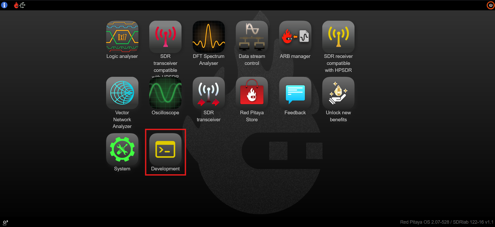
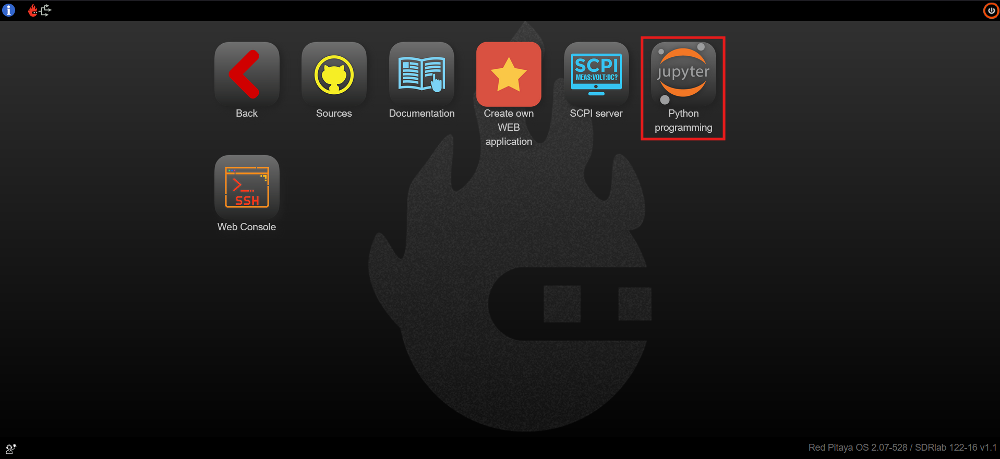

.. _jupyterlab:

#################
Jupyter Lab
#################

JupyterLab is the latest web-based interactive development environment for notebooks, code, and data. Its flexible interface allows users to configure and arrange workflows in data science, scientific computing, computational journalism, and machine learning. A modular design invites extensions to expand and enrich functionality.

JupyterLab includes all the functionality of the Jupyter Notebook (an open-source web application that allows you to create and share documents that contain live code, equations, visualizations, explanatory text, and direct control or monitor hardware).

JupyterLab is located in the **Development** section of the Red Pitaya web interface.

|

Features
============

* In-browser editing of code, with automatic syntax highlighting, indentation, and tab completion/introspection.
* The ability to execute code from the browser, with the results of computations attached to the code which generated them. 
* Displaying the result of computation using rich media representations, such as HTML, LaTeX, PNG, SVG, etc. For example, publication-quality figures rendered by the |matplotlib| library can be included inline.
* In-browser editing for rich text using the |Markdown| markup language, which can provide commentary for the code, is not limited to plain text.
* The ability to easily include mathematical notation within markdown cells using LaTeX, and rendered natively by |MathJax|.

.. note::

    We do not recommend running more than 10 JupyterLab kernels simultaneously, as the board can run out of memory and force the shutdown of the JupyterLab application.
    Red Pitaya remembers which Notebooks were opened the last time JupyterLab was used, so exiting the application without closing most of the Notebooks can lead to very long JupyterLab loading times. Therefore, it is inadvisable to exit JupyterLab with more than 5 tabs (Notebooks) open.

    Active kernels are found here:

    .. figure:: img/Jupyter_kernel.png
        :width: 800

.. |Markdown| raw:: html

    <a href="https://daringfireball.net/projects/markdown/syntax" target="_blank">Markdown</a>
    
.. |MathJax| raw:: html

    <a href="https://www.mathjax.org/" target="_blank">MathJax</a>

Notebook documents
----------------------

Notebook documents contain the inputs and outputs of an interactive session as well as additional text that accompanies the code but is not meant for execution. In this way, notebook files can serve as a complete computational
record of a session, interleaving executable code with explanatory text, mathematics, and rich representations of resulting objects. These documents are internal |JSON| files and are saved with 
the *.ipynb* extension. Since JSON is a plain text format, they can be version-controlled and shared with colleagues.

.. |JSON| raw:: html

    <a href="https://en.wikipedia.org/wiki/JSON" target="_blank">JSON</a>

Notebooks may be exported to a range of static formats, including HTML (for example, for blog posts), reStructuredText, LaTeX, PDF, and slide shows, via the |nbconvert| command.

.. |nbconvert| raw:: html

    <a href="https://nbconvert.readthedocs.io/en/latest/" target="_blank">nbconvert</a>

Furthermore, any *.ipynb* notebook document available from a public URL can be shared via the Jupyter Notebook Viewer (nbviewer). This service loads the notebook document from the URL and renders it as a static web page. The results may thus be shared with a colleague, or as a public blog post, without other users needing to install the Jupyter notebook themselves. In effect, nbviewer is simply nbconvert as a web service, so you can do your own static conversions with nbconvert without relying on nbviewer.

Hardware - Sensor extension module
======================================

Although the usage of the JupyterLab does not require any additional hardware except the Red Pitaya board, getting started with electronics is way more fun and interesting when you have loads of sensors that you can put to good use straight away. Whether you want to measure temperature, vibration, movement, etc., we have an extension module compatible with **Grove** modules from |Seeed®|. All you need to do is to select the desired module, find the correct connector, and get going with your project. We have also placed the Arduino shield headers on the extension module.

.. figure:: img/extension_module_and_sensors.png
    :width: 500

Here you can find more information regarding the :ref:`Sensor extension module <sensor_extension_module>`.

.. |Seeed®| raw:: html

    <a href="https://wiki.seeedstudio.com/Grove_System/" target="_blank">Seeed®</a>

Examples
===========

The code examples are available here:

* :ref:`JupyterLab examples <examples>` (Use Python API examples).
* |jupyterlab_github|.
* |welcome_ipynb|.

.. |jupyterlab_github| raw:: html

    <a href="https://github.com/RedPitaya/jupyter/tree/master" target="_blank">Red Pitaya Jupyter GitHub</a>

.. |welcome_ipynb| raw:: html

    <a href="https://github.com/RedPitaya/jupyter/blob/master/welcome.ipynb" target="_blank">Red Pitaya JupyterLab welcome page</a>
