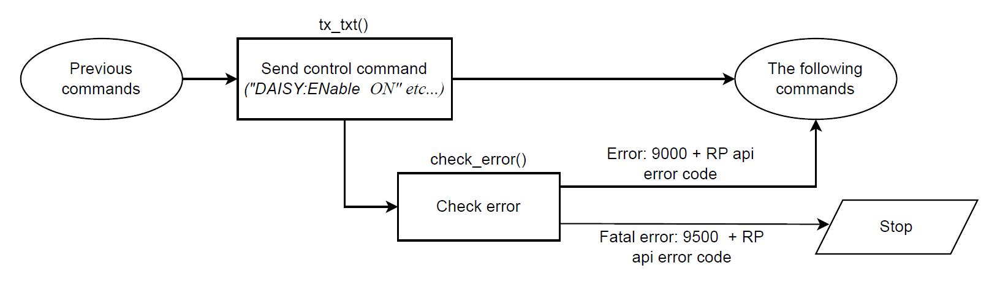

.. _scpi_commands:

SCPI server (MATLAB, LabVIEW, Scilab or Python)
##################################################

.. https://owncloud.redpitaya.com/index.php/apps/files/?dir=%2FWEB%20page%2Fapps%2FSCPI

.. figure:: img/SCPI_web_lr.png

|

The Red Pitaya board can be controlled remotely over a LAN or wireless interface using MATLAB, LabVIEW, Scilab, or Python via the Red Pitaya SCPI (Standard Commands for Programmable Instrumentation) list of commands.
The SCPI interface/environment is commonly used to control T&M instruments for development, research, or test automation. SCPI uses a set of commands recognised by the instruments to enable specific actions (e.g., acquiring data from fast analog inputs, generating signals, and controlling other peripheries of the Red Pitaya platform). 
The SCPI commands are extremely useful when complex signal analysis is required. A software environment such as MATLAB that provides powerful data analysis tools is a perfect combination for the SCPI commands' simple access to raw data acquired on the Red Pitaya board.

**Features**

- Quickly write control routines and programs using MATLAB, LabVIEW, Scilab, or Python.
- Use powerful data analysis tools like MATLAB, LabVIEW, Scilab, or Python to analyse raw signals acquired by the Red Pitaya board.
- Write testing scripts and routines.
- Incorporate your Red Pitaya and LabVIEW into testing and production lines.
- Take quick measurements directly on your PC.

.. note::

   Communicating with an SCPI server and working with web-based instruments at the same time can diminish the performance of your Red Pitaya. This is because the same resource is used for both tasks.

|

***********
Quick start
***********

To initiate the SCPI server, just click on the SCPI server icon. Once the SCPI server is operational, your board's IP address will be displayed. This IP address should be incorporated into your scripts. 
Alternatively, you can manually commence the SCPI server using the Terminal (refer to the instructions below).

To run an example, follow the instructions below:

#.  Go to your Red Pitaya web interface and select the SCPI server in the *Development* section.

    .. figure:: img/scpi-homepage.png

    |

    .. figure:: img/scpi-development.png

#.  Start the SCPI server by selecting the RUN button. Please note the IP addreess (in our case, *192.168.178.100*) or the .local address (in our case, *rp-f03e5f.local*) of your Red Pitaya board , as it will be needed to establish a socket communication with your board.

    .. figure:: img/scpi-app-run.png

    |

    .. figure:: img/scpi-app-stop.png

#.  Follow the instructions below depending on the OS environment of your computer.

    .. note::

        Please refrain from running the SCPI server in parallel with other web applications like the Oscilloscope as it may result in undefined behaviour of both the application and the SCPI program.
      
.. contents::
    :local:
    :backlinks: none
    :depth: 1

|

======
MATLAB
======

**Requirements and Setup**

The basic MATLAB installation already has everything you need to control your Red Pitaya. However, we recommend installing the *Signal Processing* and
*Instrumentat control* toolboxes, which might come in handy.

**Running code**

#.  Open MATLAB on your computer.
#.  In the MATLAB workspace, paste the code from the :ref:`blink <blink>` tutorial example.
#.  Replace the IP in the example with the IP of your Red Pitaya board or the *"rp-xxxxxx.local"* address.
#.  Hit *RUN* or the *F5* key on your keyboard to run the code.

More examples of controlling Red Pitaya through MATLAB can be found :ref:`here <examples>`.

|

======
Python
======

**Requirements and Setup**

Here are the requirements for setting up a Python environment to remotely control your Red Pitaya. Here we present setting up the environment in |VSCode|, due to high adaptability and easily expandable functionality.

1.  Python version 3.10 or higher. Link to |python_main|.
    During the installation process, do not forget to check the **Add python.exe to PATH** box!

    .. figure:: img/install_python.png
        :width: 400

2.  Install a coding environment. We recommend using |VSCode|.

    .. figure:: img/install_vsc.png
        :width: 400

3.  Install appropriate extensions for your coding environment (*Python Extension Pack* and *Better Comments* are a good combination for VS Code).

4.  Setup or create a new |workspace|. Here are some |tutorials| for Visual Studio Code.

5.  Choose a Python interpreter.
    
    .. figure:: img/select_interpreter.png
        :width: 800

6.  Optionally, create a |venv|.

7.  Ensure that the Python packages are up to date and install following Python libraries:

    - pyvisa pyvisa-py (|PyVISA| library, in combination with the |PyVISA-py| backend)
    - numpy
    - matplotlib

   |

    .. tabs::

       .. tab:: Linux

           Open the Terminal or use the *Terminal* in VS Code and type:

           .. code-block:: shell-session
   
               $ sudo pip3 install pyvisa pyvisa-py numpy matplotlib

       .. tab:: Windows

           Open the *Command Prompt* or use the *Terminal* in VS Code and type:

           .. code-block:: shell-session
   
               $ pip install pyvisa pyvisa-py numpy matplotlib

8.  Windows users must enable "Running Scripts" option. It should be located in **Settings > Update&Security > For developers** under the **Power Shell** section (or google "How to enable running scripts on Windows 10/11").

9.  Double-check the Python verision and reselect the Python interpreter if necessary (See step 5).

    .. code-block:: shell-session

       $ python --version
       Python 3.11.6

    On Windows, you can use **py** instead of **python** in the command line.

10. Download and save the |redpitaya_scpi.py| library into the VS Code workspace folder/directory. This library must be in the same folder as the python scripts.

11. Create a new python file with the following code.

    .. code-block:: python

        import numpy as np

        print("Hello world!\n")

    Once saved, check how the NumPy library is displayed. If it is underlined in yellow the current Python environment does not have the libraries installed correctly.

12. Run the test file. There should be no errors or warnings displayed in the terminal ("Hello world!" is printed).

   .. figure:: img/hello_world.png
       :width: 800

.. |PyVISA| raw:: html

    <a href="https://pyvisa.readthedocs.io/en/latest/" target="_blank">PyVISA</a>
    
.. |PyVISA-py| raw:: html

    <a href="https://pyvisa.readthedocs.io/projects/pyvisa-py/en/latest/" target="_blank">PyVISA-py</a>

.. |python_main| raw:: html

    <a href="https://www.python.org/downloads/" target="_blank">Python download webpage</a>

.. |VSCode| raw:: html

    <a href="https://code.visualstudio.com/" target="_blank">Visual Studio Code</a>

.. |workspace| raw:: html

    <a href="https://code.visualstudio.com/docs/editor/workspaces" target="_blank">workspace</a>

.. |tutorials| raw:: html

    <a href="https://code.visualstudio.com/docs/getstarted/introvideos" target="_blank">tutorials</a>

.. |venv| raw:: html

    <a href="https://code.visualstudio.com/docs/python/environments" target="_blank">virtual environment</a>

.. |redpitaya_scpi.py| raw:: html

    <a href="https://github.com/RedPitaya/RedPitaya/blob/master/Examples/python/redpitaya_scpi.py" target="_blank">redpitaya_scpi.py</a>

**Running code**

1.  Open the :ref:`blink <blink>` tutorial and copy the code to your favourite text editor.

2.  Save the file to your working folder as ``blink.py``. Make sure that **redpitaya_scpi.py** is located next to it.

    .. note::

       The ``redpitaya_scpi.py`` library is a standard script needed to establish the connection between your PC and the Red Pitaya board. The execution of your code will fail without this library being in the same folder as your Python code.

    .. figure:: img/scpi-examples.png
        :width: 600

3.  Edit ``blink.py`` so that the *IP* variable contains the IP or the "rp-xxxxxx.local" address of your Red Pitaya.

4.  Run the ``blink.py``. Either select the left arrow in the VS Code or open the Terminal and navigate to the folder containing your Python script (``examples_py``), then type: ``python blink.py``

    .. code-block:: shell-session

        cd /home/Miha/Desktop/
        python blink.py

More examples of how to control Red Pitaya with Python can be found :ref:`here <examples>`.

.. note::
   
   Python examples can also be run directly from the RP device itself. To do so, first start the SCPI server and then use the local device IP: ``127.0.0.1``

|

=======
LabVIEW
=======

**Requirements and Setup**

For proper operation, the |LabVIEW_driver| must be installed.

1.  Download the |LabVIEW_driver|. 
2.  Unpack the downloaded driver and copy the Red Pitaya folder to your LabVIEW installation ``instr.lib`` folder. Here are path examples for both 64- and 32-bit LabVIEW versions.
    
    -  64-bit LabVIEW version (mostly paid): ``C:/Program Files/National Instruments/LabVIEW 2010/instr.lib``.
    -  32-bit LabVIEW version (e.g. free Community Edition): ``C:/Program Files (x86)/National Instruments/LabVIEW 2020/instr.lib``.

The Red Pitaya driver should appear after restarting LabVIEW in **Block Diagram -> Instrument I/O -> Instr Drivers -> RedPitaya**. Depending on your settings, instrument I/O may be hidden. Please consult LabVIEW Help on how to activate or deactivate those categories. 

**Running code**

You can access example VIs by going to:

#.  *Help -> Find Examples...*
#.  select the *Search tab*
#.  In the Enter keyword(s) field, type **RedPitaya**. 

More examples on how to control Red Pitaya from LabVIEW can be found :ref:`here <examples>`.

.. |LabVIEW_driver| raw:: html

    <a href="https://downloads.redpitaya.com/downloads/Clients/labview/Red_Pitaya_LabVIEW_Driver%26Examples.zip" target="_blank">Red Pitaya LabVIEW driver</a>

|

======
SCILAB
======

**Requirements and Setup**

To control Red Pitaya through Scilab, the *Scilab socket toolbox* extension is required. Internet connection is required for the installation process.

#.  Go to the |Scilab download page| and download and install Scilab for your OS.
#.  Go to the |Scilab toolbox| and download the *basic socket function* for Scilab.
#.  Go to the extracted Scilab folder, then to the folder named ``contrib``.
#.  Copy the *socket_toolbox* zip file to the ``contrib`` folder.
#.  Extract the *socket_toolbox* zip file inside the ``contrib`` folder.
#.  Delete the *socket_toolbox* zip file, as it is no longer required
#.  Go to the *socket_toolbox* folder.
#.  Open *loader.sce* with your Scilab and press RUN (grey run button on SCILAB editor GUI).

The last two steps must be executed each time you start Scilab. 

**Running code**

Running the examples is the same as on MATLAB.

#.  In the Scilab workspace, paste the code from the :ref:`blink <blink>` tutorial example.
#.  Replace the IP in the example with the IP of your Red Pitaya board or the *"rp-xxxxxx.local"* address.
#.  Hit *RUN* to run the code.

The code examples can be found :ref:`here <examples>`. Please reffer to the MATLAB examples.

.. |Scilab download page| raw:: html

    <a href="http://www.scilab.org/download/" target="_blank">Scilab download page</a>

.. |Scilab toolbox| raw:: html

    <a href="https://atoms.scilab.org/toolboxes/socket_toolbox" target="_blank">Scilab socket toolbox page</a>

|

*****************************
Starting SCPI server manually
*****************************

1. Connect to your Red Pitaya through :ref:`SSH <ssh>`.

#. Before starting SCPI service, make sure Nginx service is not running. Running them at the same time will cause conflicts, since they access the same hardware.

   .. code-block:: shell-session

        systemctl stop redpitaya_nginx

#. Start the SCPI server with the following command:

    .. code-block:: shell-session

        systemctl start redpitaya_scpi &

    .. figure:: img/scpi-ssh.png
        :width: 400

.. note::

    Please make sure that the "default" *v0.94* FPGA image is loaded. With OS versions 2.00-23 or higher, exectue the following command:

    .. figure:: img/scpi-run2.png
        :width: 400

    To see the server logs when executing commands:

    .. code-block::

        RP:LOGmode CONSOLE

**********************************
Starting SCPI server at boot time
**********************************

The next commands will enable running SCPI service at boot time and disable Nginx service.

.. code-block::

   systemctl disable redpitaya_nginx
   systemctl enable  redpitaya_scpi

***************************
How do SCPI commands work?
***************************

Here we explain the "behind the scenes" functionality of the redpitaya_SCPI.py script, which establishes the socket connection between Red Pitaya (host) and the computer (client).
The principles explained here can also be applied to other environments that already support SCPI commands (MATLAB, LabVIEW), or used as a basis for developing a script that enables SCPI commands in another environment.

SCPI commands are basically string commands that either contain a user-defined parameter that needs to be changed in the board settings, or are a request to the board to return a specific setting or captured data.
Consequently, we can divide the SCPI commands into two categories, *control commands* and *query commands*, which we will discuss in the following chapters.

SCPI commands are easy to use and memorise, but suffer from a lack of speed because all data, regardless of size or type, must be converted into a string which is then sent over the TCP connection.
When an SCPI command string arrives at the Red Pitaya board, it is compared with the list of all possible SCPI commands, if the correct command is found, the parameters are taken from the string and converted back into the usual format, 
then the appropriate C API function is executed. Otherwise an error is returned.

==================
Control commands
==================

Control commands send user-defined settings to the Red Pitaya.

- Control commands never return anything.
- Error checking is done via the status byte.
- Error checking is optional.
- The error code from the API consists of two parts. 9000 or 9500, indicating whether the error is normal or critical, and the API error number. For example: 9500 + RP_EOED = 9501 (Failed to Open EEPROM Device)

================
Query commands
================

Query commands request data or a setting to be returned to the user. They always have a question mark (?) at the end.

.. figure:: img/SCPI_query_commands.png
    :width: 800

- Query commands always return data
- Error checking via status byte
- Error checking is optional
- The data returned by the command can be of two types: binary data and text data.
- Binary data response has the format ``#<DATA SIZE><BYTES>``. If an error occurs, the response format is as follows ``#0``.
- Text data format: ``<ANSWER>\r\n`` or ``<ANSWER>;<ANSWER>;...;<ANSWER>\r\n`` (If you're sending multiple commands at once.) If an error occurs, the response format will be like this: ``\r\n``.
- In ASCII mode, data buffers are represented in the form ``{dd,dd,dd,...,dd}``.
- The API error code consists of two parts. 9000 or 9500, indicating whether the error is normal or critical, and the API error number. For example: 9500 + RP_EOED = 9501 (Failed to Open EEPROM Device)
