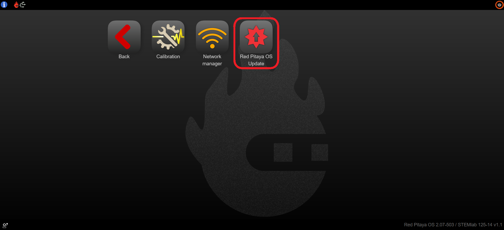

.. _software_update_manager:

########################
Software update manager
########################

To open the Software update manager application click on **System Tools** and then select **Red Pitaya OS Update**.

.. image:: ../img/Main_menu_system.jpg
    :align: center
    :width: 1200

The software update manager allows you to check for and install updates to the Red Pitaya operating system (OS) and ecosystem. The OS is the underlying software that runs on the Red Pitaya hardware, while the ecosystem includes the applications and tools that run on top of the OS.
It is also accessible from the main web interface by clicking on the on the **ecosystem version label** in the bottom right corner.

If the Red Pitaya board has access to the internet, it will notify you if a new version of the OS is available with a **yellow exclamation mark** next to the ecosystem version label.

.. figure:: img/SDcard_upgrade_desktop.png
    :align: center
    :width: 600

The software update manager checks and compares the current OS version with the files in the `Red Pitaya downloads repository <https://downloads.redpitaya.com/downloads/Unify/ecosystems/>`_.

Updating the OS
----------------

.. note::

    For the fastest OS update, please :ref:`manually download the latest OS version <prepareSD>`.

#.  Start the OS updater app and wait for the application to list the available OS versions (step 3).
    
    .. figure:: img/OS_update_running.png
        :align: center
        :width: 800

#.  Select one of the listed ecosystem versions.

    .. figure:: img/SDcard_update_manager.png
        :align: center
        :width: 600

#.  Wait for the update process to finish. Depending on the speed of the internet connection, the update process may take a while to complete.
    *We plan on adding the progress bar in the future.*

    .. note::

        An OS upgrade might cause your Red Pitaya desktop to freeze for a few minutes.

Issues with the software update manager
----------------------------------------

The Software update manager may report one of the following issues during operation:

#.  **Step 1** - *Your Red Pitaya is currently offline. Please follow the quick-start instructions to put it online*. If Red Pitaya is not connected to the internet, the software update manager will stop at step 1.
    
    .. figure:: img/No_connection.png
        :align: center
        :width: 800
    
    To solve this, please make sure Red Pitaya has internet connection. Check the :ref:`network manager <network_manager>` section to connect your Red Pitaya to the internet.

#.  **Step 3** - *The latest Ecosystem is not supported by the current Linux version*. If the update manager stops at step 3 and does not list any available OS versions, it means that the current Linux version is not compatible with the latest Ecosystem version.

    .. figure:: img/Ecosystem_not_supported.png
        :align: center
        :width: 800

    To solve this, please :ref:`manually update the Red Pitaya OS <prepareSD>`.

#.  If the update manager reports that the Linux version needs to be updated, please follow the :ref:`Download and install SD card image <prepareSD>` instructions and manually reinstall the SD card.

Other ways to update the ecosystem and Red Pitaya Linux OS
------------------------------------------------------------

.. include:: ../../../quickStart/OS_update/OS_update_options.inc
