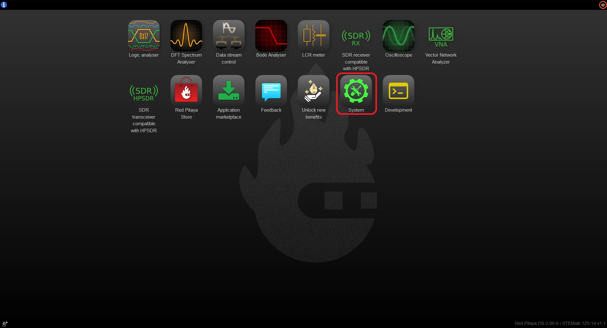
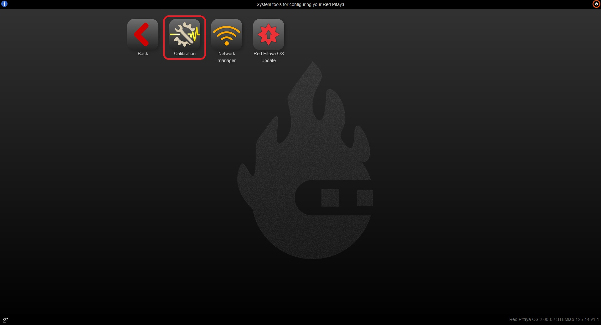
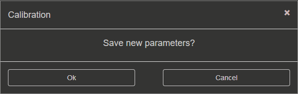

.. _calibration_app:

###########
Calibration
###########

.. note::

    The calibration application does not affect the SDRlab 122-16.

To open the Calibration application click on **System Tools** and then select **Calibration**.

When the Calibration application opens, you will see four options:

.. image:: img/Calibration_api.png
    :align: center
    :width: 50 %

***************
DC Calibration
***************

With the DC calibration, you can fine-tune Red Pitaya's ADCs and DACs.

Required materials:

*   two good-quality SMA or BNC cables (with appropriate adapters in case of BNC cables)
*   two SMA T adapters
*   Short termination
*   Accurate Volage reference source (the more accurate the voltage source, the better the calibration)
*   Accurate Multimeter (optional)

Auto DC calibration
====================

Auto DC calibration will guide you step-by-step through the calibration process and is the option we recommend for beginners.

Step-by-step video guide:

.. raw:: html

    

        <iframe src="https://www.youtube.com/embed/vLCa9oU7DMI" frameborder="0" allowfullscreen style="position: absolute; top: 0; left: 0; width: 100%; height: 100%;"></iframe>
    

The YouTube video is also available |YT-video|.

.. |YT-video| raw:: html

   <a href="https://www.youtube.com/watch?v=vLCa9oU7DMI" target="_blank">on this link</a>

Manual DC calibration
======================

Manual DC calibration will let you do the calibration manually and fine-tune all the variables.
Apart from calibration, this option will also allow you to identify any parasitics on your measurement lines.

.. image:: img/DC_manual.jpg
    :align: center
    :width: 80 %

*   **RESET**:

    *   **DEFAULT** - remove the calibration parameters
    *   **FACTORY** - reset the board to the factory calibration parameters

*   **APPLY** the calibration - save the DC offset in the system settings
*   **CLOSE** the calibration

When closing the application without saving the values, the following prompt will appear:

ADC calibration parameters
---------------------------

.. image:: img/DC_manual_ADC.jpg
    :align: center
    :width: 70 %

1. **Voltage measurements** (Mean, minimum, maximum, and peak-to-peak). Displayed in the graph with the corresponding colour.
#. **Sine wave detection**. Detects wheter a sine wave is present on the channel. The "x" indicates how many sine periods were detected.
#. **ADC Offset**. Change the offset by the number in the middle. The amount can be selected from the dropdown menu.
#. **ADC Gain**. Change the gain by the number in the middle. The amount can be selected from the dropdown menu.
#. **LV/HV**. Select the calibration voltage range. Should be the same as the input jumpers.
#. **LAST/AVG**. Select either the last or average voltage measurements.
#. **Decimation**. Select the decimation from the dropdown menu.

DAC calibration parameters
---------------------------

.. image:: img/DC_manual_DAC.jpg
    :align: center
    :width: 70 %

1. **ON/OFF**. Turn the specified output ON or OFF.
#. **DAC settings**. Change the output waveform (type), frequency, amplitude, and offset. Currently, only the waveform (type) can be changed.
#. **DAC Offset**. Change the offset by the number in the middle. The amount can be selected from the dropdown menu.
#. **DAC Gain**. Change the gain by the number in the middle. The amount can be selected from the dropdown menu.

**********************
Frequency calibration
**********************

Required materials:

*   two good-quality SMA or BNC cables (with appropriate adapters in case of BNC cables)
*   one SMA T adapter
*   External reference function generator capable of generating at least +-10 V (Optional)

Auto Frequency calibration
===========================

Auto Frequency calibration will guide you step-by-step through the calibration process and is the option we recommend for beginners.

**Step-by-step guide:**

Once the auto frequency calibration is started, you will be presented with the following window:

.. image:: img/Calib_freq_auto_start.png
    :align: center
    :width: 70 %

The header columns represent the following:

*   **MODE** - correlates to how the jumpers should be set.
*   **Channel** - indicates which channel the subsequential column settings apply to.
*   **Before and After** - values before and after the calibration.
*   **AA, BB, PP, and KK** - coefficients for the filter inside the FPGA that affects the inputs. For more details, please refer to the "Manual Frequency calibration" section.
*   **STATE** - displays the progression of the calibration process.

Please pay attention to the **STATE** column, as clickable buttons which progress the process will appear. 

1. **LV calibration**:

    .. image:: img/Calib_freq_auto_LV.png
        :align: center
        :width: 70 %

    * Clicking on the "START" button will provide further instructions and a choice between an internal and external reference generator:

    .. image:: img/Calib_freq_auto_LV_int.png
        :align: center
        :width: 50 %

    * Please select "INTERNAL" if you do not have an external reference generator. Red Pitaya will use OUT1 to generate a 0.9 Volt 1 kHz Square signal.
    * Set the jumpers to the LV position and connect OUT1 to IN1 and IN2 using the SMA cables and the T adapter.
    * Click on Calibrate button to start the calibration process.

    .. image:: img/Calib_freq_auto_LV_ext.png
        :align: center
        :width: 50 %

    * Please configure the external reference generator to produce a 1 kHz square signal and input the "reference voltage" (one-way amplitude) of the signal.
    * Set the jumpers to the LV position and connect the output of the external generator to IN1 and IN2 of the Red Pitaya using SMA or BNC cables and the T adapter.
    * Click on Calibrate button to start the calibration process.

2. **LV calibration in progress**:

    .. image:: img/Calib_freq_auto_LV_load.png
        :align: center
        :width: 70 %

    Please wait until the LV calibration is finished.

3. **HV calibration**:

    .. image:: img/Calib_freq_auto_HV.png
        :align: center
        :width: 70 %

    * Change the jumpers to the HV position and choose the generator source.

    .. image:: img/Calib_freq_auto_HV_int.png
        :align: center
        :width: 50 %

    .. image:: img/Calib_freq_auto_HV_ext.png
        :align: center
        :width: 50 %

    * The external reference generator amplitude should be changed by at least a factor of 10 to a maximum of 20 Volts.

4. **HV calibration in progress**:

    .. image:: img/Calib_freq_auto_HV_load.png
        :align: center
        :width: 70 %

    * Please wait until the HV calibration is finished.

5. **Save calibration values**:

    .. image:: img/Calib_freq_auto_save.png
        :align: center
        :width: 70 %

6. **Finish the calibration**:

    .. image:: img/Calib_freq_auto_complete.png
        :align: center
        :width: 70 %

    * Clicking on the "DONE" button will return you to the starting screen of the Calibration application.

Manual Frequency calibration
=============================

Manual Frequency calibration will let you do the calibration manually and fine-tune all the variables.
Apart from calibration, this option will also allow you to identify any parasitics on your measurement lines.

.. image:: img/Calib_freq_manual.jpg
        :align: center
        :width: 70 %

*   **SETTINGS MENU** - *APPLY* the calibration parameters, restore the *DEFAULT* parameters, or *CLOSE* the manual frequency calibration.
*   **CHANNEL & JUMPER SETTINGS** - Choose a channel and voltage range (LV or HV depending on the jumper settings) to calibrate.
*   **CALIBRATION PARAMETERS** - Choose between *DEC* and *HEX* values, click on *AUTO* to perform an automatic frequency calibration, and input the FPGA filter coefficients.
*   **GENERATOR SETTINGS** - Turn the internal generator (OUT1) *ON* and *OFF*. The frequency, one-way amplitude, and offset cannot be changed.
*   **DECIMATION & HYSTERESIS** - Change the decimation and hysteresis.
*   **EDGE ZOOM** - Zoom in on the square waveform edge for better calibration.
*   **CURSORS** - Can be moved to observe the positive or negative edge, and the white area in-between represents the zoom-in area.

Here is a MATLAB code to simulate the filter inside the FPGA:

.. code-block:: matlab
    
    clc
    close all
    clear

    aa_hex='7D93'
    bb_hex='437C7'
    pp_hex='2666'
    kk_hex='D9999A'

    aa=hex2dec(aa_hex)
    bb=hex2dec(bb_hex)
    pp=hex2dec(pp_hex) 
    kk=hex2dec(kk_hex)

    % H[z]=K*(z-B) / (z^4*(z-P) * (z-A))
    % where:
    % K=KK/2^24
    % B=1-(BB/2^28)
    % P=PP/2^16
    % A=1-(AA/2^25)

    fs=125e6;
    f=0:1e3:fs;

    z=exp(j*2*pi*f/fs);

    k=kk/(2^24);
    b=1-(bb/2^28);
    p=pp/2^16;
    a=1-(aa/2^25);

    h=k*(z-b)./(z.^4.*(z-p).*(z-a));

    %figure
    %plot(f,20*log10(abs(h)))
    figure
    semilogx(f,20*log10(abs(h)))
    title(strcat('Frequency response for AA=',aa_hex,' BB=',bb_hex,' PP=',pp_hex,' KK=',kk_hex))
    xlabel('frequency (Hz)')
    ylabel('gain (dB)')

    

