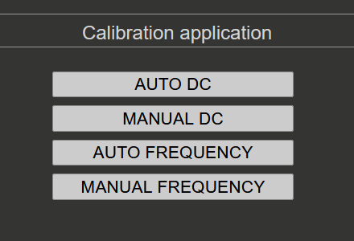
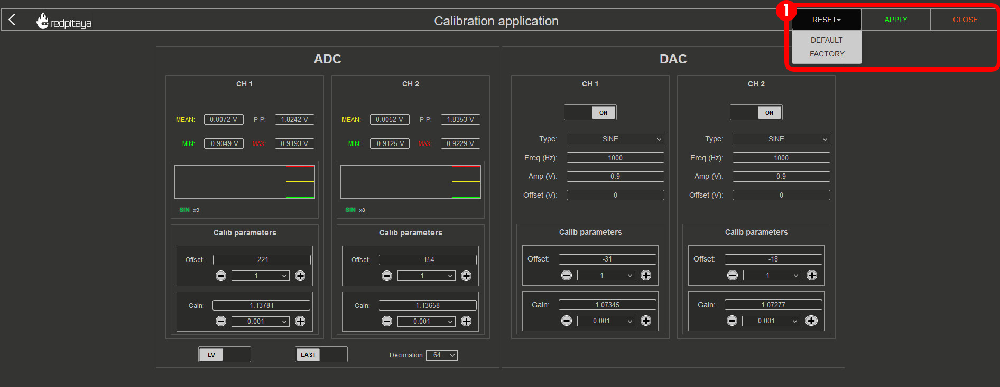
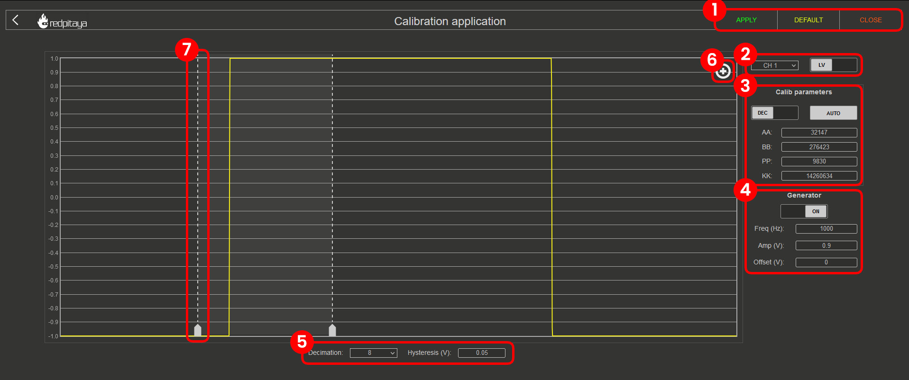

.. _calibration_app:

###########
Calibration
###########

.. contents:: Table of Contents
    :local:
    :depth: 1
    :backlinks: top

|

***************
Overview
***************

Calibration is an essential part of the Red Pitaya system. It ensures that the ADCs and DACs are functioning correctly and that the measurements are accurate. The Calibration application allows you to perform both DC and frequency calibration.

**What does calibration correct?**

* **DC Calibration** - Corrects DC offset and gain errors in the ADCs and DACs to ensure accurate voltage measurements and signal generation.
* **Frequency Calibration** - Compensates for component mismatches in the analog front-end resistor and capacitor divider circuits for both LV and HV voltage ranges. This filter ensures accurate amplitude measurements across the frequency spectrum.

The easiest way to recalibrate the Red Pitaya board is through the Calibration application, which can be accessed from the *System Tools* menu. Of course, the calibration can also be achieved through one of the following methods:

* :ref:`Calibration application <calibration_app>`.
* :ref:`Calibration command line utility <calib_util>`.
* :ref:`C or Python API commands <API_commands>`.

To open the Calibration application click on **System Tools** and then select **Calibration**.

.. image:: ../img/Main_menu_system.jpg
    :align: center
    :width: 1200

.. image:: img/Calibration_app_menu.jpg
    :align: center
    :width: 1200

When the Calibration application opens, you will see four options:

|

*******************
When to Calibrate
*******************

Red Pitaya boards are factory-calibrated before shipping and should provide accurate measurements immediately after purchase. However, calibration should be performed:

* **After initial setup** - If you want to ensure optimal accuracy for your specific use case.
* **Yearly** - Component values drift slowly over time, so annual recalibration is recommended to maintain accuracy.
* **After environmental changes** - If the board's operating environment changes significantly (temperature, humidity).
* **When accuracy degrades** - If measurements appear inconsistent or inaccurate.

.. note::

    Calibration should be performed at the board's normal operating temperature. If your board operates in a non-standard environment, perform calibration under those conditions for best accuracy.

|

*********************
Required Equipment
*********************

The equipment needed depends on your board generation and the calibration type:

**For all boards:**

* Two good-quality SMA or BNC cables (with appropriate adapters in case of BNC cables)
* One or two SMA T adapters
* Two SMA short terminators (for DC calibration)

**Original generation boards only:**

* Two 50 Ω terminators (for impedance matching during calibration)

**DC Calibration:**

* Stable voltage reference source (the more stable, the better the calibration accuracy)
* Accurate multimeter for measuring reference voltage and DAC outputs

**Frequency Calibration (optional):**

* External reference function generator capable of generating ±1 V to ±20 V square waves at 1 kHz (optional - internal generator can be used)

|

***********************
Quick Reference Guide
***********************

To properly calibrate the Red Pitaya board, please follow the steps below. The instructions differ slightly depending on the board model you are using.
Care should be taken to match the input and output impedances during calibration for accurate results.

Original generation boards
===========================

Original Generation boards (STEMlab 125-14, SIGNALlab 250-12, SDRlab 122-16, etc.) require the use of 50 Ω terminators during calibration to ensure accurate impedance matching. For example, 
STEMlab 125-14 has an output impedance of 50 Ω on its DACs, so a 50 Ω load should be connected to the outputs during calibration. As the input impedance of the ADCs is 1 MΩ, 50 Ω 
terminators should be used on the inputs during calibration to match the output impedance of the DACs. On the other hand, SDRlab 122-16 has both input and output impedance of 50 Ω, so no
additional terminators are needed when connecting inputs to outputs during the calibration process.

.. warning::

    For original generation boards, the frequency calibration filter can affect the amplitude of measured input data (particularly the peak-to-peak values). The filter should remain disabled during DC calibration to ensure accurate measurements. 
    The DC calibration process on OS version 2.07-44 and above automatically handles this. For older OS versions, please refer to the :ref:`Disabling frequency calibration filter instructions <disable_frequency_filter>`.

**Calibration procedure:**

1. **DC Calibration** - Perform the DC calibration first. Follow the :ref:`DC calibration instructions <dc_calibration>`. The frequency calibration filter is automatically disabled during DC calibration.
2. **Frequency Calibration** - After completing the DC calibration, proceed to the frequency calibration. Follow the :ref:`Frequency calibration instructions <frequency_calibration>`.

Second generation boards
========================

Second Generation boards (STEMlab 125-14 Gen 2, STEMlab 125-14 PRO Gen 2, STEMlab 65-16 TI, etc.) have improved analog front-end circuitry that eliminates the need for 50 Ω terminators during calibration. The calibration procedure is simplified.

**Calibration procedure:**

1. **DC Calibration** - Perform the DC calibration first. Follow the :ref:`DC calibration instructions <dc_calibration>`.
2. **Frequency Calibration** - After completing the DC calibration, proceed to the frequency calibration. Follow the :ref:`Frequency calibration instructions <frequency_calibration>`.

|

.. _dc_calibration:

***************
DC Calibration
***************

**Purpose:** DC calibration corrects DC offset and gain errors in the ADCs and DACs, ensuring accurate voltage measurements and signal generation at DC and low frequencies.

With the DC calibration, you can fine-tune Red Pitaya's ADCs and DACs to compensate for component tolerances and drift.

|

Auto DC calibration
====================

Auto DC calibration will guide you step-by-step through the calibration process and is the option we recommend for beginners. Step-by-step video guide:

.. raw:: html

    

        <iframe src="https://www.youtube.com/embed/vLCa9oU7DMI" frameborder="0" allowfullscreen style="position: absolute; top: 0; left: 0; width: 100%; height: 100%;"></iframe>
    

The YouTube video is also available |YT-video|.

.. |YT-video| replace:: `on this link <https://www.youtube.com/watch?v=vLCa9oU7DMI>`__

|

Manual DC calibration
======================

Manual DC Calibration allows you to perform the calibration manually and fine tune all the variables.
Apart from calibration, this option also allows you to identify any parasitics on your measurement lines.

As the DACs on some boards have output impedance of **50 Ω**, a **50 Ω load** should be connected to the outputs (DACs) during calibration for accurate results.
This is especially true for the original generation of board models.

1. **RESET**:

    * **DEFAULT** - reset all offset values to 0 and gain values to 1.
    * **FACTORY** - reset the board to the factory calibration parameters.

#. **APPLY** the calibration - save the DC offset in the system settings.
#. **CLOSE** the calibration.

When closing the application without saving the values, the following prompt will appear:

.. image:: img/Calib_save.png
    :align: center
    :width: 800

.. note::

    SDRlab 122-16 only has access to manual DC calibration. The interface has less functionality as SDRlab 122-16 has no jumpers to switch the voltage range and can only generate sine waveforms due to AC coupling.

    .. image:: img/DC_manual_sdr.png
        :align: center
        :width: 1200

ADC calibration parameters
---------------------------

.. image:: img/DC_manual_ADC.jpg
    :align: center
    :width: 800

1. **Voltage measurements** (Mean, minimum, maximum, and peak-to-peak). Displayed in the graph with the corresponding colour.
#. **Sine wave detection**. Detects whether a sine wave is present on the channel. The "x" indicates how many sine periods were detected.
#. **ADC Offset**. Change the offset by the number in the middle. The amount can be selected from the dropdown menu.
#. **ADC Gain**. Change the gain by the number in the middle. The amount can be selected from the dropdown menu.
#. **LV/HV**. Select the calibration voltage range. Should be the same as the input jumpers.
#. **LAST/AVG**. Select either the last or average voltage measurements.
#. **Decimation**. Select the decimation from the dropdown menu.

DAC calibration parameters
---------------------------

.. image:: img/DC_manual_DAC.jpg
    :align: center
    :width: 800

1. **ON/OFF**. Turn the specified output ON or OFF.
#. **DAC settings**. Change the output waveform (type), frequency, amplitude, and offset.
#. **DAC Offset**. Change the offset by the number in the middle. The amount can be selected from the dropdown menu.
#. **DAC Gain**. Change the gain by the number in the middle. The amount can be selected from the dropdown menu.

|

.. _frequency_calibration:

**********************
Frequency calibration
**********************

**Purpose:** Frequency calibration compensates for component mismatches in the analog front-end resistor and capacitor divider circuits when switching between LV and HV voltage ranges. This ensures accurate amplitude measurements across the frequency spectrum by applying a digital correction filter in the FPGA.

.. note::

    While component matching could theoretically eliminate the need for frequency calibration, the filter approach enables mass production while maintaining reasonable board costs, high accuracy and small form-factor.

Auto Frequency calibration
===========================

Auto Frequency calibration will guide you step-by-step through the calibration process and is the option we recommend for beginners.

.. note::

    There is a bug with the frequency calibration on OS 2.05-37. Please use the manual frequency calibration instead.

**Step-by-step guide:**

Once the auto frequency calibration is started, you will be presented with the following window:

.. image:: img/Calib_freq_auto_start.png
    :align: center
    :width: 1200

The header columns represent the following:

    * **MODE** - correlates to how the jumpers should be set.
    * **Channel** - indicates which channel the subsequent column settings apply to.
    * **Before and After** - values before and after the calibration.
    * **AA, BB, PP, and KK** - coefficients for the filter inside the FPGA that affects the inputs. For more details, please refer to the "Manual Frequency calibration" section.
    * **STATE** - displays the progression of the calibration process.

Please pay attention to the **STATE** column, as clickable buttons which progress the process will appear. 

1. **LV calibration**:

    .. image:: img/Calib_freq_auto_LV.png
        :align: center
        :width: 1200

    * Clicking on the "START" button will provide further instructions and a choice between an internal and external reference generator:

    .. image:: img/Calib_freq_auto_LV_int.png
        :align: center
        :width: 800

    * Please select "INTERNAL" if you do not have an external reference generator. Red Pitaya will use OUT1 to generate a 0.9 Volt 1 kHz Square signal.
    * Set the jumpers to the LV position and connect OUT1 to IN1 and IN2 using the SMA cables and the T adapter.
    * Click on Calibrate button to start the calibration process.

    .. image:: img/Calib_freq_auto_LV_ext.png
        :align: center
        :width: 800

    * Please configure the external reference generator to produce a 1 kHz square signal and input the "reference voltage" (one-way amplitude) of the signal.
    * Set the jumpers to the LV position and connect the output of the external generator to IN1 and IN2 of the Red Pitaya using SMA or BNC cables and the T adapter.
    * Click on Calibrate button to start the calibration process.

2. **LV calibration in progress**:

    .. image:: img/Calib_freq_auto_LV_load.png
        :align: center
        :width: 1200

    Please wait until the LV calibration is finished.

3. **HV calibration**:

    .. image:: img/Calib_freq_auto_HV.png
        :align: center
        :width: 1200

    * Change the jumpers to the HV position and choose the generator source.

    .. image:: img/Calib_freq_auto_HV_int.png
        :align: center
        :width: 800

    .. image:: img/Calib_freq_auto_HV_ext.png
        :align: center
        :width: 800

    * The external reference generator amplitude should be set to at least 10 V (up to ±20 V maximum) for HV calibration.

4. **HV calibration in progress**:

    .. image:: img/Calib_freq_auto_HV_load.png
        :align: center
        :width: 1200

    * Please wait until the HV calibration is finished.

5. **Save calibration values**:

    .. image:: img/Calib_freq_auto_save.png
        :align: center
        :width: 1200

6. **Finish the calibration**:

    .. image:: img/Calib_freq_auto_complete.png
        :align: center
        :width: 1200

    * Clicking on the "DONE" button will return you to the starting screen of the Calibration application.

|

Manual Frequency calibration
=============================

Manual Frequency calibration allows you to perform the calibration manually and fine-tune all the variables.
Apart from calibration, this option also allows you to identify any parasitics on your measurement lines.

**Interface elements:**

* **Settings menu** - *APPLY* the calibration parameters, restore the *DEFAULT* parameters, *DISABLE* the frequency calibration filter, or *CLOSE* the manual frequency calibration.
* **Channel & Jumper settings** - Choose a channel and voltage range (LV or HV depending on the jumper settings) to calibrate.
* **Calibration parameters** - Choose between *DEC* and *HEX* values, click on *AUTO* to perform an automatic frequency calibration, and input the FPGA filter coefficients (AA, BB, PP, KK).
* **Generator settings** - Turn the internal generator (OUT1) *ON* and *OFF*. The frequency, one-way amplitude, and offset cannot be changed.
* **Decimation & Hysteresis** - Change the decimation and hysteresis.
* **Edge zoom** - Zoom in on the square waveform edge for better calibration.
* **Cursors** - Can be moved to observe the positive or negative edge, and the white area in-between represents the zoom-in area.

For technical details about the FPGA filter coefficients, see the :ref:`Technical Reference section <fpga_filter_math>`.

|

.. code-block:: matlab
    
    clc
    close all
    clear

    % Filter parameters %
    aa_hex = '7D93'
    bb_hex = '437C7'
    pp_hex = '2666'
    kk_hex = 'D9999A'

    aa = hex2dec(aa_hex)
    bb = hex2dec(bb_hex)
    pp = hex2dec(pp_hex) 
    kk = hex2dec(kk_hex)

    % H[z]=K*(z-B) / (z^4*(z-P) * (z-A))
    % where:
    % K = KK / 2^24
    % B = 1 - (BB / 2^28)
    % P = PP / 2^16
    % A = 1 - (AA / 2^25)

    fs = 125e6;
    f = 0:1e3:fs;

    z = exp(j*2*pi*f/fs);

    k = kk/(2^24);
    b = 1-(bb/2^28);
    p = pp/2^16;
    a = 1-(aa/2^25);

    h = k*(z-b)./(z.^4.*(z-p).*(z-a));

    % Figure
    % plot(f,20*log10(abs(h)))
    figure
    semilogx(f, 20*log10(abs(h)))
    title(strcat('Frequency response for AA=',aa_hex,' BB=',bb_hex,' PP=',pp_hex,' KK=',kk_hex))
    xlabel('frequency (Hz)')
    ylabel('gain (dB)')

|

.. _disable_frequency_filter:

Disabling frequency calibration filter
=======================================

To disable the frequency calibration filter, follow these steps:

1. Open the Calibration application from the *System Tools* menu.
2. Click on the **Manual Frequency Calibration** option.
3. Click on the **Disable** button in the settings menu. Repeat the process for each input channel and each voltage range (LV and HV).
4. If you are using an older OS interface, you can disable the frequency calibration filter by inputing the following calibration parameters:

    * AA = 0
    * BB = 0
    * PP = 0
    * KK = 16777215 (or 0xFFFFFF in hexadecimal)

.. note::

    These values effectively create a unity gain filter with no phase correction, which is equivalent to bypassing the frequency calibration.

|

**************************
Command Line Calibration
**************************

The calibration application is not the only way to calibrate the Red Pitaya board. The command line utility *calib* can also be used for calibration tasks.

For more information on the command line utility and the different calibration formats, please refer to the :ref:`calib_util documentation <calib_util>`.

|

.. _fpga_filter_math:

********************
Technical Reference
********************

FPGA Filter Mathematics
========================

The frequency calibration uses a digital filter implemented in the FPGA to compensate for analog component mismatches. The filter is defined by four coefficients: **AA**, **BB**, **PP**, and **KK**.

**Filter Transfer Function:**

.. math::

    H[z] = \frac{K \cdot (z - B)}{z^4 \cdot (z - P) \cdot (z - A)}

**Where:**

* $K = \frac{KK}{2^{24}}$
* $B = 1 - \frac{BB}{2^{28}}$
* $P = \frac{PP}{2^{16}}$
* $A = 1 - \frac{AA}{2^{25}}$

**MATLAB Simulation Code:**

The following MATLAB code simulates the frequency response of the FPGA filter:

.. code-block:: matlab
    
    clc
    close all
    clear

    % Filter parameters %
    aa_hex = '7D93'
    bb_hex = '437C7'
    pp_hex = '2666'
    kk_hex = 'D9999A'

    aa = hex2dec(aa_hex)
    bb = hex2dec(bb_hex)
    pp = hex2dec(pp_hex) 
    kk = hex2dec(kk_hex)

    % H[z]=K*(z-B) / (z^4*(z-P) * (z-A))
    % where:
    % K = KK / 2^24
    % B = 1 - (BB / 2^28)
    % P = PP / 2^16
    % A = 1 - (AA / 2^25)

    fs = 125e6;
    f = 0:1e3:fs;

    z = exp(j*2*pi*f/fs);

    k = kk/(2^24);
    b = 1-(bb/2^28);
    p = pp/2^16;
    a = 1-(aa/2^25);

    h = k*(z-b)./(z.^4.*(z-p).*(z-a));

    % Figure
    % plot(f,20*log10(abs(h)))
    figure
    semilogx(f, 20*log10(abs(h)))
    title(strcat('Frequency response for AA=',aa_hex,' BB=',bb_hex,' PP=',pp_hex,' KK=',kk_hex))
    xlabel('frequency (Hz)')
    ylabel('gain (dB)')

|

