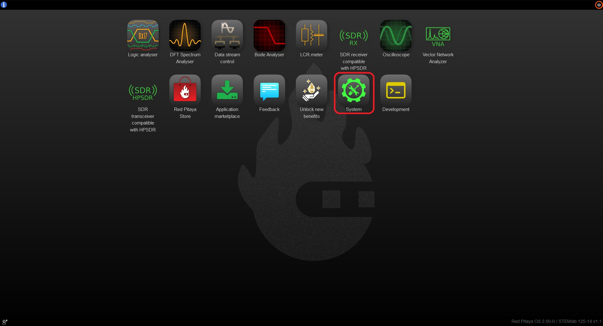
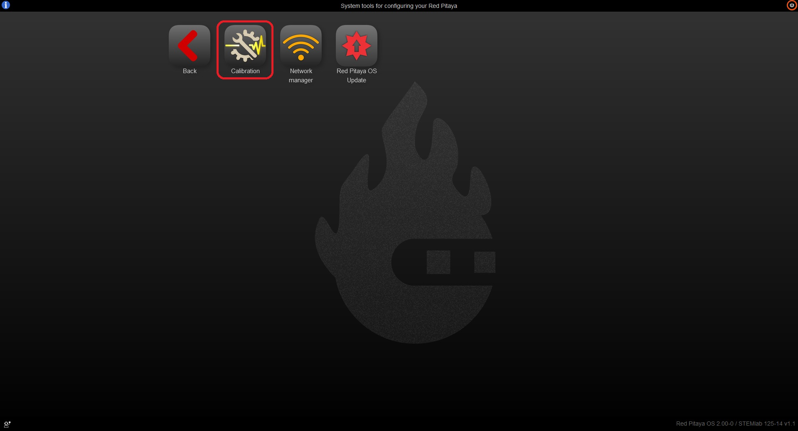
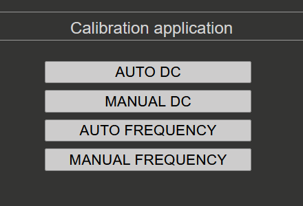

.. _calibration_app:

###########
Calibration
###########

.. contents:: Table of Contents
    :local:
    :depth: 1
    :backlinks: top

|

Overview
==========

Calibration is an essential part of the Red Pitaya system. It ensures that the ADCs and DACs are functioning correctly and that the measurements are accurate. The Calibration application allows you to perform both DC and frequency calibration.

**What does calibration correct?**

* **DC Calibration** - Corrects DC offset and gain errors in the ADCs and DACs to ensure accurate voltage measurements and signal generation.
* **Frequency Calibration** - Compensates for component mismatches in the analog front-end resistor and capacitor divider circuits for both LV and HV voltage ranges. This filter ensures accurate amplitude measurements across the frequency spectrum.

The easiest way to recalibrate the Red Pitaya board is through the Calibration application, which can be accessed from the *System Tools* menu. Of course, the calibration can also be achieved through one of the following methods:

* :ref:`Calibration application <calibration_app>`.
* :ref:`Calibration command line utility <calib_util>`.
* :ref:`C++ or Python API commands <API_commands>`.

To open the Calibration application click on **System Tools** and then select **Calibration**.

When the Calibration application opens, you will see four options:

|

When to Calibrate
===================

Red Pitaya boards are factory-calibrated before shipping and should provide accurate measurements immediately after purchase. However, calibration should be performed:

* **After initial setup** - If you want to ensure optimal accuracy for your specific use case.
* **Yearly** - Component values drift slowly over time, so annual recalibration is recommended to maintain accuracy.
* **After environmental changes** - If the board's operating environment changes significantly (temperature, humidity).
* **When accuracy degrades** - If measurements appear inconsistent or inaccurate.

.. note::

    Calibration should be performed at the board's normal operating temperature. If your board operates in a non-standard environment, perform calibration under those conditions for best accuracy.

|

Required Equipment
===================

The equipment needed depends on your board generation and the calibration type:

**For all boards:**

* Two good-quality SMA or BNC cables (with appropriate adapters in case of BNC cables)
* One or two SMA-T adapters
* Two SMA short terminators (for DC calibration)

**Original generation boards only:**

* Two 50-Ω terminators (for impedance matching during calibration)

**DC Calibration:**

* Stable voltage reference source (the more stable, the better the calibration accuracy)
* Accurate multimeter for measuring reference voltage and DAC outputs

**Frequency Calibration (optional):**

* External reference function generator capable of generating ±1 V to ±20 V square waves at 1 kHz (optional - internal generator can be used)

|

Quick Reference Guide
======================

To properly calibrate the Red Pitaya board, please follow the steps below. The instructions differ slightly depending on the board model you are using.
Care should be taken to match the input and output impedances during calibration for accurate results.

Original generation boards
---------------------------

Original generation boards (STEMlab 125-14, SIGNALlab 250-12, SDRlab 122-16, etc.) require the use of 50 Ω terminators during calibration to ensure accurate impedance matching. For example, 
STEMlab 125-14 has an output impedance of 50 Ω on its DACs, so a 50 Ω load should be connected to the outputs during calibration. As the input impedance of the ADCs is 1 MΩ, 50 Ω 
terminators should be used on the inputs during calibration to match the output impedance of the DACs. On the other hand, SDRlab 122-16 has both input and output impedance of 50 Ω, so no
additional terminators are needed when connecting inputs to outputs during the calibration process.

.. warning::

    For original generation boards, the frequency calibration filter can affect the amplitude of measured input data (particularly the 
    peak-to-peak values). The filter should remain disabled during DC calibration to ensure accurate measurements. The DC calibration 
    process on OS version 2.07-44 and above automatically handles this. For older OS versions, please refer to the 
    :ref:`Disabling frequency calibration filter instructions <disable_frequency_filter>`.

**Calibration procedure:**

1. **Disable frequency calibration filter** - If you are using an older OS version, please disable the frequency calibration filter before starting the DC calibration. For OS version 
   2.07-44 and above, this step is automatically handled by the DC calibration process.
#. **DC calibration** - Perform the DC calibration first. Follow the :ref:`DC calibration instructions <dc_calibration>`. The frequency calibration filter is automatically disabled 
   during DC calibration.
#. **Frequency calibration** - After completing the DC calibration, proceed to the frequency calibration. Follow the :ref:`Frequency calibration instructions <frequency_calibration>`.
#. **Second DC calibration (optional)** - For best accuracy, perform a second DC calibration after the frequency calibration with the frequency calibration filter enabled. This is because 
   the frequency calibration can slightly affect the DC offset and gain, so a second DC calibration can fine-tune the parameters for optimal accuracy.

|

Second generation boards
-------------------------

Second generation boards (STEMlab 125-14 Gen 2, STEMlab 125-14 PRO Gen 2, STEMlab 65-16 TI, etc.) have improved analog front-end circuitry that 
eliminates the need for 50 Ω terminators and frequency calibration filter. The calibration procedure is simplified.

**Calibration procedure:**

1. **DC calibration** - Perform the DC calibration. Follow the :ref:`DC calibration instructions <dc_calibration>`.
#. **Frequency calibration (optional)** - The frequency calibration is optional for second generation boards as the improved analog front-end design 
   significantly reduces the need for frequency calibration. However, if you want to perform frequency calibration for optimal accuracy, follow the 
   :ref:`Frequency calibration instructions <frequency_calibration>`.
#. **Second DC calibration (optional)** - For best accuracy, perform a second DC calibration after the frequency calibration with the frequency calibration filter enabled. This is because the frequency calibration can slightly 
   affect the DC offset and gain, so a second DC calibration can fine-tune the parameters for optimal accuracy.

|

Calibration Methods
====================

.. toctree::
    :maxdepth: 2

    dc_calibration
    frequency_calibration

|

Command Line Calibration
==========================

The calibration application is not the only way to calibrate the Red Pitaya board. The command line utility *calib* can also be used for 
calibration tasks.

For more information on the command line utility and the different calibration formats, please refer to the :ref:`calib_util documentation <calib_util>`.

|

Known Issues
=================

* **OS 2.07-44 to 2.07-48** - STEMlab 125-14 4-Input CH3 offset is copied over to CH2 offset during DC calibration. Please update to latest Nightly OS version 3.00-728 or later to resolve this issue.
* **OS 2.05-37** - There is a bug with the frequency calibration. Please use the manual frequency calibration instead.

|

