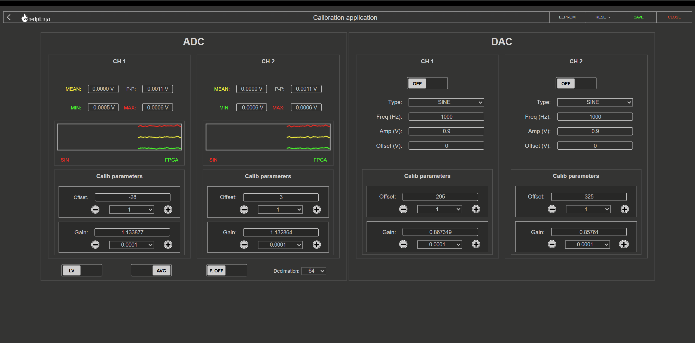
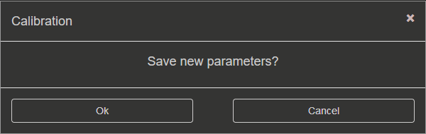
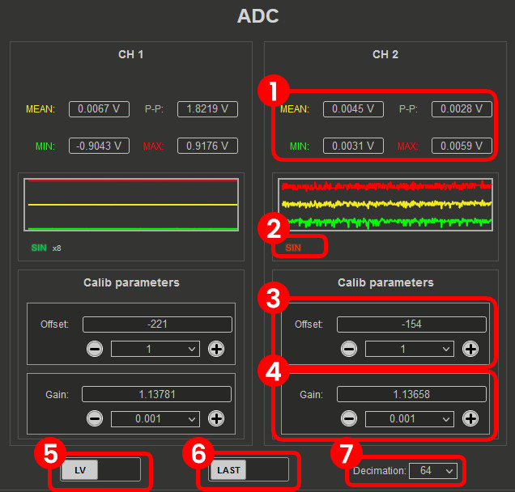
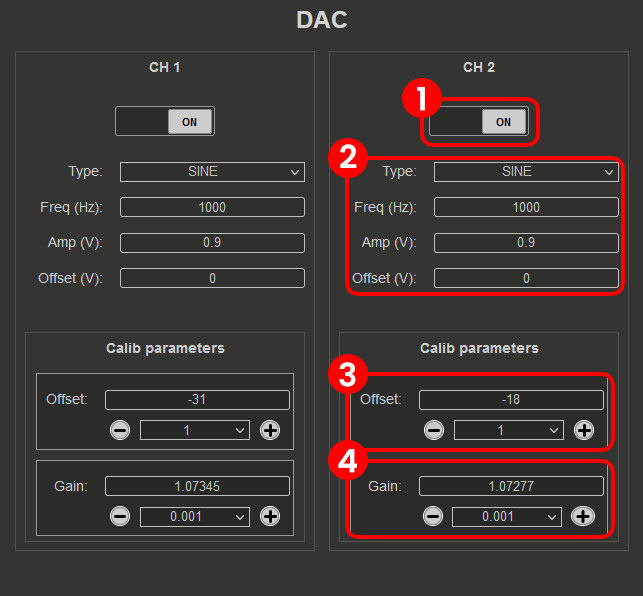

.. _dc_calibration:

##############
DC Calibration
##############

.. contents:: Table of Contents
    :local:
    :depth: 2
    :backlinks: top

|

**Purpose:** DC calibration corrects DC offset and gain errors in the ADCs and DACs, ensuring accurate voltage measurements and signal 
generation at DC and low frequencies.

With the DC calibration, you can fine-tune Red Pitaya's ADCs and DACs to compensate for component tolerances and drift.

|

Auto DC calibration
====================

Auto DC calibration will guide you step-by-step through the calibration process and is the option we recommend for beginners. 

Once the auto DC calibration is started, you will be presented with the following window:

.. figure:: img/Calib_freq_auto_start.png
    :align: center
    :width: 1200

The header columns represent the following:

    * **MODE** - Current step of the calibration process, which also displays the current jumper settings for the input channels.
    * **Channel (CH1, CH2, etc.)** - indicates which channel the column settings underneath it apply to.
    * **Before and After** - values measured before and after the calibration.
    * **Value** - the new value of the offset and gain. These values are applied to the **User zone** when the calibration is finished and the "DONE" button is clicked.
    * **STATE** - displays the progression of the calibration process.

Please pay attention to the **STATE** column, as clickable buttons which progress the process will appear. 

|

1. Frequency equalization filter
---------------------------------

The first step of the auto DC calibration is resetting the calibration values to default. During this step, a prompt will appear asking to select what happens with the frequency equalization filter.
Providing the following options:

1. **Bypass (recommended)** - the frequency equalization filter will be bypassed, effectively disabling it during the DC calibration process.
2. **Apply** - the frequency equalization filter will be applied during the DC calibration process:

    * **Disabled** - the frequency equalization filter will be disabled during the DC calibration process.
    * **Keep current values** - the current filter values will be applied during the DC calibration process.
    * **Restore default settings** - the default filter values will be applied during the DC calibration process.

For accurate DC calibration, the frequency equalization filter should be bypassed or disabled, as it can affect the amplitude of the measured input signal, particularly the 
peak-to-peak values:

* **For OS version 2.07-44 and above**, this step is automatically handled by the DC calibration process, so you can simply click "OK" to proceed. 
* **For older OS versions**, please manually disable the frequency calibration filter as the values are automatically applied.
  frequency calibration filter as the values are automatically applied.

.. note::

    During the second DC calibration (after frequency calibration), the frequency equalization filter should be applied with the current or default values for optimal accuracy.

.. warning::

    The **frequency equalization filter** is relevant **only for the original generation boards**. For second generation boards, the improved analog front-end design eliminates 
    the need for the frequency equalization filter, so this step can be ignored.

|

2. HV (1:20) calibration
-------------------------

This step calibrates the channels with the jumpers set to the HV position. Follow the instructions in the **STATE** column to complete this step.

1.  **Jumper settings** - Set the jumpers to the HV position.
#.  **ADC offset (1:20)** - Connect all input channels to GND and click on the "Calibrate" button. The calibration will measure the offset error and calculate the necessary correction values.

    .. figure:: img/Calib_DC_auto_HV_offset.png
        :align: center
        :width: 600

#.  **ADC gain (1:20)** - Connect all input channels to a stable voltage reference source (for example, a precise power supply or a voltage reference IC), input the reference voltage and 
    click on the "Calibrate" button. The calibration will measure the gain error and calculate the necessary correction values.

    .. figure:: img/Calib_DC_auto_HV_gain.png
        :align: center
        :width: 600

.. note::

    For the gain calibration, the reference voltage should be at least 10 V (up to ±20 V maximum) for HV calibration. For example, you can use a precise power supply or a voltage reference 
    IC that can provide a stable voltage in this range.

|

3. LV (1:1) calibration
-------------------------

4.  **Jumper settings** - Change the jumpers to the LV position.
#.  **ADC offset (1:1)** - Change the jumpers to the LV position, connect all input channels to GND and click on the "Calibrate" button. The calibration will measure the offset error and 
    calculate the necessary correction values.

#.  **ADC gain (1:1)** - Connect all input channels to a stable voltage reference source (for example, a precise power supply or a voltage reference IC), input the reference voltage and 
    click on the "Calibrate" button. The calibration will measure the gain error and calculate the necessary correction values.

.. note::

    For the gain calibration, the reference voltage should be at least 0.5 V (up to ±1 V maximum) for LV calibration. For example, you can use a precise power supply or a voltage reference 
    IC that can provide a stable voltage in this range.

|

4. DAC calibration
-----------------------

7.  **Connect the outputs** - Connect the outputs to inputs using the SMA cables (IN1 to OUT1 and IN2 to OUT2). For original generation boards, make sure to terminate the outputs with 
    **50 Ω terminators** for accurate calibration.
#.  **DAC gain** - Click on the "Calibrate" button in the DAC gain row. The calibration will generate a ±0.9 V DC signal on the outputs, measure it with the inputs, and calculate the necessary 
    correction values for the DAC gain.
#.  **DAC offset** - Click on the "Calibrate" button in the DAC offset row. The calibration will disable the DACs to effectively generate a 0 V DC signal on the outputs, measure it with the 
    inputs, and calculate the necessary correction values for the DAC offset.
#.  **DAC gain and offset verification** - DAC gain and offset calibration will be recalculated in the second and third stage of the DAC calibration process (effectively repeating the previous two steps) 
    to verify that the applied calibration values are correct and provide accurate measurements.

|

5. Calibration completion
-------------------------

After completing the HV and LV calibration steps, click on the "DONE" button to save the calibration values to the **User zone** and return to the starting screen of the Calibration application.

6. Video guide
----------------

.. note::

    The following video is based on an older version of the Calibration application, so the interface may look different. However, the calibration procedure is still the same, so the video can 
    be used as a reference for the calibration process.

Step-by-step video guide:

.. raw:: html

    

        <iframe src="https://www.youtube.com/embed/vLCa9oU7DMI" frameborder="0" allowfullscreen style="position: absolute; top: 0; left: 0; width: 100%; height: 100%;"></iframe>
    

The YouTube video is also available |YT-video|.

.. |YT-video| replace:: `on this link <https://www.youtube.com/watch?v=vLCa9oU7DMI>`__

|

Manual DC calibration
======================

Manual DC Calibration allows you to perform the calibration manually and fine tune all the variables.
Apart from calibration, this option also allows you to identify any parasitics on your measurement lines.

.. note::

    As the DACs on the **original generation boards** have output impedance of **50 Ω**, a **50 Ω load** should be connected to the outputs 
    (DACs) during calibration for accurate results.

The interface elements are seprated into three sections:

1. **Settings menu** - *APPLY* the calibration parameters, restore the *DEFAULT* parameters, *DISABLE* the frequency calibration filter, or *CLOSE* the manual DC calibration.
2. **ADC calibration parameters** - Change the ADC offset and gain, select the voltage range (LV or HV depending on the jumper settings), and observe the voltage measurements.
3. **DAC calibration parameters** - Change the output waveform, frequency, amplitude, and offset, and change the DAC offset and gain.

|

1. Settings menu
-----------------

The settings menu allows you to manage the calibration process. The options are as follows:

1.  **EEPROM Info** - view the current calibration values stored in the EEPROM for both the **Factory and User zones**. The **Factory zone** contains the calibration values set at the factory, 
    while the **User zone** contains the values that are currently active on the board. The **User zone** is updated when you click on the "APPLY" button to save the calibration values.

    The calibration version and values are explained in more detail in the :ref:`Calibration parameters section <calib_params>`.

    The EEPROM Info menu also allows you to backup the current calibration values to a file and restore them from a file. This is useful if you want to save your 
    calibration settings or revert to previous settings.

    .. figure:: img/Calib_DC_EEPROM.png
        :align: center
        :width: 800
    
#.  **RESET** - reset the calibration values. Choose between two options:

    * **DEFAULT** - reset all offset values to 0 and gain values to 1.
    * **FACTORY** - reset the board to the factory calibration parameters. If the factory calibration version version is older than the current calibration 
      version, a default reset will be performed instead.

#.  **APPLY** - save the current calibration to the **User zone**.
#.  **CLOSE** - close the manual DC calibration and return to the previous menu.

When closing the application without saving the values, the following prompt will appear:

.. note::

    SDRlab 122-16 only has access to manual DC calibration. The interface has less functionality as SDRlab 122-16 has no jumpers to switch the 
    voltage range and can only generate sine waveforms due to AC coupling.

    .. figure:: img/Calib_DC_manual_sdr.png
        :align: center
        :width: 1200

|

2. ADC calibration parameters
-------------------------------

1.  **Voltage measurements** (Mean, minimum, maximum, and peak-to-peak). Displayed in the graph with the corresponding colours.
#.  **Sine wave detection**. Detects whether a sine wave is present on the channel. The "x" indicates how many sine periods were detected.
#.  **FPGA**. Turns green when the calibration is applied within the FPGA (calibration version 6 and above).
#.  **ADC Offset**. Change the offset by the number in the middle. The amount can be selected from the dropdown menu.
#.  **ADC Gain**. Change the gain by the number in the middle. The amount can be selected from the dropdown menu.
#.  **LV/HV**. Select the calibration voltage range. Should be the same as the input jumpers.
#.  **LAST/AVG**. Select either the last or average voltage measurements. AVG is recommended for calibration as it provides more stable measurements, while 
    LAST can be used to observe the effect of changes in real time.
#.  **Decimation**. Select the decimation from the dropdown menu. For factory calibration decimation 1024 is used, but for quick calibration decimation 64 can be used.
    A higher decimation will provide more accurate measurements but will take more time to update the values. A lower decimation will provide faster updates but less 
    accurate measurements. For quick calibration, a decimation of 64 can be used to speed up the process, while for final calibration, a decimation of 1024 is recommended for optimal accuracy.

|

3. DAC calibration parameters
------------------------------

1.  **ON/OFF**. Turn the specified output ON or OFF. When the output is turned ON, the waveform will be generated with the specified settings. When the output 
    is turned OFF, a 0 V DC signal will be generated.
#.  **DAC settings**. Change the output waveform (type), frequency, amplitude, and offset.
#.  **DAC Offset**. Change the offset with the + or - buttons by the number in the middle (the amount can be selected from the dropdown menu) or manually edit the value.
#.  **DAC Gain**. Change the gain with the + or - buttons by the number in the middle (the amount can be selected from the dropdown menu) or manually edit the value.

|
