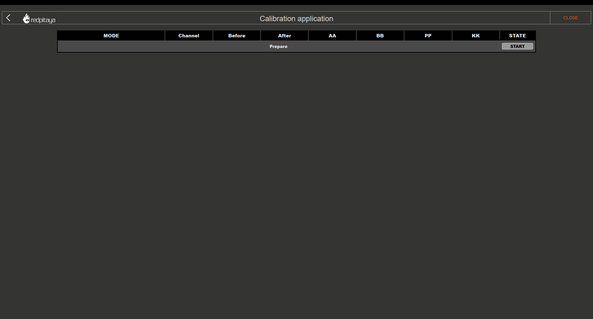
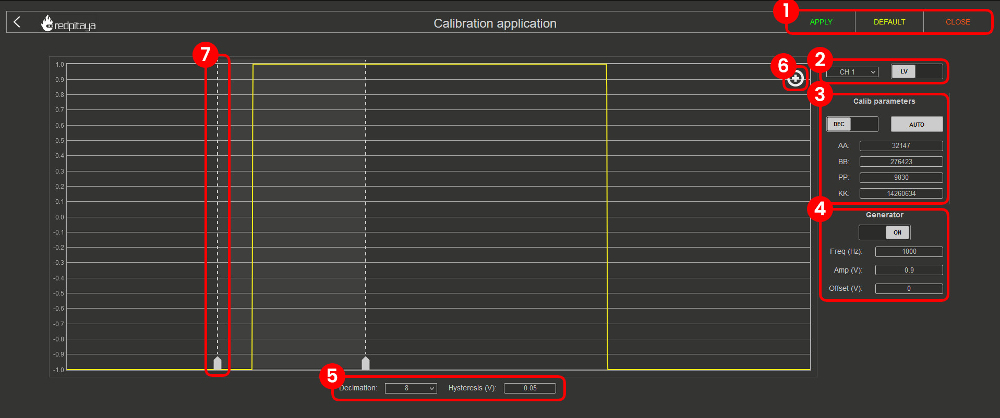

.. _frequency_calibration:

.. TODO: Screenshots in this page are outdated - update to new OS

######################
Frequency Calibration
######################

.. contents:: Table of Contents
    :local:
    :depth: 2
    :backlinks: top

|

**Purpose:** Frequency calibration compensates for component mismatches in the analog front-end resistor and capacitor divider circuits when 
switching between LV and HV voltage ranges. This ensures accurate amplitude measurements across the frequency spectrum by applying a digital correction filter in the FPGA.

.. note::

    While component matching could theoretically eliminate the need for frequency calibration, the filter approach enables mass production while 
    maintaining reasonable board costs, high accuracy and small form-factor.

|

Auto Frequency calibration
===========================

Auto Frequency calibration will guide you step-by-step through the calibration process and is the option we recommend for beginners.

**Step-by-step guide:**

Once the auto frequency calibration is started, you will be presented with the following window:

The header columns represent the following:

    * **MODE** - correlates to how the jumpers should be set.
    * **Channel** - indicates which channel the subsequent column settings apply to.
    * **Before and After** - values before and after the calibration.
    * **AA, BB, PP, and KK** - coefficients for the filter inside the FPGA that affects the inputs. For more details, please refer to the "Manual Frequency calibration" section.
    * **STATE** - displays the progression of the calibration process.

Please pay attention to the **STATE** column, as clickable buttons which progress the process will appear. 

1.  **LV calibration**:

    .. figure:: img/Calib_freq_auto_LV.png
        :align: center
        :width: 1200

    * Clicking on the "START" button will provide further instructions and a choice between an internal and external reference generator:

    .. figure:: img/Calib_freq_auto_LV_int.png
        :align: center
        :width: 800

    * Please select "INTERNAL" if you do not have an external reference generator. Red Pitaya will use OUT1 to generate a 0.9 Volt 1 kHz Square signal.
    * Set the jumpers to the LV position and connect OUT1 to IN1 and IN2 using the SMA cables and the T adapter.
    * Click on Calibrate button to start the calibration process.

    .. figure:: img/Calib_freq_auto_LV_ext.png
        :align: center
        :width: 800

    * Please configure the external reference generator to produce a 1 kHz square signal and input the "reference voltage" (one-way amplitude) of the signal.
    * Set the jumpers to the LV position and connect the output of the external generator to IN1 and IN2 of the Red Pitaya using SMA or BNC cables and the T adapter.
    * Click on Calibrate button to start the calibration process.

2.  **LV calibration in progress**:

    .. figure:: img/Calib_freq_auto_LV_load.png
        :align: center
        :width: 1200

    Please wait until the LV calibration is finished.

3.  **HV calibration**:

    .. figure:: img/Calib_freq_auto_HV.png
        :align: center
        :width: 1200

    * Change the jumpers to the HV position and choose the generator source.

    .. figure:: img/Calib_freq_auto_HV_int.png
        :align: center
        :width: 800

    .. figure:: img/Calib_freq_auto_HV_ext.png
        :align: center
        :width: 800

    * The external reference generator amplitude should be set to at least 10 V (up to ±20 V maximum) for HV calibration.

4.  **HV calibration in progress**:

    .. figure:: img/Calib_freq_auto_HV_load.png
        :align: center
        :width: 1200

    * Please wait until the HV calibration is finished.

5.  **Save calibration values**:

    .. figure:: img/Calib_freq_auto_save.png
        :align: center
        :width: 1200

6.  **Finish the calibration**:

    .. figure:: img/Calib_freq_auto_complete.png
        :align: center
        :width: 1200

    * Clicking on the "DONE" button will return you to the starting screen of the Calibration application.

|

Manual Frequency calibration
=============================

Manual Frequency calibration allows you to perform the calibration manually and fine-tune all the variables.
Apart from calibration, this option also allows you to identify any parasitics on your measurement lines.

**Interface elements:**

* **Settings menu** - *APPLY* the calibration parameters, restore the *DEFAULT* parameters, *DISABLE* the frequency calibration filter, or *CLOSE* the manual frequency calibration.
* **Channel & Jumper settings** - Choose a channel and voltage range (LV or HV depending on the jumper settings) to calibrate.
* **Calibration parameters** - Choose between *DEC* and *HEX* values, click on *AUTO* to perform an automatic frequency calibration, and input the FPGA filter coefficients (AA, BB, PP, KK).
* **Generator settings** - Turn the internal generator (OUT1) *ON* and *OFF*. The frequency, one-way amplitude, and offset cannot be changed.
* **Decimation & Hysteresis** - Change the decimation and hysteresis.
* **Edge zoom** - Zoom in on the square waveform edge for better calibration.
* **Cursors** - Can be moved to observe the positive or negative edge, and the white area in-between represents the zoom-in area.

For technical details about the FPGA filter coefficients, see the :ref:`Technical Reference section <fpga_filter_math>`.

|

.. _disable_frequency_filter:

Disabling frequency calibration filter
=======================================

To disable the frequency calibration filter, follow these steps:

1.  Open the Calibration application from the *System Tools* menu.
2.  Click on the **Manual Frequency Calibration** option.
3.  Click on the **Disable** button in the settings menu. Repeat the process for each input channel and each voltage range (LV and HV).
4.  If you are using an older OS interface, you can disable the frequency calibration filter by inputing the following calibration parameters:

    * AA = 0
    * BB = 0
    * PP = 0
    * KK = 16777215 (or 0xFFFFFF in hexadecimal)

.. note::

    These values effectively create a unity gain filter with no phase correction, which is equivalent to bypassing the frequency calibration.

|

.. _fpga_filter_math:

Technical Reference
===================

FPGA Filter Mathematics
-----------------------

The frequency calibration uses a digital filter implemented in the FPGA to compensate for analog component mismatches. The filter is defined by four coefficients: **AA**, **BB**, **PP**, and **KK**.

**Filter Transfer Function:**

.. math::

    H[z] = \frac{K \cdot (z - B)}{z^4 \cdot (z - P) \cdot (z - A)}

**Where:**

* :math:`K = \frac{KK}{2^{24}}`
* :math:`B = 1 - \frac{BB}{2^{28}}`
* :math:`P = \frac{PP}{2^{16}}`
* :math:`A = 1 - \frac{AA}{2^{25}}`

**MATLAB Simulation Code:**

The following MATLAB code simulates the frequency response of the FPGA filter:

.. code-block:: matlab
    
    clc
    close all
    clear

    % Filter parameters %
    aa_hex = '7D93'
    bb_hex = '437C7'
    pp_hex = '2666'
    kk_hex = 'D9999A'

    aa = hex2dec(aa_hex)
    bb = hex2dec(bb_hex)
    pp = hex2dec(pp_hex) 
    kk = hex2dec(kk_hex)

    % H[z]=K*(z-B) / (z^4*(z-P) * (z-A))
    % where:
    % K = KK / 2^24
    % B = 1 - (BB / 2^28)
    % P = PP / 2^16
    % A = 1 - (AA / 2^25)

    fs = 125e6;
    f = 0:1e3:fs;

    z = exp(j*2*pi*f/fs);

    k = kk/(2^24);
    b = 1-(bb/2^28);
    p = pp/2^16;
    a = 1-(aa/2^25);

    h = k*(z-b)./(z.^4.*(z-p).*(z-a));

    % Figure
    % plot(f,20*log10(abs(h)))
    figure
    semilogx(f, 20*log10(abs(h)))
    title(strcat('Frequency response for AA=',aa_hex,' BB=',bb_hex,' PP=',pp_hex,' KK=',kk_hex))
    xlabel('frequency (Hz)')
    ylabel('gain (dB)')

|
