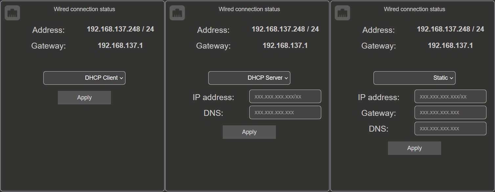
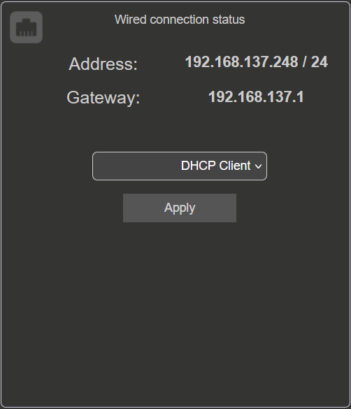
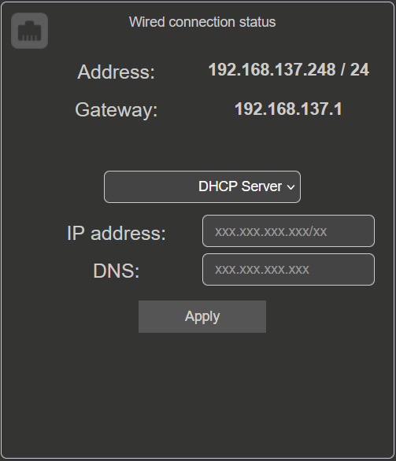
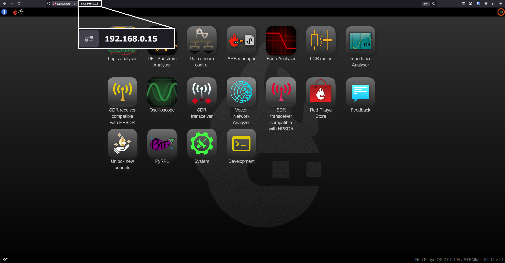
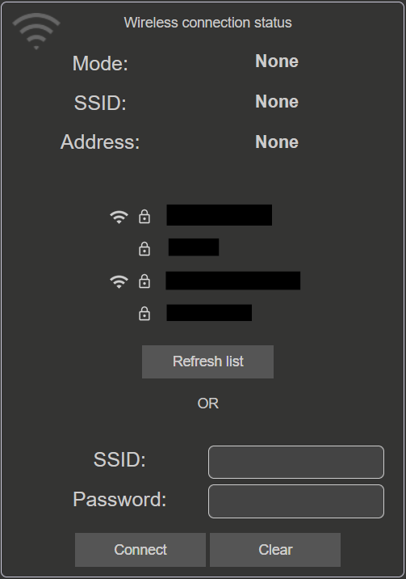

.. _network_manager:

###############
Network Manager
###############

Network manager is a tool that allows you to configure the network settings of your Red Pitaya board.

To open the Network manager application click on **System Tools** and then select **Network manager**.

.. image:: img/instructions-connect.png
    :width: 800

We recommend using the Network Manager application to configure Red Pitaya connection settings. However, it is still possible to :ref:`establish connection manually <network>`.

.. image:: img/Network_manager_interface.png
    :width: 1000

The network manager interface is split into two sections:

1. **Wired connection status** - shows the status of the wired connection (LAN) and the IP address assigned to the Red Pitaya board.
2. **Wireless connection status** - shows the status of the wireless connection (WiFi) and the IP address assigned to the Red Pitaya board.

If either of the two connections is unavailable, the corresponding settings will be unavailable, displaying a warning that the connection is not present (see the figure above).

The settings for each connection are presented along with the instructions for setting up each type of connection.

You can connect to the Red Pitaya boards via:

.. contents:: Index
    :local:
    :depth: 2
    :backlinks: none

.. figure:: img/connection-types.png
    :width: 1000

    Red Pitaya board network connection options.

.. note::

    **Windows 7/8** users should install `Bonjour Print Services <https://downloads.redpitaya.com/tools/BonjourPSSetup.exe>`_, otherwise access to ``*.local`` addresses will not work.

    **Windows 10 or higher** already supports mDNS and DNS-SD, so there is no need to install additional software.

.. note::

    Red Pitaya board requires internet access when:

    * Updating the OS through the OS update application.
    * Installing applications from the marketplace.

.. warning::

    You may experience connection problems when connecting the board to complex networks with multiple routers, switches or firewalls, or networks with enhanced security layers (e.g. university networks where each user must log in via a dedicated login page).
    In such cases, we recommend using a direct connection between the Red Pitaya board and your PC, or contacting your network administrator for assistance.

Wired
======

The wired connection status displays the current IP address, subnet mask and gateway of the Red Pitaya board. The wired connection is established via an Ethernet cable connected to the router or directly to the PC Ethernet socket.

There are three possible modes of operation:

* **DHCP Client** (Default mode) - Red Pitaya will wait untill it is automatically assigned an IP address from the router (DHCP server). Once the IP address is assigned, the Red Pitaya board will be available on the local network. If Red Pitaya does not receive an IP address within 1 minute after boot, it will enter the **DHCP Server** mode.
* **DHCP Server** - Red Pitaya will act as a DHCP server and assign IP addresses to itself other devices connected to the same network.
* **Static IP** - Red Pitaya will use the specified static IP address.

    Red Pitaya board network connection options.

|

.. _LAN:

Local Area Network (LAN)
-------------------------

We recommend using the Local Area Network (LAN) connection for the Red Pitaya board. The LAN connection is established via an Ethernet cable connected to the router or directly to the PC Ethernet socket.
The Red Pitaya board will automatically receive an IP address from the router (DHCP server) and will be available on the local network. The Red Pitaya board can be accessed via a web browser using the URL: ``rp-xxxxxx.local/``.

.. figure:: img/connection-schematic.png
    :width: 1200
    
    Connecting your Red Pitaya board to the LAN network.

1. Connect the power supply and the ethernet cable to the Red Pitaya board.
#. Connect the Red Pitaya board to the router or directly to the PC Ethernet socket.
#. Open a web browser (Google Chrome is recommended) and type ``rp-xxxxxx.local/`` in the URL field. ``xxxxxx`` are the last 6 characters of your Red Pitaya board's MAC address, which is written on the Ethernet connector.

    .. figure:: img/Main-web-interface.png
        :width: 1000

        Red Pitaya main page user interface.

To set up the Local Area Network (LAN) connection, set the mode to **DHCP Client** in the Network Manager application.

.. _dir_cab_connect:

Direct Ethernet cable connection and DHCP server
-------------------------------------------------

The second option is to connect the Red Pitaya board directly to your PC using an Ethernet cable. This option is useful when there is no router available or when you want to establish a direct connection without going through a router (for example, a laptop with Wi-Fi connection).

.. figure:: img/connection-scheme-direct.png
    :width: 1000

    Direct Ethernet connection between the Red Pitaya board and the PC.

1. On **Linux**, open **Network settings**, go to **Edit Connection** and select **Share to other computers** under *LAN network IPv4 settings*.
#. Plug the ethernet cable from your PC to the Red Pitaya board and wait approximately 2 minutes.
#. Open a web browser (Google Chrome is recommended) and type ``rp-xxxxxx.local/`` in the URL field. ``xxxxxx`` are the last 6 characters of your Red Pitaya board's MAC address, which is written on the Ethernet connector.
#. If the web interface doesn't open, try pinging the Red Pitaya board using the command line. Open the command line and type:

    .. code-block:: bash

        ping rp-xxxxxx.local

To set up the **DHCP Server** mode, input the following settings:

    * ``<IP address>/<subnet prefix>`` (subnet prefix == number of significant bits in subnet mask).
    * ``<DNS>`` server.

.. note::

    **Linux and macOS**
        
    If the direct ethernet connection is not working, please check that the ethernet connector has DHCP enabled. If **Share to other computers** mode does not work, try to use **Local only**.

    Should the problems persist even after pinging the board, try to **disable the WiFi** connection on **your PC** (if it has been enabled) and **reset the Red Pitaya** board (power off/on). If the problem persists, you can try the :ref:`static IP configuration <static_ip>` described below.

.. _static_ip:

Static IP configuration
-------------------------

To setup the **Static IP** mode, LAN connection must be established first to configure the Network manager settings.

1. Follow the :ref:`LAN connection <LAN>` instructions to connect the Red Pitaya board to the LAN network.

#. Under **Wired connection status** in the Network manager application. Choose the **Static** option. Input the following data and click **Apply**:

    * ``<IP address>/<subnet prefix>`` (subnet prefix == number of significant bits in subnet mask).
    * ``<Gateway>`` (router IP).
    * ``<DNS>`` server.

    .. figure:: img/wired-settings-static-IP.png
        :width: 600

    For more information please check `Wikipedia subnetwork <https://en.wikipedia.org/wiki/Subnetwork>`_ and `Wikipedia IP address <https://en.wikipedia.org/wiki/IP_address>`_.

#. Even though nothing happens in the interface, Red Pitaya will automatically switch to the static IP address.

#. Test the connection by openning a new browser window and typing the new IP address in the URL field.

    .. figure:: img/connection-static-IP.png
        :width: 1000

Direct Ethernet connection Static IP configuration
~~~~~~~~~~~~~~~~~~~~~~~~~~~~~~~~~~~~~~~~~~~~~~~~~~

When using the Direct Ethernet connection in combination with a static IP, some additional settings on the PC are likely required.
The instruction show an example on Ubuntu 14.04, but they will be very similar on other operating systems as well.

Here are the steps to configure the direct ethernet connection on **Ubuntu 14.04** (they will be very similar on other operating systems as well):

1. Launch Network Manager on your computer. 

#. Add a new Ethernet connection.

    .. figure:: img/static-IP-comp1.png
        :width: 400

#. Select **Ethernet** connection and press **Create** button.

    .. figure:: img/static-IP-comp2.png
        :width: 400

#. Select the name of the new Ethernet connection.

    .. figure:: img/static-IP-comp3.png
        :width: 400

#. Select **Method - Manual**, press the **Add** button, and insert:

    * The ``static IP address`` of your PC (must be different from the IP address of the Red Pitaya board).
    * ``Netmask`` (usually ``255.255.255.0``).
    * ``Gateway`` (can be left empty).
    * ``DNS servers`` (can be left empty).

    .. figure:: img/static-IP-comp4.png
        :width: 400

#. Click the **Save** button.

Once you have these settings arranged, connect the Ethernet cable between your Red Pitaya board and PC, open a web browser, in the web browser URL field, input the chosen Red Pitaya board static IP (in our example, ``192.168.0.15``) and press enter.

|

.. _wireless:

Wireless
=========

To use the wireless connection, a Wi-Fi dongle must be connected to the Red Pitaya's USB port. We recommend using the `Wi-Fi dongle from our webstore <https://redpitaya.com/product/red-pitaya-wi-fi-dongle/>`_. In general, all Wi-Fi USB dongles that use the RTL8188CUS chipset should work (we are looking to expand the list of compatible dongles in the near future).

.. note::

    :ref:`List of supported Wi-Fi adapters <support_wifi_adapter>`.

The wireless connection status displays:

* ``Mode of operation`` (Wireless or Acess Point).
* ``SSID`` of the Wi-Fi network.
* ``IP address`` of the Red Pitaya board.

|

Wireless Network Connection
----------------------------

To setup a Wi-Fi interface with your Red Pitaya, a :ref:`LAN connection <LAN>` or :ref:`direct ethernet connection <dir_cab_connect>` must be established first.

.. figure:: img/connection-scheme-wifi.png
    :width: 1200

How to connect your Red Pitaya board over a Wi-Fi network:
 
1.  Connect to the Red Pitaya web interface and open the *Network manager* application.

    .. figure:: img/instructions-connect.png
        :width: 800

#.  Insert a Wi-Fi dongle into the USB port on the Red Pitaya board. The system will automatically recognise it and enable the **Wireless status settings** on the right side of the web interface.

    .. figure:: img/wireless-settings-wifi.png
        :width: 600

#.  Select the desired Wi-Fi network, enter your password and press the **connect** button. If the Wi-Fi network is not listed, you can manually input the SSID and password of the Wi-Fi network or click **Refresh list** to rescan the available networks.

    .. figure:: img/Instructions-wifi.png
        :width: 600

#.  The Red Pitaya board will automatically connect to the selected Wi-Fi network. The connection process may take a few seconds. Once connected, the IP address of the Red Pitaya board will be displayed in the **Wireless connection settings**. If the interface does not update automatically, you can refresh the page in your web browser.

#.  Check the connection by inputting a Wi-Fi IP address in the web browser URL field and pressing enter.
   
    .. figure:: img/connection-wifi-IP.png
        :width: 1000

#.  Disconnect the LAN cable from the Red Pitaya board. Then open a new browser window and type the Wi-Fi IP address or the .local address (``rp-xxxxxx.local/``) in the URL field. ``xxxxxx`` are the last 6 characters of your Red Pitaya board's MAC address, which is written on the Ethernet connector.

#.  Restart the Red Pitaya board. Then retest the connection. Red Pitaya should automatically connect to the selected Wi-Fi network.

.. note::
    
    Wi-Fi networks are generally not as robust as wired connection, so you may experience decreased performance with some of the applications.

.. _access_point_mode:

Access Point Mode (currently not supported)
-------------------------------------------

Red Pitaya can act as an access point when there are no LAN or Wi-Fi networks available. This will allow you to connect your PC, laptop, tablet, or smartphone directly to the Red Pitaya over Wi-fi.

To setup the Access point mode, a :ref:`LAN connection <LAN>` or :ref:`direct ethernet connection <dir_cab_connect>` must be established with the board first.

.. figure:: img/connection-scheme-access-point.png
    :width: 1200

Here are the setps to set up the Access Point mode:

1. Connect the the Red Pitaya board using the :ref:`LAN connection <lan>` and open the *Network manager* application.
#. Insert a Wi-Fi dongle into the USB port on the Red Pitaya board. The system will automatically recognise it and enable the **Wireless status settings** on the right side of the web interface.
#. From the dropdown menu select the *Access point mode*.
#. Input a name and password to create an access point network. The password name should be at least eight characters long. Special characters are not allowed. The name of the access point network can be anything you like, but it is recommended to use a name that is easy to remember.
#. Disconnect the LAN cable from the Red Pitaya board. The Red Pitaya board will automatically switch to Access Point mode and create a new Wi-Fi network with the name you specified in the previous step.

    .. figure:: img/instructions-access-point.png
        :width: 800

#. Connect your PC, laptop, tablet, or phone to the network created by the Red Pitaya board.
#. Input the Access Point network IP address into the web browser URL field and press enter.
    
.. note::

    The Access point is automatically activated upon each boot until disabled in the Network Manager application.
   
.. note::
    
    The Red Pitaya's IP address in Access Point mode is always the same: ``192.168.128.1``.

