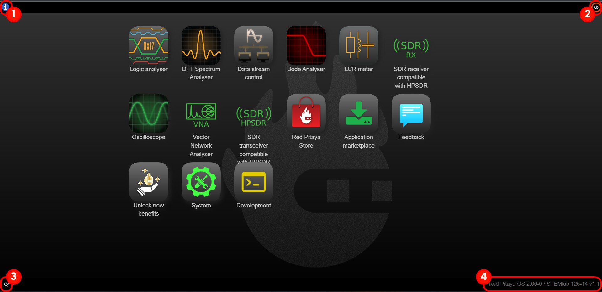
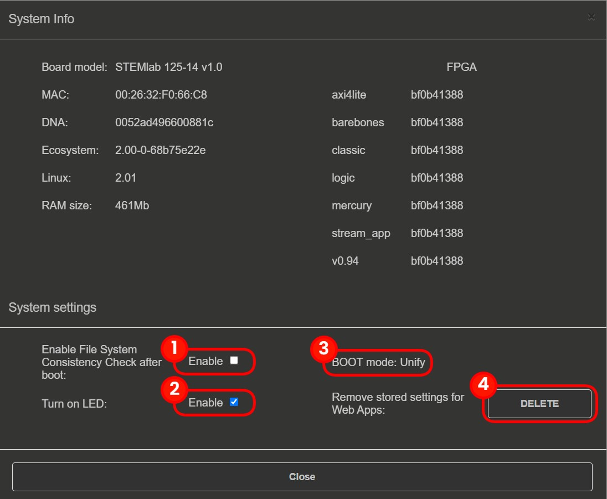

.. _systemInfo:

###############
System Info
###############

In the four corners of the Red Pitaya web interface there are the following widgets:

  1. **General System information button:** Includes optional features that can be turned ON/OFF. See below.
  2. **Power button:** Manual Power Off or Reboot of the board.
  3. **Download system report:** a .zip file with information for developers when issues are encountered.
  4. **Current OS and ecosystem version:** Reroutes to the OS Update tool if clicked.

General OS and Ecosystem info
=================================

Once the Info button is clicked, the following settings will be displayed:

In the **System Info** section, general information regarding *Board model*, *MAC address*, *DNA number*, etc. is displayed.
The **System Settings** section contains the following options:

  1. **Boot-up File consistency check:** If checked, during the boot, a file system check of the SD card is performed, which increases the overall boot-up time.
  2. **Turn ON LED:** If checked, the Red (Heartbeat) and Orange (SD card read) LEDs are disabled.
  3. **BOOT mode:** On SIGNALlab 250-12, a button **Up to 1 GB RAM** is located here (see the picture below). If checked, the board boots with 1 GB RAM instead of 512 MB.
  4. **Restore default app settings:** Restores all saved application settings to default values.

.. image:: img/Info_button_250-12.png
    :align: center
    :width: 50 %

System information on SIGNALlab 250-12.

