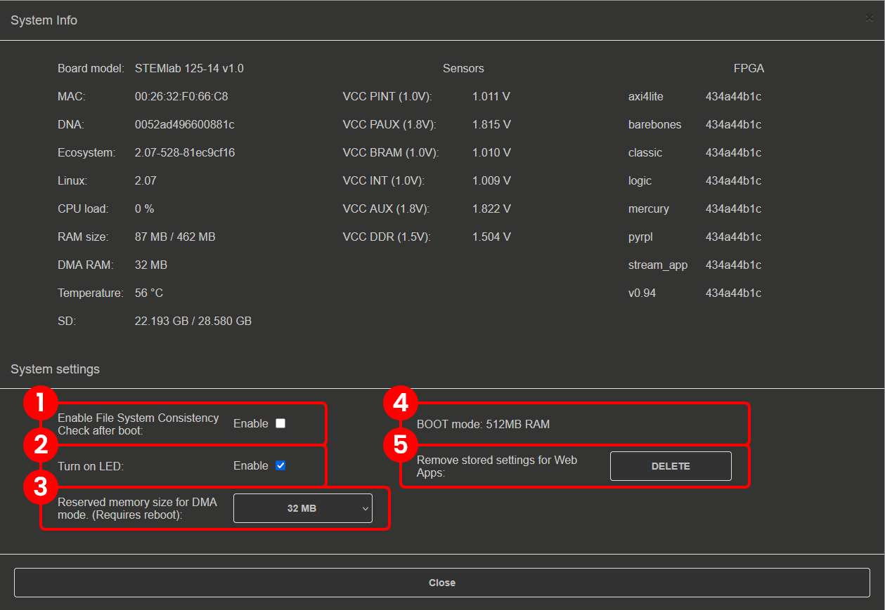
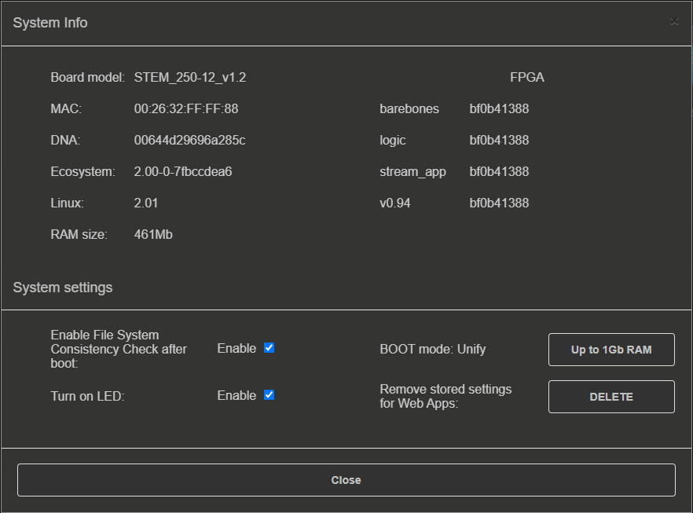
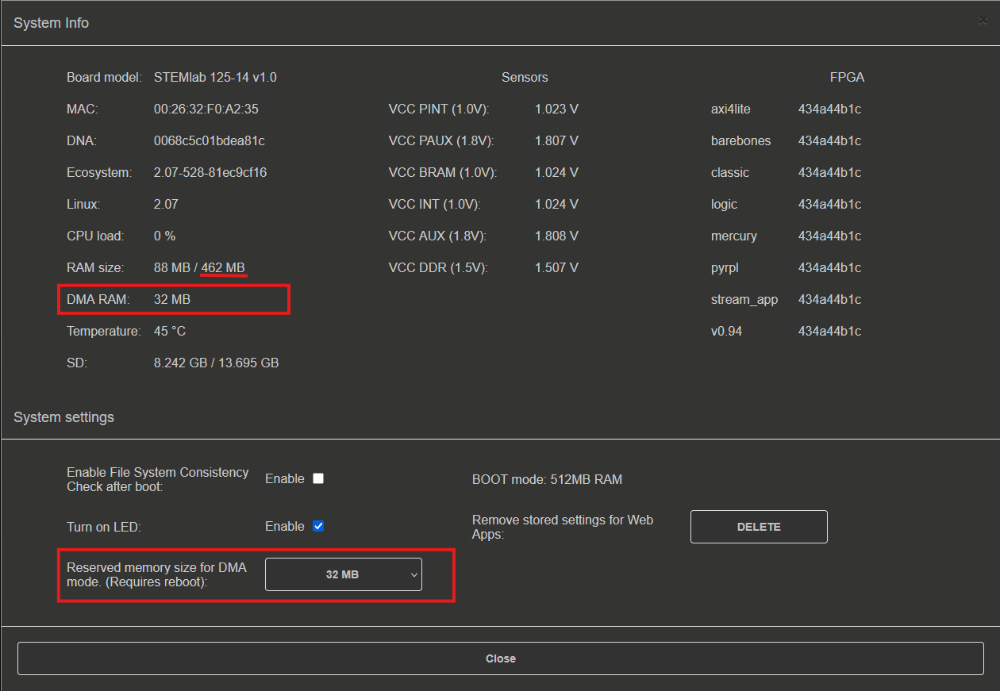

.. _system_info:

###############
System Info
###############

In the four corners of the Red Pitaya web interface there are the following widgets:

.. image:: img/System_info.jpg
    :align: center
    :width: 1000

1. **General System information button:** Includes optional features that can be turned ON/OFF. For more information see the section below.
2. **Power button:** Manual *Power Off* or *Reboot* of the board.
3. **Download system report:** Downloads a .zip file with information for the developers. Please attach it to the support mail with the issue description. The report should download after approx. 15 seconds.
4. **Current OS and ecosystem version:** Reroutes to the :ref:`Software update tool <software_update_manager>` if clicked. At boot, Red Pitaya checks for software updates and displays a yellow exclamation mark here if a new release is available.

General OS and Ecosystem info
=================================

Once the Info button is clicked, the following settings will be displayed:

In the **System Info** section, general information regarding *Board model*, *MAC address*, *DNA number*, etc. is displayed.

.. note::

    The ecosystem version for nightly builds is labelled 2.00-0, as shown in the image above.

The **System Settings** section contains the following options:

    1.  **Boot-up File consistency check:** If checked, during the boot, a file system check of the SD card is performed, which increases the overall boot-up time.
    #.  **Turn ON LED:** If checked, the Red (Heartbeat) and Orange (SD card read) LEDs are enabled.
    #.  **BOOT mode:** Board models with 1 GB RAM (SIGNALlab 250-12 and STEMlab 125-14 Gen 2 Z7020 Pro) have a button **1 GB RAM** located here (see the picture below). Toggle the button to switch between 1 GB and 512 MB of RAM. Changing the RAM size requires a reboot.
    #.  **Restore default app settings:** Restores all saved application settings to default values.
    #.  **DMA reserved memory size:** Memory manager for selecting the size of reserved memory for the :ref:`Deep Memory Mode <deepMemoryMode>`. Select the amount of reserved memory from the dropdown menu. The default value is 32 MB. Changing the reserved memory size requires a reboot.

        .. note ::

            To manually change the DMA reserved memory size, please refer to the :ref:`Changing reserved memory chapter under the DMM <deepMemoryMode>`.

    System information on SIGNALlab 250-12.

.. note::

    The expected VCCDDR voltage displayed in the *Sensors* section is 1.35 V for boards with 1 GB of RAM (SIGNALlab 250-12 and STEMlab 125-14 Pro Z7020 Gen 2) and 1.5 V for all other boards.

DMM memory manager
--------------------

The :ref:`Deep Memory Mode <deepMemoryMode>` memory manager can automatically adjust the size of the RAM reserved memory area directly from the *OS info settings* in a similar way to the manual adjustment described in the :ref:`DMM changing reserved memory chapter <DMM_change_reserved_memory>`.

    DMM memory manager.

As can be seen in the above picture, the system info page displays both the current size of the DMA-reserved memory and the RAM memory available to the rest of the system. The more memory that is reserved for DMA mode, the less is available for the rest of the system.
The maximum size of the allocated backup memory varies depending on the board model. The table below shows the maximum size of the allocated backup memory for each board model.

+--------------------------------+--------------------------------------------+----------------------+----------------------+--------------------------------------------+
|                                | **STEMlab 125-14 Gen 2** |br|              | **STEMlab 125-14 Pro Z7020 Gen 2** |br|     | **STEMlab 125-10 (discontinued)**          |
|                                | **STEMlab 125-14 Pro Gen 2** |br|          | **SIGNALlab 250-12**                        |                                            |
|                                | **STEMlab 125-14 (Gen 1)** |br|            |                                             |                                            |
|                                | **STEMlab 125-14 4-Input** |br|            |                                             |                                            |
|                                | **SDRlab 122-16**                          |                                             |                                            |
|                                |                                            |                                             |                                            |
+================================+============================================+======================+======================+============================================+
| RAM mode                       |                                            | 512 MB mode          | 1 GB mode            |                                            |
+--------------------------------+--------------------------------------------+----------------------+----------------------+--------------------------------------------+
| RAM on board                   | 512 MB                                     | 1 GB                                        | 256 MB                                     |
+--------------------------------+--------------------------------------------+----------------------+----------------------+--------------------------------------------+
| Maximum DMM size               | 256 MB                                     | 256 MB               | 512 MB               | 128 MB                                     |
+--------------------------------+--------------------------------------------+----------------------+----------------------+--------------------------------------------+

The board must be rebooted after changing the size of the reserved memory for the change to take effect.

.. note::

    TThe allocation limit applies to the options in the Memory Manager dropdown menu. The reserved region size can be adjusted more precisely using the manual method.
    Careful consideration and testing is required before exceeding the maximum size specified in the table above, as this may affect the operation of memory-intensive applications and programs.

.. substitutions

.. |br| raw:: html

     