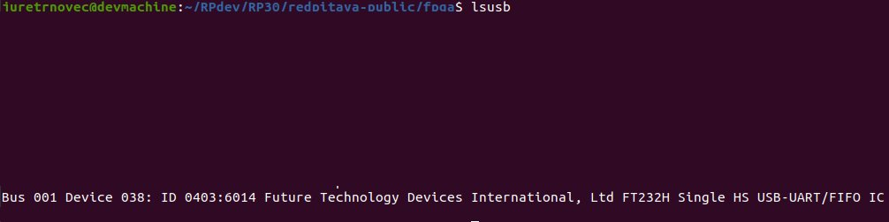

.. _fpga_jtag_programming:

.. !! CHECK AND VERIFY THIS, ADD PICTURES

################################
Programming Red Pitaya via JTAG
################################

JTAG (Joint Test Action Group) programming allows direct FPGA configuration from Xilinx Vivado, bypassing the need for SSH file transfer and command-line tools. 
This method is particularly useful for rapid prototyping, debugging, and development workflows.

.. contents:: Table of Contents
    :local:
    :depth: 2
    :backlinks: top

|

**********************************
Overview
**********************************

When to Use JTAG Programming
=============================

JTAG programming is ideal for:

**Development and Debugging:**

- Rapid prototyping with instant FPGA updates
- Debugging FPGA designs with integrated logic analyzers (ILA)
- Testing bitstreams before deploying to production
- Iterative development without SSH overhead

**Recovery Scenarios:**

- Recovering from corrupted SD card or boot failure
- Testing FPGA without functional Linux system
- Direct hardware access when network is unavailable
- Bypassing software layer for pure FPGA testing

**Production and Testing:**

- Manufacturing test and quality control
- Batch programming of multiple boards
- Automated testing with Vivado TCL scripts
- Initial board bring-up and validation

Advantages vs. SSH Upload
==========================

**JTAG Programming:**

- Direct from Vivado IDE (one-click programming)
- Integrated with debugging tools (ILA, VIO)
- Faster for iterative development
- Works without functional OS
- Real-time signal monitoring with Vivado

**SSH Upload:**

- No special hardware required
- Can be automated with scripts
- Works remotely over network
- Includes device tree loading
- Persists after programming

.. important::

    **JTAG programming is volatile** - the FPGA configuration is lost when:
    
    - Red Pitaya is powered off
    - FPGA is reprogrammed via SSH
    - System reboots
    
    For persistent configuration, use :ref:`SSH upload with boot loading <fpga_boot_loading>`.

|

**********************************
Hardware Requirements
**********************************

JTAG Cable Selection
====================

Red Pitaya requires a JTAG cable compatible with Xilinx Zynq-7000 devices. The following cables are tested and supported:

Recommended Cables
------------------

.. list-table::
    :header-rows: 1
    :widths: 30 35 35

    * - Cable Model
      - Connection
      - Notes
    * - **Digilent JTAG-HS3**
      - 14-pin connector + 14-to-6-pin adapter required
      - High-speed, most commonly used
    * - **Digilent JTAG-HS2**
      - 6-pin connector (direct connection)
      - More convenient (no adapter needed)
    * - **Xilinx Platform Cable USB II**
      - 14-pin connector + adapter
      - Official Xilinx cable

Other Compatible Cables
------------------------

Any Xilinx-compatible JTAG cable should work. For a complete list, see:

- `Xilinx UG908 - Programming and Debugging <https://www.xilinx.com/support/documents/sw_manuals/xilinx2021_2/ug908-vivado-programming-debugging.pdf>`_ (Appendix D)

Required Adapters
-----------------

If using JTAG-HS3 or similar 14-pin cable:

- **14-pin to 6-pin adapter** - Converts standard 14-pin JTAG to Red Pitaya's 6-pin header
- Available from Digilent or third-party suppliers
- Ensure correct pin mapping (see pinout section below)

Physical Connection
===================

JTAG Connector Location
-----------------------

The JTAG connector is a **6-pin header** located on Red Pitaya's PCB:

- **Top side:** No marking
- **Bottom side:** Pins are clearly marked with labels

.. figure:: img/JTAG-tutorial/JTAG_pins.jpg
    :width: 600
    :align: center
    
    JTAG connector pin markings on Red Pitaya PCB bottom side

JTAG Pinout
-----------

Red Pitaya's 6-pin JTAG header follows standard ARM JTAG pinout:

.. code-block:: text

    Pin 1: VCC  (3.3V)    Pin 2: GND
    Pin 3: TDI            Pin 4: TMS
    Pin 5: TCK            Pin 6: TDO

**Pin 1 orientation:** Look for the square pad or the marking on the PCB bottom.

Connection Procedure
--------------------

1. **Ensure Red Pitaya is powered off**
2. **Orient the cable correctly** - Pin 1 (VCC) should match the square pad
3. **Insert cable firmly** - Ensure all 6 pins make contact
4. **Connect USB to computer**
5. **Power on Red Pitaya**

.. warning::

    **Incorrect polarity can damage the JTAG interface!**
    
    - Always double-check pin 1 orientation before connecting
    - If in doubt, compare with PCB markings
    - Some cables have a keying notch - don't force it

|

**********************************
Software Installation
**********************************

Prerequisites
=============

Before starting, ensure you have:

- Xilinx Vivado (2020.1 or newer) installed
- USB port available on your computer
- Administrator/sudo privileges for driver installation

.. seealso::

    Need to install Vivado? See :ref:`Vivado Installation Guide <FPGA_install_vivado>`

Step 1: Install Digilent Adept 2
=================================

Digilent Adept provides drivers and utilities for Digilent JTAG cables.

Download Adept 2
----------------

Visit: https://digilent.com/reference/software/adept/start

Download both packages:

1. **Adept 2 Runtime** - Core drivers
2. **Adept 2 Utilities** - Configuration tools

Linux Installation
------------------

**Download .deb packages** for Ubuntu/Debian:

.. code-block:: bash

    # Install Runtime
    sudo dpkg -i digilent.adept.runtime_<version>_amd64.deb
    
    # Install Utilities
    sudo dpkg -i digilent.adept.utilities_<version>_amd64.deb
    
    # If dependency errors occur, fix them
    sudo apt-get install -f

**Verify installation:**

.. code-block:: bash

    # Check if Adept utilities are available
    djtgcfg --version

Windows Installation
--------------------

**Run installers:**

1. Double-click ``AdeptRuntime_<version>.msi``
2. Follow installation wizard
3. Restart if prompted
4. Double-click ``AdeptUtilities_<version>.msi``
5. Follow installation wizard

**Verify installation:**

Open Command Prompt and run:

.. code-block:: batch

    djtgcfg enum

Step 2: Verify JTAG Cable Detection
====================================

Linux Verification
------------------

**Check USB device:**

.. code-block:: bash

    lsusb | grep -i ftdi

**Expected output for JTAG-HS3:**

.. code-block:: text

    Bus 001 Device 005: ID 0403:6014 Future Technology Devices International, Ltd FT232H Single HS USB-UART/FIFO IC

    
    JTAG-HS3 appears as FTDI device in lsusb output

**Check Digilent driver detection:**

.. code-block:: bash

    djtgcfg enum

**Expected output:**

.. code-block:: text

    Found 1 device(s)
    
    Device: JtagHs3
        Product Name:   Digilent JTAG-HS3
        User Name:      JtagHs3
        Serial Number:  210299123456

.. figure:: img/JTAG-tutorial/JTAG-tutorial-driver-check.jpg
    :width: 800
    :align: center
    
    Digilent driver successfully detects JTAG cable

Windows Verification
--------------------

**Check Device Manager:**

1. Open Device Manager (devmgmt.msc)
2. Look under "Universal Serial Bus controllers"
3. Find "Digilent USB Device" or similar

**Check with Adept:**

Open Command Prompt:

.. code-block:: batch

    djtgcfg enum

Should list connected Digilent devices.

Troubleshooting Detection Issues
=================================

Cable Not Detected
------------------

**Linux:**

.. code-block:: bash

    # Check if device appears in kernel messages
    dmesg | grep -i ftdi
    dmesg | grep -i usb
    
    # Check USB permissions
    ls -l /dev/bus/usb/*/*
    
    # Add user to dialout group for USB access
    sudo usermod -aG dialout $USER
    # Log out and log back in

**Windows:**

- Check Device Manager for yellow exclamation marks
- Reinstall Adept 2 Runtime
- Try different USB port
- Check USB cable quality

Driver Issues
-------------

**Linux - Missing libraries:**

.. code-block:: bash

    # Install required libraries
    sudo apt-get install libusb-1.0-0 libftdi1

**Windows - Driver conflicts:**

- Uninstall conflicting FTDI drivers
- Use Zadig tool to reinstall WinUSB driver
- Reboot after driver changes

|

**********************************
Vivado Configuration
**********************************

Step 1: Open Hardware Manager
==============================

From Vivado IDE:

1. Click **Flow Navigator** → **Program and Debug** → **Open Hardware Manager**

   Or from menu: **Tools** → **Open Hardware Manager**

2. Hardware Manager window opens

Step 2: Auto Connect to Cable
==============================

In Hardware Manager:

1. Click **Open Target** → **Auto Connect**

   .. figure:: img/JTAG-tutorial/JTAG-tutorial-program-menu.jpg
       :width: 800
       :align: center
       
       Opening Hardware Manager and auto-connecting to JTAG cable

2. Vivado searches for JTAG cables

3. If successful, cable appears under **localhost** in Hardware window

   .. figure:: img/JTAG-tutorial/JTAG-tutorial-cable.jpg
       :width: 400
       :align: center
       
       JTAG cable detected and listed under localhost

Step 3: Connect Red Pitaya
===========================

1. **Ensure Red Pitaya is powered on**

2. **Connect JTAG cable** to Red Pitaya's 6-pin header

3. **In Vivado, click refresh** if device doesn't appear automatically

4. **Zynq device appears** in Hardware window:

   - **STEMlab 125-10/14:** ``xc7z010_1`` (Zynq-7010)
   - **STEMlab 125-14 Z7020, SDRlab, SIGNALlab:** ``xc7z020_1`` (Zynq-7020)

   .. figure:: img/JTAG-tutorial/JTAG-tutorial-program.jpg
       :width: 800
       :align: center
       
       Zynq device (xc7z010) detected via JTAG

Manual Connection (Alternative)
================================

If auto-connect fails:

1. Click **Open Target** → **Open New Target**
2. Follow wizard:
   - Select **Local server**
   - Select detected hardware server
   - Choose your JTAG cable
   - Click **Finish**

|

**********************************
Programming Procedure
**********************************

Step 1: Select Device
=====================

In Hardware window:

1. Right-click on the Zynq device (e.g., ``xc7z010_1``)
2. Select **Program Device...**

   .. figure:: img/JTAG-tutorial/JTAG-tutorial-connected.jpg
       :width: 800
       :align: center
       
       Right-click menu showing "Program Device" option

Step 2: Select Bitstream File
==============================

Program Device dialog appears:

1. **Bitstream file** field:
   
   - Click **Browse** button (📁)
   - Navigate to your ``.bit`` file location
   - Select the bitstream: ``red_pitaya_top.bit``

   .. figure:: img/JTAG-tutorial/JTAG-tutorial-file-select.jpg
       :width: 600
       :align: center
       
       Bitstream file selection dialog

2. **Debug probes file** (optional):
   
   - Leave blank unless using Integrated Logic Analyzer (ILA)
   - If using ILA, select corresponding ``.ltx`` file

.. note::

    **Bitstream location after build:**
    
    .. code-block:: text
    
        fpga/prj/<project_name>/out/red_pitaya_top.bit
    
    Or within Vivado project:
    
    .. code-block:: text
    
        fpga/prj/<project_name>/project/redpitaya.runs/impl_1/red_pitaya_top.bit

Step 3: Program FPGA
====================

1. Click **Program** button

2. **Progress window** shows programming status:
   
   .. code-block:: text
   
       Programming device...
       Loading configuration data...
       Bitstream loaded successfully
       Configuration complete

3. **Success message** appears in TCL console:
   
   .. code-block:: text
   
       INFO: [Labtools 27-3164] End of startup status: HIGH
       INFO: [Labtoolstcl 44-377] Flash programming completed successfully

4. **FPGA is now configured** - Red Pitaya begins operating with new FPGA design

Step 4: Verify Programming
===========================

**Visual verification:**

- Check LED patterns on Red Pitaya (should match your design)
- Observe expected behavior

**Register verification:**

If Red Pitaya Linux is running, check via SSH:

.. code-block:: bash

    # Read a known register to verify FPGA is responding
    ssh root@rp-xxxxxx.local
    redpitaya> /opt/redpitaya/bin/monitor 0x40000000

**Vivado verification:**

In Hardware window, device status should show:

- **DONE:** True
- **Status:** Configuration successful

|

**********************************
Advanced Usage
**********************************

Programming via TCL Script
==========================

Automate JTAG programming using Vivado TCL commands:

**Create script:** ``program_jtag.tcl``

.. code-block:: tcl

    # Open hardware manager
    open_hw_manager
    
    # Connect to local hardware server
    connect_hw_server -url localhost:3121
    
    # Open target
    current_hw_target [get_hw_targets */xilinx_tcf/Digilent/*]
    set_property PARAM.FREQUENCY 15000000 [get_hw_targets */xilinx_tcf/Digilent/*]
    open_hw_target
    
    # Set bitstream file
    current_hw_device [get_hw_devices xc7z010_1]
    set_property PROGRAM.FILE {/path/to/red_pitaya_top.bit} [get_hw_devices xc7z010_1]
    
    # Program device
    program_hw_devices [get_hw_devices xc7z010_1]
    
    # Verify
    refresh_hw_device [get_hw_devices xc7z010_1]
    
    # Close connections
    close_hw_target
    close_hw_manager

**Run script:**

.. code-block:: bash

    vivado -mode batch -source program_jtag.tcl

Adjusting JTAG Clock Frequency
===============================

Default JTAG clock is 10 MHz. Adjust for stability or speed:

**In Vivado GUI:**

1. Right-click JTAG cable in Hardware window
2. Select **Properties**
3. Change **Frequency** parameter
4. Click **OK**

**Recommended frequencies:**

- **Stable connections:** 10 MHz (default)
- **Long cables or noise:** 5 MHz or lower
- **Short cables, high speed:** 15-20 MHz

**Via TCL:**

.. code-block:: tcl

    set_property PARAM.FREQUENCY 10000000 [get_hw_targets */xilinx_tcf/Digilent/*]

Using Integrated Logic Analyzer (ILA)
======================================

Debug internal FPGA signals with Vivado's ILA:

**Prerequisites:**

- ILA IP core added to FPGA design
- ``.ltx`` debug probes file generated during synthesis

**Programming with ILA:**

1. In Program Device dialog, browse for ``.ltx`` file
2. Program device
3. ILA cores appear in Hardware window
4. Configure trigger conditions
5. Run ILA to capture waveforms

**ILA file location:**

.. code-block:: text

    fpga/prj/<project_name>/project/redpitaya.runs/impl_1/red_pitaya_top.ltx

See `Xilinx UG908 <https://www.xilinx.com/support/documents/sw_manuals/xilinx2021_2/ug908-vivado-programming-debugging.pdf>`_ Chapter 8 for complete ILA usage.

Batch Programming Multiple Boards
==================================

For production or testing multiple Red Pitayas:

**Setup:**

1. Use USB hub to connect multiple JTAG cables
2. Assign unique serial numbers to each cable
3. Create TCL script for each board

**Script template:**

.. code-block:: tcl

    # Target specific cable by serial number
    current_hw_target [get_hw_targets */xilinx_tcf/Digilent/210299123456]
    open_hw_target
    
    # Program
    current_hw_device [get_hw_devices xc7z010_1]
    set_property PROGRAM.FILE {red_pitaya_top.bit} [get_hw_devices xc7z010_1]
    program_hw_devices [get_hw_devices xc7z010_1]
    
    close_hw_target

Remote JTAG Programming
========================

Program Red Pitaya over network using Vivado Hardware Server:

**On Remote Machine (where Red Pitaya is connected):**

.. code-block:: bash

    # Start hardware server
    hw_server

**On Local Machine (running Vivado):**

1. In Hardware Manager, click **Open New Target**
2. Select **Remote server**
3. Enter remote machine's IP address and port (default: 3121)
4. Continue with normal programming procedure

|

**********************************
Troubleshooting
**********************************

Cable Not Detected in Vivado
=============================

**Problem:** JTAG cable doesn't appear in Hardware Manager

**Solutions:**

1. **Verify USB connection:**
   
   .. code-block:: bash
   
       lsusb | grep -i ftdi  # Linux
       # Or check Device Manager (Windows)

2. **Check Digilent drivers:**
   
   .. code-block:: bash
   
       djtgcfg enum
   
   If cable not listed, reinstall Adept 2

3. **Restart Hardware Server:**
   
   .. code-block:: bash
   
       # Linux
       killall hw_server
       hw_server &
   
   In Vivado, reconnect to server

4. **Check Vivado cable drivers:**
   
   .. code-block:: bash
   
       cd $XILINX_VIVADO/data/xicom/cable_drivers/lin64/install_script/install_drivers
       sudo ./install_drivers

Device Not Appearing After Cable Connection
============================================

**Problem:** JTAG cable detected, but Zynq device doesn't appear

**Check:**

1. **Red Pitaya is powered on:**
   
   - LEDs should be lit
   - Power supply connected
   - Check power LED

2. **JTAG cable properly connected:**
   
   - Pins aligned correctly
   - Pin 1 (VCC) matches square pad
   - All 6 pins making contact
   - Cable firmly seated

3. **Refresh in Vivado:**
   
   - Right-click cable in Hardware window
   - Select **Refresh Device**

4. **Check JTAG chain:**
   
   In TCL console:
   
   .. code-block:: tcl
   
       get_hw_devices
   
   Should return ``xc7z010_1`` or ``xc7z020_1``

Programming Fails with Error
=============================

**Problem:** Programming starts but fails with error

**Common errors and solutions:**

**"DONE pin did not go high"**

- FPGA failed to configure properly
- Check bitstream is correct for board model (Z10 vs Z20)
- Verify bitstream file is not corrupted
- Try regenerating bitstream in Vivado

**"Failed to program device"**

- Check JTAG connection quality
- Lower JTAG clock frequency
- Check for poor solder joints on JTAG header
- Try different JTAG cable

**"Device not in chain"**

- JTAG connection lost during programming
- Check cable connection
- Ensure stable power supply
- Check for USB hub issues (try direct connection)

FPGA Programs But Doesn't Work
===============================

**Problem:** Programming succeeds but Red Pitaya doesn't behave as expected

**Debug steps:**

1. **Verify correct bitstream:**
   
   - Check board model in Vivado project matches hardware
   - Z10 boards need Z10 bitstream
   - Z20 boards need Z20 bitstream

2. **Check if Linux interferes:**
   
   JTAG programming doesn't load device tree, which may cause conflicts:
   
   .. code-block:: bash
   
       # Stop Red Pitaya services that access FPGA
       ssh root@rp-xxxxxx.local
       redpitaya> systemctl stop redpitaya_*

3. **Test with simple design:**
   
   - Program with known-good bitstream (e.g., factory v0.94)
   - If that works, issue is with custom design
   - If that fails, hardware or connection issue

4. **Check clock configuration:**
   
   - Ensure PS (ARM) clocks are configured
   - Verify PL clock is enabled in FPGA design
   - Check clock frequencies match constraints

5. **Use ILA to debug:**
   
   - Add ILA cores to monitor internal signals
   - Check if expected signals are toggling
   - Verify AXI bus transactions

Linux XADC/GPIO Access After JTAG Programming
==============================================

**Problem:** After JTAG programming, Linux drivers can't access FPGA peripherals

**Cause:** Device tree not loaded (JTAG only programs FPGA, not device tree)

**Solution:**

Option 1 - Reload device tree manually:

.. code-block:: bash

    # Load device tree overlay for your project
    ssh root@rp-xxxxxx.local
    redpitaya> overlay.sh v0.94

Option 2 - Use SSH programming instead:

For production use, :ref:`SSH upload with overlay.sh <fpga_reprogramming>` loads both FPGA and device tree.

Permission Denied Errors (Linux)
=================================

**Problem:** USB access denied or permission errors

**Solution:**

.. code-block:: bash

    # Add user to dialout group
    sudo usermod -aG dialout $USER
    
    # Add udev rules for FTDI devices
    echo 'SUBSYSTEM=="usb", ATTRS{idVendor}=="0403", MODE="0666"' | \
        sudo tee /etc/udev/rules.d/52-ftdi.rules
    
    # Reload udev rules
    sudo udevadm control --reload-rules
    sudo udevadm trigger
    
    # Log out and log back in for group changes to take effect

|

**********************************
Best Practices
**********************************

Development Workflow
====================

**Recommended workflow for efficient FPGA development:**

1. **Initial setup:**
   
   - Connect JTAG cable once
   - Keep connection throughout development session
   - Leave Hardware Manager open

2. **Design iteration:**
   
   - Make changes in Vivado
   - Run synthesis and implementation
   - Program via JTAG (one click)
   - Test on hardware
   - Repeat

3. **Final deployment:**
   
   - Once design is stable, switch to SSH upload
   - Configure boot loading if needed
   - Test complete boot sequence

Cable Management
================

- Keep JTAG cable connected during active development
- Use cable ties to prevent strain on connector
- Avoid bending cable near connectors
- Store cable properly when not in use
- Label cables if using multiple boards

Safety Considerations
=====================

- **Always power off before connecting/disconnecting JTAG**
- Double-check pin orientation before connecting
- Use proper ESD precautions when handling cables
- Keep JTAG connector clean and free of debris
- Don't force connections - pins should align naturally

Version Control
===============

When using JTAG for development:

- **Commit bitstream files** to version control
- **Tag working versions** for easy rollback
- **Document programming date/time** in log
- **Keep notes** on what works vs. what doesn't

Production Considerations
=========================

For manufacturing or batch programming:

- **Test JTAG setup thoroughly** before production run
- **Create automated TCL scripts** for consistency
- **Implement verification step** after programming
- **Log programming results** for traceability
- **Have backup cables** available

|

**********************************
Related Documentation
**********************************

**FPGA Programming:**

- :ref:`fpga_reprogramming` - Basic FPGA loading via SSH
- :ref:`fpga_boot_loading` - Making FPGA load at boot
- :ref:`fpga_advanced_loading` - Advanced configurations and workflows

**FPGA Development:**

- :ref:`fpga_create_project` - Creating FPGA projects in Vivado
- :ref:`device_tree` - Device tree configuration
- :ref:`signal_mapping` - Hardware signal connections

**External Resources:**

- `Xilinx UG908 - Programming and Debugging <https://www.xilinx.com/support/documents/sw_manuals/xilinx2021_2/ug908-vivado-programming-debugging.pdf>`_
- `Digilent Adept Documentation <https://digilent.com/reference/software/adept/start>`_
- `Vivado Design Suite User Guide <https://www.xilinx.com/support/documents/sw_manuals/xilinx2020_1/ug893-vivado-ide.pdf>`_
