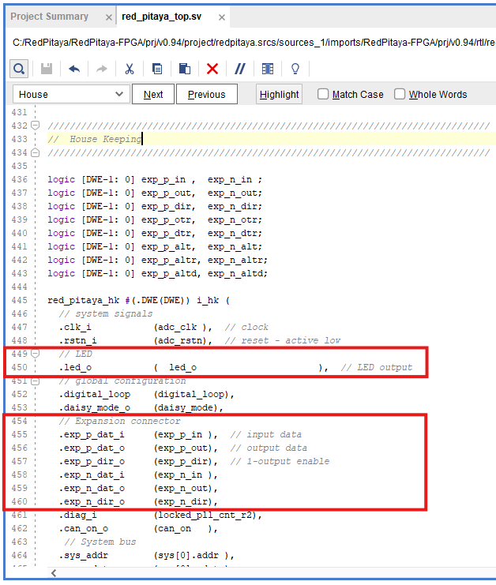

.. _fpga_modify_project:

###########################
Modifying the FPGA project
###########################

Project modification can include changing the functionality of the design, adding new features, or fixing bugs. In this guide, we will focus on modifying the existing v0.94 FPGA project to change the behavior of the LED output and adding our own component.
These two modifications will help you understand the process of working with FPGA projects and how to adapt them to your needs.

.. contents:: Table of Contents
    :local:
    :depth: 2
    :backlinks: top

|

Prerequisites
==================

This example project doesn't have any specific prerequisites, but familiarity with Verilog and FPGA design concepts will be helpful. 

**Board model compatibility:**

* All Red Pitaya boards

**Based on:**

* :ref:`v0.94 FPGA project <fpga_project_v0_94>`

If you are looking for detailed description of the v0.94 FPGA project, click on the link above.

.. note::

    Since Red Pitaya board models have slightly different variations of the v0.94 FPGA project due to the nature of the hardware, the exact code lines mentioned in the tutorial 
    may differ slightly.

|

Removing extra design source files
===================================

In this step, we will remove any unnecessary design source files from the project to keep it clean and organized.

1.  **Locate Design Sources**: Inside the **Sources** panel in Vivado, locate the **Design Sources** directory. 

    .. figure:: img/Vivado-design-sources.png
        :width: 500
        :align: center

#.  **Disable Unnecessary Files**: As we can see, the **Design Sources** contains a lot of different Verilog files, of which most are not needed in the v0.94 project (most of the files contain old functionality 
    or alternative functionality of v0.94 project for different board models). The only file tree related to our project is at the top of the list, written in **bold**, with a 
    small pyramid next to it. **Shift Select** all the other files. **Right-click** and select **Disable file** to "exclude" them from the project.

    .. figure:: img/Vivado-design-sources-disable.png
        :width: 500
        :align: center

#.  **Repeat for Tree-Like Structures**: As most of the disabled files have a tree-like file structure, repeat step number 2 until only the **red_pitaya_top** file tree remains.

    .. figure:: img/Vivado-design-sources-disable-step2.png
        :width: 500
        :align: center

    .. figure:: img/Vivado-design-sources-disable-finish.png
        :width: 500
        :align: center

|

.. _fpga_tutorial_led_blink:

Simple LED blink
==================

In this project modification, we will focus on taking one of the existing signals, specifically the LEDs, and modifying its behavior.

To start, open the Vivado project you created in the previous section. If you haven't created a project yet, please refer to the :ref:`Creating an FPGA project in Vivado <fpga_create_project>` section.

To make things simple, we will only edit the top-level module **red_pitaya_top.sv** and work with existing signals.

1.  **Open the Top-Level Module**: Open the **red_pitaya_top.sv** file. Go to the **Sources** panel in Vivado, and locate the **red_pitaya_top.sv** file under the **Design Sources** directory. Double-click the name to 
    open it in the editor.

    .. figure:: img/Tutorial_blink/Vivado-redpitaya-top.png
        :width: 1200
        :align: center

#.  **Modify the LED Port**: Change the **led_o** port in top level module/entity in line 119 from **inout logic** to **output logic**. This change will allow us to control the LED output directly from the FPGA 
    design and skip the complicated three-state logic.

    .. figure:: img/Tutorial_blink/Vivado-tutorial-led-logic-change.png
        :width: 800
        :align: center

#.  **Comment the LED Port in House Keeping Section**: Scroll down to the **House Keeping** section. We can also use *Ctrl+F* to search for the keyword **House Keeping**. This section contains the code that manages the LEDs and GPIOs.
    Comment the **led_o** port.

    .. figure:: img/Tutorial_blink/Vivado-tutorial-comment-led.png
        :width: 800
        :align: center

#.  **Insert LED Blink Code**: Scroll down a bit further to get to the empty **LED** section. Insert the following code to make the LED 0 blink

    .. code-block:: Verilog

        reg [27:0]counter = 28'd0;
        reg led = 1'b0;

        always @ (posedge adc_clk) begin
            counter = counter+1;
            if (counter == 28'd256000000) begin      // 256e6 periods of adc_clock (core clock frequency)
                led = ~led;                          // led will blink with a period of aprox. 2 sec
                counter = 28'd0;                     // reset the counter
            end 
        end

        assign led_o[0] = led;                       // assign the register value to the led output

    As the counter increases with the core clock frequency of the Red Pitaya unit, the blink period will vary depending on the board model:

    * 2.083 seconds (for 122.88 MHz)
    * 2.048 seconds (for 125 MHz)
    * 1.024 seconds (for 250 MHz)

    To adjust the blink period, change the value in the **if (counter == 28'd256000000)** line.

    .. figure:: img/Tutorial_blink/Vivado-tutorial-led-blink.png
       :width: 800
       :align: center

#.  **Save the Changes**: Save the changes by clicking on the **Save** icon in the toolbar or using the shortcut *Ctrl+S*.

#.  **Synthesize the Design**: Now that we have modified the code, we need to synthesize the design to check for any errors. Click on the **Run ==> Synthesis** button (green play button) in the toolbar or click on 
    the **Run Synthesis** option in the **Flow Navigator** panel on the far left.

    .. figure:: img/Tutorial_blink/Vivado-tutorial-run-synthesis.png
        :width: 1200
        :align: center

    .. figure:: img/Tutorial_blink/Vivado-tutorial-run-synthesis-popup.png
       :width: 500
       :align: center

#.  **Review Synthesis Results (optional)**: After the synthesis is complete, Vivado will display a summary of the synthesis results. If there are no errors, we can proceed to the next step. 
    If there are errors, review the messages in the **Synthesis** panel and fix them accordingly. During the build process, Vivado will also check for any warnings or errors in the code. 
    If there are any issues, they will be displayed in the **Messages** panel at the bottom of the Vivado window. During the build of the v0.94 project, Vivado will report a few warnings, 
    which can be safely ignored.

#.  **Open Synthesized Design**: When the synthesis is finished, a window will pop up with the synthesis results and an option to proceed with implementation. If you are curious, click on 
    the **Open Synthesized Design** button to open the synthesized design in the Vivado editor. 

    .. figure:: img/Tutorial_blink/Vivado-tutorial-run-synthesis-finish.png
        :width: 400
        :align: center

#.  **Run Implementation**: We will proceed with the implementation step. Similarly to launching the synthesis, click on the **Run ==> Implementation** button (green play button) in the toolbar, 
    click on the **Run Implementation** option in the **Flow Navigator** panel on the far left or select **Run implementation** option from the synthesis result pop-up.

    .. figure:: img/Tutorial_blink/Vivado-tutorial-run-implementation.png
        :width: 1200
        :align: center

    .. figure:: img/Tutorial_blink/Vivado-tutorial-run-implementation-popup.png
       :width: 500
       :align: center

#.  **Review Implementation Results (optional)**: After the implementation is complete, Vivado will display a summary of the implementation results. If there are no errors, we can proceed to 
    the next step. If there are errors, review the messages in the **Implementation** panel and fix them accordingly. During the build process, Vivado will also check for any warnings or 
    errors in the code. If there are any issues, they will be displayed in the **Messages** panel at the bottom of the Vivado window. During the build of the v0.94 project, Vivado will 
    report a few warnings, which can be safely ignored.

    .. figure:: img/Tutorial_blink/Vivado-tutorial-run-implementation-finish.png
        :width: 400
        :align: center

#.  **Generate Bitstream**: The final step is bitstream generation, which can be launched from the **Program and Debug** section in the Flow Navigator or the **Generate Bitstream** button in 
    the toolbar. 

    .. figure:: img/Tutorial_blink/Vivado-tutorial-generate-bitstream.png
        :width: 1200
        :align: center

    .. note::
        
        **Generate Bitstream Directly**: What we haven't mentioned is that you can also generate the bitstream file directly from the start. In this case Vivado will automatically run 
        synthesis, implementation, and bitstream generation in one go, informing us of any additional steps that need to be taken.

#.  **Review Bitstream Generation Results**: Once bitstream generation is complete, the following pop-up window will appear. If you are curious you can explore the different options,
    but for now, close the pop-up.

    .. figure:: img/Tutorial_blink/Vivado-tutorial-generate-bitstream-finish.png
        :width: 400
        :align: center

#.  **Locate the Bitstream File**: The bitstream file is named after the top module **red_pitaya_top.bit** and located in the **/prj/v0.94/project/repitaya.runs/impl_1** directory of the 
    downloaded Red Pitaya FPGA Repository.

The next step is transfering the bitstream to the Red Pitaya board and loading it into the FPGA. For this, please refer to the :ref:`Reprogramming the FPGA <fpga_reprogramming>` section.

|

.. _fpga_tutorial_cust_comp:

Adding a custom component
==========================

To start, open the Vivado project you created in the :ref:`previous section <fpga_create_project>`. If you haven't created a project yet, please refer to the :ref:`Creating an FPGA project in Vivado <fpga_create_project>` section.

Here, we will focus on adding a custom component/module named **red_pitaya_proc** to the existing v0.94 FPGA project and reroute the existing signals to it. This will help you understand how to integrate your own designs into the Red Pitaya FPGA project structure.
The source and HDL language used to describe the custom component itself is not important as the nature of HDL languages enables us to view each module as a black box with defined input and output ports. As long as the "black box" has the expected ports (matching name, width and direction), it can be integrated into the existing design.

Our custom component will have the following functionality:

* **System bus connection**. This will allow the component to communicate with the Red Pitaya system bus and receive commands from the host.
* **ADC**. Interface with the ADC to receive input signals from IN1 and IN2 for processing.
* **DAC**. Interface with the DAC to send processed output signals to OUT1 and OUT2.
* **GPIOs**. Use GPIOs for general-purpose input/output operations.
* **LEDs**. Control LEDs for status indication and debugging purposes.

As discussed in :ref:`v0.94 FPGA project description <fpga_project_v0_94>`, the system bus on Red Pitaya is split into eight sections. Generally, we could have connected the custom component to one of the free sections, but for this example, we will be replacing the existing **PID** component.

|

Changes to red_pitaya_top
--------------------------

1.  **Removing an existing component**: Removing an existing component is straightforward - we only have to remove the code that connects the unwanted component to the top module. In the 
    **red_pitaya_top.sv** file, locate the **MIMO PID controller** section and comment out the entire section.

    .. figure:: img/Tutorial_custom_comp/Vivado-tutorial-mimo-pid.png
        :width: 800
        :align: center

    In some projects (for example, *v0.94_250* meant for *SIGNALlab 250-12*), the PID component is already commented out, but there are a few lines of code that ensure the correct 
    functionality of the system bus. Comment out the lines related to system bus, but leave the *pid_dat* signals intact. If we take a closer look at the signals connected to the 
    PID component, we can already guess which signals will need to be connected to our custom component.

    .. figure:: img/Tutorial_custom_comp/Vivado-tutorial-mimo-pid-250.png
        :width: 800
        :align: center

    .. figure:: img/Tutorial_custom_comp/Vivado-tutorial-mimo-pid-250-comment.png
        :width: 800
        :align: center

#.  **Add a custom component connection**: We will add the custom component connection to the very end on the **red_pitaya_top.sv** file, just before the final `endmodule` statement. 
    To start, we can copy over the existing **PID component** instantiation, which we will slowly modify to match our custom component's interface.

    .. code-block:: Verilog

        red_pitaya_proc #(
            // Generic parameters

        )
        i_proc(
            // Signals
            .clk_i          (adc_clk         ), // clock
            .rstn_i         (adc_rstn        ), // reset - active low
            
            // ADC
            .dat_a_in       (                ), // IN 1
            .dat_b_in       (                ), // IN 2

            // DAC
            .dat_a_out      (                ), // OUT 1
            .dat_b_out      (                ), // OUT 2

            // System bus
            .sys_addr       (sys[3].addr     ), // System address
            .sys_wdata      (sys[3].wdata    ), // Write data
            .sys_wen        (sys[3].wen      ), // Write enable
            .sys_ren        (sys[3].ren      ), // Read enable
            .sys_rdata      (sys[3].rdata    ), // Read data
            .sys_err        (sys[3].err      ), // Error
            .sys_ack        (sys[3].ack      ), // Acknowledge
        );

    As there are quite a few changes we need to make, we will go through them step by step.

|

GPIO and LEDs
~~~~~~~~~~~~~~~

By default, the GPIOs and LEDs are connected to the **House Keeping module (red_pitaya_hk)**. We will have to disconnect them from there and connect them to our custom component instead.

The digital pins on the :ref:`E1 connector <E1>` are connected directly to the FPGA. Inside the FPGA, they first connect to an input-output buffer, which splits each pin's signal into 
three digital signals:

* Input data
* Output data
* Direction control (0 = input, 1 = output)

Furthermore, since there are two rows of GPIO pins, which can be treated as differential pairs (labelled P and N), this results in a grand total of 6 GPIO signals:

* ``exp_p_in`` - input data for the P row
* ``exp_p_out`` - output data for the P row
* ``exp_p_dir`` - direction control for the P row
* ``exp_n_in`` - input data for the N row
* ``exp_n_out`` - output data for the N row
* ``exp_n_dir`` - direction control for the N row

Each of these signals' widths corresponds to the number of GPIO pins on the E1 connector (usually either 8 or 11). Each bit represents a single GPIO pin in the corresponding row 
(the LSB is pin 0).

3.  **Copy the GPIO and LED signals to custom component**: Copy the GPIO and LED signal connections from the **House Keeping** section and paste them into the custom component instantiation. 
    The GPIOs will be connected to the **exp_p_in**, **exp_p_out**, **exp_p_dir**, **exp_n_in**, **exp_n_out**, and **exp_n_dir** signals, while the LEDs will be connected to the **led_o** 
    signal. Then comment out the original connections in the **House Keeping** section.

    .. figure:: img/Tutorial_custom_comp/Vivado-tutorial-housekeeping-comment.png
        :width: 800
        :align: center

#.  **Add generic parameter for GPIO width**: We will also add a generic parameter **DW** (digital width) to determine the width of the GPIO signals. This will allow us to easily adapt the 
    component to different board models with varying numbers of GPIO pins.

    Here is how our custom component instantiation should look like so far:

    .. code-block:: Verilog

        red_pitaya_proc #(
            // Generic parameters
            .DW             (DWE             )  // GPIO bus width
        )
        i_proc(
            // Signals
            .clk_i          (adc_clk         ), // clock
            .rstn_i         (adc_rstn        ), // reset - active low
            
            // ADC
            .dat_a_in       (                ), // IN 1
            .dat_b_in       (                ), // IN 2

            // DAC
            .dat_a_out      (                ), // OUT 1
            .dat_b_out      (                ), // OUT 2

            // GPIO + LED
            .led_o          (led_o           ), // LED output
            .gpio_p_i       (exp_p_in        ), // GPIO P row input
            .gpio_p_o       (exp_p_out       ), // GPIO P row output
            .gpio_p_dir     (exp_p_dir       ), // GPIO P row direction
            .gpio_n_i       (exp_n_in        ), // GPIO N row input
            .gpio_n_o       (exp_n_out       ), // GPIO N row output
            .gpio_n_dir     (exp_n_dir       ), // GPIO N row direction

            // System bus
            .sys_addr       (sys[3].addr     ), // System address
            .sys_wdata      (sys[3].wdata    ), // Write data
            .sys_wen        (sys[3].wen      ), // Write enable
            .sys_ren        (sys[3].ren      ), // Read enable
            .sys_rdata      (sys[3].rdata    ), // Read data
            .sys_err        (sys[3].err      ), // Error
            .sys_ack        (sys[3].ack      ), // Acknowledge
        );

|

ADC and DAC
~~~~~~~~~~~~~~~

Now we will configure the ADC and DAC connections. The ADC and DAC signals are already defined in the top module, so we just need to connect them to our custom component.

.. note::

    Some Red Pitaya board models (for example :ref:`STEMlab 125-14 4-Input <top_125_14_4-IN>`) have a different number of ADC and DAC channels. The code snippets in this tutorial are based 
    on the 2-channel configuration, but they can be easily adapted to different board models by changing the signal names and widths accordingly. For example, for 4-channel ADC configuration,
    create 4 input ports in the custom component and connect them to the corresponding ADC signals in the top module.

5.  **Add new ADC and DAC busses**: First, we will add a new bus for the ADC and DAC signals, which will replace the ``pid_dat`` as the output of our component. Add the following lint near 
    the *ASG* and *PID* bus declarations (around line 200). At the same time comment out the original PID bus declaration.

    .. code-block:: Verilog

        // CUSTOM
        SBG_T [2-1:0]            dac_proc_o;    //! Add Modified DAC signal
        SBA_T [MNA-1:0]          adc_proc_dat;  //! Add Modified ADC signal

        // PID
        //SBA_T [2-1:0]            pid_dat;    //! disable PID

    .. figure:: img/Tutorial_custom_comp/Vivado-tutorial-custom-buses.png
        :width: 800
        :align: center

#.  **Remove the PID signals**: Next, we will remove the existing PID signals and connect the custom DAC bus in their place. This will allow us to send the processed output 
    signals from our custom component to the DAC outputs. Head to the **DAC IO** section and change the following lines.

    .. code-block:: Verilog

        // assign dac_a_sum = asg_dat[0] + pid_dat[0];      //! (disable PID)
        // assign dac_b_sum = asg_dat[1] + pid_dat[1];      //! (disable PID)

        assign dac_a_sum = dac_proc_o[0];   // Direct assign, to leave space for PID
        assign dac_b_sum = dac_proc_o[1];

    .. figure:: img/Tutorial_custom_comp/Vivado-tutorial-reconfigure-dac-sigs.png
        :width: 800
        :align: center

#.  **Change the ADC (scope) connections**: Change the ADC connections in the **oscilloscope (rp_scope_com) component** to connect to the new ADC bus instead of the original ADC signals. 
    This will allow us to monitor the processed input signals from our custom component using the oscilloscope application.

    .. code-block:: Verilog

        // ADC
        .adc_dat_i     ({adc_proc_dat[1], adc_proc_dat[0]}  ),    //! adc_dat

    .. figure:: img/Tutorial_custom_comp/Vivado-tutorial-reconfigure-scope.png
        :width: 800
        :align: center

#.  **Connect the custom component**: Finally, we can connect the ``adc_dat`` (``adc_dat_sw`` for SIGNALlab 250-12), ``asg_dat`` and our two custom busses (``adc_proc_dat`` and 
    ``dac_proc_o``) to the custom component.

    .. code-block:: Verilog

        ////////////////////////////////////////////////////
        // Custom processing component
        ////////////////////////////////////////////////////

        red_pitaya_proc #(
            .DW             (DWE             )  // GPIO bus width
        )
        i_proc(
            // Signals
            .clk_i          (adc_clk         ), // clock
            .rstn_i         (adc_rstn        ), // reset - active low

            // ADC
            .adc_a_in       (adc_dat[0]      ), // IN 1 - ADC input
            .adc_b_in       (adc_dat[1]      ), // IN 2 - ADC input
            .adc_a_out      (adc_proc_dat[0] ), // IN 1 - to scope
            .adc_b_out      (adc_proc_dat[1] ), // IN 2 - to scope

            // DAC
            .dac_a_in       (asg_dat[0]      ), // OUT 1 - from signal generator (ASG)
            .dac_b_in       (asg_dat[1]      ), // OUT 2 - from signal generator (ASG)
            .dac_a_out      (dac_proc_o[0]   ), // OUT 1 - DAC output
            .dac_b_out      (dac_proc_o[1]   ), // OUT 2 - DAC output
            
            // GPIO + LED
            .led_o          (led_o           ), // LED output
            .gpio_p_in      (exp_p_in        ), // GPIO P row input
            .gpio_p_out     (exp_p_out       ), // GPIO P row output
            .gpio_p_dir     (exp_p_dir       ), // GPIO P row direction
            .gpio_n_in      (exp_n_in        ), // GPIO N row input
            .gpio_n_out     (exp_n_out       ), // GPIO N row output
            .gpio_n_dir     (exp_n_dir       ), // GPIO N row direction

            // System bus
            .sys_addr       (sys[3].addr     ), // System address
            .sys_wdata      (sys[3].wdata    ), // Write data
            .sys_wen        (sys[3].wen      ), // Write enable
            .sys_ren        (sys[3].ren      ), // Read enable
            .sys_rdata      (sys[3].rdata    ), // Read data
            .sys_err        (sys[3].err      ), // Error
            .sys_ack        (sys[3].ack      )  // Acknowledge
        );

    .. note::

        * Since we disconnected the GPIOs and LEDs from the House Keeping module, SCPI and API commands to control them will not work. It is possible to add custom registers for GPIO and 
          LED control in the custom component (covered in a different tutorial).
        * The DAC signal from the custom component is summed with the output of the existing signal generator (if enabled). If you want to use only the custom component's DAC output, 
          you can modify the **DAC IO** section to remove the signal generator's contribution or exclude the **ASG** component from the design.

#.  **Confirm unknown component**: After we save the changes to the **red_pitaya_top.sv** file, we will see Vivado add an unknown component to the **Design Sources** panel. This is because 
    we haven't created the custom component yet.

    .. figure:: img/Tutorial_custom_comp/Vivado-tutorial-custom-component-new.png
        :width: 500
        :align: center

|

Designing a new custom component
---------------------------------

Due to the "black box" nature of HDL languages, we can write the custom component in any HDL language (Verilog, VHDL, etc.) and it will work as long as the input and output ports 
match the expected names, widths, and directions. We will create both a Verilog and a VHDL version of the custom component.

9.  **Add a new Design Source**: To add a new *Design Source* to the project, either click the **+** button in the **Sources** panel or right-click on the **Design Sources** directory and select **Add Sources**.

    .. figure:: img/Tutorial_custom_comp/Vivado-tutorial-custom-add-sources.png
        :width: 500
        :align: center

#.  As we are adding a new module, we need to select **Add or create design sources**.

    .. figure:: img/Tutorial_custom_comp/Vivado-tutorial-custom-add-sources-panel.png
        :width: 600
        :align: center

    If we already have the HDL code for the custom component, we can select **Add Files** and browse to the file location. In this case, we will create a new file, so select **Create File**.

    .. figure:: img/Tutorial_custom_comp/Vivado-tutorial-custom-create-file.png
        :width: 600
        :align: center

#.  **Select the File type**: Select the **File type** (Verilog or VHDL) and enter the **File name** (red_pitaya_proc). Click **OK** to create the new file.

    .. figure:: img/Tutorial_custom_comp/Vivado-tutorial-custom-create-file-name.png
        :width: 400
        :align: center

#.  **Finish adding the new file**: The new file will be added to the list of files to be added to the project. Click **Finish** to complete the process.

    .. figure:: img/Tutorial_custom_comp/Vivado-tutorial-custom-create-file-finish.png
        :width: 600
        :align: center

#.  **Define the Module**: As soon as the file is created, another window will pop up, asking for the *Module definition* parameters like entity name, architecture name and 
    I/O ports. We will click **OK** as it is much easier to edit the ports in the code editor directly.

    .. figure:: img/Tutorial_custom_comp/Vivado-tutorial-custom-define-module.png
        :width: 600
        :align: center

#.  **Confirm Module Definition**: Click **Yes**.

    .. figure:: img/Tutorial_custom_comp/Vivado-tutorial-custom-define-module-finish.png
        :width: 500
        :align: center

#.  **Open the new file**: After Vivado finishes reloading, we will see the new file in the **Design Sources** panel. Double-click the file name to open it in the editor.

    .. figure:: img/Tutorial_custom_comp/Vivado-tutorial-component-inserted.png
        :width: 1200
        :align: center

#.  **Copy the code**: Now, copy the following code into the file. We will go through its functionality step by step.

    .. tabs::

        .. tab:: VHDL

            .. code-block:: vhdl

                library IEEE;
                use IEEE.std_logic_1164.all;
                use IEEE.numeric_std.all;

                entity red_pitaya_proc is
                generic(
                  DW                      :       integer := 8                        -- GPIO width
                );
                port (
                  clk_i                   : in    std_logic;
                  rstn_i                  : in    std_logic;                          -- bus reset - active low

                  sys_addr                : in    std_logic_vector(31 downto 0);      -- bus address
                  sys_wdata               : in    std_logic_vector(31 downto 0);      -- bus write data
                  sys_wen                 : in    std_logic;                          -- bus write enable
                  sys_ren                 : in    std_logic;                          -- bus read enable
                  sys_rdata               : out   std_logic_vector(31 downto 0);      -- bus read data
                  sys_err                 : out   std_logic;                          -- bus error indicator
                  sys_ack                 : out   std_logic;                          -- bus acknowledge signal

                  adc_a_in, adc_b_in      : in    signed(13 downto 0);                -- ADC 1 & 2 input
                  adc_a_out, adc_b_out    : out   signed(13 downto 0);                -- to scope

                  dac_a_in, dac_b_in      : in    signed(13 downto 0);                -- from signal generator (ASG)
                  dac_a_out, dac_b_out    : out   signed(13 downto 0);                -- DAC 1 & 2 output

                  led_o                   : out   std_logic_vector(   7 downto 0);    -- LED output
                  gpio_p_in, gpio_n_in    : in    std_logic_vector(DW-1 downto 0);    -- GPIO input data
                  gpio_p_out, gpio_n_out  : out   std_logic_vector(DW-1 downto 0);    -- GPIO output data
                  gpio_p_dir, gpio_n_dir  : out   std_logic_vector(DW-1 downto 0)     -- GPIO direction 
                );
                end red_pitaya_proc;

                architecture RTL of red_pitaya_proc is

                -- ### SIGNALS ### --
                constant ZERO           : std_logic_vector(31 downto 0) := (others => '0');         -- Padding registers
                constant ID_REG         : std_logic_vector(31 downto 0) := X"FEEDBACC";             -- ID register
                
                -- LED & GPIO --
                
                signal diop_in,  dion_in    : std_logic_vector(DW-1 downto 0);                      -- GPIO input
                signal diop_out, dion_out   : std_logic_vector(DW-1 downto 0) := (others => '0');   -- GPIO output
                signal diop_dir, dion_dir   : std_logic_vector(DW-1 downto 0) := (others => '0');   -- Direction in == 0, out == 1
                
                signal led                  : std_logic_vector(   7 downto 0) := (others => '0');   -- LED status

                begin

                -- ### Registers, write & control logic ### --
                -- Red Pitaya core clock frequency
                pbus: process(clk_i)
                begin
                  if rising_edge(clk_i) then
                    if rstn_i = '0' then
                      -- LED & GPIO --
                      diop_dir <= (others => '0');
                      dion_dir <= (others => '0');
                      diop_out <= (others => '0');
                      dion_out <= (others => '0');
                      led <= (others => '0');

                    else
                      sys_ack <= sys_wen or sys_ren;                      -- acknowledge transactions
                        
                      -- decode address & write registers
                      if sys_wen='1' then
                        if    sys_addr(19 downto 0) = X"00010" then
                          diop_dir <= sys_wdata(DW-1 downto 0);           -- Change direction P

                        elsif sys_addr(19 downto 0) = X"00014" then
                          dion_dir <= sys_wdata(DW-1 downto 0);           -- Change direction N

                        elsif sys_addr(19 downto 0) = X"00018" then
                          diop_out <= sys_wdata(DW-1 downto 0);           -- Change output P

                        elsif sys_addr(19 downto 0) = X"0001C" then
                          dion_out <= sys_wdata(DW-1 downto 0);           -- Change output N

                        elsif sys_addr(19 downto 0) = X"00030" then
                          led <= sys_wdata(7 downto 0);                   -- Change LEDs

                        end if;
                      end if;
                    end if;
                  end if;
                end process pbus;

                sys_err <= '0';

                -- ADC & DAC processing --
                adc_a_out <= adc_a_in;
                adc_b_out <= adc_b_in;
                dac_a_out <= dac_a_in;
                dac_b_out <= dac_b_in;

                -- GPIO I/O assignment --
                gpio_p_out <= diop_out;
                gpio_n_out <= dion_out;
                gpio_p_dir <= diop_dir;
                gpio_n_dir <= dion_dir;
                diop_in <= gpio_p_in;
                dion_in <= gpio_n_in;

                -- LED output assignment --
                led_o <= led;

                -- ### Decode address & read data ### --
                with sys_addr(19 downto 0) select
                  sys_rdata <=                          ID_REG              when x"00000",      -- ID register
                              ZERO(32-1 downto DW)    & diop_dir            when x"00010",      -- GPIO P direction
                              ZERO(32-1 downto DW)    & dion_dir            when x"00014",      -- GPIO N direction
                              ZERO(32-1 downto DW)    & diop_out            when x"00018",      -- GPIO P output
                              ZERO(32-1 downto DW)    & dion_out            when x"0001C",      -- GPIO N output
                              ZERO(32-1 downto DW)    & diop_in             when x"00020",      -- GPIO P inputs
                              ZERO(32-1 downto DW)    & dion_in             when x"00024",      -- GPIO N inputs
                              ZERO(32-1 downto  8)    & led                 when x"00030",      -- LEDs
                              ZERO when others;

                end RTL;

        .. tab:: Verilog

            .. code-block:: Verilog

                module red_pitaya_proc # (
                  parameter DW = 8                                // Digital width (number of GPIO pins)
                ) (
                  input                clk_i,                     // Clock input
                  input                rstn_i,                    // bus reset - active low

                  input       [  31:0] sys_addr,                  // bus address
                  input       [  31:0] sys_wdata,                 // bus write data
                  input                sys_wen,                   // bus write enable
                  input                sys_ren,                   // bus read enable
                  output reg  [  31:0] sys_rdata,                 // bus read data
                  output wire          sys_err,                   // bus error indicator
                  output reg           sys_ack,                   // bus acknowledge signal

                  input       [  13:0] adc_a_in, adc_b_in,        // ADC 1 & 2 input
                  output wire [  13:0] adc_a_out, adc_b_out,      // to scope

                  input       [  13:0] dac_a_in, dac_b_in,        // from signal generator (ASG)
                  output wire [  13:0] dac_a_out, dac_b_out,      // DAC 1 & 2 output

                  output wire [   7:0] led_o,                     // LED output
                  input       [DW-1:0] gpio_p_in, gpio_n_in,      // GPIO input data
                  output wire [DW-1:0] gpio_p_out, gpio_n_out,    // GPIO output data
                  output wire [DW-1:0] gpio_p_dir, gpio_n_dir     // GPIO direction
                );

                  // Internal signals
                  reg        [DW-1:0] diop_dir;
                  reg        [DW-1:0] dion_dir;
                  reg        [DW-1:0] diop_out;
                  reg        [DW-1:0] dion_out;
                  wire       [DW-1:0] diop_in;
                  wire       [DW-1:0] dion_in;
                  reg        [   7:0] led;

                  // ADC & DAC passthrough
                  assign adc_a_out = adc_a_in;
                  assign adc_b_out = adc_b_in;
                  assign dac_a_out = dac_a_in;
                  assign dac_b_out = dac_b_in;

                  // Bus process
                  always @(posedge clk_i) begin
                    if (!rstn_i) begin
                      diop_dir <= {DW{1'b0}};
                      dion_dir <= {DW{1'b0}};
                      diop_out <= {DW{1'b0}};
                      dion_out <= {DW{1'b0}};
                      led      <= 8'b0;
                    end else begin
                      sys_ack <= sys_wen | sys_ren;

                      if (sys_wen) begin
                        case (sys_addr[19:0])
                          20'h00010: diop_dir <= sys_wdata[DW-1:0];
                          20'h00014: dion_dir <= sys_wdata[DW-1:0];
                          20'h00018: diop_out <= sys_wdata[DW-1:0];
                          20'h0001C: dion_out <= sys_wdata[DW-1:0];
                          20'h00030: led      <= sys_wdata[7:0];
                        endcase
                      end
                    end
                  end

                  // Error handling
                  assign sys_err = 1'b0;

                  // Direct connections
                  assign gpio_p_dir = diop_dir;
                  assign gpio_n_dir = dion_dir;
                  assign gpio_p_out = diop_out;
                  assign gpio_n_out = dion_out;
                  assign diop_in    = gpio_p_in;
                  assign dion_in    = gpio_n_in;
                  assign led_o      = led;

                  // Read data
                  always @(*) begin
                    case (sys_addr[19:0])
                      20'h00000: sys_rdata = 32'hFEEDBACC;
                      20'h00010: sys_rdata = {{32-DW{1'b0}}, diop_dir};
                      20'h00014: sys_rdata = {{32-DW{1'b0}}, dion_dir};
                      20'h00018: sys_rdata = {{32-DW{1'b0}}, diop_out};
                      20'h0001C: sys_rdata = {{32-DW{1'b0}}, dion_out};
                      20'h00020: sys_rdata = {{32-DW{1'b0}}, diop_in};
                      20'h00024: sys_rdata = {{32-DW{1'b0}}, dion_in};
                      20'h00030: sys_rdata = {{32-8{1'b0}},  led};
                      default:   sys_rdata = 32'b0;
                    endcase
                  end
                endmodule

The code of the custom component is relatively simple and has the following functionality:

* ID register.
* LED and GPIO control via the system bus.
* Passthrough of ADC and DAC signals (input signals are sent to the scope, output signals are sent to the DAC).

As discussed in :ref:`v0.94 FPGA project description <fpga_project_v0_94>`, the system bus on Red Pitaya is split into eight sections. Each section has its own 20 bit address space. 
The custom component is connected to section 3 of the system bus, which has the base address ``0x40300000``. The upper twelve bits determine the section (``0x403`` for section 3), 
while the lower 20 bits are used for addressing registers inside the component. The custom component has the following registers:

* ``0x00000``: ID register
* ``0x00010``: Digital output direction (diop_dir)
* ``0x00014``: Digital input direction (dion_dir)
* ``0x00018``: Digital output data (diop_out)
* ``0x0001C``: Digital input data (dion_out)
* ``0x00030``: LED control (led)

The easiest way to interact with the custom FPGA registers from inside Linux OS is through the ``monitor`` command line tool.

|

17. **Save the changes**: As soon as we save the changes, Vivado will update the project; our custom module ``red_pitaya_proc`` replaces the ``red_pitaya_pid`` module, which is now outside the top module.

    .. figure:: img/Tutorial_custom_comp/Vivado-tutorial-custom-component-finish.png
        :width: 500
        :align: center

#.  Proceed with **Synthesis, Implementation, and Bitstream Generation** as described in the `Simple LED blink`_ example above.

In the next chapter we will show how to change the FPGA image on the Red Pitaya board.
