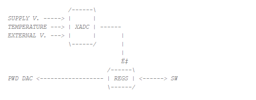

.. _fpga_project_v0_94:

#######################
FPGA project v0.94
#######################

The v0.94 project is the default FPGA image that loads during Red Pitaya boot. It includes all the necessary components to run the standard Red Pitaya applications, such as signal generators, oscilloscopes, and spectrum analyzers.
This image is also used by most of Red Pitaya applications, so if you want to create your own FPGA project, it is recommended to start with this one.

The v0.94 project does not have a IP Block Design hierarchy, instead all the connections are made in Verilog in the top module.

.. contents:: Table of Contents
    :local:
    :depth: 1
    :backlinks: top
   
|

Top module
------------

Top module connects PS part with rest of Red Pitaya FPGA.

.. figure:: img/v0.94/fpga-v094-top.png
    :width: 600
    :align: center

Most of the Red Pitaya FPGA project is written in Verilog and System Verilog, but we can also include components written in VHDL. If we open the resource drop-down menu hidden under *red_pitaya_top*, we can see the 12 components that actually make up the system.
The full relationship between them is described in the comments at the top of the *red_pitaya_top* module, where a brief description of the more important components is also available. 

The individual components are interconnected by a simplified form of the AXI bus. AXI ("Advanced eXtensible Interface") is a communication protocol designed for microcontrollers and belongs to the set of AMBA ("Advanced Microcontroller Bus Architecture") protocols.
AMBA is a set of different protocols that define the way of communication between the different functional blocks on a system-on-chip (SoC). 

A simplified AXI bus, used in the Red Pitaya FPGA, consists of the following signals: 

* ``clk`` - clock signal 
* ``addr`` - address bus 
* ``wdata`` - write data 
* ``rdata`` - read data 
* ``wen`` - write enable 
* ``ren`` - read enable 
* ``err`` - error 
* ``ack`` - acknowledge 

The AXI address space of the Red Pitaya bus in the v0.94 project is divided into 8 sections, where each section has a 20 bit address. It starts at the hexadecimal address 0x40000000 and ends at 0x407FFFFF. Each of the 8 sections has a specific module associated with it.

+-------------+------------+----------------------------------+
| Start       | End        | Module Name                      |
+=============+============+==================================+
| 0x40000000  | 0x400FFFFF | House Keeping                    |
+-------------+------------+----------------------------------+
| 0x40100000  | 0x401FFFFF | Oscilloscope                     |
+-------------+------------+----------------------------------+
| 0x40200000  | 0x402FFFFF | Arbitrary signal generator (ASG) |
|             |            | \ 125-14-4-Input: \              |
|             |            | Oscilloscope CHC and CHD         |
+-------------+------------+----------------------------------+
| 0x40300000  | 0x403FFFFF | PID controller                   |
+-------------+------------+----------------------------------+
| 0x40400000  | 0x404FFFFF | Analog mixed signals (AMS)       |
+-------------+------------+----------------------------------+
| 0x40500000  | 0x405FFFFF | Daisy chain                      |
+-------------+------------+----------------------------------+
| 0x40600000  | 0x406FFFFF | FREE                             |
|             |            | \ 125-14-GEN2 Z20: \             |
|             |            | E3 connector serial lines test   |
+-------------+------------+----------------------------------+
| 0x40700000  | 0x407FFFFF | Power test                       |
+-------------+------------+----------------------------------+

The architecture of the Red Pitaya is 32-bit, which means that each register occupies 32 bits (4 bytes). The registers are memory-mapped, which means that each register has a specific address in the memory space. The registers are used to configure and control the different modules in the FPGA.

|

House Keeping
----------------

The housekeeping module, named "red_pitaya_hk" or "i_hk" within the v0.94 project, takes care of the system identification via DNA readout at startup and ID register which user can define at compile time, while also controlling eight LEDs and digital inputs and outputs (GPIOs). 

|

Oscilloscope
--------------

The oscilloscope module, which can be referred to as either "red_pitaya_scope" or "i_scope", is designed to capture data into two buffers implemented in BRAM; one buffer is dedicated to each input channel. Two other modules are present between the input signal and the buffers. The first is a digital filter that calibrates the frequency of the signal correctly.
The second module can average and decimate the input signal. Currently, Direct Memory Access (DMA), which is used by the Deep Memory mode, is implemented here too, but it will be added as a separate module in future versions.

.. figure:: img/v0.94/fpga-v094-scope.png
    :width: 600
    :align: center

* The input data can be averaged and decimated optionally via an average filter.

* The trigger section generates triggers from the input ADC data or an external digital signal. To create a trigger from an analog signal, a Schmitt trigger is used; the external trigger first passes through a debouncer, which is separate for positive and negative edges.

* The data capture buffer is implemented using a BRAM. Writing to RAM is performed using the ARM/TRIG logic. Writing is enabled with the ADC_ARM_DO signal (SW), which remains active until the trigger arrives and the ADC_DLY_CNT counts to zero. The value of adc_wp_trig serves as a pointer showing when the trigger arrived. This value is used to display the pre-trigger data.

|

Arbitrary signal generator (ASG)
---------------------------------

The Arbitrary signal/waveform generator, located at the following address, allows the generation of user-defined arbitrary signals. It is represented in the FPGA by the module "red_pitaya_asg" or "i_asg". The signal is generated from a fixed length buffer. Where the jump of the read indicator depends on the given frequency. The buffer content is generated by software, 
either as one of the pre-selected formats or given by the user. The buffer signal is further scaled before output via a linear function defined by the calibration.

.. figure:: img/v0.94/fpga-v094-asg.png
    :width: 600
    :align: center

* The buffers are filled with the SW. They also set a finite state machine that takes control of the read pointer. All registers relating to reading from the buffer have an additional 16 bits that are used as decimal points. This enables us to achieve a better ratio between the clock cycle and the frequency of the output signal.

* The finite state machine can be set to one-time or continuous wrapping sequences. The starting trigger can come from outside and a notification trigger is also available to synchronise with other applications (scope). Both channels are independent.

* The output data is scaled using a linear transformation.

|

PID controller
------------------

The PID controller (Proportional-Integral-Derivative controller) is represented in the FPGA by the "red_pitaya_pid" or "i_pid" module. The complete PID module consists of four PID blocks. Each data line from the ADC representing one of the fast analogue inputs (CHA and CHB, or IN1 and IN2) is split into two parts.
Each part then passes through its own PID block before being summed with the output of the other channel's PID block and fed to the high-speed analog output. Each output includes saturation protection.

.. figure:: img/v0.94/fpga-v094-pid.png
    :width: 600
    :align: center

This makes it easy to make the fast analog input dependent on both analog inputs, which is important for controlling different systems (e.g. laser stabilisation).

Each PID block comprises a proportional, an integrator and a derivative part. The input signal to the PID block is subtracted from the set point. This difference represents the error and is fed to the inputs of the P, I and D parts. The outputs of these three parts are then summed and fed to the output.

.. figure:: img/v0.94/fpga-v094-pid-submodule.png
    :width: 600
    :align: center

The integral part can be reset using a special signal.

|

Mixed analog signals (AMS)
---------------------------

The 'analog mixed signals' represent the 'slow' analog inputs and outputs on expansion connector E2. These are represented in the FPGA by the "red_pitaya_ams" or "i_ams" module.

The Red Pitaya has four slow analog inputs and four slow analog outputs. The slow analog inputs (AIN0, AIN1, AIN2 and AIN3) are connected to a 12-bit ADC, which also measures internal Red Pitaya voltages (important for system stability). The voltage range of these inputs is between 0 and 3.5 V, and the measured values are stored in FPGA registers. 
The analog outputs can be configured via the registers, with an output voltage range of 0 to 1.8 V.

The reading of the system and external voltages is performed by the XADC running in sequencer mode. It measures supply voltages, temperature, and voltages on the external connector. The measured values are then exposed to the software. In addition, the SW can set the registers that control the logic for the PWM DAC (analog module).

|

Daisy chaining
---------------

The Daisy Chaining Module is designed to connect and synchronise multiple Red Pitaya units via the clock signal of the primary unit. In the FPGA, it is represented by the "red_pitaya_daisy" or "i_daisy" module.
In a chain, the primary unit shares its clock and trigger signals with all secondary units, enabling synchronous data generation and capture. In addition to sharing the clock and trigger signals, the module also allows fast communication and data transmission between individual units. 

.. figure:: img/v0.94/fpga-v094-daisy.png
    :width: 600
    :align: center

A daisy chain module can be used to communicate with other boards and perform basic data transfers. The connection is made via fast serial lines with a separate clock and data line. The module consists of multiple submodules.

* The TX submodule serialises parallel data, which can be selected using the TX_CFG_SEL switch. There is an option for user data, training, manual values or loopback.

* The RX submodule de-serialises the input data and, when in training mode, looks for a predefined value.

* The testing submodule creates random values that can be selected for use by the TX module. After some time, it checks the received values and compares them to see if they are the same.

|

Free
------

As mentioned at the beginning of this chapter, the address bus in the v0.94 project is divided into eight address spaces. Six of these are occupied by the components listed above and two are free and connected to a leading stub/terminator ('system stub').
The leading stub prevents system errors when reading free or unconnected addresses.

|

System bus interconnect
-------------------------

The system bus interconnect, represented by the "system_bus_interconnect" module in the FPGA, is used to divide the address bus/space into several smaller ones. In the v0.94 project, for example, it divides the address space into eight parts, each with a 20-bit address.

|

Process System (PS)
--------------------

The processing system is located in the "red_pitaya_ps" or "ps" module and comprises a dual-core ARM processor and FPGA circuitry, which together constitute the Zynq 7010 chip. It is dependent on an external clock and reset and communicates with the DDR memory, analog and digital connectors on expansion connectors E1 and E2, 
the serial console on the micro USB connector next to the power supply and the AXI bus. There is also a special AXI block inside the module that simplifies the AXI bus to make it more user-friendly, connecting it to the system bus.

.. figure:: img/v0.94/fpga-v094-ps.png
    :width: 600
    :align: center

The PS module is also the wrapper for the block design.

