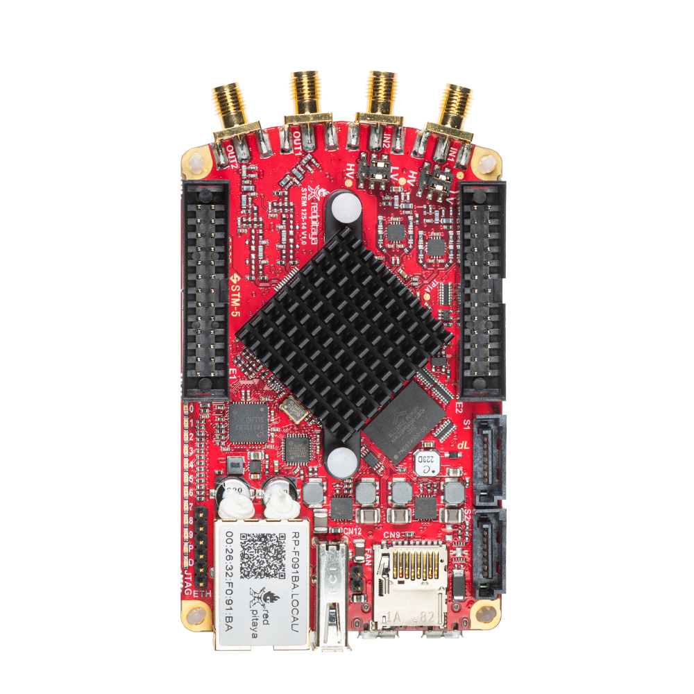

.. _top_125_14_LN:

##################
STEMlab 125-14-LN
##################

STEMlab 125-14 low noise is a STEMlab 125-14 board that is populated with additional linear analog power supplies to reduce RF output noise and consequently increase ENOB.

To find out more about the performance of the STEMlab 125-14 with DC analog power supplies, we suggest you refer to Leonhard Neuhaus’s blog.

- |Red Pitaya DAC performance|

.. |Red Pitaya DAC performance| raw:: html

    <a href="https://ln1985blog.wordpress.com/2016/02/07/red-pitaya-dac-performance/" target="_blank">Red Pitaya DAC performance</a>

Pinout
=========

.. figure:: ../125-14/img/Red_Pitaya_pinout.jpg
    :width: 700

Technical specifications
=========================

.. table::
    :widths: 40 40

    +------------------------------------+------------------------------------+
    | **Basic**                                                               |
    +====================================+====================================+
    | Processor                          | DUAL CORE ARM CORTEX A9            |
    +------------------------------------+------------------------------------+
    | FPGA                               | FPGA Xilinx Zynq 7010 SOC          |
    +------------------------------------+------------------------------------+
    | RAM                                | 512 MB (4 Gb)                      |
    +------------------------------------+------------------------------------+
    | System memory                      | Micro SD up to 32 GB               |
    +------------------------------------+------------------------------------+
    | Console connection                 | Micro USB                          |
    +------------------------------------+------------------------------------+
    | Power connector                    | Micro USB                          |
    |                                    |                                    |
    +------------------------------------+------------------------------------+
    | Power consumption                  | 5 V, 2 A max                       |
    +------------------------------------+------------------------------------+

|

.. table::
    :widths: 40 40

    +------------------------------------+------------------------------------+
    | **Connectivity**                                                        |
    +====================================+====================================+
    | Ethernet                           | 1 Gbit                             |
    +------------------------------------+------------------------------------+
    | USB                                | USB 2.0                            |
    +------------------------------------+------------------------------------+
    | Wi-Fi                              | requires Wi-Fi dongle              |
    +------------------------------------+------------------------------------+

|

.. table::
    :widths: 40 40

    +------------------------------------+------------------------------------+
    | **RF inputs**                                                           |
    +====================================+====================================+
    | RF input channels                  | 2                                  |
    +------------------------------------+------------------------------------+
    | Sample rate                        | 125 MS/s                           |
    +------------------------------------+------------------------------------+
    | ADC resolution                     | 14 bit                             |
    +------------------------------------+------------------------------------+
    | Input impedance                    | 1 MΩ / 10 pF                       |
    +------------------------------------+------------------------------------+
    | Full scale voltage range           | ±1 V (LV) and ±20 V (HV)           |
    +------------------------------------+------------------------------------+
    | Input coupling                     | DC                                 |
    +------------------------------------+------------------------------------+
    | | **Absolute max. Input**          | | **LV +-6 V**                     |
    | | **voltage range**                | | **HV +-30 V**                    |
    +------------------------------------+------------------------------------+
    | Input ESD protection               | Yes                                |
    +------------------------------------+------------------------------------+
    | Overload protection                | Protection diodes                  |
    +------------------------------------+------------------------------------+
    | Bandwidth                          | DC - 60 MHz                        |
    +------------------------------------+------------------------------------+

|

.. table::
    :widths: 40 40

    +------------------------------------+------------------------------------+
    | **RF outputs**                                                          |
    +====================================+====================================+
    | RF output channels                 | 2                                  |
    +------------------------------------+------------------------------------+
    | Sample rate                        | 125 MS/s                           |
    +------------------------------------+------------------------------------+
    | DAC resolution                     | 14 bit                             |
    +------------------------------------+------------------------------------+
    | Load impedance                     | 50 Ω                               |
    +------------------------------------+------------------------------------+
    | Voltage range                      | ±1 V                               |
    |                                    |                                    |
    +------------------------------------+------------------------------------+
    | Short circuit protection           | Yes                                |
    |                                    |                                    |
    +------------------------------------+------------------------------------+
    | Connector type                     | SMA                                |
    +------------------------------------+------------------------------------+
    | Output slew rate                   | 2 V / 10 ns                        |
    +------------------------------------+------------------------------------+
    | Bandwidth                          | DC - 50 MHz                        |
    +------------------------------------+------------------------------------+

|

.. table::
    :widths: 40 40

    +------------------------------------+------------------------------------+
    | **Extension connector**                                                 | 
    +====================================+====================================+
    | Digital IOs                        | 16                                 |
    +------------------------------------+------------------------------------+
    | Digital voltage levels             | 3.3 V                              |
    +------------------------------------+------------------------------------+
    | Analog inputs                      | 4                                  |
    +------------------------------------+------------------------------------+
    | Analog inputs voltage range        | 0 - 3.5 V                          |
    +------------------------------------+------------------------------------+
    | Analog input resolution            | 12 bit                             |
    +------------------------------------+------------------------------------+
    | Analog input sample rate           | 100 kS/s                           |
    +------------------------------------+------------------------------------+
    | Analog outputs                     | 4                                  |
    +------------------------------------+------------------------------------+
    | Analog outputs voltage range       | 0 - 1.8 V                          |
    +------------------------------------+------------------------------------+
    | Analog output resolution           | 8 bit                              |
    +------------------------------------+------------------------------------+
    | Analog output sample rate          | ≲ 3.2 MS/s                         |
    +------------------------------------+------------------------------------+
    | Analog output bandwidth            | ≈ 160 kHz                          |
    +------------------------------------+------------------------------------+
    | Communication interfaces           | I2C, SPI, UART, CAN                |
    +------------------------------------+------------------------------------+
    | Available voltages                 | +5 V, +3.3 V, -4 V                 |
    +------------------------------------+------------------------------------+
    | External ADC clock                 |  Yes                               |
    +------------------------------------+------------------------------------+

.. table::
    :widths: 40 40

    +------------------------------------+------------------------------------+
    | **Synchronisation**                                                     |
    +====================================+====================================+
    | External trigger input             | Through E1 ext. connector (DIO0_P) |
    +------------------------------------+------------------------------------+
    | External trigger input impedance   | High-Z (digital input)             |
    |                                    |                                    |
    +------------------------------------+------------------------------------+
    | Trigger output [#f1]_              | Through E1 ext. connector (DIO0_N) |
    +------------------------------------+------------------------------------+
    | Daisy chain connection             | Over SATA connection               |
    |                                    | (up to 500 Mbps)                   |
    +------------------------------------+------------------------------------+
    | Ref. clock input                   | N/A                                |
    +------------------------------------+------------------------------------+

.. rubric:: Footnotes

.. [#f1]  See the :ref:`Click Shield synchronisation section <click_shield>` and :ref:`Click Shield synchronisation example <click_shield_sync_exam1>`.

.. note::
    
    For more information, please refer to the :ref:`Product comparison table <rp-board-comp>`.

Schematics
===========

- `User-DOC_STEMlab_125-14_V1.1_STEMlab 125-14 LN.PDF <https://downloads.redpitaya.com/doc/User-DOC_STEMlab_125-14_V1.1%28STEMlab%20125-14%20LN%29.PDF>`_

.. note::

    FULL HW schematics for the Red Pitaya board are not available. Red Pitaya has open-source code but not open hardware schematics. Nonetheless, DEVELOPMENT schematics are available. This schematic will give you information about HW configuration, FPGA pin connections, and similar.

Mechanical Specifications and 3D Models
=========================================

- `Red_Pitaya_3Dmodel_v1.0.zip <https://downloads.redpitaya.com/doc/Red_Pitaya_3Dmodel_v1.0.zip>`_

Other specifications
=====================

For all other specifications please refer to standard :ref:`STEMlab 125-14 specs <top_125_14>`.

