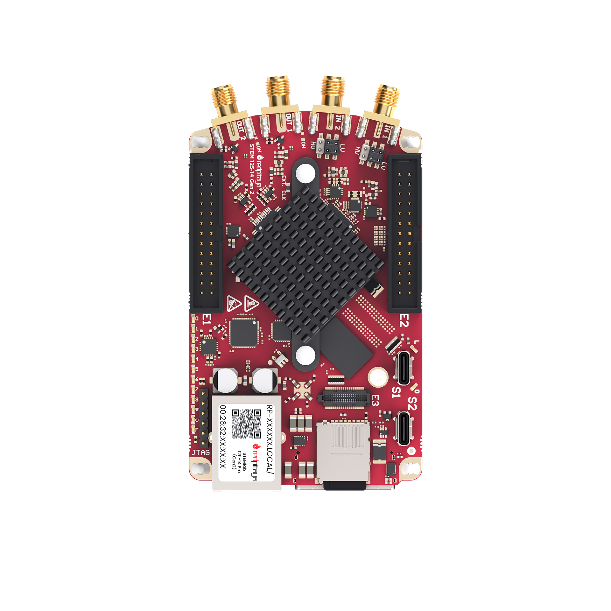

.. _top_125_14_pro_gen2:

#########################
STEMlab 125-14 PRO Gen 2
#########################

|

.. contents:: Table of Contents
    :local:
    :depth: 1
    :backlinks: top

|

Overview
========

The STEMlab 125-14 PRO Gen 2 is a high-performance, versatile, and compact measurement and control platform designed for a wide range of applications in electronics, 
signal processing, and embedded systems development. It features a dual-core ARM Cortex-A9 processor, an FPGA AMD (Xilinx) Zynq 7010 SoC, and high-speed ADCs and DACs, 
making it suitable for tasks such as data acquisition, signal generation, and real-time processing.

|

Features
========

* Improved Gen 2 frontend architecture
* 14-bit, 125 MS/s ADC and DAC
* Dual-core ARM Cortex-A9 processor
* FPGA AMD (Xilinx) Zynq 7010 SoC
* 512 MB RAM
* 16 digital I/Os, 4 analog inputs, 4 analog outputs
* Multiple communication interfaces: I2C, SPI, UART, CAN
* USB-C connectivity for power and console
* External clock input support
* E3 connector for external QSPI/eMMC storage, power and watchdog control.

|

Quick Reference
===============

.. table::
    :widths: 40 60

    +----------------------------+--------------------------------------------------+
    | **Category**               | **Key Specifications**                           |
    +============================+==================================================+
    | ADC                        | 2 channels, 14-bit, 125 MS/s, DC-50 MHz          |
    +----------------------------+--------------------------------------------------+
    | DAC                        | 2 channels, 14-bit, 125 MS/s, DC-50 MHz          |
    +----------------------------+--------------------------------------------------+
    | Processor                  | Dual-core ARM Cortex-A9                          |
    +----------------------------+--------------------------------------------------+
    | FPGA                       | AMD Zynq 7010 SoC                                |
    +----------------------------+--------------------------------------------------+
    | RAM                        | 512 MB                                           |
    +----------------------------+--------------------------------------------------+
    | Digital I/O                | 16 GPIOs @ 3.3V                                  |
    +----------------------------+--------------------------------------------------+
    | Analog I/O                 | 4 inputs (12-bit), 4 outputs (8-bit)             |
    +----------------------------+--------------------------------------------------+
    | Jitter Performance         | 20 ps RMS @ 40 MHz                               |
    +----------------------------+--------------------------------------------------+
    | Connectivity               | Ethernet, USB-C, Extension connectors            |
    +----------------------------+--------------------------------------------------+
    | Special Features           | E3, External ADC clock                           |
    +----------------------------+--------------------------------------------------+

|

Board Layout & Pinout
======================

.. figure:: ../125-14_Gen2/img/RedPitaya_Gen2_pinout.png
    :alt: Red Pitaya Gen 2 pinout
    :width: 800
    :align: center

The pinout diagram shows all external connectors including RF inputs/outputs (IN1, IN2, OUT1, OUT2) and extension connectors (E1, E2).

For other external connectors like S1 and S2 synchronisation connectors, power, communication and ethernet ports please see the general Gen 2 picture below.

.. figure:: ../img/GEN2_specs.png
    :alt: Red Pitaya Gen 2 specs
    :width: 800
    :align: center

|

Technical Specifications
=========================

.. table::
    :widths: 30 30 15 15

    +------------------------------------+------------------------------------+-----------+----------------------------------+
    | **Parameter**                      | **Value**                          | **Units** | **Notes**                        |
    +====================================+====================================+===========+==================================+
    | |br|                                                                                                                   |
    | **Basic**                                                                                                              |
    +------------------------------------+------------------------------------+-----------+----------------------------------+
    | Processor                          | Dual core ARM Cortex-A9            | \-        |                                  |
    +------------------------------------+------------------------------------+-----------+----------------------------------+
    | FPGA                               | FPGA AMD (Xilinx) Zynq 7010 SoC    | \-        |                                  |
    +------------------------------------+------------------------------------+-----------+----------------------------------+
    | RAM                                | 512                                | MB        | (4 Gb)                           |
    +------------------------------------+------------------------------------+-----------+----------------------------------+
    | Core clock frequency               | 125                                | MHz       |                                  |
    +------------------------------------+------------------------------------+-----------+----------------------------------+
    | System memory                      | Micro SD up to 32 GB               | \-        |                                  |
    +------------------------------------+------------------------------------+-----------+----------------------------------+
    | Serial console connector           | USB-C                              | \-        |                                  |
    +------------------------------------+------------------------------------+-----------+----------------------------------+
    | Power connector                    | USB-C                              | \-        |                                  |
    +------------------------------------+------------------------------------+-----------+----------------------------------+
    | Power consumption                  | 5 V, 3 A                           | \-        | max                              |
    +------------------------------------+------------------------------------+-----------+----------------------------------+
    | |br|                                                                                                                   |
    | **Connectivity**                                                                                                       |
    +------------------------------------+------------------------------------+-----------+----------------------------------+
    | Ethernet                           | 1                                  | Gbit      |                                  |
    +------------------------------------+------------------------------------+-----------+----------------------------------+
    | USB                                | USB-C 2.0                          | \-        |                                  |
    +------------------------------------+------------------------------------+-----------+----------------------------------+
    | Wi-Fi                              | Requires Wi-Fi dongle              | \-        |                                  |
    +------------------------------------+------------------------------------+-----------+----------------------------------+
    | |br|                                                                                                                   |
    | **RF inputs**                                                                                                          |
    +------------------------------------+------------------------------------+-----------+----------------------------------+
    | RF input channels                  | 2                                  | \-        |                                  |
    +------------------------------------+------------------------------------+-----------+----------------------------------+
    | Sampling rate                      | 125                                | MS/s      |                                  |
    +------------------------------------+------------------------------------+-----------+----------------------------------+
    | ADC resolution                     | 14                                 | bit       |                                  |
    +------------------------------------+------------------------------------+-----------+----------------------------------+
    | Input impedance                    | 1 MΩ / 10 pF                       | \-        |                                  |
    +------------------------------------+------------------------------------+-----------+----------------------------------+
    | Full scale voltage range           | | ±1 (LV)                          | V         |                                  |
    |                                    | | ±20 (HV)                         |           |                                  |
    +------------------------------------+------------------------------------+-----------+----------------------------------+
    | Input coupling                     | DC                                 | \-        |                                  |
    +------------------------------------+------------------------------------+-----------+----------------------------------+
    | Absolute max. input voltage        | | ±6 (LV)                          | V         | DC values [#f1]_                 |
    |                                    | | ±30 (HV)                         |           |                                  |
    +------------------------------------+------------------------------------+-----------+----------------------------------+
    | Input ESD protection               | Yes                                | \-        |                                  |
    +------------------------------------+------------------------------------+-----------+----------------------------------+
    | Overload protection                | Protection diodes                  | \-        |                                  |
    +------------------------------------+------------------------------------+-----------+----------------------------------+
    | Bandwidth                          | DC - 50                            | MHz       |                                  |
    +------------------------------------+------------------------------------+-----------+----------------------------------+
    | Connector type                     | SMA                                | \-        |                                  |
    +------------------------------------+------------------------------------+-----------+----------------------------------+
    | |br|                                                                                                                   |
    | **RF outputs**                                                                                                         |
    +------------------------------------+------------------------------------+-----------+----------------------------------+
    | RF output channels                 | 2                                  | \-        |                                  |
    +------------------------------------+------------------------------------+-----------+----------------------------------+
    | Sampling rate                      | 125                                | MS/s      |                                  |
    +------------------------------------+------------------------------------+-----------+----------------------------------+
    | DAC resolution                     | 14                                 | bit       |                                  |
    +------------------------------------+------------------------------------+-----------+----------------------------------+
    | Load impedance                     | 50 Ω / Hi-Z                        | \-        |                                  |
    +------------------------------------+------------------------------------+-----------+----------------------------------+
    | Voltage range                      | | ±1 @ 50 Ω                        | V         |                                  |
    |                                    | | ±2 @ Hi-Z                        |           |                                  |
    +------------------------------------+------------------------------------+-----------+----------------------------------+
    | Short circuit protection           | Yes                                | \-        |                                  |
    +------------------------------------+------------------------------------+-----------+----------------------------------+
    | Output slew rate                   | 2 V / 10 ns                        | \-        |                                  |
    +------------------------------------+------------------------------------+-----------+----------------------------------+
    | RF output jitter @40 MHz           | 20                                 | ps        | RMS                              |
    +------------------------------------+------------------------------------+-----------+----------------------------------+
    | Bandwidth                          | DC - 50                            | MHz       |                                  |
    +------------------------------------+------------------------------------+-----------+----------------------------------+
    | Connector type                     | SMA                                | \-        |                                  |
    +------------------------------------+------------------------------------+-----------+----------------------------------+
    | |br|                                                                                                                   |
    | **Extension connectors**                                                                                               |
    +------------------------------------+------------------------------------+-----------+----------------------------------+
    | Digital GPIOs                      | 16                                 | \-        |                                  |
    +------------------------------------+------------------------------------+-----------+----------------------------------+
    | Digital voltage levels             | 3.3                                | V         |                                  |
    +------------------------------------+------------------------------------+-----------+----------------------------------+
    | High-speed diff. pairs (E3)        | N/A                                | \-        |                                  |
    +------------------------------------+------------------------------------+-----------+----------------------------------+
    | High-speed diff. pair voltage      | N/A                                | \-        |                                  |
    | levels (E3)                        |                                    |           |                                  |
    +------------------------------------+------------------------------------+-----------+----------------------------------+
    | Analog inputs                      | 4                                  | \-        |                                  |
    +------------------------------------+------------------------------------+-----------+----------------------------------+
    | Analog input voltage range         | 0 - 3.5                            | V         |                                  |
    +------------------------------------+------------------------------------+-----------+----------------------------------+
    | Analog input resolution            | 12                                 | bit       |                                  |
    +------------------------------------+------------------------------------+-----------+----------------------------------+
    | Analog input sampling rate         | 100                                | kS/s      |                                  |
    +------------------------------------+------------------------------------+-----------+----------------------------------+
    | Analog outputs                     | 4                                  | \-        |                                  |
    +------------------------------------+------------------------------------+-----------+----------------------------------+
    | Analog output voltage range        | 0 - 1.8                            | V         |                                  |
    +------------------------------------+------------------------------------+-----------+----------------------------------+
    | Analog output resolution           | 8                                  | bit       |                                  |
    +------------------------------------+------------------------------------+-----------+----------------------------------+
    | Analog output sampling rate        | ≲ 3.2                              | MS/s      |                                  |
    +------------------------------------+------------------------------------+-----------+----------------------------------+
    | Analog output bandwidth            | ≈ 120                              | kHz       |                                  |
    +------------------------------------+------------------------------------+-----------+----------------------------------+
    | Communication interfaces           | I2C, SPI, UART, CAN                | \-        |                                  |
    +------------------------------------+------------------------------------+-----------+----------------------------------+
    | Available voltages                 | ±5, +3.3                           | V         |                                  |
    +------------------------------------+------------------------------------+-----------+----------------------------------+
    | External ADC clock                 | Yes                                | \-        |                                  |
    +------------------------------------+------------------------------------+-----------+----------------------------------+
    | E3 connector                       | Yes                                | \-        |                                  |
    +------------------------------------+------------------------------------+-----------+----------------------------------+
    | |br|                                                                                                                   |
    | **Synchronisation**                                                                                                    |
    +------------------------------------+------------------------------------+-----------+----------------------------------+
    | External trigger input             | DIO0_P                             | \-        | E1 connector                     |
    +------------------------------------+------------------------------------+-----------+----------------------------------+
    | External trigger input impedance   | Hi-Z                               | \-        | Digital input                    |
    +------------------------------------+------------------------------------+-----------+----------------------------------+
    | Trigger output                     | DIO0_N                             | \-        | E1 connector [#f2]_              |
    +------------------------------------+------------------------------------+-----------+----------------------------------+
    | Daisy chain connectors (S1 & S2)   | Yes                                | \-        |                                  |
    +------------------------------------+------------------------------------+-----------+----------------------------------+
    | Daisy chain connectors speed       | up to 500                          | Mb/s      |                                  |
    +------------------------------------+------------------------------------+-----------+----------------------------------+
    | Daisy chain connectors type        | USB-C                              | \-        | Not standard USB-C [#f3]_        |
    +------------------------------------+------------------------------------+-----------+----------------------------------+
    | Ref. clock input                   | N/A                                | \-        |                                  |
    +------------------------------------+------------------------------------+-----------+----------------------------------+
    | |br|                                                                                                                   |
    | **Boot options**                                                                                                       |
    +------------------------------------+------------------------------------+-----------+----------------------------------+
    | SD card                            | Yes                                | \-        |                                  |
    +------------------------------------+------------------------------------+-----------+----------------------------------+
    | QSPI                               | E3 add-on module                   | \-        |                                  |
    +------------------------------------+------------------------------------+-----------+----------------------------------+
    | eMMC                               | E3 add-on module                   | \-        |                                  |
    +------------------------------------+------------------------------------+-----------+----------------------------------+
    | |br|                                                                                                                   |
    | **Environmental Specifications**                                                                                       |
    +------------------------------------+------------------------------------+-----------+----------------------------------+
    | Operating Temperature Range        | 0 to 55                            | ℃         | With default heatsink            |
    +------------------------------------+------------------------------------+-----------+----------------------------------+
    | Operating Humidity Range           | < 90%                              | RH        |                                  |
    +------------------------------------+------------------------------------+-----------+----------------------------------+
    | Automatic Shutdown Temperature     | 85                                 | ℃         |                                  |
    +------------------------------------+------------------------------------+-----------+----------------------------------+
    | |br|                                                                                                                   |
    | **Dimensions**                                                                                                         |
    +------------------------------------+------------------------------------+-----------+----------------------------------+
    | Size (L x W x H)                   | 106.8 x 60.0 x 17.9                | mm        | See `Schematics`_ for details    |
    +------------------------------------+------------------------------------+-----------+----------------------------------+

.. warning::

    **Maximum Input Voltage**
    
    * **LV mode:** ±6 V absolute maximum
    * **HV mode:** ±30 V absolute maximum
    
    Exceeding these values may damage the board permanently.

.. seealso::

    For more detailed information, please refer to the |Gen 2 comparison table|.

|

Performance & Measurements
============================
    
You can find the measurements of the fast analog frontend here:

* :ref:`Gen 2 - STEMlab 125-14 Gen 2 <measurements_gen2>`.

|

.. _schematics_125_14_pro_gen2:

Schematics & 3D Models
========================

Schematics
----------

* :download:`Schematics_STEM_125-14_PRO_Gen2_V2r0_RevA.pdf <https://downloads.redpitaya.com/doc/Schematics/Schematics_STEM_125-14_PRO_Gen2_V2r0_RevA.pdf>`.

.. note::

    Full hardware schematics for the Red Pitaya board are not available. Red Pitaya has open-source code but not open hardware schematics. Nonetheless, development schematics are available. This schematic will give you information about hardware configuration, FPGA pin connections, and similar.

Mechanical Specifications & 3D Models
--------------------------------------

* STEP :download:`3D_STEM_125-14-Pro-Gen2.zip <https://downloads.redpitaya.com/doc/3D_models/3D_STEM_125-14-Pro-Gen2.zip>`.

|

Hardware Details
==================

Components
----------

The STEMlab 125-14 PRO Gen 2 uses high-performance analog components from Linear Technology (now Analog Devices) for the signal chain.

**ADC:** Analog Devices `LTC2145-14 <https://www.analog.com/en/products/ltc2145-14.html>`_

    * Dual 14-bit, 125 MS/s ADC
    * Low power consumption
    * High dynamic range

**DAC:** Analog Devices `AD9767 <https://www.analog.com/en/products/AD9767.html>`_

    * Dual 14-bit, 125 MS/s DAC
    * High SFDR performance
    * Low power operation

**FPGA:** AMD (Xilinx) `Zynq 7010 <https://docs.amd.com/v/u/en-US/ds190-Zynq-7000-Overview>`_

    * Dual-core ARM Cortex-A9 @ 667 MHz
    * Programmable logic fabric
    * Integrated peripherals and memory controllers

**Oscillator:** `SG3225VAN <https://support.epson.biz/td/api/doc_check.php?dl=brief_SG3225VAN&lang=en>`_

    * High-precision 125 MHz reference oscillator
    * Low jitter performance

|

Extension Connectors & Interfaces
===================================

Overview
---------

The STEMlab 125-14 PRO Gen 2 board features the following connectors and interfaces:

* **E1 and E2 connectors:** Primary expansion connectors with digital I/O, analog I/O, and communication interfaces. These connectors allow users to interface with additional hardware, sensors, or peripherals, enhancing the board's capabilities.
* **E3 connector:** Secondary expansion connector designed for high-speed differential pairs, QSPI/eMMC storage, power management, and watchdog control. This connector is ideal for advanced applications requiring additional storage or specialized interfaces.
* **S1 and S2 connectors:** Daisy-chain connectors for synchronizing multiple Red Pitaya boards. These connectors enable clock and trigger synchronization between boards.

|

Connector Physical Specifications
----------------------------------

**E1 and E2 Extension Connectors:**

* Connector type: `2 x 13 pins IDC 2.54 mm pitch <https://www.digikey.com/en/products/detail/adam-tech/BHR-26-VUA/9832284>`_
* Pin count: 26 pins each (2x13 configuration)
* Pitch: 2.54 mm (0.1")

**E3 Extension Connector:**

* Connector type: `2 x 20 pins Micro Blade & Beam 0.50 mm pitch <https://www.samtec.com/products/ss5-20-3.00-l-d-k-tr#compliance>`_.
* Pin count: 40 pins (2x20 configuration)
* Pitch: 0.50 mm

**Mating Connectors:**

.. note::

    When looking for mating connectors for custom Red Pitaya shields, `double height elevated sockets <https://www.digikey.com/en/products/detail/samtec-inc/ESW-113-33-T-D/6693225>`_ are needed to clear the heatsink and ethernet connector on the board.
    Any connectors with *insulation height* of 0.635" (16.13mm) or greater will work.

|

E1 Connector - Digital I/O & CAN
----------------------------------

.. include:: ../_specs_common/E1_connector_7010.inc

|

E2 Connector - Analog & Communication
--------------------------------------

.. include:: ../_specs_common/E2_connector.inc

|

E3 Connector - QSPI/eMMC & Power Control
-----------------------------------------

.. include:: ../_specs_common/E3_connector_7010.inc

|

Auxiliary Analog Inputs & Outputs
------------------------------------

.. include:: ../_specs_common/slow_analog_io.inc

|

General Purpose Digital I/O Channels
--------------------------------------

.. table::
    :widths: 30 30 15 15

    +------------------------------------+------------------------------------+-----------+------------------------+
    | **Parameter**                      | **Value**                          | **Units** | **Notes**              |
    +====================================+====================================+===========+========================+
    | Number of GPIOs                    | 16                                 | \-        |                        |
    +------------------------------------+------------------------------------+-----------+------------------------+
    | Digital voltage level              | 3.3                                | V         |                        |
    +------------------------------------+------------------------------------+-----------+------------------------+
    | Abs. min. voltage                  | -0.40                              | V         |                        |
    +------------------------------------+------------------------------------+-----------+------------------------+
    | Abs. max. voltage                  | 3.3 + 0.55                         | V         |                        |
    +------------------------------------+------------------------------------+-----------+------------------------+
    | Current limitation                 | < 8                                | mA        | Drive strength         |
    +------------------------------------+------------------------------------+-----------+------------------------+
    | Direction                          | Configurable                       | \-        |                        |
    +------------------------------------+------------------------------------+-----------+------------------------+
    | Time resolution                    | 8 ns                               | ns        | (1/125 MHz)            |
    +------------------------------------+------------------------------------+-----------+------------------------+
    | Connector location                 | Extension connector |E1|           | \-        |                        |
    +------------------------------------+------------------------------------+-----------+------------------------+

|

Synchronisation Connectors (S1 & S2)
-------------------------------------

.. include:: ../_specs_common/Sync_connectors.inc
    
|

Advanced Features
==================

Extension Connector Power
--------------------------

.. include:: ../_specs_common/power_supply.inc

|

External ADC Clock
-------------------

.. include:: ../_specs_common/ext_adc_clk.inc

|

External Booting Options
--------------------------

.. include:: ../_specs_common/Ext_boot_options.inc

|

Additional Resources
====================

For additional specifications and measurements, please refer to:

* |Gen 2 hardware specs| - Common Gen 2 specifications
* |Gen 2 comparison table| - Comparison across all Red Pitaya Gen 2 models
* :ref:`E3 module specifications <E3_HW>` - Detailed E3 module specifications

|

Legal & Disclaimers
===================

.. include:: ../_specs_common/disclaimer.inc

|

.. rubric:: Footnotes

.. [#f1] The absolute maximum input voltage values are for frequencies below 1 kHz. For higher frequencies, please use the input voltage range specifications as **Absolute maximum**.
.. [#f2] See the :ref:`Click Shield synchronisation section <click_shield>` and :ref:`Click Shield synchronisation examples <examples_multiboard_sync>` for trigger output configuration.
.. [#f3] Not compatible with USB-C standard (DC-coupled). Use only for daisy-chaining multiple Red Pitaya boards.
.. [#f4] The external ADC clock goes first to the `NB6L72`_ clock selector chip, then passes through the ADC to finally reach the FPGA pins.
.. [#f5] For exact voltage levels, please refer to the `NB6L72`_ datasheet.
.. [#f6] Negative logic in the FPGA.
.. [#f8] The default software enables sampling at a CPU-dependent speed. To acquire data at a 100 kS/s rate, additional FPGA processing must be implemented.
.. [#f9] The output is passed through a first-order low-pass filter. Should additional filtering be required, this can be applied externally in line with the specific requirements of the application.  
.. [#f10] VBUS connectors are connected together on the board. They are not connected to the board power supply.
.. [#f11] On the S1 connector, the CC1 pin is connected to the Orient LED and to the S1_ORIENT FPGA pin (via resistor divider to reduce the voltage levels to 2V5). CC1 and CC2 pins are connected to an XOR gate which determines the state of the **Link LED**. The output of the XOR gate is also connected to the S1_LINK FPGA pin (via resistor divider to reduce the voltage levels to 2V5).
.. [#f12] On the S2 connector, the CC1 pin is protected with a Zener diode to 3V3, but is not connected to the FPGA. CC2 pin is not connected.
.. [#f13] Application specific. The output current is shared between the extension module and the USB devices, and can be higher if other peripheral units are not in use.

|

.. substitutions

.. |E1| replace:: :ref:`E1 connector <E1_gen2>`
.. |E2| replace:: :ref:`E2 connector <E2_gen2>`
.. |E3| replace:: :ref:`E3 connector <E3_gen2>`
.. |Gen 2 hardware specs| replace:: :ref:`Gen 2 hardware specifications <hw_specs_gen2>`
.. |Gen 2 comparison table| replace:: :ref:`Gen 2 board comparison table <rp-board-comp-gen2>`
.. |STEMlab 125-14 PRO Gen 2| replace:: :ref:`STEMlab 125-14 PRO Gen 2 <top_125_14_pro_gen2>`
.. |STEMlab 125-14 PRO Z7020 Gen 2| replace:: :ref:`STEMlab 125-14 PRO Z7020 Gen 2 <top_125_14_pro_z7020_gen2>`
.. _NB6L72: https://www.onsemi.com/pdf/datasheet/nb6l72-d.pdf
