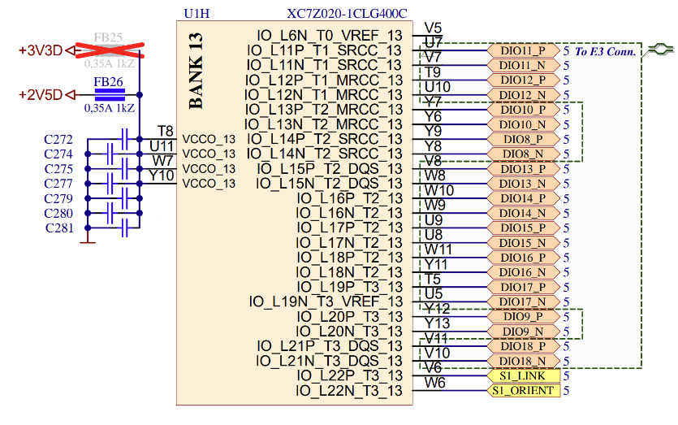

.. _faq_gen2:

FAQ Gen 2
#####################

Here are some frequently asked questions about the Red Pitaya Gen 2 boards.

.. contents:: Questions
    :local:
    :backlinks: top

Fast analog inputs and outputs
=================================

Where can I find the measurements for the fast analog frontend?
----------------------------------------------------------------

The Gen 2 measurements are located in the Fast Analog inputs and outputs section in the :ref:`Gen 2 hardware specifications <hw_specs_gen2>`.

.. TODO How to bypass input filter on Gen 2 boards?

How can I make sure Red Pitaya outputs are at 0 V when Red Pitaya is booting?
------------------------------------------------------------------------------

The output signal on Gen 2 boards is disabled by hardware until the FPGA image has finished loading. Afterwards, how the DAC is configured (initialised) in the FPGA image determines the output signal. To prevent output voltage spikes, the DAC should be initialised to 0 V.

As the official Red Pitaya OS image needs to identify the type of Red Pitaya board first, the DAC is not initialised immediately. Consequently, there will be a spike at the outputs after the FPGA image has loaded, until the DAC is initialised on official Red Pitaya OS images.

External clock and synchronisation
===================================

Where can I find the external clock specifications?
-----------------------------------------------------

The external ADC clock should comply with `NB6L72`_ input specifications. The chip is powered by 3V3.

How to switch from internal to external clock?
------------------------------------------------

The main FPGA CLK signal on |STEMlab 125-14 Pro Gen 2| and |STEMlab 125-14 Pro Z7020 Gen 2| boards can be supplied from an external source through the **Ext. ADC Clk±** ports.

Both the internal oscillator clock and the external clock signal are connected to the `NB6L72`_ Differential Crosspoint Switch.
The **CLK_SEL** pin is used to select the clock source:

* 3V3 (logic high) or unconnected - **Internal clock**.
* GND (logic low) - **External clock**.

The clock signal then travelles from the output of the NB6L72 through the ADC to the FPGA.

**External clock specifications**
The external ADC clock should comply with `NB6L72`_ input specifications. The chip is powered by 3V3.

.. note::

    When synchronising multiple Red Pitaya *Pro Gen 2* boards, please keep in mind that:

    * :ref:`Click Shield synchronisation <click_shield>` works out-of-the-box.
    * :ref:`X-channel synchronisation <x-ch_streaming>` requires a hardware modification as secondary boards differ from the primary board.

.. note::

    Switching between internal and external clock is only available on the Gen 2 Pro board models (STEMlab 125-14 Pro Gen 2, STEMlab 125-14 Pro Z7020 Gen 2).

How to synchronise Gen 2 boards (multichanneling)?
---------------------------------------------------

The Gen 2 boards can be syncrhonised in the same way as Gen 1 boards:

* :ref:`Click Shield synchronisation <click_shield>` works out-of-the-box.
* :ref:`X-channel synchronisation <x-ch_streaming>` requires a hardware modification as secondary boards differ from the primary board. Also USB-C cables are used for synchronisation instead of SATA cables.

How to synchronise Gen 2 boards over USB-C daisy chain connection?
--------------------------------------------------------------------

Please check the :ref:`X-channel synchronisation <x-ch_streaming>` section for more information.

.. TODO What cable is recommended?

E3 connector and QSPI eMMC module
=====================================

Where can I find the E3 connector pinout?
------------------------------------------------

Check the :ref:`E3 connector pinout <E3_gen2>` section for more information.

.. TODO Are there any timing requirements for the high-speed differential pairs?

Are the fast differential pair votage levels configurable? What should I watch out for?
----------------------------------------------------------------------------------------

The fast differential pair voltage levels are determined by the power supply voltage on Bank 13 of Zynq 7020 FPGA. By default, the votlage is set to 2.5 V, but can be configured between 2.5 V and 3.3 V by changing the position of the ferrite bead from position FB26 to position FB25 on the PCB.

To utilise the full speed of the fast differential pairs, Bank 13 voltage should be set to 2.5 V.

    Bank 13 of Zynq 7020 FPGA

+-----------------------------+-----------------------------+-----------------------------+
| List of Bank 13 pins        | Connector                   | Type                        |
+=============================+=============================+=============================+
| DIO8_P, DIO8_N              | E1                          | Input/Output                |
+-----------------------------+-----------------------------+-----------------------------+
| DIO9_P, DIO9_N              | E1                          | Input/Output                |
+-----------------------------+-----------------------------+-----------------------------+
| DIO10_P, DIO10_N            | E1                          | Input/Output                |
+-----------------------------+-----------------------------+-----------------------------+
| DIO11_P, DIO11_N            | E3                          | Input/Output                |
+-----------------------------+-----------------------------+-----------------------------+
| DIO12_P, DIO12_N            | E3                          | Input/Output                |
+-----------------------------+-----------------------------+-----------------------------+
| DIO13_P, DIO13_N            | E3                          | Input/Output                |
+-----------------------------+-----------------------------+-----------------------------+
| DIO14_P, DIO14_N            | E3                          | Input/Output                |
+-----------------------------+-----------------------------+-----------------------------+
| DIO15_P, DIO15_N            | E3                          | Input/Output                |
+-----------------------------+-----------------------------+-----------------------------+
| DIO16_P, DIO16_N            | E3                          | Input/Output                |
+-----------------------------+-----------------------------+-----------------------------+
| DIO17_P, DIO17_N            | E3                          | Input/Output                |
+-----------------------------+-----------------------------+-----------------------------+
| DIO18_P, DIO18_N            | E3                          | Input/Output                |
+-----------------------------+-----------------------------+-----------------------------+
| S1_LINK                     | S1 Link LED                 | Input                       |
+-----------------------------+-----------------------------+-----------------------------+
| S1_ORIENT                   | S1 Orientation LED          | Input                       |
+-----------------------------+-----------------------------+-----------------------------+

.. note::

    Changing the power supply of Bank 13 affects the digital voltage levels of all the pins connected to it. This includes not only the fast differential pairs, but also the DIO10-DIO8 GPIO pins on the E1 extension connector.

Where can I find the documentation for the QSPI eMMC (E3) module?
------------------------------------------------------------------

Check the :ref:`QSPI eMMC board <QSPI_eMMC_board>` section for more information.

My Gen 2 board does not boot with the QSPI eMMC module connected. What should I do?
------------------------------------------------------------------------------------

When the QSPI eMMC module is connected to the Red Pitaya board, Red Pitaya will not boot automatically. The **P-ON** button on the QSPI eMMC module should be pressed to power up the Red Pitaya board.

Check the :ref:`QSPI eMMC board <QSPI_eMMC_board>` section for more information.

.. TODO QSPI and eMMC booting instructions

Power supply
==============

.. TODO How can I disable Power Delivery negotiation when using a USB-C power supply?

.. There is an unpopulated resistor on the PCB that can disable the Power Delivery negotiation. Connecting the two pads with a solder bridge will disable the Power Delivery negotiation. The conection is located on the bottom side of the PCB, near the USB-C connector.

Other
========

.. TODO Gen 2 3D board models

Where can I find Gen 2 board schematics?
------------------------------------------------

Board development schematics are available under each board model hardware section. For example, the |STEMlab 125-14 Pro Gen 2| schematics are avaialable under |STEMlab 125-14 Pro Gen 2| specifications.

.. substitutions

.. |STEMlab 125-14 Pro Gen 2| replace:: :ref:`STEMlab 125-14 Pro Gen 2 <top_125_14_pro_gen2>`
.. |STEMlab 125-14 Pro Z7020 Gen 2| replace:: :ref:`STEMlab 125-14 Pro Z7020 Gen 2 <top_125_14_pro_z7020_gen2>`
.. _NB6L72: https://www.onsemi.com/pdf/datasheet/nb6l72-d.pdf