.. _measurements_gen2:

#######################
Fast analog IO (Gen 2)
#######################

.. contents:: Table of Contents
    :local:
    :depth: 2
    :backlinks: top

|

.. warning::

    All inputs and outputs available through SMA connectors share a common ground connected to the power supply ground.

*************************
Analog inputs
*************************

The measurements presented in this section have been perfomed on the *STEMlab 125-14 PRO Z7020 Gen 2* board. All STEMlab 125-14 Gen 2 boards have the same analog input specifications.

Specifications
=======================

.. table::
    :widths: 30 30 15 15

    +------------------------------------+------------------------------------+-----------+----------------------------------+
    | **Parameter**                      | **Value**                          | **Units** | **Notes**                        |
    +====================================+====================================+===========+==================================+
    | |br|                                                                                                                   |
    | **RF inputs**                                                                                                          |
    +------------------------------------+------------------------------------+-----------+----------------------------------+
    | RF input channels                  | 2                                  | \-        |                                  |
    +------------------------------------+------------------------------------+-----------+----------------------------------+
    | Sampling rate                      | 125                                | MS/s      |                                  |
    +------------------------------------+------------------------------------+-----------+----------------------------------+
    | ADC resolution                     | 14                                 | bit       |                                  |
    +------------------------------------+------------------------------------+-----------+----------------------------------+
    | Input impedance                    | 1 MΩ (10 pF)                       | \-        |                                  |
    +------------------------------------+------------------------------------+-----------+----------------------------------+
    | Full scale voltage range           | | ±1 (LV)                          | V         |                                  |
    |                                    | | ±20 (HV)                         |           |                                  |
    +------------------------------------+------------------------------------+-----------+----------------------------------+
    | Input coupling                     | DC                                 | \-        |                                  |
    +------------------------------------+------------------------------------+-----------+----------------------------------+
    | Absolute max. input voltage        | | ±6 (LV)                          | V         | DC values [#f1]_                 |
    |                                    | | ±30 (HV)                         |           |                                  |
    +------------------------------------+------------------------------------+-----------+----------------------------------+
    | Input ESD protection               | Yes                                | \-        |                                  |
    +------------------------------------+------------------------------------+-----------+----------------------------------+
    | Overload protection                | Protection diodes                  | \-        | (within input voltage ratings)   |
    +------------------------------------+------------------------------------+-----------+----------------------------------+
    | Bandwidth                          | DC - 50                            | MHz       | Typical                          |
    +------------------------------------+------------------------------------+-----------+----------------------------------+
    | Connector type                     | SMA                                | \-        |                                  |
    +------------------------------------+------------------------------------+-----------+----------------------------------+

.. note::
    
    Overload protection applies to low frequency signals. For input signals containing frequency components above 1 kHz, where capacitor divider comes into play, the full scale value defines the maximum permissible input voltage.

.. note::
    
    The SMA connectors on the cables connected to Red Pitaya must comply with the MILC39012 standard. The centre pin must be of suitable length, otherwise the SMA connector installed in Red Pitaya will mechanically damage the SMA connector.
    The centre pin of the SMA connector on Red Pitaya will lose contact with the board and the board will not be repairable due to the mechanical damage (separation of the pad from the board).

|

Hardware Details
=======================

Jumpers
----------

Voltage ranges are set by input jumpers, as shown here:

.. figure:: img/jumpers/Jumper_settings.png 

Gain can be adjusted independently for both input channels. The adjustment is done by bridging the jumpers located behind the corresponding input SMA connector.
     
.. figure:: img/jumpers/Jumper_settings_photo.png

    Jumper setting
    
    - The left setting (LV) adjusts to ±1 V full scale.
    - The right setting (HV) adjusts to ±20 V full scale.

.. warning::
    
    Please note that jumper settings are limited to the described positions. Any other configuration or use of different jumper types may damage the product and void the warranty.

|

Jumper orientation
----------------------

The position of the jumpers can affect the measurements taken by the Red Pitaya. The jumpers are internally connected to a small metal plate which acts as a capacitor and affects the overall capacitance which in turn affects the input impedance.
If the jumpers are moved from an incorrect to a correct position, calibration is strongly recommended as the input capacitance depends on jumper settings and may vary between positions.

1. The position of the jumper bumps must be as shown in the diagram. Due to the non-symmetrical nature of the jumpers and their latches, we advise installing them with the latch on the outer side to avoid any issues with difficult-to-remove jumpers.

    .. figure:: img/jumpers/Jumper_position_Note.png

2. Once installed, the jumpers should be positioned so that the metal part is not visible. Please refer to the example of the STEMlab 125-14 4-Input in the pictures below for guidance.

    .. figure:: img/jumpers/Jumper_position_4IN_0.png
        :align: center
        :width: 700 px

    .. figure:: img/jumpers/Jumper_position_4IN_1.png
        :align: center
        :width: 700 px

Incorrect jumper placement can cause the front part of the acquired square wave signals to be overshot or undercut. This is shown in the figure below.

.. figure:: img/jumpers/Jumper_position_wrong_signal.jpg
    :width: 800

    As can be seen, **if the jumpers are not set correctly, the step response will be under-compensated.**.

With the jumper pins correctly placed, the same waveform looks much better.

.. figure:: img/jumpers/Jumper_position_correct_signal.jpg
    :width: 800

|

Input stage schematics
-----------------------

The input stage consists of a voltage divider, buffer amplifier, anti-aliasing filter, and ADC driver.

.. figure:: img/schematics/Fast_analog_input_schematics.png
    :width: 800

For more information, please refer to each board's hardware documentation.

|

Input coupling
------------------

Fast analog inputs are **DC coupled**.

.. TODO add input impedance measurements

|

Performance Measurements
==========================

Input bandwidth
------------------

+------------------------------------+------------------------------------+
| Jumper settings                    | Bandwidth                          |
+====================================+====================================+
| LV                                 | 52.02 MHz (-3 dB)                  |
+------------------------------------+------------------------------------+
| HV                                 | 52.77 MHz (-3 dB)                  |
+------------------------------------+------------------------------------+

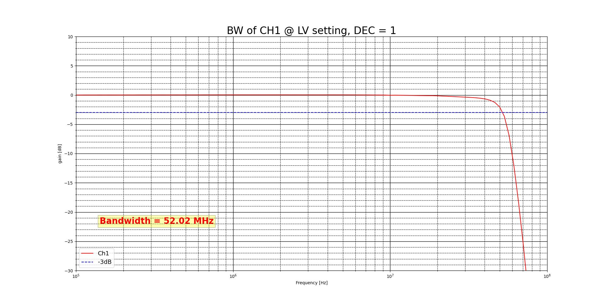

Bandwidth measurement of the input channel 1 in LV mode.

.. figure:: img/measurements/RF_inputs/Bandwidth/IN1_HV_DEC1.jpg
    :width: 800

Bandwidth measurement of the input channel 1 in HV mode.

|

Input bandwidth flatness
--------------------------

The bandwidth flatness is <0.05 dB from DC to full (-3 dB) bandwidth on LV gain setting.

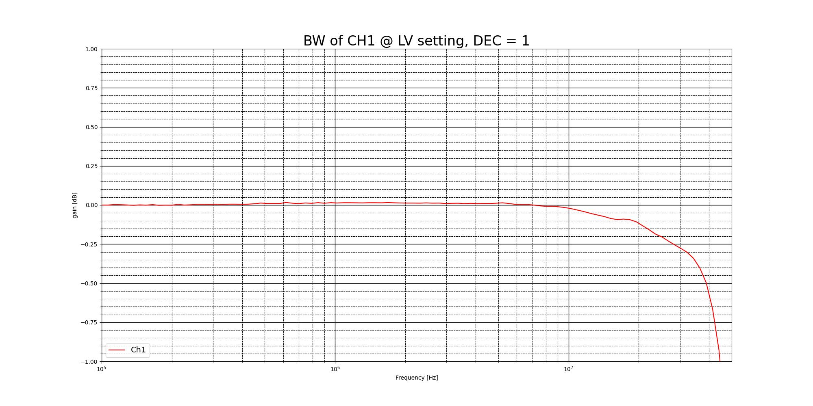

Bandwidth flatness measurement of the input channel 1 in LV mode.

|

Input crosstalk
------------------

Crosstalk measurements were performed between input channels 1 and 2 for both LV and HV modes.

+------------------------------------+------------------+------------------+------------------+------------------+
|                                    | **Up to 30 MHz**                    | **Above 30 MHz**                    |
+------------------------------------+------------------+------------------+------------------+------------------+
| |br|                               | |br|             | |br|             | |br|             | |br|             |
| **IN1 \ IN2**                      | **LV**           | **HV**           | **LV**           | **HV**           |
+------------------------------------+------------------+------------------+------------------+------------------+
| **LV**                             | >70 dB           | >80 dB           | >50 dB           | >50 dB           |
+------------------------------------+------------------+------------------+------------------+------------------+
| **HV**                             | 40 dB            | 55 dB            | >35 dB           | >40 dB           |
+------------------------------------+------------------+------------------+------------------+------------------+
| |br|                               | |br|             | |br|             | |br|             | |br|             |
| **IN2 \ IN1**                      | **LV**           | **HV**           | **LV**           | **HV**           |
+------------------------------------+------------------+------------------+------------------+------------------+
| **LV**                             | >70 dB           | 55 dB            | >55 dB           | 50 dB            |
+------------------------------------+------------------+------------------+------------------+------------------+
| **HV**                             | 70 dB            | 55 dB            | >55 dB           | 55 dB            |
+------------------------------------+------------------+------------------+------------------+------------------+

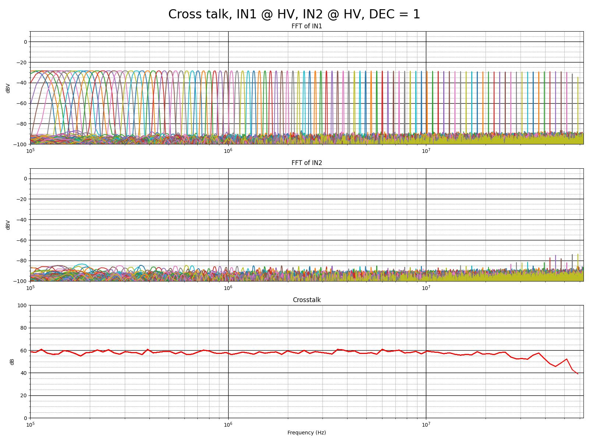

Crosstalk measurements between input channels 1 and 2 in HV mode.

|

.. Input SFDR
.. ------------------

.. Input SNR
.. ------------------

.. Input THD
.. ------------------

.. Input ENOB
.. ------------------

.. Input noise floor
.. ------------------

.. Input IMD
.. ------------------

|

Calibration
==============

Analog inputs calibration
--------------------------

To calibrate the analog inputs, please refer to the :ref:`Calibration guide <calibration_app>`.

|

****************
Analog outputs
****************

The Red Pitaya board analog front-end features two fast analog outputs.

Specifications
========================

.. table::
    :widths: 30 30 15 15

    +------------------------------------+------------------------------------+-----------+----------------------------------+
    | **Parameter**                      | **Value**                          | **Units** | **Notes**                        |
    +====================================+====================================+===========+==================================+
    | |br|                                                                                                                   |
    | **RF outputs**                                                                                                         |
    +------------------------------------+------------------------------------+-----------+----------------------------------+
    | RF output channels                 | 2                                  | \-        |                                  |
    +------------------------------------+------------------------------------+-----------+----------------------------------+
    | Sampling rate                      | 125                                | MS/s      |                                  |
    +------------------------------------+------------------------------------+-----------+----------------------------------+
    | DAC resolution                     | 14                                 | bit       |                                  |
    +------------------------------------+------------------------------------+-----------+----------------------------------+
    | Load impedance                     | 50 Ω (Hi-Z)                        | \-        |                                  |
    +------------------------------------+------------------------------------+-----------+----------------------------------+
    | Voltage range                      | | ±1 @ 50 Ω                        | V         |                                  |
    |                                    | | ±2 @ Hi-Z                        |           |                                  |
    +------------------------------------+------------------------------------+-----------+----------------------------------+
    | Output coupling                    | DC                                 | \-        |                                  |
    +------------------------------------+------------------------------------+-----------+----------------------------------+
    | Short circuit protection           | Yes                                | \-        |                                  |
    +------------------------------------+------------------------------------+-----------+----------------------------------+
    | Output slew rate                   | 200                                | V/μs      |                                  |
    +------------------------------------+------------------------------------+-----------+----------------------------------+
    | RF output jitter @40 MHz           | 20                                 | ps        | RMS, typical                     |
    +------------------------------------+------------------------------------+-----------+----------------------------------+
    | Bandwidth                          | DC - 50                            | MHz       | Typical                          |
    +------------------------------------+------------------------------------+-----------+----------------------------------+
    | Connector type                     | SMA                                | \-        |                                  |
    +------------------------------------+------------------------------------+-----------+----------------------------------+

The output load impedance should be set in the software before connecting the load.

.. note::

    The SMA connectors on the cables connected to Red Pitaya must correspond to the standard MILC39012. The central pin must be of a suitable length, otherwise, 
    the SMA connector, installed on the Red Pitaya, will mechanically damage the SMA connector. The central pin of the SMA connector on the Red Pitaya will 
    lose contact with the board and the board will not be possible to repair due to the mechanical damage (separation of the pad from the board).

|

Hardware Details
========================

Output stage schematics
-----------------------

The output stage consists of a buffer amplifier, low-pass filter filter, and DAC driver.

.. figure:: img/schematics/Fast_analog_output_schematics.png
    :width: 800

For more information, please refer to each board's hardware documentation.

|

Performance Measurements
==========================

Output bandwidth
------------------

+------------------------------------+------------------------------------+
| Load impedance                     | Bandwidth                          |
+====================================+====================================+
| 50 Ω                               | 54.3 MHz (-3 dB)                   |
+------------------------------------+------------------------------------+
| High-Z                             | 55.0 MHz (-3 dB)                   |
+------------------------------------+------------------------------------+

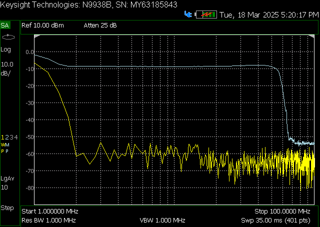

Bandwidth measurement of the output channel 1 at 50 Ω load.

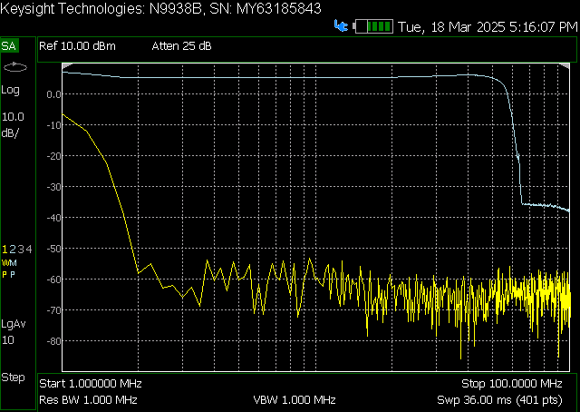

Bandwidth measurement of the output channel 1 at high impedance load.

|

Output bandwidth flatness
--------------------------

The output bandwidth flattness is within -1 dB from DC to full (-3 dB) bandwidth.

|

Output impedance
------------------

The impedance of the output channels (output amplifier and filter) is shown in the figure below. The original *STEMlab 125-14* output impedance is shown for comparison.

.. figure:: img/measurements/RF_outputs/Output_impedance/Output_impedance.png
    :width: 800

Original board and Gen 2 output impedance measurement.

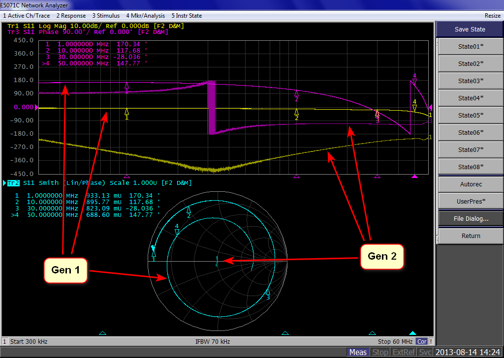

Smith diagram of the output impedance of original board and Gen 2.

|

Output phase noise
------------------

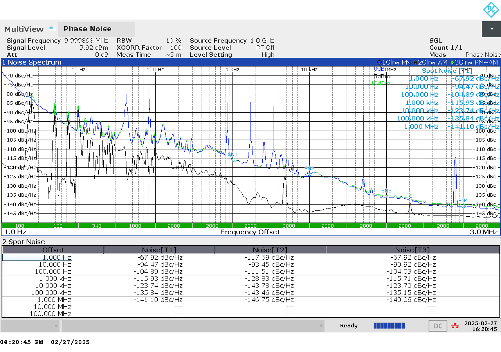

Phase noise measurements between 1 Hz and 1 MHz.

|

Output SFDR
------------------

+------------------+-----------------+-----------------+
|                  | **OUT 1**       | **OUT 2**       |
+==================+=================+=================+
| **f [MHz]**      | **SFDR [dB]**   | **SFDR [dB]**   |
+------------------+-----------------+-----------------+
| 0.1              | 56              | 54              |
+------------------+-----------------+-----------------+
| 1                | 52              | 58              |
+------------------+-----------------+-----------------+
| 10               | 58              | 55              |
+------------------+-----------------+-----------------+
| 20               | 44              | 44              |
+------------------+-----------------+-----------------+
| 30               | 45              | 45              |
+------------------+-----------------+-----------------+
| 40               | 44              | 45              |
+------------------+-----------------+-----------------+

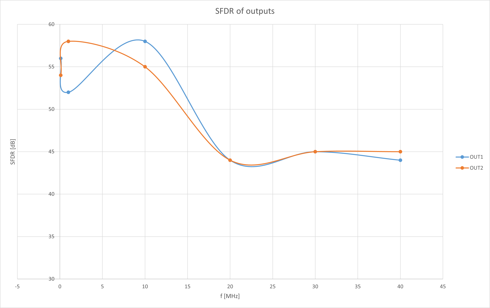

SFDR measurement for both output channels.

**Measurements at specific frequencies**

.. figure:: img/measurements/RF_outputs/SFDR/SFDR_OUT1_100k.png
    :width: 800

SFDR at 100 kHz.

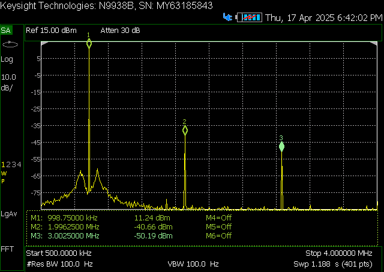

SFDR at 1 MHz.

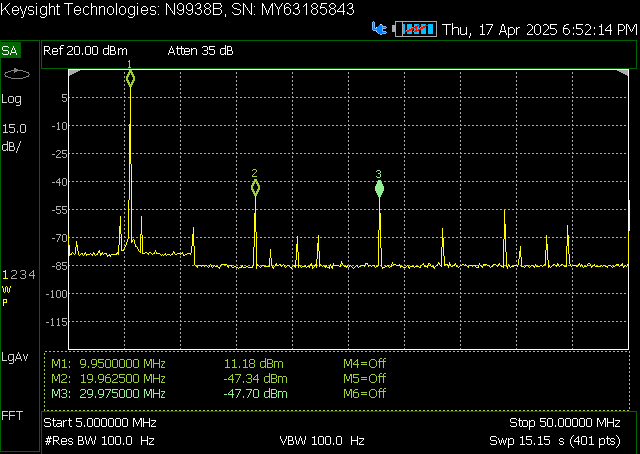

SFDR at 10 MHz.

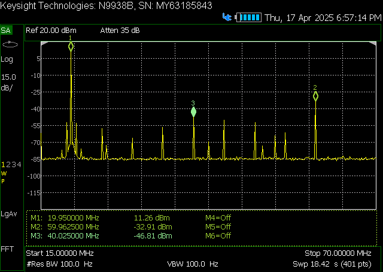

SFDR at 20 MHz.

.. figure:: img/measurements/RF_outputs/SFDR/SFDR_OUT1_30M.png
    :width: 800

SFDR at 30 MHz.

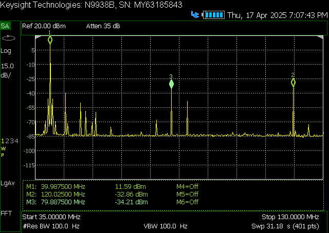

SFDR at 40 MHz.

|

Output SNR
-------------------

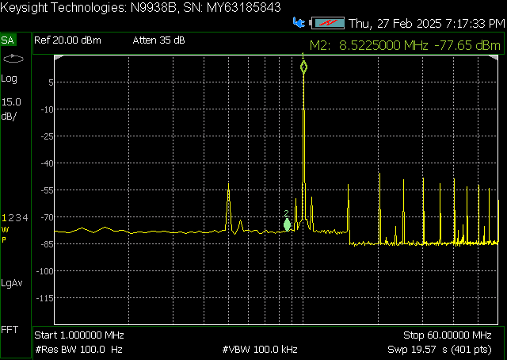

SNR measurement of the output channel 1 (whole specturm).

.. figure:: img/measurements/RF_outputs/SNR/SNR_OUT1_MEAS.png
    :width: 800

SNR measurement of the output channel 1 (VBW 100 kHz).

.. figure:: img/measurements/RF_outputs/SNR/SNR_OUT1_NO_SIGNAL.png
    :width: 800

SNR measurement of the output channel 1 (no signal).

|

.. Output THD
.. ------------------

.. Output ENOB
.. ------------------

.. Output noise floor
.. ------------------

.. Output IMD
.. ------------------

|

Calibration
==============

Analog output calibration
--------------------------

To calibrate the analog outputs, please refer to the :ref:`Calibration guide <calibration_app>`.

|

**********************
Legal & Disclaimers
**********************

.. include:: ../_specs_common/disclaimer.inc

|

.. rubric:: Footnotes

.. [#f1] The absolute maximum input voltage values are for frequencies below 1 kHz. For higher frequencies, please use the input voltage range specifications as **Absolute maximum**.
