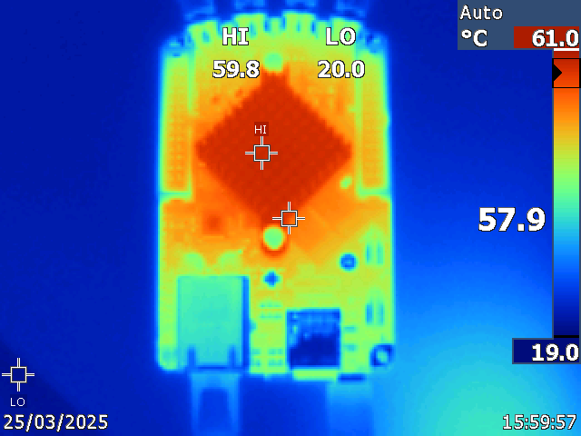
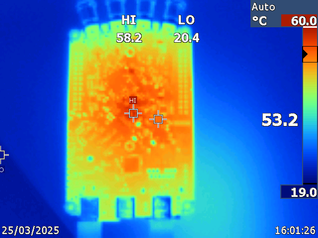
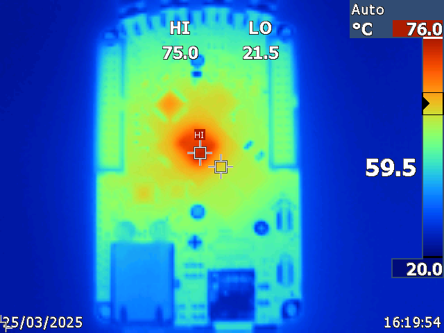
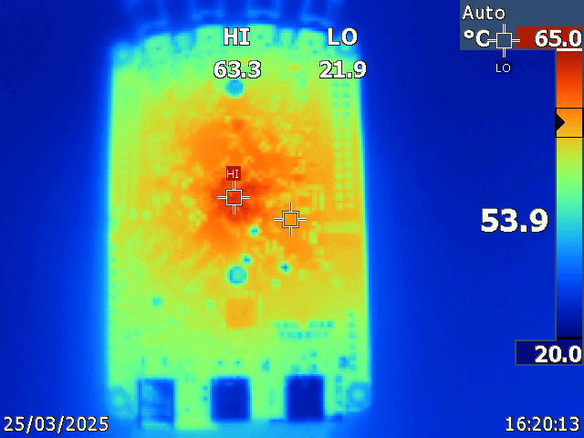

.. _hw_specs_gen2:

#######################################
Common hardware specifications (Gen 2)
#######################################

.. note::

    Looking for :ref:`Original Gen hardware specifications? <hw_specs_orig_gen>`

This section contains information that applies to **all** Red Pitaya Gen 2 boards. For board-specific specifications, measurements, power requirements, and detailed technical data, 
please refer to the individual product documentation pages.

Please note that the full hardware schematics for the Red Pitaya boards are not available. While Red Pitaya has open-source code, the hardware schematics are not open source. However, 
development schematics with information regarding hardware configuration, FPGA pin connections, and similar, are available.

.. note::

    The information provided by Red Pitaya d.o.o. is believed to be accurate and reliable. However, no liability is accepted for its use. Please note that the contents may be 
    subject to change without prior notice. 

.. contents:: **Index**
   :local:
   :backlinks: none

|

Power supply (all Gen 2 boards)
=================================

**All Red Pitaya Gen 2 boards use the same power supply:**

* **5 V, 3 A USB-C power supply** (including STEMlab Gen 2 models and TI variants)

.. note::

    It is important to note that Red Pitaya boards should **not** be powered by a power supply that provides less power than specified above or has very thin power wires. Doing so may result in abnormal behaviour of the device, causing reboots and network disconnections.
    Similarly, the Red Pitaya board may malfunction if powered directly from a USB port on a PC (due to insufficient current supply) or hub that cannot provide sufficient power or if a faulty power cable is used.
    
    Furthermore, the use of an unapproved power supply may impair performance or cause damage to the product.

.. warning::

    Power supply precautions:

    * All Gen 2 boards may only be powered by an isolated external power supply of 5 Volts DC with a maximum current of 3 A delivered via USB-C connector.
      Any external power supply used with Red Pitaya must comply with the relevant regulations and standards applicable in the country of use.

.. TODO add recommended Gen2 power supply model

|

SD card size (all Gen 2 boards)
=================================

We recommend using an SD card with a minimum of **32 GB** of space for Red Pitaya Gen 2 boards. The SD card should be **Class 10 or higher**.

|

Required hardware (all Gen 2 boards)
=====================================

The following items are required for proper board operation. They are already included in each of the Red Pitaya kits available on the |redpitaya-store|:

* 32 GB Class 10 micro SD card with pre-loaded Red Pitaya OS.
* Ethernet cable.
* USB-C power supply (5 V, 3 A).

Additional items required that are not included in the Red Pitaya kits:

* A computer with an internet browser (Google Chrome is recommended).
* Router with DHCP server enabled (access to the internet is required for :ref:`Software update manager <software_update_manager>` and some 3rd party community projects).

|

.. _status_leds_gen2:

Status LED description (all Gen 2 boards)
===========================================

+---------+--------------------------------------------------------------------------------------------------------------+
| Colour  | Function                                                                                                     |
+=========+==============================================================================================================+
| Blue    | FPGA bitstream status (in normal operation, this LED is lit, indicating that the FPGA bitstream              |
|         | has been successfully loaded).                                                                               |
+---------+--------------------------------------------------------------------------------------------------------------+
| Green   | Power supply status (in normal operation, this LED is lit, indicating that all power supplies                |
|         | on Red Pitaya are working properly).                                                                         |
+---------+--------------------------------------------------------------------------------------------------------------+
| Red     | Heartbeat blink pattern indicating CPU load (in normal operation, this LED will blink continuously).         |
+---------+--------------------------------------------------------------------------------------------------------------+
| Orange  | | SD card access indicator (in normal operation, this LED will flash sporadically at slow intervals).        |
|         | | If the :ref:`QSPI eMMC module <E3_QSPI_eMMC_module_HW>` is present, the internal watchdog timer is wired   |
|         | | to the orange LED instead (the LED will blink continuously).                                               |
+---------+--------------------------------------------------------------------------------------------------------------+

.. note::

    When the :ref:`QSPI eMMC module <E3_QSPI_eMMC_module_HW>` is connected to a Gen 2 PRO board the orange LED functionality will be switched to show 
    the watchdog timer status instead of the SD card access.

|

Operating temperature and safety
==================================

Operating temperature range
----------------------------

Red Pitaya Gen 2 devices have an operating temperature range from 0°C to +55°C and a storage temperature range of -20°C to +85°C. 

For industrial grade Gen 2 boards with operating temperature range from -40°C to +85°C, please contact us at info@redpitaya.com.

* Should be operated in normal conditions and should not be covered.
* Are intended for indoor use at a maximum altitude of 2000 m, pollution severity 2 and relative humidity less than 90%.
* Are intended for use with low voltage power sources and signals and should not be used in direct connection with voltages exceeding 30 Volts.

.. note::

    The operating temperature range (0°C to +55°C) applies if the board is using the included heatsink. Replacing the heatsink with a larger one or implementing additional cooling solutions will increase the operating range of the board.
    
    When using custom cooling solutions, please note that the Zynq temperature must not exceed +85°C. Additionally, the Red Pitaya OS has a software temperature protection that will shut down the board if it gets too hot. This is meant to protect the board from overheating and damage.
    If a custom cooling solution is used, please check that the software temperature protection is not preventing proper operation.

Heating and cooling
--------------------

It is not uncommon for Red Pitaya boards to reach temperatures of 60°C or above during operation. The thermal images below show expected temperatures during typical operation.

    Thermal image of the board with heatsink attached (top view) - typical operating temperatures.

    Thermal image of the board with heatsink attached (bottom view) - typical operating temperatures.

    Thermal image of the board without heatsink attached (top view) - operation without heatsink is not recommended.

    Thermal image of the board without heatsink attached (bottom view) - operation without heatsink is not recommended.

.. note::

    Please note that some parts of the board, particularly the heatsink, may become hot during and after operation. To avoid injury, please do not touch them.

.. note::

    It is imperative that a heatsink is installed and that the board is operated on a flat surface devoid of any obstructions that could impede airflow.
    In order to mitigate the effects of elevated ambient temperatures and reduced pressure conditions within enclosures, it is necessary to implement an effective ventilation strategy.
    The product's operational functionality is automatically disabled at temperatures of 85°C to prevent any potential damage.

Cooling options
^^^^^^^^^^^^^^^^^

For enhanced cooling, we suggest utilising one or more of the following options:

* :ref:`Gen 2 Aluminium case <alucase>` (**not yet available**) - to improve heat dissipation and protect the board from external factors.
* :ref:`Gen 2 Heatsink interface <heatsink>` (**not yet available**) - to improve heat dissipation and connect the board to an external heatsink.
* External cooling fan - to increase airflow around the board.

.. TODO add cooling options for Gen 2 boards.

|

Fast analog inputs and outputs (all Gen 2 boards)
==================================================

.. warning::

    All inputs and outputs available through SMA connectors share a common ground connected to the power supply ground.

.. warning::
    
    The SMA connectors on the cables connected to Red Pitaya must comply with the MILC39012 standard. The centre pin must be of suitable length, otherwise the SMA connector installed in Red Pitaya will mechanically damage the SMA connector.
    The centre pin of the SMA connector on Red Pitaya will lose contact with the board and the board will not be repairable due to the mechanical damage (separation of the pad from the board).

Jumper settings
----------------

Voltage input ranges are set by jumpers located behind each input SMA connector. Gain can be adjusted independently for both input channels.

.. figure:: img/jumpers/Jumper_settings.png
    :align: center

    Jumper settings diagram

.. figure:: img/jumpers/Jumper_settings_photo.png
    :align: center

    Jumper setting positions:
    
    - **Left setting (LV)** adjusts to ±1 V full scale
    - **Right setting (HV)** adjusts to ±20 V full scale

.. warning::
    
    Please note that jumper settings are limited to the described positions. Any other configuration or use of different jumper types may damage the product and void the warranty.

Jumper orientation (important)
--------------------------------

**The position and orientation of the jumpers can significantly affect measurement accuracy.** The jumpers are internally connected to a small metal plate which acts as a capacitor and affects the overall capacitance, which in turn affects the input impedance.

If the jumpers are moved from an incorrect to a correct position, **calibration is strongly recommended** as the input capacitance depends on jumper settings and may vary between positions.

1. **The position of the jumper bumps must be as shown in the diagram.** Due to the non-symmetrical nature of the jumpers and their latches, we advise installing them with the latch on the outer side to avoid any issues with difficult-to-remove jumpers.

    .. figure:: img/jumpers/Jumper_position_Note.png
        :align: center

2. **Once installed, the jumpers should be positioned so that the metal part is not visible.** Please refer to the example of the STEMlab 125-14 4-Input in the pictures below for guidance.

    .. figure:: img/jumpers/Jumper_position_4IN_0.png
        :align: center
        :width: 700 px

    .. figure:: img/jumpers/Jumper_position_4IN_1.png
        :align: center
        :width: 700 px

**Impact of incorrect jumper placement:**

Incorrect jumper placement can cause the front part of acquired square wave signals to be overshot or undercut. This is shown in the figure below.

.. figure:: img/jumpers/Jumper_position_wrong_signal.jpg
    :align: center
    :width: 800

    If the jumpers are not set correctly, the step response will be under-compensated.

With the jumper pins correctly placed, the same waveform looks much better:

.. figure:: img/jumpers/Jumper_position_correct_signal.jpg
    :align: center
    :width: 800

    Correctly positioned jumpers result in proper step response.

|

Extension connectors (all Gen 2 boards)
=========================================

All Gen 2 boards feature extension connectors (E1 and E2) using the same physical format and electrical characteristics:

**Physical specifications:**

* **Connector type**: 2 x 13 pins IDC 2.54 mm pitch
* **Digital I/O voltage levels**: 3.3V LVCMOS33
* **Power rails**: +5V, -5V, +3.3V

**Current limitations:**

* 0.5 A for +5V (shared between extension module and USB devices)
* 0.1 A for -5V
* 0.5 A for +3.3V (shared between extension module and USB devices)

**Board-specific differences:**

Pin assignments, available features, and FPGA connections vary significantly by board model:

* **STEMlab 125-14 Gen 2**: 16 digital I/Os, 4 slow ADCs, 4 slow DACs, SPI/UART/I2C/CAN
* **STEMlab 125-14 PRO Gen 2**: 16 digital I/Os, 4 slow ADCs, 4 slow DACs, SPI/UART/I2C/CAN, **external clock input**
* **STEMlab 125-14 PRO Z7020 Gen 2**: **22 digital I/Os**, 4 slow ADCs, 4 slow DACs, SPI/UART/I2C/CAN, external clock input, **E3 connector** (16 additional GPIOs)
* **TI variants**: See individual board documentation for specific pinout

For complete pinout diagrams, FPGA pin numbers, and detailed specifications, please refer to your specific board's documentation page.

|

What's different in Gen 2?
============================

Gen 2 boards represent a significant hardware evolution from the original generation. Here are the key improvements:

**STEMlab 125-14 Gen 2 improvements:**

* Reduced noise and crosstalk on the fast analog inputs and outputs
* Increased fast analog output voltage range (±1 V @ 50 Ω load, ±2 V @ Hi-Z load)
* USB-C connectors (power and console) replacing Micro USB
* Crisp clean 50 Ω output impedance
* SFDR improvements
* No voltage glitching on the outputs when the board is powered on (see the :ref:`Gen 2 FAQ <faq_gen2>` section for full details)

**PRO model exclusive features:**

* Switching between internal and external clock with the *CLK SEL* pin
* E3 add-on board with an STM32 microcontroller providing control over Power, WDT and diverse booting options (QSPI, eMMC)

**STEMlab 125-14 PRO Z7020 Gen 2 exclusive features:**

* E3 connector with 8 fast differential pairs (16 GPIOs) and external eMMC and QSPI booting option
* 1 GB RAM (double the standard 512 MB)
* Zynq 7020 FPGA (double the logic capacity of Zynq 7010)

**Important compatibility notes:**

* Gen 2 boards require OS version **2.07-43 or higher**
* **TI variants** are NOT backwards compatible with older OS versions - see :ref:`OS Version Compatibility <os_compatibility>` for details
* USB-C power supply: **5V, 3A** (vs Micro USB 5V, 2A on Original Gen)
* Different frontend architecture means analog performance characteristics differ from Original Gen

For detailed performance measurements and specifications, please refer to the individual product pages.

