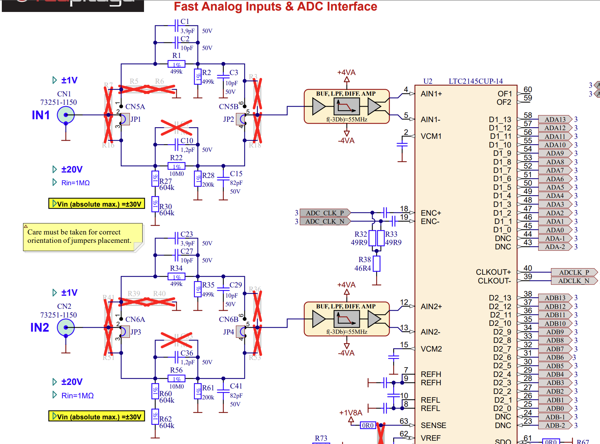
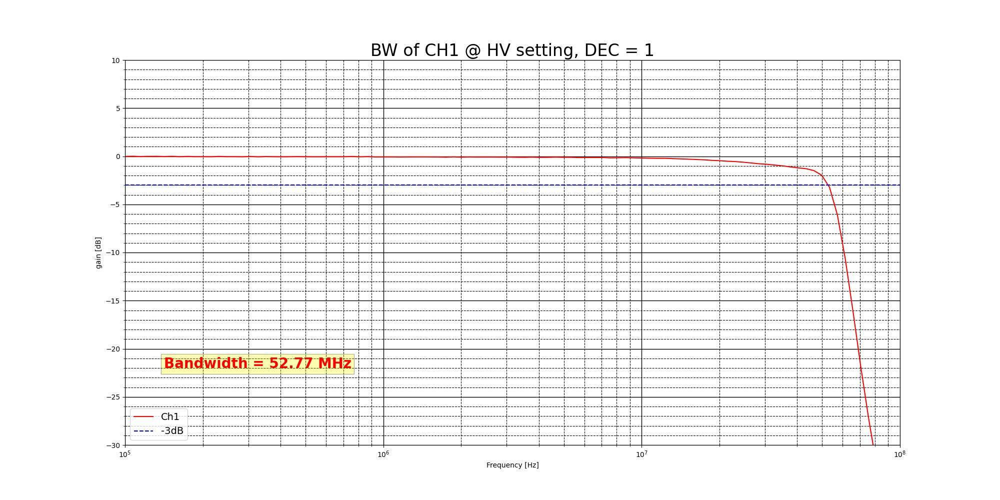

.. _measurements_gen2_inputs:

###########################
Fast Analog Inputs
###########################

This page contains detailed specifications and performance measurements for Gen 2 fast analog inputs.

.. contents::
   :local:
   :depth: 2
   :backlinks: none

|

Specifications
=======================

.. table::
    :widths: 30 30 15 15

    +------------------------------------+------------------------------------+-----------+----------------------------------+
    | **Parameter**                      | **Value**                          | **Units** | **Notes**                        |
    +====================================+====================================+===========+==================================+
    | |br|                                                                                                                   |
    | **RF inputs**                                                                                                          |
    +------------------------------------+------------------------------------+-----------+----------------------------------+
    | RF input channels                  | 2                                  | \-        |                                  |
    +------------------------------------+------------------------------------+-----------+----------------------------------+
    | Sampling rate                      | 125                                | MS/s      |                                  |
    +------------------------------------+------------------------------------+-----------+----------------------------------+
    | ADC resolution                     | 14                                 | bit       |                                  |
    +------------------------------------+------------------------------------+-----------+----------------------------------+
    | Input impedance                    | 1 MΩ (10 pF)                       | \-        |                                  |
    +------------------------------------+------------------------------------+-----------+----------------------------------+
    | Full scale voltage range           | | ±1 (LV)                          | V         |                                  |
    |                                    | | ±20 (HV)                         |           |                                  |
    +------------------------------------+------------------------------------+-----------+----------------------------------+
    | Input coupling                     | DC                                 | \-        |                                  |
    +------------------------------------+------------------------------------+-----------+----------------------------------+
    | Absolute max. input voltage        | | ±6 (LV)                          | V         | DC values [#f1]_                 |
    |                                    | | ±30 (HV)                         |           |                                  |
    +------------------------------------+------------------------------------+-----------+----------------------------------+
    | Input ESD protection               | Yes                                | \-        |                                  |
    +------------------------------------+------------------------------------+-----------+----------------------------------+
    | Overload protection                | Protection diodes                  | \-        | (within input voltage ratings)   |
    +------------------------------------+------------------------------------+-----------+----------------------------------+
    | Bandwidth                          | DC - 50                            | MHz       | Typical                          |
    +------------------------------------+------------------------------------+-----------+----------------------------------+
    | Connector type                     | SMA                                | \-        |                                  |
    +------------------------------------+------------------------------------+-----------+----------------------------------+

.. note::
    
    Overload protection applies to low frequency signals. For input signals containing frequency components above 1 kHz, where capacitor divider comes into play, the full scale value defines the maximum permissible input voltage.

|

Hardware Details
=================

Input stage schematics
-----------------------

The input stage consists of a voltage divider, buffer amplifier, anti-aliasing filter, and ADC driver.

For more information, please refer to each board's hardware documentation.

|

Input coupling
------------------

Fast analog inputs are **DC coupled**.

.. TODO add input impedance measurements

|

Performance Measurements
==========================

Input bandwidth
------------------

+------------------------------------+------------------------------------+
| Jumper settings                    | Bandwidth                          |
+====================================+====================================+
| LV                                 | 52.02 MHz (-3 dB)                  |
+------------------------------------+------------------------------------+
| HV                                 | 52.77 MHz (-3 dB)                  |
+------------------------------------+------------------------------------+

.. figure:: img/RF_inputs/Bandwidth/IN1_LV_DEC1.jpg
    :width: 800

Bandwidth measurement of the input channel 1 in LV mode.

Bandwidth measurement of the input channel 1 in HV mode.

|

Input bandwidth flatness
--------------------------

The bandwidth flatness is <0.05 dB from DC to full (-3 dB) bandwidth on LV gain setting.

.. figure:: img/RF_inputs/Bandwidth_flatness/IN1_LV_DEC1_flatness.jpg
    :width: 800

Bandwidth flatness measurement of the input channel 1 in LV mode.

|

Input crosstalk
------------------

Crosstalk measurements were performed between input channels 1 and 2 for both LV and HV modes.

+------------------------------------+------------------+------------------+------------------+------------------+
|                                    | **Up to 30 MHz**                    | **Above 30 MHz**                    |
+------------------------------------+------------------+------------------+------------------+------------------+
| |br|                               | |br|             | |br|             | |br|             | |br|             |
| **IN1 \ IN2**                      | **LV**           | **HV**           | **LV**           | **HV**           |
+------------------------------------+------------------+------------------+------------------+------------------+
| **LV**                             | >70 dB           | >80 dB           | >50 dB           | >50 dB           |
+------------------------------------+------------------+------------------+------------------+------------------+
| **HV**                             | 40 dB            | 55 dB            | >35 dB           | >40 dB           |
+------------------------------------+------------------+------------------+------------------+------------------+
| |br|                               | |br|             | |br|             | |br|             | |br|             |
| **IN2 \ IN1**                      | **LV**           | **HV**           | **LV**           | **HV**           |
+------------------------------------+------------------+------------------+------------------+------------------+
| **LV**                             | >70 dB           | 55 dB            | >55 dB           | 50 dB            |
+------------------------------------+------------------+------------------+------------------+------------------+
| **HV**                             | 70 dB            | 55 dB            | >55 dB           | 55 dB            |
+------------------------------------+------------------+------------------+------------------+------------------+

.. figure:: img/RF_inputs/Cross-talk/Cross_talk_IN1@HV_IN2@HV.jpg
    :width: 800

Crosstalk measurements between input channels 1 and 2 in HV mode.

|

.. Input SFDR
.. ------------------

.. Input SNR
.. ------------------

.. Input THD
.. ------------------

.. Input ENOB
.. ------------------

.. Input noise floor
.. ------------------

.. Input IMD
.. ------------------

|

Calibration
==============

Analog inputs calibration
--------------------------

To calibrate the analog inputs, please refer to the :ref:`Calibration guide <calibration_app>`.

|

.. rubric:: Footnotes

.. [#f1] The absolute maximum input voltage values are for frequencies below 1 kHz. For higher frequencies, please use the input voltage range specifications as **Absolute maximum**.

