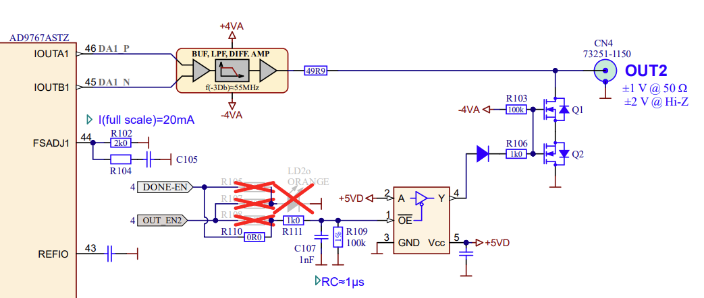
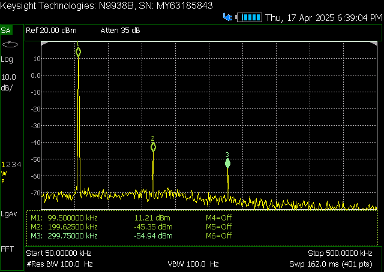
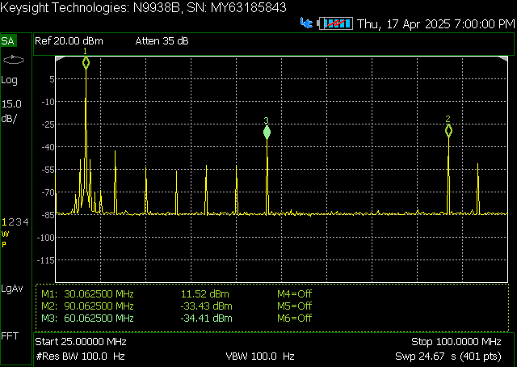
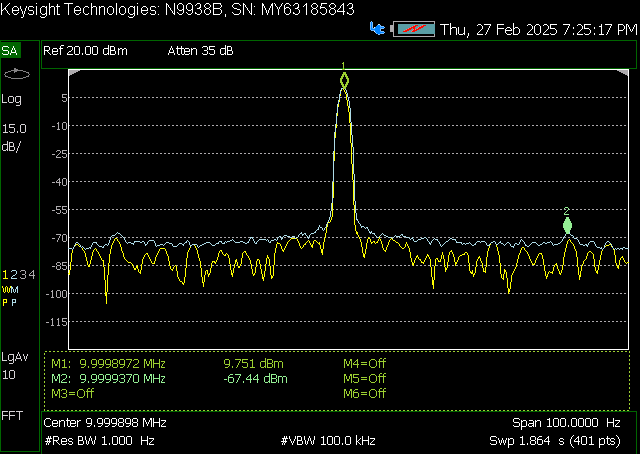
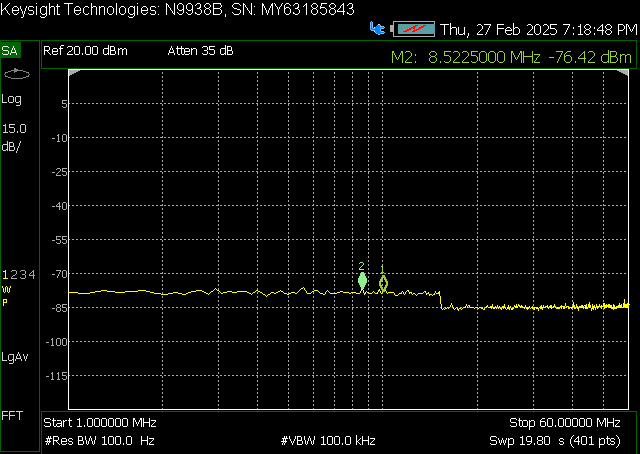

.. _measurements_gen2_outputs:

###########################
Fast Analog Outputs
###########################

This page contains detailed specifications and performance measurements for Gen 2 fast analog outputs.

.. contents::
   :local:
   :depth: 2
   :backlinks: none

|

Specifications
========================

.. table::
    :widths: 30 30 15 15

    +------------------------------------+------------------------------------+-----------+----------------------------------+
    | **Parameter**                      | **Value**                          | **Units** | **Notes**                        |
    +====================================+====================================+===========+==================================+
    | |br|                                                                                                                   |
    | **RF outputs**                                                                                                         |
    +------------------------------------+------------------------------------+-----------+----------------------------------+
    | RF output channels                 | 2                                  | \-        |                                  |
    +------------------------------------+------------------------------------+-----------+----------------------------------+
    | Sampling rate                      | 125                                | MS/s      |                                  |
    +------------------------------------+------------------------------------+-----------+----------------------------------+
    | DAC resolution                     | 14                                 | bit       |                                  |
    +------------------------------------+------------------------------------+-----------+----------------------------------+
    | Load impedance                     | 50 Ω (Hi-Z)                        | \-        |                                  |
    +------------------------------------+------------------------------------+-----------+----------------------------------+
    | Voltage range                      | | ±1 @ 50 Ω                        | V         |                                  |
    |                                    | | ±2 @ Hi-Z                        |           |                                  |
    +------------------------------------+------------------------------------+-----------+----------------------------------+
    | Output coupling                    | DC                                 | \-        |                                  |
    +------------------------------------+------------------------------------+-----------+----------------------------------+
    | Short circuit protection           | Yes                                | \-        |                                  |
    +------------------------------------+------------------------------------+-----------+----------------------------------+
    | Output slew rate                   | 200                                | V/μs      |                                  |
    +------------------------------------+------------------------------------+-----------+----------------------------------+
    | RF output jitter @40 MHz           | 20                                 | ps        | RMS, typical                     |
    +------------------------------------+------------------------------------+-----------+----------------------------------+
    | Bandwidth                          | DC - 50                            | MHz       | Typical                          |
    +------------------------------------+------------------------------------+-----------+----------------------------------+
    | Connector type                     | SMA                                | \-        |                                  |
    +------------------------------------+------------------------------------+-----------+----------------------------------+

.. note::

    The output load impedance should be set in the software before connecting the load.

|

Hardware Details
========================

Output stage schematics
-----------------------

The output stage consists of a buffer amplifier, low-pass filter filter, and DAC driver.

For more information, please refer to each board's hardware documentation.

|

Performance Measurements
==========================

Output bandwidth
------------------

+------------------------------------+------------------------------------+
| Load impedance                     | Bandwidth                          |
+====================================+====================================+
| 50 Ω                               | 54.3 MHz (-3 dB)                   |
+------------------------------------+------------------------------------+
| High-Z                             | 55.0 MHz (-3 dB)                   |
+------------------------------------+------------------------------------+

.. figure:: img/RF_outputs/Bandwidth/OUT1LOW.png
    :width: 800

Bandwidth measurement of the output channel 1 at 50 Ω load.

.. figure:: img/RF_outputs/Bandwidth/OUT1HIGH.png
    :width: 800

Bandwidth measurement of the output channel 1 at high impedance load.

|

Output bandwidth flatness
--------------------------

The output bandwidth flattness is within -1 dB from DC to full (-3 dB) bandwidth.

|

Output impedance
------------------

The impedance of the output channels (output amplifier and filter) is shown in the figure below. The original *STEMlab 125-14* output impedance is shown for comparison.

.. figure:: img/RF_outputs/Output_impedance/Output_impedance.png
    :width: 800

Original board and Gen 2 output impedance measurement.

.. figure:: img/RF_outputs/Output_impedance/SMITH_PITAYA_Gen1_VS_Gen2_markings.png
    :width: 800

Smith diagram of the output impedance of original board and Gen 2.

|

Output phase noise
------------------

.. figure:: img/RF_outputs/Phase_noise/noise_generation_Gen2.png
    :width: 800

Phase noise measurements between 1 Hz and 1 MHz.

|

Output SFDR
------------------

+------------------+-----------------+-----------------+
|                  | **OUT 1**       | **OUT 2**       |
+==================+=================+=================+
| **f [MHz]**      | **SFDR [dB]**   | **SFDR [dB]**   |
+------------------+-----------------+-----------------+
| 0.1              | 56              | 54              |
+------------------+-----------------+-----------------+
| 1                | 52              | 58              |
+------------------+-----------------+-----------------+
| 10               | 58              | 55              |
+------------------+-----------------+-----------------+
| 20               | 44              | 44              |
+------------------+-----------------+-----------------+
| 30               | 45              | 45              |
+------------------+-----------------+-----------------+
| 40               | 44              | 45              |
+------------------+-----------------+-----------------+

.. figure:: img/RF_outputs/SFDR/SFDR_measurements.png
    :width: 800

SFDR measurement for both output channels.

**Measurements at specific frequencies**

SFDR at 100 kHz.

.. figure:: img/RF_outputs/SFDR/SFDR_OUT1_1M.png
    :width: 800

SFDR at 1 MHz.

.. figure:: img/RF_outputs/SFDR/SFDR_OUT1_10M.png
    :width: 800

SFDR at 10 MHz.

.. figure:: img/RF_outputs/SFDR/SFDR_OUT1_20M.png
    :width: 800

SFDR at 20 MHz.

SFDR at 30 MHz.

.. figure:: img/RF_outputs/SFDR/SFDR_OUT1_40M.png
    :width: 800

SFDR at 40 MHz.

|

Output SNR
-------------------

.. figure:: img/RF_outputs/SNR/SNR_OUT1.png
    :width: 800

SNR measurement of the output channel 1 (whole specturm).

SNR measurement of the output channel 1 (VBW 100 kHz).

SNR measurement of the output channel 1 (no signal).

|

.. Output THD
.. ------------------

.. Output ENOB
.. ------------------

.. Output noise floor
.. ------------------

.. Output IMD
.. ------------------

|

Calibration
==============

Analog output calibration
--------------------------

To calibrate the analog outputs, please refer to the :ref:`Calibration guide <calibration_app>`.

