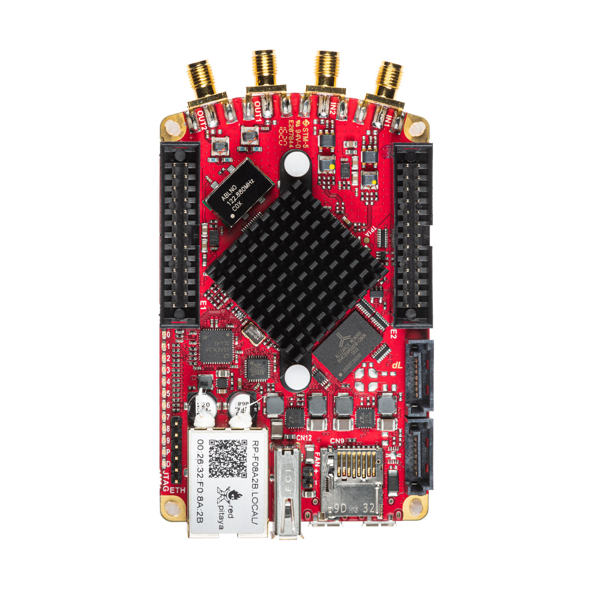

.. _top_122_16:

###############
SDRlab 122-16
###############

|

.. contents:: Table of Contents
    :local:
    :depth: 1
    :backlinks: top

|

Overview
========

The SDRlab 122-16 is a specialized Red Pitaya board designed for Software Defined Radio (SDR) applications. It features 16-bit ADC and 14-bit DAC resolution with 122.88 MS/s sampling rate, 
optimized for RF signal processing. The board includes AC-coupled 50 Ω inputs and operates at the SDR-standard 122.88 MHz clock frequency.

|

Features
========

* 16-bit ADC and 14-bit DAC, 122.88 MS/s
* AC-coupled 50 Ω RF inputs and outputs
* SDR-optimized clock frequency (122.88 MHz)
* Dual-core ARM Cortex-A9 processor
* FPGA Xilinx Zynq 7020 SoC
* 512 MB RAM
* 22 digital I/Os, 4 analog inputs, 4 analog outputs
* Multiple communication interfaces: I2C, SPI, UART, CAN
* Micro USB connectivity for power and console

|

Quick Reference
===============

.. table::
    :widths: 40 60

    +----------------------------+--------------------------------------------------+
    | **Category**               | **Key Specifications**                           |
    +============================+==================================================+
    | ADC                        | 2 channels, 16-bit, 122.88 MS/s                  |
    +----------------------------+--------------------------------------------------+
    | DAC                        | 2 channels, 14-bit, 122.88 MS/s                  |
    +----------------------------+--------------------------------------------------+
    | Processor                  | Dual-core ARM Cortex-A9                          |
    +----------------------------+--------------------------------------------------+
    | FPGA                       | Xilinx Zynq 7020 SoC                             |
    +----------------------------+--------------------------------------------------+
    | RAM                        | 512 MB                                           |
    +----------------------------+--------------------------------------------------+
    | Digital I/O                | 22 GPIOs @ 3.3V                                  |
    +----------------------------+--------------------------------------------------+
    | Analog I/O                 | 4 inputs (12-bit), 4 outputs (8-bit)             |
    +----------------------------+--------------------------------------------------+
    | Connectivity               | Ethernet, USB-C, Extension connectors            |
    +----------------------------+--------------------------------------------------+
    | Input Impedance            | 50 Ω (AC-coupled)                                |
    +----------------------------+--------------------------------------------------+
    | Special Features           | AC-coupling, 16-bit resolution                   |
    +----------------------------+--------------------------------------------------+

|

Board Layout & Pinout
======================

.. figure:: ../125-14/img/Red_Pitaya_pinout.jpg
    :alt: Red Pitaya pinout
    :width: 700
    :align: center

|

Technical Specifications
=========================

.. table::
    :widths: 30 30 15 15

    +------------------------------------+------------------------------------+-----------+----------------------------------+
    | **Parameter**                      | **Value**                          | **Units** | **Notes**                        |
    +====================================+====================================+===========+==================================+
    | |br|                                                                                                                   |
    | **Basic**                                                                                                              |
    +------------------------------------+------------------------------------+-----------+----------------------------------+
    | Processor                          | Dual core ARM Cortex-A9            | \-        |                                  |
    +------------------------------------+------------------------------------+-----------+----------------------------------+
    | FPGA                               | FPGA AMD (Xilinx) Zynq 7020 SoC    | \-        |                                  |
    +------------------------------------+------------------------------------+-----------+----------------------------------+
    | RAM                                | 512                                | MB        | (4 Gb)                           |
    +------------------------------------+------------------------------------+-----------+----------------------------------+
    | Core clock frequency               | 122.88                             | MHz       |                                  |
    +------------------------------------+------------------------------------+-----------+----------------------------------+
    | System memory                      | Micro SD up to 32 GB               | \-        |                                  |
    +------------------------------------+------------------------------------+-----------+----------------------------------+
    | Serial console connector           | Micro USB                          | \-        |                                  |
    +------------------------------------+------------------------------------+-----------+----------------------------------+
    | Power connector                    | Micro USB                          | \-        |                                  |
    +------------------------------------+------------------------------------+-----------+----------------------------------+
    | Power consumption                  | 5 V, 2 A                           | \-        | max                              |
    +------------------------------------+------------------------------------+-----------+----------------------------------+
    | |br|                                                                                                                   |
    | **Connectivity**                                                                                                       |
    +------------------------------------+------------------------------------+-----------+----------------------------------+
    | Ethernet                           | 1                                  | Gbit      |                                  |
    +------------------------------------+------------------------------------+-----------+----------------------------------+
    | USB                                | USB-A 2.0                          | \-        |                                  |
    +------------------------------------+------------------------------------+-----------+----------------------------------+
    | Wi-Fi                              | Requires Wi-Fi dongle              | \-        |                                  |
    +------------------------------------+------------------------------------+-----------+----------------------------------+
    | |br|                                                                                                                   |
    | **RF inputs**                                                                                                          |
    +------------------------------------+------------------------------------+-----------+----------------------------------+
    | RF input channels                  | 2                                  | \-        |                                  |
    +------------------------------------+------------------------------------+-----------+----------------------------------+
    | Sampling rate                      | 122.88                             | MS/s      |                                  |
    +------------------------------------+------------------------------------+-----------+----------------------------------+
    | ADC resolution                     | 16                                 | bit       |                                  |
    +------------------------------------+------------------------------------+-----------+----------------------------------+
    | Input impedance                    | 50 Ω                               | \-        |                                  |
    +------------------------------------+------------------------------------+-----------+----------------------------------+
    | Full scale voltage range           | 0.5 Vpp / -2 dBm                   | \-        |                                  |
    +------------------------------------+------------------------------------+-----------+----------------------------------+
    | Input coupling                     | AC                                 | \-        |                                  |
    +------------------------------------+------------------------------------+-----------+----------------------------------+
    | Absolute max. input voltage        | | **DC max 50 V** (AC-coupled)     | V         |                                  |
    |                                    | | **1 Vpp for RF**                 |           |                                  |
    +------------------------------------+------------------------------------+-----------+----------------------------------+
    | Input ESD protection               | No                                 | \-        | AC coupling [#f1]_               |
    +------------------------------------+------------------------------------+-----------+----------------------------------+
    | Overload protection                | DC voltage protection              | \-        |                                  |
    +------------------------------------+------------------------------------+-----------+----------------------------------+
    | Bandwidth                          | 300 kHz - 60 MHz                   | \-        | Undersampling up to 550 MHz      |
    +------------------------------------+------------------------------------+-----------+----------------------------------+
    | Connector type                     | SMA                                | \-        |                                  |
    +------------------------------------+------------------------------------+-----------+----------------------------------+
    | |br|                                                                                                                   |
    | **RF outputs**                                                                                                         |
    +------------------------------------+------------------------------------+-----------+----------------------------------+
    | RF output channels                 | 2                                  | \-        |                                  |
    +------------------------------------+------------------------------------+-----------+----------------------------------+
    | Sampling rate                      | 122.88                             | MS/s      |                                  |
    +------------------------------------+------------------------------------+-----------+----------------------------------+
    | DAC resolution                     | 14                                 | bit       |                                  |
    +------------------------------------+------------------------------------+-----------+----------------------------------+
    | Load impedance                     | 50 Ω                               | \-        |                                  |
    +------------------------------------+------------------------------------+-----------+----------------------------------+
    | Voltage range                      | 0.5 Vpp / -2 dBm                   | \-        |                                  |
    +------------------------------------+------------------------------------+-----------+----------------------------------+
    | Output coupling                    | AC                                 | \-        |                                  |
    +------------------------------------+------------------------------------+-----------+----------------------------------+
    | Short circuit protection           | No                                 | \-        | AC coupling only                 |
    +------------------------------------+------------------------------------+-----------+----------------------------------+
    | Bandwidth                          | 300 kHz - 60 MHz                   | \-        |                                  |
    +------------------------------------+------------------------------------+-----------+----------------------------------+
    | Connector type                     | SMA                                | \-        |                                  |
    +------------------------------------+------------------------------------+-----------+----------------------------------+
    | |br|                                                                                                                   |
    | **Extension connectors**                                                                                               |
    +------------------------------------+------------------------------------+-----------+----------------------------------+
    | Digital GPIOs                      | 22                                 | \-        |                                  |
    +------------------------------------+------------------------------------+-----------+----------------------------------+
    | Digital voltage levels             | 3.3                                | V         |                                  |
    +------------------------------------+------------------------------------+-----------+----------------------------------+
    | Analog inputs                      | 4                                  | \-        |                                  |
    +------------------------------------+------------------------------------+-----------+----------------------------------+
    | Analog input voltage range         | 0 - 3.5                            | V         |                                  |
    +------------------------------------+------------------------------------+-----------+----------------------------------+
    | Analog input resolution            | 12                                 | bit       |                                  |
    +------------------------------------+------------------------------------+-----------+----------------------------------+
    | Analog input sampling rate         | 100                                | kS/s      |                                  |
    +------------------------------------+------------------------------------+-----------+----------------------------------+
    | Analog outputs                     | 4                                  | \-        |                                  |
    +------------------------------------+------------------------------------+-----------+----------------------------------+
    | Analog output voltage range        | 0 - 1.8                            | V         |                                  |
    +------------------------------------+------------------------------------+-----------+----------------------------------+
    | Analog output resolution           | 8                                  | bit       |                                  |
    +------------------------------------+------------------------------------+-----------+----------------------------------+
    | Analog output sampling rate        | ≲ 3.2                              | MS/s      |                                  |
    +------------------------------------+------------------------------------+-----------+----------------------------------+
    | Analog output bandwidth            | ≈ 160                              | kHz       |                                  |
    +------------------------------------+------------------------------------+-----------+----------------------------------+
    | Communication interfaces           | I2C, SPI, UART, CAN                | \-        |                                  |
    +------------------------------------+------------------------------------+-----------+----------------------------------+
    | Available voltages                 | +5, +3.3                           | V         |                                  |
    +------------------------------------+------------------------------------+-----------+----------------------------------+
    | External ADC clock                 | No                                 | \-        | See [#f2]_                       |
    +------------------------------------+------------------------------------+-----------+----------------------------------+
    | |br|                                                                                                                   |
    | **Synchronisation**                                                                                                    |
    +------------------------------------+------------------------------------+-----------+----------------------------------+
    | External trigger input             | DIO0_P                             | \-        | E1 connector                     |
    +------------------------------------+------------------------------------+-----------+----------------------------------+
    | External trigger input impedance   | Hi-Z                               | \-        | Digital input                    |
    +------------------------------------+------------------------------------+-----------+----------------------------------+
    | Trigger output                     | DIO0_N                             | \-        | E1 connector [#f3]_              |
    +------------------------------------+------------------------------------+-----------+----------------------------------+
    | Daisy chain connectors (S1 & S2)   | Yes                                | \-        |                                  |
    +------------------------------------+------------------------------------+-----------+----------------------------------+
    | Daisy chain connectors speed       | up to 500                          | Mb/s      |                                  |
    +------------------------------------+------------------------------------+-----------+----------------------------------+
    | Daisy chain connectors type        | SATA                               | \-        |                                  |
    +------------------------------------+------------------------------------+-----------+----------------------------------+
    | Ref. clock input                   | N/A                                | \-        |                                  |
    +------------------------------------+------------------------------------+-----------+----------------------------------+
    | Ref. clock frequency               | N/A                                | \-        |                                  |
    +------------------------------------+------------------------------------+-----------+----------------------------------+
    | Ref. clock connector type          | N/A                                | \-        |                                  |
    +------------------------------------+------------------------------------+-----------+----------------------------------+
    | |br|                                                                                                                   |
    | **Boot options**                                                                                                       |
    +------------------------------------+------------------------------------+-----------+----------------------------------+
    | SD card                            | Yes                                | \-        |                                  |
    +------------------------------------+------------------------------------+-----------+----------------------------------+
    | QSPI                               | Not populated                      | \-        |                                  |
    +------------------------------------+------------------------------------+-----------+----------------------------------+
    | eMMC                               | N/A                                | \-        |                                  |
    +------------------------------------+------------------------------------+-----------+----------------------------------+
    | |br|                                                                                                                   |
    | **Environmental Specifications**                                                                                       |
    +------------------------------------+------------------------------------+-----------+----------------------------------+
    | Operating Temperature Range        | 0 to 55                            | ℃         | With default heatsink            |
    +------------------------------------+------------------------------------+-----------+----------------------------------+
    | Operating Humidity Range           | < 90%                              | RH        |                                  |
    +------------------------------------+------------------------------------+-----------+----------------------------------+
    | Automatic Shutdown Temperature     | 85                                 | ℃         |                                  |
    +------------------------------------+------------------------------------+-----------+----------------------------------+
    | |br|                                                                                                                   |
    | **Dimensions**                                                                                                         |
    +------------------------------------+------------------------------------+-----------+----------------------------------+
    | Size (L x W x H)                   | 106.8 x 60.0 x 21.1                | mm        | See `Schematics`_ for details    |
    +------------------------------------+------------------------------------+-----------+----------------------------------+

.. note::

    The SDRlab 122-16 operates at 122.88 MHz, which is a standard clock frequency for SDR applications.

.. seealso::

    For more detailed information, please refer to the |Original Gen comparison table|.

|

.. warning::

    **Maximum Input Voltage**

    * **RF signal:** 1 Vpp maximum (0.5 Vpp nominal)
    * **DC voltage:** up to 50 V (inputs are AC-coupled — DC will not pass to the ADC)

    Exceeding the RF input level may damage the board permanently.

|

Performance & Measurements
===========================

.. note::

    We do not have explicit measurements for the SDRlab 122-16 board.

You can find the measurements of the fast analog frontend for similar boards here:

* :ref:`Original Gen - STEMlab 125-14 <measurements_orig_gen>`.

|

.. _schematics_122_16:

Schematics & 3D Models
========================

Schematics
----------

* :download:`Schematics_STEM_122-16SDR_V1r1.pdf <https://downloads.redpitaya.com/doc/Schematics/Schematics_STEM_122-16SDR_V1r1.pdf>`.

.. note::

    Full hardware schematics for the Red Pitaya board are not available. Red Pitaya has open-source code but not open hardware schematics. Nonetheless, development schematics are available. This schematic will give you information about hardware configuration, FPGA pin connections, and similar.

Mechanical Specifications & 3D Models
--------------------------------------

* PDF :download:`3D_STEM_122-16SDR_V1r1.pdf.zip <https://downloads.redpitaya.com/doc/3D_models/3D_STEM_122-16SDR_V1r1.pdf.zip>`.
* STEP :download:`3D_STEM_122-16SDR_V1r1.zip <https://downloads.redpitaya.com/doc/3D_models/3D_STEM_122-16SDR_V1r1.zip>`.

|

Hardware Details
==================

Components
----------

The SDRlab 122-16 uses high-performance analog components optimized for SDR (Software Defined Radio) applications.

**ADC:** Analog Devices `LTC2185 <https://www.analog.com/en/products/LTC2185.html>`_

    * Dual 16-bit, up to 250 MS/s ADC (operated at 122.88 MS/s)
    * Low noise, high dynamic range
    * AC-coupled inputs for RF applications

**DAC:** Analog Devices `AD9767 <https://www.analog.com/en/products/AD9767.html>`_

    * Dual 14-bit, 125 MS/s DAC (operated at 122.88 MS/s)
    * High SFDR performance
    * Low power operation

**FPGA:** Xilinx `Zynq 7020 <https://docs.amd.com/v/u/en-US/ds190-Zynq-7000-Overview>`_

    * Dual-core ARM Cortex-A9 @ 667 MHz
    * Larger programmable logic fabric than Zynq 7010
    * Integrated peripherals and memory controllers

**Oscillator:** `ABRACON ABLNO 122.88 MHz <https://abracon.com/Precisiontiming/ABLNO.pdf>`_

    * High-precision 122.88 MHz reference oscillator (SDR-standard frequency)

**DC-DC Converter:** `LTC3615 <https://www.analog.com/en/products/LTC3615.html>`_

    * High-efficiency step-down regulator

**DDR3 SRAM:** `MT41J256M16HA-125 <https://www.digikey.com/en/products/detail/micron-technology-inc/MT41J256M16HA-125-E/4315785>`_

    * 512 MB DDR3 RAM

**QSPI Flash:** `S25FL128SAGNFI001 <https://www.infineon.com/part/S25FL128SAGNFI001>`_

    * Not populated on standard boards

|

Extension Connectors & Interfaces
===================================

Overview
---------

The SDRlab 122-16 board features the following connectors and interfaces:

* **E1 and E2 connectors:** Primary expansion connectors with digital I/O, analog I/O, and communication interfaces. These connectors allow users to interface with additional hardware, sensors, or peripherals, enhancing the board's capabilities.
* **S1 and S2 connectors:** SATA connectors connected directly to the FPGA. Unlike the STEMlab 125-14, this board does not support multi-board clock synchronisation through these connectors — the shared 
  clock signal does not propagate to the ADC and DAC. They can still be used to exchange clock, trigger, or data signals between boards or external devices. Note that the voltage levels are 1V8, 
  which is non-standard for SATA connections.

|

Connector Physical Specifications
----------------------------------

**E1 and E2 Extension Connectors:**

* Connector type: `2 x 13 pins IDC 2.54 mm pitch <https://www.digikey.com/en/products/detail/adam-tech/BHR-26-VUA/9832284>`_
* Pin count: 26 pins each (2x13 configuration)
* Pitch: 2.54 mm (0.1")

**Mating Connectors:**

.. note::

    When looking for mating connectors for custom Red Pitaya shields, `double height elevated sockets <https://www.digikey.com/en/products/detail/samtec-inc/ESW-113-33-T-D/6693225>`_ are needed to clear the heatsink and ethernet connector on the board.
    Any connectors with *insulation height* of 0.635" (16.13 mm) or greater will work. This clearance requirement is based on the tallest components on the Red Pitaya board (heatsink and ethernet connector).

.. note::

    To prevent damage to the board or the shield, when connecting shields to the E1 and E2 connectors, please ensure:

    * **Proper alignment of connectors** - ensure the connectors are correctly aligned. The connectors on the Red Pitaya board have additional space in the socket housing, making it possible
      to misalign the shields by ±1 pin while still appearing physically connected. This can cause damage to the board and/or the shield, so please double-check the alignment before powering on the board.
    * **Tight-fitting counterparts** - use connectors that fit securely to prevent accidental disconnections or damage.

|

E1 Connector - Digital I/O & CAN
----------------------------------

.. include:: ../_specs_common/E1_connector_7020.inc

|

E2 Connector - Analog & Communication
--------------------------------------

The E2 extension connector provides analog I/O and communication interfaces for sensor integration and data acquisition.

**Features:**

* +5 V power source (max 0.5 A, shared with USB devices)
* SPI, UART, I2C communication interfaces
* 4 slow ADCs (12-bit, 100 kS/s)
* 4 slow DACs (8-bit PWM, ≲ 3.2 MS/s)

**E2 Pinout:**

+-----+-----------------------+-------------------+-----------------------------------------------+----------------+
| Pin | Description           | FPGA pin number   | FPGA pin description                          | Voltage levels |
+=====+=======================+===================+===============================================+================+
| 1   | +5V                   |                   |                                               |                |
+-----+-----------------------+-------------------+-----------------------------------------------+----------------+
| 2   | NC                    |                   |                                               |                |
+-----+-----------------------+-------------------+-----------------------------------------------+----------------+
| 3   | SPI (MOSI)            | E9                | PS_MIO10_500                                  | 3V3            |
+-----+-----------------------+-------------------+-----------------------------------------------+----------------+
| 4   | SPI (MISO)            | C6                | PS_MIO11_500                                  | 3V3            |
+-----+-----------------------+-------------------+-----------------------------------------------+----------------+
| 5   | SPI (SCK)             | D9                | PS_MIO12_500                                  | 3V3            |
+-----+-----------------------+-------------------+-----------------------------------------------+----------------+
| 6   | SPI (CS)              | E8                | PS_MIO13_500                                  | 3V3            |
+-----+-----------------------+-------------------+-----------------------------------------------+----------------+
| 7   | UART (TX)             | D5                | PS_MIO8_500                                   | 3V3            |
+-----+-----------------------+-------------------+-----------------------------------------------+----------------+
| 8   | UART (RX)             | B5                | PS_MIO9_500                                   | 3V3            |
+-----+-----------------------+-------------------+-----------------------------------------------+----------------+
| 9   | I2C (SCL)             | B13               | PS_MIO50_501                                  | 3V3            |
+-----+-----------------------+-------------------+-----------------------------------------------+----------------+
| 10  | I2C (SDA)             | B9                | PS_MIO51_501                                  | 3V3            |
+-----+-----------------------+-------------------+-----------------------------------------------+----------------+
| 11  | Ext com. mode (AIN)   |                   |                                               | GND (default)  |
+-----+-----------------------+-------------------+-----------------------------------------------+----------------+
| 12  | GND                   |                   |                                               |                |
+-----+-----------------------+-------------------+-----------------------------------------------+----------------+
| 13  | Analog Input 0        | B19, A20          | IO_L2P_T0_AD8P_35, IO_L2N_T0_AD8N_35          | 0-3.5 V        |
+-----+-----------------------+-------------------+-----------------------------------------------+----------------+
| 14  | Analog Input 1        | C20, B20          | IO_L1P_T0_AD0P_35, IO_L1N_T0_AD0N_35          | 0-3.5 V        |
+-----+-----------------------+-------------------+-----------------------------------------------+----------------+
| 15  | Analog Input 2        | E17, D18          | IO_L3P_T0_DQS_AD1P_35, IO_L3N_T0_DQS_AD1N_35  | 0-3.5 V        |
+-----+-----------------------+-------------------+-----------------------------------------------+----------------+
| 16  | Analog Input 3        | E18, E19          | IO_L5P_T0_AD9P_35, IO_L5N_T0_AD9N_35          | 0-3.5 V        |
+-----+-----------------------+-------------------+-----------------------------------------------+----------------+
| 17  | Analog Output 0       | T10               | IO_L1N_T0_34                                  | 0-1.8 V        |
+-----+-----------------------+-------------------+-----------------------------------------------+----------------+
| 18  | Analog Output 1       | T11               | IO_L1P_T0_34                                  | 0-1.8 V        |
+-----+-----------------------+-------------------+-----------------------------------------------+----------------+
| 19  | Analog Output 2       | P15               | IO_L24P_T3_34                                 | 0-1.8 V        |
+-----+-----------------------+-------------------+-----------------------------------------------+----------------+
| 20  | Analog Output 3       | U13               | IO_L3P_T0_DQS_PUDC_B_34                       | 0-1.8 V        |
+-----+-----------------------+-------------------+-----------------------------------------------+----------------+
| 21  | GND                   |                   |                                               |                |
+-----+-----------------------+-------------------+-----------------------------------------------+----------------+
| 22  | GND                   |                   |                                               |                |
+-----+-----------------------+-------------------+-----------------------------------------------+----------------+
| 23  | NC                    |                   |                                               |                |
+-----+-----------------------+-------------------+-----------------------------------------------+----------------+
| 24  | NC                    |                   |                                               |                |
+-----+-----------------------+-------------------+-----------------------------------------------+----------------+
| 25  | GND                   |                   |                                               |                |
+-----+-----------------------+-------------------+-----------------------------------------------+----------------+
| 26  | GND                   |                   |                                               |                |
+-----+-----------------------+-------------------+-----------------------------------------------+----------------+

.. note::

    **UART TX (PS_MIO08)** is an output only. It must be connected to GND or left floating at power-up (no external pull-ups)!

|

Auxiliary Analog Inputs & Outputs
------------------------------------

.. include:: ../_specs_common/slow_analog_io.inc

|

General Purpose Digital I/O Channels
--------------------------------------

.. table::
    :widths: 30 30 15 15

    +------------------------------------+------------------------------------+-----------+------------------------+
    | **Parameter**                      | **Value**                          | **Units** | **Notes**              |
    +====================================+====================================+===========+========================+
    | Number of GPIOs                    | 22                                 | \-        |                        |
    +------------------------------------+------------------------------------+-----------+------------------------+
    | Digital voltage level              | 3.3                                | V         |                        |
    +------------------------------------+------------------------------------+-----------+------------------------+
    | Abs. min. voltage                  | -0.40                              | V         |                        |
    +------------------------------------+------------------------------------+-----------+------------------------+
    | Abs. max. voltage                  | 3.3 + 0.55                         | V         |                        |
    +------------------------------------+------------------------------------+-----------+------------------------+
    | Current limitation                 | < 8                                | mA        | Drive strength         |
    +------------------------------------+------------------------------------+-----------+------------------------+
    | Direction                          | Configurable                       | \-        |                        |
    +------------------------------------+------------------------------------+-----------+------------------------+
    | Time resolution                    | 8.14                               | ns        | (1/122.88 MHz)         |
    +------------------------------------+------------------------------------+-----------+------------------------+
    | Connector location                 | Extension connector |E1|           | \-        |                        |
    +------------------------------------+------------------------------------+-----------+------------------------+

|

Synchronisation Connectors (S1 & S2)
--------------------------------------

.. include:: ../_specs_common/Sync_connectors_SATA_nosync.inc

|

Advanced Features
==================

Power Supply
-------------

.. include:: ../_specs_common/power_supply.inc

|

External ADC Clock
-------------------

.. note::

    The standard SDRlab 122-16 does not support external ADC clock without hardware modification. If you need external clock support without modification, use the pre-modified board:

    * :ref:`SDRlab 122-16 External Clock <top_122_16_EXT>` — Board with external clock capability

.. _external_122_16:

**Clock Sources**

The ADC clock can be provided from two sources:

* **On-board 122.88 MHz oscillator (default):** Internal clock source
* **External source through E2 connector:** External clock via Ext. ADC Clk± pins (requires hardware modification described below)

|

**External Clock Specifications**

The external ADC clock should be a differential LVDS signal:

+-------------------------------------------------------+----------------------------------------------+---------+---------+---------+---------+
| Parameter                                             | Description                                  | Min     | Typ     | Max     | Unit    |
+=============================+=========================+==============================================+=========+=========+=========+=========+
|                             | Clock input pins        | 23 (Clk+) and 24 (Clk-) on |E2|              |         |         |         |         |
+-----------------------------+-------------------------+----------------------------------------------+---------+---------+---------+---------+
|                             | Input standards         | LVDS                                         |         |         |         |         |
+-----------------------------+-------------------------+----------------------------------------------+---------+---------+---------+---------+
|                             | Input clock coupling    | AC (capacitors added during modification)    |         |         |         |         |
+-----------------------------+-------------------------+----------------------------------------------+---------+---------+---------+---------+
| :math:`f_{CLK}`             | Input frequency range   |                                              | 1       | 122.88  | 125     | MHz     |
+-----------------------------+-------------------------+----------------------------------------------+---------+---------+---------+---------+
| :math:`V_{ID,DIFF,PP}`      | Input voltage swing     | Differential peak-to-peak                    |         | 0.35    | 0.8     | V       |
+-----------------------------+-------------------------+----------------------------------------------+---------+---------+---------+---------+
| IDC                         | Input clock duty cycle  |                                              | 45%     |         | 55%     |         |
+-----------------------------+-------------------------+----------------------------------------------+---------+---------+---------+---------+

|

**Required Materials**

* 2x 100 nF 0402 capacitors
* 1x 100 Ω 0402 resistor

**Hardware Modification Instructions**

To enable external clock input, the following PCB modifications are required. Components crossed out with a red X in the images below are not placed on the standard SDRlab 122-16.

1.  Move the 0R resistors R37 and R46 to positions R34 and R35.

    .. figure:: img/External_img1.png
        :align: center
        :width: 800

2.  Remove the ferrite bead FB11.

    .. figure:: img/External_img2.png
        :align: center
        :width: 800

3.  Remove the 0R resistors on positions C64 and R24.
4.  Add 100 nF 0402 capacitors to positions C64 and C63.
5.  Add a 100 Ω resistor to position R36.

    .. figure:: img/External_img3.png
        :align: center
        :width: 600

    .. figure:: img/External_shem.png
        :align: center
        :width: 1200

        Full schematic showing modification positions

.. warning::

    **Changing the external clock frequency during operation is not supported**

    The Red Pitaya FPGA is designed, tested, and guaranteed to operate correctly at the board's specified core clock frequency (122.88 MHz for SDRlab 122-16).

    While it is possible to run the board at different clock frequencies, please be aware that:

    * The FPGA may not function as intended at non-standard frequencies and requires thorough testing
    * The ADC and DAC sampling rates will change proportionally with the clock frequency
    * Lower clock frequencies will reduce the analog bandwidth of the board
    * Red Pitaya does not guarantee proper operation at frequencies other than 122.88 MHz

    The board will boot with any valid external clock signal. OS versions 2.07-48 and higher do not block boot-up if the external clock is absent.

.. warning::

    Any non-Red Pitaya hardware modification will void the warranty, and we cannot guarantee support for modified boards.

|

QSPI Flash
-----------

The QSPI flash chip is by default not populated on Red Pitaya boards. For further information on board modifications, please contact support@redpitaya.com or info@redpitaya.com.

.. warning::

    Any non-Red Pitaya hardware modification will void the warranty, and we cannot guarantee support for modified boards.

|

Calibration
------------

.. include:: ../_specs_common/calibration.inc

|

Additional Resources
====================

For additional specifications and measurements, please refer to:

* |Original Gen hardware specs| - Common Original Gen specifications
* |Original Gen comparison table| - Comparison across all Red Pitaya Original Gen models
* :ref:`SDRlab 122-16 External Clock <top_122_16_EXT>` - External clock variant

|

Legal & Disclaimers
===================

.. include:: ../_specs_common/disclaimer.inc

|

.. rubric:: Footnotes

.. [#f1] Besides the AC coupling, which will block DC voltages up to 50 V and protect the ADC, there is no additional ESD protection. The RF inputs are meant to connect to a 50 Ω source (antenna, generator, etc.), not to an oscilloscope probe. Avoid touching the input pins with bare hands.
.. [#f2] See the :ref:`SDRlab 122-16 External Clock <top_122_16_EXT>` board for external clock support, or refer to the :ref:`External ADC Clock section <external_122_16>` for hardware modification instructions.
.. [#f3] See the :ref:`X-channel 2.0 (Click Shield) synchronisation <click_shield_sync>` and :ref:`X-channel 2.0 (Click Shield) synchronisation examples <examples_multiboard_sync>` for trigger output configuration.
.. [#f8] The default software enables sampling at a CPU-dependent speed. To acquire data at a 100 kS/s rate, additional FPGA processing must be implemented.
.. [#f9] The output is passed through a first-order low-pass filter. Should additional filtering be required, this can be applied externally in line with the specific requirements of the application.
.. [#f10] Application specific. The output current is shared between the extension connectors and the connected USB devices, and can be higher if other peripheral units are not in use.

|

.. substitutions

.. |E1| replace:: :ref:`E1 connector <E1_sdr>`
.. |E2| replace:: :ref:`E2 connector <E2_sdr>`
.. |Original Gen hardware specs| replace:: :ref:`Original Gen hardware specifications <hw_specs_orig_gen>`
.. |Original Gen comparison table| replace:: :ref:`Original Gen board comparison table <rp-board-comp-orig_gen>`
