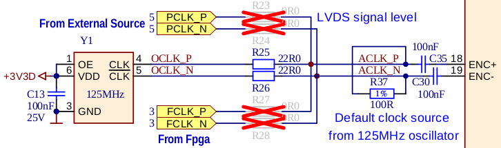

.. _top_125_14:

################
STEMlab 125-14
################

.. figure:: img/STEMlab-125-14.jpg
    :width: 500
    :align: center

|

.. contents:: Table of Contents
    :local:
    :depth: 1
    :backlinks: top

|

Overview
========

The STEMlab 125-14 is the original Red Pitaya board, a versatile and compact measurement and control platform designed for a wide range of applications in electronics, 
signal processing, and embedded systems development. It features a dual-core ARM Cortex-A9 processor, an FPGA Xilinx Zynq 7010 SoC, and high-speed ADCs and DACs, 
making it suitable for tasks such as data acquisition, signal generation, and real-time processing.

|

Features
========

* 14-bit, 125 MS/s ADC and DAC
* Dual-core ARM Cortex-A9 processor
* FPGA Xilinx Zynq 7010 SoC
* 512 MB RAM
* 16 digital I/Os, 4 analog inputs, 4 analog outputs
* Multiple communication interfaces: I2C, SPI, UART, CAN
* Micro USB connectivity for power and console
* SATA daisy-chain connectors for multi-board synchronisation

|

Quick Reference
===============

.. table::
    :widths: 40 60

    +----------------------------+--------------------------------------------------+
    | **Category**               | **Key Specifications**                           |
    +============================+==================================================+
    | ADC                        | 2 channels, 14-bit, 125 MS/s, DC-50 MHz          |
    +----------------------------+--------------------------------------------------+
    | DAC                        | 2 channels, 14-bit, 125 MS/s, DC-50 MHz          |
    +----------------------------+--------------------------------------------------+
    | Processor                  | Dual-core ARM Cortex-A9                          |
    +----------------------------+--------------------------------------------------+
    | FPGA                       | Xilinx Zynq 7010 SoC                             |
    +----------------------------+--------------------------------------------------+
    | RAM                        | 512 MB                                           |
    +----------------------------+--------------------------------------------------+
    | Digital I/O                | 16 GPIOs @ 3.3V                                  |
    +----------------------------+--------------------------------------------------+
    | Analog I/O                 | 4 inputs (12-bit), 4 outputs (8-bit)             |
    +----------------------------+--------------------------------------------------+
    | Connectivity               | Ethernet, USB, Extension connectors              |
    +----------------------------+--------------------------------------------------+

|

Board Layout & Pinout
======================

.. figure:: img/Red_Pitaya_pinout.jpg
    :alt: Red Pitaya pinout
    :width: 700
    :align: center

The pinout diagram shows all external connectors including RF inputs/outputs (IN1, IN2, OUT1, OUT2) and extension connectors (E1, E2).

|

Technical Specifications
=========================

.. table::
    :widths: 30 30 15 15

    +------------------------------------+------------------------------------+-----------+----------------------------------+
    | **Parameter**                      | **Value**                          | **Units** | **Notes**                        |
    +====================================+====================================+===========+==================================+
    | |br|                                                                                                                   |
    | **Basic**                                                                                                              |
    +------------------------------------+------------------------------------+-----------+----------------------------------+
    | Processor                          | Dual core ARM Cortex-A9            | \-        |                                  |
    +------------------------------------+------------------------------------+-----------+----------------------------------+
    | FPGA                               | FPGA AMD (Xilinx) Zynq 7010 SoC    | \-        |                                  |
    +------------------------------------+------------------------------------+-----------+----------------------------------+
    | RAM                                | 512                                | MB        | (4 Gb)                           |
    +------------------------------------+------------------------------------+-----------+----------------------------------+
    | Core clock frequency               | 125                                | MHz       |                                  |
    +------------------------------------+------------------------------------+-----------+----------------------------------+
    | System memory                      | Micro SD up to 32 GB               | \-        |                                  |
    +------------------------------------+------------------------------------+-----------+----------------------------------+
    | Serial console connector           | Micro USB                          | \-        |                                  |
    +------------------------------------+------------------------------------+-----------+----------------------------------+
    | Power connector                    | Micro USB                          | \-        |                                  |
    +------------------------------------+------------------------------------+-----------+----------------------------------+
    | Power consumption                  | 5 V, 2 A                           | \-        | max                              |
    +------------------------------------+------------------------------------+-----------+----------------------------------+
    | |br|                                                                                                                   |
    | **Connectivity**                                                                                                       |
    +------------------------------------+------------------------------------+-----------+----------------------------------+
    | Ethernet                           | 1                                  | Gbit      |                                  |
    +------------------------------------+------------------------------------+-----------+----------------------------------+
    | USB                                | USB-A 2.0                          | \-        |                                  |
    +------------------------------------+------------------------------------+-----------+----------------------------------+
    | Wi-Fi                              | Requires Wi-Fi dongle              | \-        |                                  |
    +------------------------------------+------------------------------------+-----------+----------------------------------+
    | |br|                                                                                                                   |
    | **RF inputs**                                                                                                          |
    +------------------------------------+------------------------------------+-----------+----------------------------------+
    | RF input channels                  | 2                                  | \-        |                                  |
    +------------------------------------+------------------------------------+-----------+----------------------------------+
    | Sampling rate                      | 125                                | MS/s      |                                  |
    +------------------------------------+------------------------------------+-----------+----------------------------------+
    | ADC resolution                     | 14                                 | bit       |                                  |
    +------------------------------------+------------------------------------+-----------+----------------------------------+
    | Input impedance                    | 1 MΩ / 10 pF                       | \-        |                                  |
    +------------------------------------+------------------------------------+-----------+----------------------------------+
    | Full scale voltage range           | | ±1 (LV)                          | V         |                                  |
    |                                    | | ±20 (HV)                         |           |                                  |
    +------------------------------------+------------------------------------+-----------+----------------------------------+
    | Input coupling                     | DC                                 | \-        |                                  |
    +------------------------------------+------------------------------------+-----------+----------------------------------+
    | Absolute max. input voltage        | | ±6 (LV)                          | V         | DC values [#f1]_                 |
    |                                    | | ±30 (HV)                         |           |                                  |
    +------------------------------------+------------------------------------+-----------+----------------------------------+
    | Input ESD protection               | 1500                               | V         | DC                               |
    +------------------------------------+------------------------------------+-----------+----------------------------------+
    | Overload protection                | Protection diodes                  | \-        |                                  |
    +------------------------------------+------------------------------------+-----------+----------------------------------+
    | Bandwidth                          | DC - 50                            | MHz       |                                  |
    +------------------------------------+------------------------------------+-----------+----------------------------------+
    | Connector type                     | SMA                                | \-        |                                  |
    +------------------------------------+------------------------------------+-----------+----------------------------------+
    | |br|                                                                                                                   |
    | **RF outputs**                                                                                                         |
    +------------------------------------+------------------------------------+-----------+----------------------------------+
    | RF output channels                 | 2                                  | \-        |                                  |
    +------------------------------------+------------------------------------+-----------+----------------------------------+
    | Sampling rate                      | 125                                | MS/s      |                                  |
    +------------------------------------+------------------------------------+-----------+----------------------------------+
    | DAC resolution                     | 14                                 | bit       |                                  |
    +------------------------------------+------------------------------------+-----------+----------------------------------+
    | Load impedance                     | 50 Ω                               | \-        |                                  |
    +------------------------------------+------------------------------------+-----------+----------------------------------+
    | Voltage range                      | ±1                                 | V         |                                  |
    +------------------------------------+------------------------------------+-----------+----------------------------------+
    | Output coupling                    | DC                                 | \-        |                                  |
    +------------------------------------+------------------------------------+-----------+----------------------------------+
    | Short circuit protection           | Yes                                | \-        |                                  |
    +------------------------------------+------------------------------------+-----------+----------------------------------+
    | Output slew rate                   | 2 V / 10 ns                        | \-        |                                  |
    +------------------------------------+------------------------------------+-----------+----------------------------------+
    | Bandwidth                          | DC - 50                            | MHz       |                                  |
    +------------------------------------+------------------------------------+-----------+----------------------------------+
    | Connector type                     | SMA                                | \-        |                                  |
    +------------------------------------+------------------------------------+-----------+----------------------------------+
    | |br|                                                                                                                   |
    | **Extension connectors**                                                                                               |
    +------------------------------------+------------------------------------+-----------+----------------------------------+
    | Digital GPIOs                      | 16                                 | \-        |                                  |
    +------------------------------------+------------------------------------+-----------+----------------------------------+
    | Digital voltage levels             | 3.3                                | V         |                                  |
    +------------------------------------+------------------------------------+-----------+----------------------------------+
    | Analog inputs                      | 4                                  | \-        |                                  |
    +------------------------------------+------------------------------------+-----------+----------------------------------+
    | Analog input voltage range         | 0 - 3.5                            | V         |                                  |
    +------------------------------------+------------------------------------+-----------+----------------------------------+
    | Analog input resolution            | 12                                 | bit       |                                  |
    +------------------------------------+------------------------------------+-----------+----------------------------------+
    | Analog input sampling rate         | 100                                | kS/s      |                                  |
    +------------------------------------+------------------------------------+-----------+----------------------------------+
    | Analog outputs                     | 4                                  | \-        |                                  |
    +------------------------------------+------------------------------------+-----------+----------------------------------+
    | Analog output voltage range        | 0 - 1.8                            | V         |                                  |
    +------------------------------------+------------------------------------+-----------+----------------------------------+
    | Analog output resolution           | 8                                  | bit       |                                  |
    +------------------------------------+------------------------------------+-----------+----------------------------------+
    | Analog output sampling rate        | ≲ 3.2                              | MS/s      |                                  |
    +------------------------------------+------------------------------------+-----------+----------------------------------+
    | Analog output bandwidth            | ≈ 160                              | kHz       |                                  |
    +------------------------------------+------------------------------------+-----------+----------------------------------+
    | Communication interfaces           | I2C, SPI, UART, CAN                | \-        |                                  |
    +------------------------------------+------------------------------------+-----------+----------------------------------+
    | Available voltages                 | +5, +3.3, -3.4                     | V         |                                  |
    +------------------------------------+------------------------------------+-----------+----------------------------------+
    | External ADC clock                 | No                                 | \-        | See [#f2]_                       |
    +------------------------------------+------------------------------------+-----------+----------------------------------+
    | |br|                                                                                                                   |
    | **Synchronisation**                                                                                                    |
    +------------------------------------+------------------------------------+-----------+----------------------------------+
    | External trigger input             | DIO0_P                             | \-        | E1 connector                     |
    +------------------------------------+------------------------------------+-----------+----------------------------------+
    | External trigger input impedance   | Hi-Z                               | \-        | Digital input                    |
    +------------------------------------+------------------------------------+-----------+----------------------------------+
    | Trigger output                     | DIO0_N                             | \-        | E1 connector [#f3]_              |
    +------------------------------------+------------------------------------+-----------+----------------------------------+
    | Daisy chain connectors (S1 & S2)   | Yes                                | \-        |                                  |
    +------------------------------------+------------------------------------+-----------+----------------------------------+
    | Daisy chain connectors speed       | up to 500                          | Mb/s      |                                  |
    +------------------------------------+------------------------------------+-----------+----------------------------------+
    | Daisy chain connectors type        | SATA                               | \-        |                                  |
    +------------------------------------+------------------------------------+-----------+----------------------------------+    
    | Ref. clock input                   | N/A                                | \-        |                                  |
    +------------------------------------+------------------------------------+-----------+----------------------------------+
    | Ref. clock frequency               | N/A                                | \-        |                                  |
    +------------------------------------+------------------------------------+-----------+----------------------------------+
    | Ref. clock connector type          | N/A                                | \-        |                                  |
    +------------------------------------+------------------------------------+-----------+----------------------------------+
    | |br|                                                                                                                   |
    | **Boot options**                                                                                                       |
    +------------------------------------+------------------------------------+-----------+----------------------------------+
    | SD card                            | Yes                                | \-        |                                  |
    +------------------------------------+------------------------------------+-----------+----------------------------------+
    | QSPI                               | Not populated                      | \-        |                                  |
    +------------------------------------+------------------------------------+-----------+----------------------------------+
    | eMMC                               | N/A                                | \-        |                                  |
    +------------------------------------+------------------------------------+-----------+----------------------------------+
    | |br|                                                                                                                   |
    | **Environmental Specifications**                                                                                       |
    +------------------------------------+------------------------------------+-----------+----------------------------------+
    | Operating Temperature Range        | 0 to 55                            | ℃         | With default heatsink            |
    +------------------------------------+------------------------------------+-----------+----------------------------------+
    | Operating Humidity Range           | < 90%                              | RH        |                                  |
    +------------------------------------+------------------------------------+-----------+----------------------------------+
    | Automatic Shutdown Temperature     | 85                                 | ℃         |                                  |
    +------------------------------------+------------------------------------+-----------+----------------------------------+
    | |br|                                                                                                                   |
    | **Dimensions**                                                                                                         |
    +------------------------------------+------------------------------------+-----------+----------------------------------+
    | Size (L x W x H)                   | 106.8 x 60.0 x 21.1                | mm        | See `Schematics`_ for details    |
    +------------------------------------+------------------------------------+-----------+----------------------------------+

.. warning::

    **Maximum Input Voltage**
    
    * **LV mode:** ±6 V absolute maximum
    * **HV mode:** ±30 V absolute maximum
    
    Exceeding these values may damage the board permanently.

.. seealso::

    For more detailed information, please refer to the |Original Gen comparison table|.

|

Performance & Measurements
============================
    
You can find the measurements of the fast analog frontend here:

* :ref:`Original Gen - STEMlab 125-14 <measurements_orig_gen>`.

|

.. _schematics_125_14:

Schematics & 3D Models
========================

Schematics
----------

* :download:`Schematics_STEM_125-14_v1.1.pdf <https://downloads.redpitaya.com/doc/Schematics/Schematics_STEM_125-14_v1.1.pdf>`.

.. note::

    Full hardware schematics for the Red Pitaya board are not available. Red Pitaya has open-source code but not open hardware schematics. 
    Nonetheless, development schematics are available. This schematic will give you information about hardware configuration, FPGA pin connections, and similar.

Mechanical Specifications & 3D Models
--------------------------------------

* STEP :download:`3D_STEM_125-14_v1.0.zip <https://downloads.redpitaya.com/doc/3D_models/3D_STEM_125-14_v1.0.zip>`.

|

Hardware Details
==================

Components
----------

The STEMlab 125-14 uses high-performance analog components from Linear Technology (now Analog Devices) for the signal chain.

**ADC:** Analog Devices `LTC2145-14 <https://www.analog.com/en/products/ltc2145-14.html>`_

    * Dual 14-bit, 125 MS/s ADC
    * Low power consumption
    * High dynamic range

**DAC:** Analog Devices `AD9767 <https://www.analog.com/en/products/AD9767.html>`_

    * Dual 14-bit, 125 MS/s DAC
    * High SFDR performance
    * Low power operation

**FPGA:** Xilinx `Zynq 7010 <https://docs.xilinx.com/v/u/en-US/ds190-Zynq-7000-Overview>`_

    * Dual-core ARM Cortex-A9 @ 667 MHz
    * Programmable logic fabric
    * Integrated peripherals and memory controllers

**Oscillator:** `125 MHz oscillator <https://eu.mouser.com/datasheet/2/417/bf-8746.pdf>`_

    * High-precision 125 MHz reference oscillator

**DC-DC Converter:** `LTC3615 <https://www.analog.com/en/products/LTC3615.html>`_

    * High-efficiency step-down regulator

**DDR3 SRAM:** `MT41J256M16HA-125 <https://www.digikey.com/en/products/detail/micron-technology-inc/MT41J256M16HA-125-E/4315785>`_

    * 512 MB DDR3 RAM

**QSPI Flash:** `S25FL128SAGNFI001 <https://www.infineon.com/cms/en/product/memories/nor-flash/standard-spi-nor-flash/quad-spi-flash/s25fl128sagnfi001/>`_

    * Not populated on standard boards

|

Extension Connectors & Interfaces
===================================

Overview
---------

The STEMlab 125-14 board features the following connectors and interfaces:

* **E1 and E2 connectors:** Primary expansion connectors with digital I/O, analog I/O, and communication interfaces. These connectors allow users to interface with additional hardware, sensors, or peripherals, enhancing the board's capabilities.
* **S1 and S2 connectors:** Daisy-chain connectors for synchronising multiple Red Pitaya boards. These connectors enable clock and trigger synchronisation between boards.

|

Connector Physical Specifications
----------------------------------

**E1 and E2 Extension Connectors:**

* Connector type: `2 x 13 pins IDC 2.54 mm pitch <https://www.digikey.com/en/products/detail/adam-tech/BHR-26-VUA/9832284>`_
* Pin count: 26 pins each (2x13 configuration)
* Pitch: 2.54 mm (0.1")

**Mating Connectors:**

.. note::

    When looking for mating connectors for custom Red Pitaya shields, `double height elevated sockets <https://www.digikey.com/en/products/detail/samtec-inc/ESW-113-33-T-D/6693225>`_ are needed to clear the heatsink and ethernet connector on the board.
    Any connectors with *insulation height* of 0.635" (16.13 mm) or greater will work. This clearance requirement is based on the tallest components on the Red Pitaya board (heatsink and ethernet connector).

.. note::

    To prevent damage to the board or the shield, when connecting shields to the E1 and E2 connectors, please ensure:
    
    * **Proper alignment of connectors** - ensure the connectors are correctly aligned. The connectors on the Red Pitaya board have additional space in the socket housing, making it possible 
      to misalign the shields by ±1 pin while still appearing physically connected. This can cause damage to the board and/or the shield, so please double-check the alignment before powering on the board.
    * **Tight-fitting counterparts** - use connectors that fit securely to prevent accidental disconnections or damage.

|

E1 Connector - Digital I/O & CAN
----------------------------------

.. include:: ../_specs_common/E1_connector_7010.inc

|

E2 Connector - Analog & Communication
--------------------------------------

.. include:: ../_specs_common/E2_connector_125-14.inc

|

Auxiliary Analog Inputs & Outputs
------------------------------------

.. include:: ../_specs_common/slow_analog_io.inc

|

General Purpose Digital I/O Channels
--------------------------------------

.. table::
    :widths: 30 30 15 15

    +------------------------------------+------------------------------------+-----------+------------------------+
    | **Parameter**                      | **Value**                          | **Units** | **Notes**              |
    +====================================+====================================+===========+========================+
    | Number of GPIOs                    | 16                                 | \-        |                        |
    +------------------------------------+------------------------------------+-----------+------------------------+
    | Digital voltage level              | 3.3                                | V         |                        |
    +------------------------------------+------------------------------------+-----------+------------------------+
    | Abs. min. voltage                  | -0.40                              | V         |                        |
    +------------------------------------+------------------------------------+-----------+------------------------+
    | Abs. max. voltage                  | 3.3 + 0.55                         | V         |                        |
    +------------------------------------+------------------------------------+-----------+------------------------+
    | Current limitation                 | < 8                                | mA        | Drive strength         |
    +------------------------------------+------------------------------------+-----------+------------------------+
    | Direction                          | Configurable                       | \-        |                        |
    +------------------------------------+------------------------------------+-----------+------------------------+
    | Time resolution                    | 8                                  | ns        | (1/125 MHz)            |
    +------------------------------------+------------------------------------+-----------+------------------------+
    | Connector location                 | Extension connector |E1|           | \-        |                        |
    +------------------------------------+------------------------------------+-----------+------------------------+

|

Synchronisation Connectors (S1 & S2)
--------------------------------------

.. include:: ../_specs_common/Sync_connectors_SATA.inc
    
|

Advanced Features
==================

Power Supply
-------------

.. include:: ../_specs_common/power_supply.inc

|

External ADC Clock
-------------------

.. note::

    The standard STEMlab 125-14 does not support external ADC clock without hardware modification. If you need external clock support without modification, consider these pre-modified boards:
    
    * :ref:`STEMlab 125-14 External Clock <top_125_14_EXT>` - Board with external clock capability
    * :ref:`STEMlab 125-14 4-Input <top_125_14_4IN>` - Board with 4 input channels and external clock capability

.. _external_125_14:

**Clock Sources**

The ADC clock can be provided from three sources:

* **On-board 125 MHz oscillator (default):** Internal clock source
* **External source through E2 connector:** External clock via Ext. ADC Clk± pins (requires hardware modification: R25, R26 → R23, R24)
* **SATA connectors (from FPGA):** For X-channel secondary/slave configuration (requires hardware modification: R25, R26 → R27, R28)

    Clock source options for the ADC

|

**External Clock Specifications**

The external ADC clock should be a differential LVDS signal:

+-------------------------------------------------------+----------------------------------------------+---------+---------+---------+---------+
| Parameter                                             | Description                                  | Min     | Typ     | Max     | Unit    |
+=============================+=========================+==============================================+=========+=========+=========+=========+
|                             | Clock input pins        | 23 (Clk+) and 24 (Clk-) on |E2|              |         |         |         |         |
+-----------------------------+-------------------------+----------------------------------------------+---------+---------+---------+---------+
|                             | Input standards         | LVDS                                         |         |         |         |         |
+-----------------------------+-------------------------+----------------------------------------------+---------+---------+---------+---------+
|                             | Input clock coupling    | AC (on-board capacitors)                     |         |         |         |         |
+-----------------------------+-------------------------+----------------------------------------------+---------+---------+---------+---------+
| :math:`f_{CLK}`             | Input frequency range   |                                              | 1       | 125     | 125     | MHz     |
+-----------------------------+-------------------------+----------------------------------------------+---------+---------+---------+---------+
| :math:`V_{ID,DIFF,PP}`      | Input voltage swing     | Differential peak-to-peak                    |         | 0.35    | 0.8     | V       |
+-----------------------------+-------------------------+----------------------------------------------+---------+---------+---------+---------+
| IDC                         | Input clock duty cycle  |                                              | 45%     |         | 55%     |         |
+-----------------------------+-------------------------+----------------------------------------------+---------+---------+---------+---------+

|

**Hardware Modification Instructions**

To enable external clock input, SMD resistors must be relocated on the PCB:

1.  Remove R25 and R26 from the top side of the board

    .. figure:: img/schematics/External_clock_top.png
        :alt: Top side schematic
        :align: center
        :width: 400

        Top side schematic

2.  Relocate the desoldered resistors from R25 and R26 to:

    * **R23 and R24** for external clock (Ext. ADC CLK± pins on E2 connector)
    * **R27 and R28** for X-channel secondary (SATA connectors)

    .. figure:: img/schematics/External_clock_bottom_photo.png
        :alt: Bottom side photo
        :align: center
        :width: 400

        Bottom side photo showing the location of the resistors

    .. figure:: img/schematics/External_clock_resistors.jpeg
        :alt: Full schematic with highlighted resistors
        :align: center
        :width: 400

        Full schematic with highlighted resistor positions

.. warning::

    **Changing the external clock frequency during operation is not supported**

    The Red Pitaya FPGA is designed, tested, and guaranteed to operate correctly at 125 MHz.
    
    While it is possible to run the board at different clock frequencies, please be aware that:
    
    * The FPGA may not function as intended at non-standard frequencies and requires thorough testing
    * The ADC and DAC sampling rates will change proportionally with the clock frequency
    * Lower clock frequencies will reduce the analog bandwidth of the board
    * Red Pitaya does not guarantee proper operation at frequencies other than 125 MHz
    
    The board will boot with any valid external clock signal. OS versions 2.07-48 and higher do not block boot-up if the external clock is absent.

.. warning::

    Any non-Red Pitaya hardware modification will void the warranty, and we cannot guarantee support for modified boards.

|

QSPI Flash
-----------

The QSPI flash chip is by default not populated on Red Pitaya boards. For further information on board modifications, please contact support@redpitaya.com or info@redpitaya.com.

.. warning::

    Any non-Red Pitaya hardware modification will void the warranty, and we cannot guarantee support for modified boards.

|

Calibration
------------

.. include:: ../_specs_common/calibration.inc

|

Additional Resources
====================

For additional specifications and measurements, please refer to:

* |Original Gen hardware specs| - Common Original Gen specifications
* |Original Gen comparison table| - Comparison across all Red Pitaya Original Gen models

|

Legal & Disclaimers
===================

.. include:: ../_specs_common/disclaimer.inc

|

.. rubric:: Footnotes

.. [#f1] The absolute maximum input voltage values are for frequencies below 1 kHz. For higher frequencies, please use the input voltage range specifications as **Absolute maximum**.
.. [#f2] See the :ref:`STEMlab 125-14 External Clock <top_125_14_EXT>` board for more information, or refer to the :ref:`External ADC Clock section <external_125_14>` for hardware modification instructions.
.. [#f3] See the :ref:`X-channel 2.0 (Click Shield) synchronisation <click_shield_sync>` and :ref:`X-channel 2.0 (Click Shield) synchronisation examples <examples_multiboard_sync>` for trigger output configuration.
.. [#f7] Red Pitaya Version 1.0 has -3.3 V on pin 2. Red Pitaya Version 1.1 has -3.4 V on pin 2.
.. [#f8] The default software enables sampling at a CPU-dependent speed. To acquire data at a 100 kS/s rate, additional FPGA processing must be implemented.
.. [#f9] The output is passed through a first-order low-pass filter. Should additional filtering be required, this can be applied externally in line with the specific requirements of the application.
.. [#f10] Application specific. The output current is shared between the extension connectors and the connected USB devices, and can be higher if other peripheral units are not in use.

.. substitutions

.. |E1| replace:: :ref:`E1 connector <E1_orig_gen>`
.. |E2| replace:: :ref:`E2 connector <E2_orig_gen>`
.. |Original Gen hardware specs| replace:: :ref:`Original Gen hardware specifications <hw_specs_orig_gen>`
.. |Original Gen comparison table| replace:: :ref:`Original Gen board comparison table <rp-board-comp-orig_gen>`
