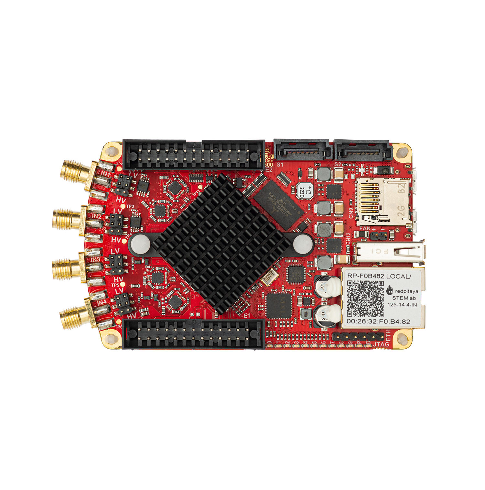
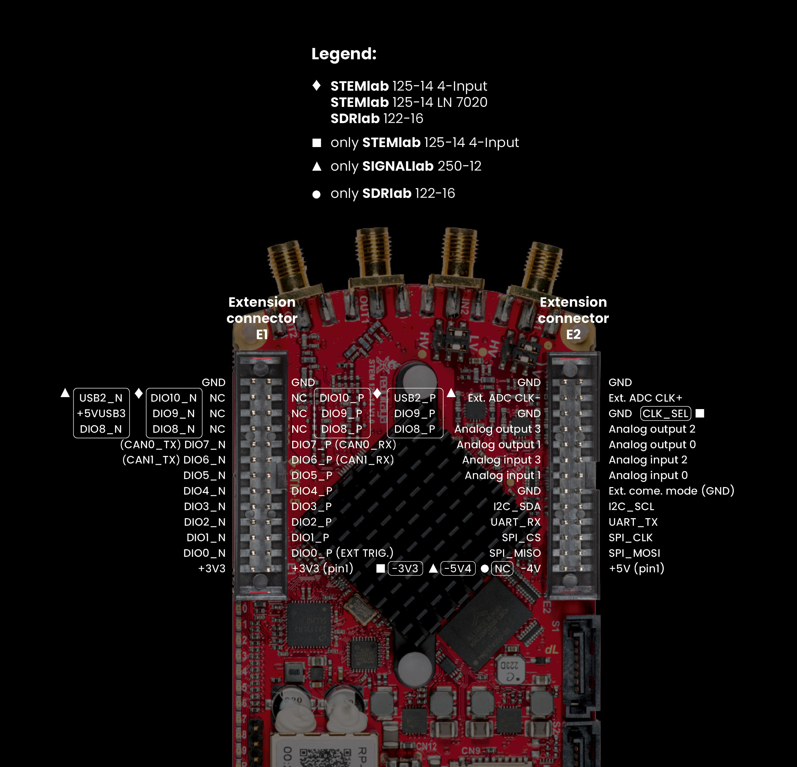
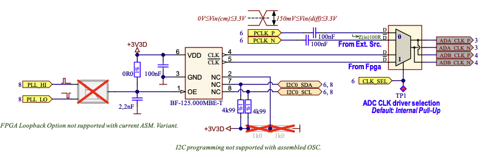

.. _top_125_14_4-IN:

#######################
STEMlab 125-14 4-Input
#######################

|

.. contents:: Table of Contents
    :local:
    :depth: 1
    :backlinks: top

|

Overview
========

STEMlab 125-14 4-Input is a specialized single-board RF signal acquisition platform offering 4 analog input channels instead of the standard 2 inputs and 2 outputs configuration.
The board features improved RF performance with reduced crosstalk, noise, and distortions, and a more powerful Zynq 7020 FPGA compared to the standard STEMlab 125-14.
The integrated CLK_SEL control pin on the |E2| connector enables seamless switching between the on-board oscillator and an external clock source without any hardware modification.

|

Key Differences from Standard STEMlab 125-14
=============================================

* **4 analog input channels** @ 125 MS/s & 14-bit (instead of 2 inputs + 2 outputs)
* **No RF outputs** — all SMA connectors dedicated to inputs
* **Improved RF performance:** Reduced crosstalk, noise, and distortions
* **Zynq 7020 FPGA:** More processing capability and 22 digital I/O pins (vs 16 on 7010 boards)
* **External clock support:** Hardware-integrated with CLK_SEL pin (pin 21 on |E2|) — no hardware modification required

|

Features
========

* 14-bit, 125 MS/s ADC with 4 input channels
* No analog RF outputs (all channels dedicated to inputs)
* Improved RF input performance (reduced crosstalk, noise, distortions)
* Dual-core ARM Cortex-A9 processor
* FPGA Xilinx Zynq 7020 SoC
* 512 MB RAM
* 22 digital I/Os (6 more than standard Zynq 7010 boards)
* 4 analog inputs and 4 analog outputs on extension connector
* External clock input with hardware-selectable clock source (CLK_SEL pin)
* Multiple communication interfaces: I2C, SPI, UART, CAN

|

Quick Reference
===============

.. table::
    :widths: 40 60

    +----------------------------+--------------------------------------------------+
    | **Category**               | **Key Specifications**                           |
    +============================+==================================================+
    | ADC                        | 4 channels, 14-bit, 125 MS/s, DC-50 MHz          |
    +----------------------------+--------------------------------------------------+
    | DAC                        | None (no RF outputs)                             |
    +----------------------------+--------------------------------------------------+
    | Processor                  | Dual-core ARM Cortex-A9                          |
    +----------------------------+--------------------------------------------------+
    | FPGA                       | Xilinx Zynq 7020 SoC                             |
    +----------------------------+--------------------------------------------------+
    | RAM                        | 512 MB                                           |
    +----------------------------+--------------------------------------------------+
    | Digital I/O                | 22 GPIOs @ 3.3V                                  |
    +----------------------------+--------------------------------------------------+
    | Analog I/O                 | 4 inputs (12-bit), 4 outputs (8-bit)             |
    +----------------------------+--------------------------------------------------+
    | Connectivity               | Ethernet, USB, Extension connectors              |
    +----------------------------+--------------------------------------------------+
    | Special Features           | External ADC clock                               |
    +----------------------------+--------------------------------------------------+

|

Board Layout & Pinout
======================

|

Technical Specifications
=========================

.. table::
    :widths: 30 30 15 15

    +------------------------------------+------------------------------------+-----------+----------------------------------+
    | **Parameter**                      | **Value**                          | **Units** | **Notes**                        |
    +====================================+====================================+===========+==================================+
    | |br|                                                                                                                   |
    | **Basic**                                                                                                              |
    +------------------------------------+------------------------------------+-----------+----------------------------------+
    | Processor                          | Dual core ARM Cortex-A9            | \-        |                                  |
    +------------------------------------+------------------------------------+-----------+----------------------------------+
    | FPGA                               | FPGA AMD (Xilinx) Zynq 7020 SoC    | \-        |                                  |
    +------------------------------------+------------------------------------+-----------+----------------------------------+
    | RAM                                | 512                                | MB        | (4 Gb)                           |
    +------------------------------------+------------------------------------+-----------+----------------------------------+
    | Core clock frequency               | 125                                | MHz       |                                  |
    +------------------------------------+------------------------------------+-----------+----------------------------------+
    | System memory                      | Micro SD up to 32 GB               | \-        |                                  |
    +------------------------------------+------------------------------------+-----------+----------------------------------+
    | Serial console connector           | Micro USB                          | \-        |                                  |
    +------------------------------------+------------------------------------+-----------+----------------------------------+
    | Power connector                    | Micro USB                          | \-        |                                  |
    +------------------------------------+------------------------------------+-----------+----------------------------------+
    | Power consumption                  | 5 V, 2 A                           | \-        | max                              |
    +------------------------------------+------------------------------------+-----------+----------------------------------+
    | |br|                                                                                                                   |
    | **Connectivity**                                                                                                       |
    +------------------------------------+------------------------------------+-----------+----------------------------------+
    | Ethernet                           | 1                                  | Gbit      |                                  |
    +------------------------------------+------------------------------------+-----------+----------------------------------+
    | USB                                | USB-A 2.0                          | \-        |                                  |
    +------------------------------------+------------------------------------+-----------+----------------------------------+
    | Wi-Fi                              | Requires Wi-Fi dongle              | \-        |                                  |
    +------------------------------------+------------------------------------+-----------+----------------------------------+
    | |br|                                                                                                                   |
    | **RF inputs**                                                                                                          |
    +------------------------------------+------------------------------------+-----------+----------------------------------+
    | RF input channels                  | 4                                  | \-        |                                  |
    +------------------------------------+------------------------------------+-----------+----------------------------------+
    | Sampling rate                      | 125                                | MS/s      |                                  |
    +------------------------------------+------------------------------------+-----------+----------------------------------+
    | ADC resolution                     | 14                                 | bit       |                                  |
    +------------------------------------+------------------------------------+-----------+----------------------------------+
    | Input impedance                    | 1 MΩ / 10 pF                       | \-        |                                  |
    +------------------------------------+------------------------------------+-----------+----------------------------------+
    | Full scale voltage range           | | ±1 (LV)                          | V         |                                  |
    |                                    | | ±20 (HV)                         |           |                                  |
    +------------------------------------+------------------------------------+-----------+----------------------------------+
    | Input coupling                     | DC                                 | \-        |                                  |
    +------------------------------------+------------------------------------+-----------+----------------------------------+
    | Absolute max. input voltage        | | ±6 (LV)                          | V         | DC values [#f1]_                 |
    |                                    | | ±30 (HV)                         |           |                                  |
    +------------------------------------+------------------------------------+-----------+----------------------------------+
    | Input ESD protection               | 1500                               | V         | DC                               |
    +------------------------------------+------------------------------------+-----------+----------------------------------+
    | Overload protection                | Protection diodes                  | \-        |                                  |
    +------------------------------------+------------------------------------+-----------+----------------------------------+
    | Bandwidth                          | DC - 50                            | MHz       |                                  |
    +------------------------------------+------------------------------------+-----------+----------------------------------+
    | Connector type                     | SMA                                | \-        |                                  |
    +------------------------------------+------------------------------------+-----------+----------------------------------+
    | |br|                                                                                                                   |
    | **RF outputs**                                                                                                         |
    +------------------------------------+------------------------------------+-----------+----------------------------------+
    | RF output channels                 | N/A                                | \-        |                                  |
    +------------------------------------+------------------------------------+-----------+----------------------------------+
    | Sampling rate                      | N/A                                | \-        |                                  |
    +------------------------------------+------------------------------------+-----------+----------------------------------+
    | DAC resolution                     | N/A                                | \-        |                                  |
    +------------------------------------+------------------------------------+-----------+----------------------------------+
    | Load impedance                     | N/A                                | \-        |                                  |
    +------------------------------------+------------------------------------+-----------+----------------------------------+
    | Voltage range                      | N/A                                | \-        |                                  |
    +------------------------------------+------------------------------------+-----------+----------------------------------+
    | Output coupling                    | N/A                                | \-        |                                  |
    +------------------------------------+------------------------------------+-----------+----------------------------------+
    | Short circuit protection           | N/A                                | \-        |                                  |
    +------------------------------------+------------------------------------+-----------+----------------------------------+
    | Output slew rate                   | N/A                                | \-        |                                  |
    +------------------------------------+------------------------------------+-----------+----------------------------------+
    | Bandwidth                          | N/A                                | \-        |                                  |
    +------------------------------------+------------------------------------+-----------+----------------------------------+
    | Connector type                     | N/A                                | \-        |                                  |
    +------------------------------------+------------------------------------+-----------+----------------------------------+
    | |br|                                                                                                                   |
    | **Extension connectors**                                                                                               |
    +------------------------------------+------------------------------------+-----------+----------------------------------+
    | Digital GPIOs                      | 22                                 | \-        |                                  |
    +------------------------------------+------------------------------------+-----------+----------------------------------+
    | Digital voltage levels             | 3.3                                | V         |                                  |
    +------------------------------------+------------------------------------+-----------+----------------------------------+
    | Analog inputs                      | 4                                  | \-        |                                  |
    +------------------------------------+------------------------------------+-----------+----------------------------------+
    | Analog input voltage range         | 0 - 3.5                            | V         |                                  |
    +------------------------------------+------------------------------------+-----------+----------------------------------+
    | Analog input resolution            | 12                                 | bit       |                                  |
    +------------------------------------+------------------------------------+-----------+----------------------------------+
    | Analog input sampling rate         | 100                                | kS/s      |                                  |
    +------------------------------------+------------------------------------+-----------+----------------------------------+
    | Analog outputs                     | 4                                  | \-        |                                  |
    +------------------------------------+------------------------------------+-----------+----------------------------------+
    | Analog output voltage range        | 0 - 1.8                            | V         |                                  |
    +------------------------------------+------------------------------------+-----------+----------------------------------+
    | Analog output resolution           | 8                                  | bit       |                                  |
    +------------------------------------+------------------------------------+-----------+----------------------------------+
    | Analog output sampling rate        | ≲ 3.2                              | MS/s      |                                  |
    +------------------------------------+------------------------------------+-----------+----------------------------------+
    | Analog output bandwidth            | ≈ 160                              | kHz       |                                  |
    +------------------------------------+------------------------------------+-----------+----------------------------------+
    | Communication interfaces           | I2C, SPI, UART, CAN                | \-        |                                  |
    +------------------------------------+------------------------------------+-----------+----------------------------------+
    | Available voltages                 | +5, ±3.3                           | V         |                                  |
    +------------------------------------+------------------------------------+-----------+----------------------------------+
    | External ADC clock                 | Yes                                | \-        | CLK_SEL pin on |E2|              |
    +------------------------------------+------------------------------------+-----------+----------------------------------+
    | |br|                                                                                                                   |
    | **Synchronisation**                                                                                                    |
    +------------------------------------+------------------------------------+-----------+----------------------------------+
    | External trigger input             | DIO0_P                             | \-        | E1 connector                     |
    +------------------------------------+------------------------------------+-----------+----------------------------------+
    | External trigger input impedance   | Hi-Z                               | \-        | Digital input                    |
    +------------------------------------+------------------------------------+-----------+----------------------------------+
    | Trigger output                     | DIO0_N                             | \-        | E1 connector [#f3]_              |
    +------------------------------------+------------------------------------+-----------+----------------------------------+
    | Daisy chain connectors (S1 & S2)   | Yes                                | \-        |                                  |
    +------------------------------------+------------------------------------+-----------+----------------------------------+
    | Daisy chain connectors speed       | up to 500                          | Mb/s      |                                  |
    +------------------------------------+------------------------------------+-----------+----------------------------------+
    | Daisy chain connectors type        | SATA                               | \-        |                                  |
    +------------------------------------+------------------------------------+-----------+----------------------------------+
    | Ref. clock input                   | Yes [#f4]_                         | \-        | Requires hardware modification   |
    +------------------------------------+------------------------------------+-----------+----------------------------------+
    | Ref. clock frequency               | 10                                 | MHz       | Requires hardware modification   |
    +------------------------------------+------------------------------------+-----------+----------------------------------+
    | Ref. clock connector type          | 2-pin header                       | \-        | Requires hardware modification   |
    +------------------------------------+------------------------------------+-----------+----------------------------------+
    | |br|                                                                                                                   |
    | **Boot options**                                                                                                       |
    +------------------------------------+------------------------------------+-----------+----------------------------------+
    | SD card                            | Yes                                | \-        |                                  |
    +------------------------------------+------------------------------------+-----------+----------------------------------+
    | QSPI                               | Not populated                      | \-        |                                  |
    +------------------------------------+------------------------------------+-----------+----------------------------------+
    | eMMC                               | N/A                                | \-        |                                  |
    +------------------------------------+------------------------------------+-----------+----------------------------------+
    | |br|                                                                                                                   |
    | **Environmental Specifications**                                                                                       |
    +------------------------------------+------------------------------------+-----------+----------------------------------+
    | Operating Temperature Range        | 0 to 55                            | ℃         | With default heatsink            |
    +------------------------------------+------------------------------------+-----------+----------------------------------+
    | Operating Humidity Range           | < 90%                              | RH        |                                  |
    +------------------------------------+------------------------------------+-----------+----------------------------------+
    | Automatic Shutdown Temperature     | 85                                 | ℃         |                                  |
    +------------------------------------+------------------------------------+-----------+----------------------------------+
    | |br|                                                                                                                   |
    | **Dimensions**                                                                                                         |
    +------------------------------------+------------------------------------+-----------+----------------------------------+
    | Size (L x W x H)                   | 106.8 x 60.0 x 21.1                | mm        | See `Schematics`_ for details    |
    +------------------------------------+------------------------------------+-----------+----------------------------------+

.. seealso::

    For more detailed information, please refer to the |Original Gen comparison table|.

|

.. warning::

    **Maximum Input Voltage**

    * **LV mode:** ±6 V absolute maximum
    * **HV mode:** ±30 V absolute maximum

    Exceeding these values may damage the board permanently.

|

Performance & Measurements
============================

.. note::

    Although specific measurements for the STEMlab 125-14 4-Input board have not been published, it is expected to fall within the measurement range of the STEMlab 125-14 and STEMlab 125-14 Gen 2 boards.
    The 4-Input board was produced immediately prior to the STEMlab 125-14 Gen 2 and incorporates some of the Gen 2 analog front-end improvements.

You can find the measurements of the fast analog frontend here:

* :ref:`Original Gen - STEMlab 125-14 <measurements_orig_gen>`.
* :ref:`Gen 2 - STEMlab 125-14 Gen 2 <measurements_gen2>`.

|

.. _schematics_125_14_4_IN:

Schematics & 3D Models
========================

Schematics
----------

* :download:`Schematics_STEM_125-14-4_IN_V1r3.pdf <https://downloads.redpitaya.com/doc/Schematics/Schematics_STEM_125-14-4_IN_V1r3.pdf>`.

.. note::

    Full hardware schematics for the Red Pitaya board are not available. Red Pitaya has open-source code but not open hardware schematics. Nonetheless, development schematics are available. 
    This schematic will give you information about hardware configuration, FPGA pin connections, and similar.

Mechanical Specifications & 3D Models
--------------------------------------

.. * PDF :download:`3D_STEM_125-14-4_IN_V1r3.pdf.zip <https://downloads.redpitaya.com/doc/3D_models/3D_STEM_125-14-4_IN_V1r3.pdf.zip>`.

* STEP :download:`3D_STEM_125-14-4_IN_V1r3.zip <https://downloads.redpitaya.com/doc/3D_models/3D_STEM_125-14-4_IN_V1r3.zip>`.

|

Hardware Details
==================

Components
----------

**ADC:** Analog Devices `LTC2145-14 <https://www.analog.com/en/products/ltc2145-14.html>`_

    * Dual 14-bit, 125 MS/s ADC
    * Low noise and distortion
    * High dynamic range

.. note::

    The 4-Input board uses two LTC2145-14 ADC chips to achieve 4 input channels.

**FPGA:** Xilinx `Zynq 7020 <https://docs.xilinx.com/v/u/en-US/ds190-Zynq-7000-Overview>`_

    * Dual-core ARM Cortex-A9 @ 667 MHz
    * Larger programmable logic fabric than Zynq 7010
    * 22 digital I/Os on the E1 extension connector

**Oscillator:** `IQ3309 <https://eu.mouser.com/datasheet/2/417/bf-8746.pdf>`_ 125 MHz

    * Provides the default ADC clock
    * Bypassed when CLK_SEL = GND (external clock mode)

|

Extension Connectors & Interfaces
===================================

Overview
---------

The STEMlab 125-14 4-Input board features the following connectors and interfaces:

* **E1 and E2 connectors:** Primary expansion connectors with digital I/O, analog I/O, and communication interfaces. These connectors allow users to interface with additional hardware, sensors, or peripherals.
* **S1 and S2 connectors:** SATA connectors connected directly to the FPGA. Unlike the STEMlab 125-14, this board does not support multi-board clock synchronisation through these connectors — the shared 
  clock signal does not propagate to the ADC and DAC. They can still be used to exchange clock, trigger, or data signals between boards or external devices. Note that the voltage levels are 1V8, 
  which is non-standard for SATA connections.

|

Connector Physical Specifications
----------------------------------

**E1 and E2 Extension Connectors:**

* Connector type: `2 x 13 pins IDC 2.54 mm pitch <https://www.digikey.com/en/products/detail/adam-tech/BHR-26-VUA/9832284>`_
* Pin count: 26 pins each (2x13 configuration)
* Pitch: 2.54 mm (0.1")

**Mating Connectors:**

.. note::

    When looking for mating connectors for custom Red Pitaya shields, `double height elevated sockets <https://www.digikey.com/en/products/detail/samtec-inc/ESW-113-33-T-D/6693225>`_ are needed to clear the heatsink and ethernet connector on the board.
    Any connectors with *insulation height* of 0.635" (16.13 mm) or greater will work. This clearance requirement is based on the tallest components on the Red Pitaya board (heatsink and ethernet connector).

.. note::

    To prevent damage to the board or the shield, when connecting shields to the E1 and E2 connectors, please ensure:

    * **Proper alignment of connectors** - ensure the connectors are correctly aligned. The connectors on the Red Pitaya board have additional space in the socket housing, making it possible
      to misalign the shields by ±1 pin while still appearing physically connected. This can cause damage to the board and/or the shield, so please double-check the alignment before powering on the board.
    * **Tight-fitting counterparts** - use connectors that fit securely to prevent accidental disconnections or damage.

|

.. _E1_4IN:

E1 Connector - Digital I/O & CAN
----------------------------------

.. include:: ../_specs_common/E1_connector_7020.inc

|

.. _E2_4IN:

E2 Connector - Analog & Communication
--------------------------------------

The E2 extension connector provides analog I/O and communication interfaces, and houses the **CLK_SEL** pin for switching between the on-board oscillator and an external ADC clock.

**Features:**

* +5 V power source (max 0.5 A, shared with USB devices)
* -3.4 V power source (max 0.05 A) [#f7]_
* SPI, UART, I2C communication interfaces
* 4 slow ADCs (12-bit, 100 kS/s)
* 4 slow DACs (8-bit PWM, ≲ 3.2 MS/s)
* CLK_SEL pin (pin 21): GND = external clock, 3V3/floating = internal clock
* External ADC clock input on pins 23-24 (Ext. ADC Clk±)

**E2 Pinout:**

+-----+------------------------+-------------------+-----------------------------------------------+----------------+
| Pin | Description            | FPGA pin number   | FPGA pin description                          | Voltage levels |
+=====+========================+===================+===============================================+================+
| 1   | +5V                    |                   |                                               |                |
+-----+------------------------+-------------------+-----------------------------------------------+----------------+
| 2   | -3.4V [#f7]_           |                   |                                               |                |
+-----+------------------------+-------------------+-----------------------------------------------+----------------+
| 3   | SPI (MOSI)             | E9                | PS_MIO10_500                                  | 3V3            |
+-----+------------------------+-------------------+-----------------------------------------------+----------------+
| 4   | SPI (MISO)             | C6                | PS_MIO11_500                                  | 3V3            |
+-----+------------------------+-------------------+-----------------------------------------------+----------------+
| 5   | SPI (SCK)              | D9                | PS_MIO12_500                                  | 3V3            |
+-----+------------------------+-------------------+-----------------------------------------------+----------------+
| 6   | SPI (CS)               | E8                | PS_MIO13_500                                  | 3V3            |
+-----+------------------------+-------------------+-----------------------------------------------+----------------+
| 7   | UART (TX)              | D5                | PS_MIO8_500                                   | 3V3            |
+-----+------------------------+-------------------+-----------------------------------------------+----------------+
| 8   | UART (RX)              | B5                | PS_MIO9_500                                   | 3V3            |
+-----+------------------------+-------------------+-----------------------------------------------+----------------+
| 9   | I2C (SCL)              | B13               | PS_MIO50_501                                  | 3V3            |
+-----+------------------------+-------------------+-----------------------------------------------+----------------+
| 10  | I2C (SDA)              | B9                | PS_MIO51_501                                  | 3V3            |
+-----+------------------------+-------------------+-----------------------------------------------+----------------+
| 11  | Ext com. mode (AIN)    |                   |                                               | GND (default)  |
+-----+------------------------+-------------------+-----------------------------------------------+----------------+
| 12  | GND                    |                   |                                               |                |
+-----+------------------------+-------------------+-----------------------------------------------+----------------+
| 13  | Analog Input 0         | B19, A20          | IO_L2P_T0_AD8P_35, IO_L2N_T0_AD8N_35          | 0-3.5 V        |
+-----+------------------------+-------------------+-----------------------------------------------+----------------+
| 14  | Analog Input 1         | C20, B20          | IO_L1P_T0_AD0P_35, IO_L1N_T0_AD0N_35          | 0-3.5 V        |
+-----+------------------------+-------------------+-----------------------------------------------+----------------+
| 15  | Analog Input 2         | E17, D18          | IO_L3P_T0_DQS_AD1P_35, IO_L3N_T0_DQS_AD1N_35  | 0-3.5 V        |
+-----+------------------------+-------------------+-----------------------------------------------+----------------+
| 16  | Analog Input 3         | E18, E19          | IO_L5P_T0_AD9P_35, IO_L5N_T0_AD9N_35          | 0-3.5 V        |
+-----+------------------------+-------------------+-----------------------------------------------+----------------+
| 17  | Analog Output 0        | T10               | IO_L1N_T0_34                                  | 0-1.8 V        |
+-----+------------------------+-------------------+-----------------------------------------------+----------------+
| 18  | Analog Output 1        | T11               | IO_L1P_T0_34                                  | 0-1.8 V        |
+-----+------------------------+-------------------+-----------------------------------------------+----------------+
| 19  | Analog Output 2        | P15               | IO_L24P_T3_34                                 | 0-1.8 V        |
+-----+------------------------+-------------------+-----------------------------------------------+----------------+
| 20  | Analog Output 3        | U13               | IO_L3P_T0_DQS_PUDC_B_34                       | 0-1.8 V        |
+-----+------------------------+-------------------+-----------------------------------------------+----------------+
| 21  | CLK_SEL                |                   |                                               | 3.3V / GND     |
+-----+------------------------+-------------------+-----------------------------------------------+----------------+
| 22  | GND                    |                   |                                               |                |
+-----+------------------------+-------------------+-----------------------------------------------+----------------+
| 23  | Ext. ADC Clk+          |                   |                                               | LVDS           |
+-----+------------------------+-------------------+-----------------------------------------------+----------------+
| 24  | Ext. ADC Clk-          |                   |                                               | LVDS           |
+-----+------------------------+-------------------+-----------------------------------------------+----------------+
| 25  | GND                    |                   |                                               |                |
+-----+------------------------+-------------------+-----------------------------------------------+----------------+
| 26  | GND                    |                   |                                               |                |
+-----+------------------------+-------------------+-----------------------------------------------+----------------+

.. note::

    **UART TX (PS_MIO08)** is an output only. It must be connected to GND or left floating at power-up (no external pull-ups)!

.. note::

    **CLK_SEL pin (pin 21):** Drive to **GND** to select external clock mode (Ext. ADC Clk± on pins 23-24). Drive to **3V3** or leave floating to use the on-board oscillator 
    (internal clock mode).

|

Auxiliary Analog Inputs & Outputs
------------------------------------

.. include:: ../_specs_common/slow_analog_io.inc

|

General Purpose Digital I/O Channels
--------------------------------------

.. table::
    :widths: 30 30 15 15

    +------------------------------------+------------------------------------+-----------+------------------------+
    | **Parameter**                      | **Value**                          | **Units** | **Notes**              |
    +====================================+====================================+===========+========================+
    | Number of GPIOs                    | 22                                 | \-        |                        |
    +------------------------------------+------------------------------------+-----------+------------------------+
    | Digital voltage level              | 3.3                                | V         |                        |
    +------------------------------------+------------------------------------+-----------+------------------------+
    | Abs. min. voltage                  | -0.40                              | V         |                        |
    +------------------------------------+------------------------------------+-----------+------------------------+
    | Abs. max. voltage                  | 3.3 + 0.55                         | V         |                        |
    +------------------------------------+------------------------------------+-----------+------------------------+
    | Current limitation                 | < 8                                | mA        | Drive strength         |
    +------------------------------------+------------------------------------+-----------+------------------------+
    | Direction                          | Configurable                       | \-        |                        |
    +------------------------------------+------------------------------------+-----------+------------------------+
    | Time resolution                    | 8                                  | ns        | (1/125 MHz)            |
    +------------------------------------+------------------------------------+-----------+------------------------+
    | Connector location                 | Extension connector |E1|           | \-        |                        |
    +------------------------------------+------------------------------------+-----------+------------------------+

|

Synchronisation Connectors (S1 & S2)
--------------------------------------

.. include:: ../_specs_common/Sync_connectors_SATA_nosync.inc

|

Advanced Features
==================

Power Supply
-------------

.. include:: ../_specs_common/power_supply.inc

|

External ADC Clock
-------------------

.. include:: ../../GEN2/_specs_common/ext_adc_clk.inc

|

.. _ref_clk_4IN:

Locking the Oscillator to an External 10 MHz Reference
--------------------------------------------------------

It is possible to lock the internal oscillator to an external 10 MHz clock supplied through the DIO10 differential pair (DIO10_P and DIO10_N) on the |E1| connector.

This requires a hardware modification of the board by placing the optional `Si570/Si571 VXCO <https://www.skyworksinc.com/-/media/skyworks/sl/documents/public/data-sheets/si570-71.pdf>`_ 
(Voltage Controlled Oscillator) and locking the oscillator to the external 10 MHz clock using the FPGA.

The oscillator is synchronized through the PPL_LO (K14, IO_L20P_T3_AD6P_35) and PLL_HI (J15, IO_25_35) pins on the FPGA.

If you are interested in this feature, please contact us at support@redpitaya.com.

|

Calibration
------------

.. include:: ../_specs_common/calibration.inc

|

Additional Resources
====================

For additional specifications and measurements, please refer to:

* |Original Gen hardware specs| - Common Original Gen specifications
* |Original Gen comparison table| - Comparison across all Red Pitaya Original Gen models

|

Legal & Disclaimers
===================

.. include:: ../_specs_common/disclaimer.inc

|

.. rubric:: Footnotes

.. [#f1] The absolute maximum input voltage values are for frequencies below 1 kHz. For higher frequencies, please use the input voltage range specifications as **Absolute maximum**.
.. [#f3] See the :ref:`X-channel 2.0 (Click Shield) synchronisation <click_shield_sync>` and :ref:`X-channel 2.0 (Click Shield) synchronisation examples <examples_multiboard_sync>`.
.. [#f4] This feature requires a hardware modification of the board by placing the optional VXCO. See the :ref:`Locking the Oscillator to an External 10 MHz Reference section <ref_clk_4IN>` for more details.
.. [#f7] In older board revisions, the supply voltage on pin 2 may be labelled -3.3 V. The actual measured voltage is typically -3.4 V.
.. [#f8] The default software enables sampling at a CPU-dependent speed. To acquire data at a 100 kS/s rate, additional FPGA processing must be implemented.
.. [#f9] The output is passed through a first-order low-pass filter. Should additional filtering be required, this can be applied externally in line with the specific requirements of the application.
.. [#f10] Application specific. The output current is shared between the extension connectors and the connected USB devices, and can be higher if other peripheral units are not in use.

.. substitutions

.. |E1| replace:: :ref:`E1 connector <E1_4IN>`
.. |E2| replace:: :ref:`E2 connector <E2_4IN>`
.. |Original Gen hardware specs| replace:: :ref:`Original Gen hardware specifications <hw_specs_orig_gen>`
.. |Original Gen comparison table| replace:: :ref:`Original Gen board comparison table <rp-board-comp-orig_gen>`
.. _NB6L72: https://www.onsemi.com/pdf/datasheet/nb6l72-d.pdf
