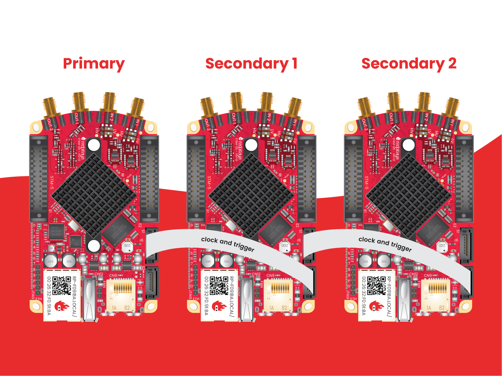

.. _top_125_14_MULTI:

###################################
Red Pitaya X-Channel System
###################################

The Red Pitaya X-Channel system consists of multiple Low-Noise STEMlab 125-14 devices that are modified for clock and trigger synchronisation and also comes with SATA synchronisation cables and software that supports multi-channel RF signal acquisition and generation.

Red Pitaya X-Channel system consists of:

* **One Primary Low-Noise STEMlab 125-14** device, a standard Low-Noise STEMlab 125-14 device that provides clock and trigger signals to other *Secondary* Low-Noise STEMlab 125-14 devices.
* One or **multiple Secondary Low-Noise STEMlab 125-14 devices**, that are modified in a way that they can receive clock and trigger signals from a *Primary* device and distribute them to the next *Secondary* device. These are marked with an “S” sticker.

The *Primary* device provides a clock and trigger over the SATA S1 connector that is then connected to the S2 of the *Secondary* 1 board. *Secondary* 1 then passes the clock forward to *Secondary* 2, *Secondary* 2 to *Secondary* 3, and so on (*Secondary* N to *Secondary* N+1). This way, we can achieve clock and trigger synchronisation of all boards in the system.

For more information about the software, please refer to: :ref:`X-Channel streaming <x-ch_streaming>`.

.. note::
    
    We recommend using :ref:`OS 2.00-23 or higher <prepareSD>` for the X-channel system.

    * With 2.00 OS both the *Primary* and the *Secondary* devices use the **same** Red Pitaya OS images!
    * With 1.04 OS the Primanry and *Secondary* boards use **different** Red Pitaya OS images!

.. note::

    **Booting without the external clock present?**
    The official Red Pitaya OS will not boot on *Secondary* devices without providing an external clock as it relies on reading the FPGA register map, which is available if the ADC clock is present.
    However, by modifying the software, the Linux OS itself can boot even without the external clock present, but please note it will crash when trying to read from the FPGA without the external clock present.

.. note::

    When synchronising multiple Red Pitaya boards, please keep in mind that:

    * :ref:`Click Shield synchronisation <click_shield>` requires external clock models.
    * :ref:`X-channel synchronisation <x-ch_streaming>` requires the X-channel system (master and slave boards) which differ from external clock models.

    For more information about Red Pitaya synchronisation, please refer to the :ref:`multiboard synchronisation chapter <multiboard_sync>`.

Setup
=========

#.  Connect all Red Pitayas to the same network via ethernet cables (switch or router that is connected to the client PC).

    .. note::

        Make sure that your network has enough throughput for all the data you are about to stream. It is also recommended to use a dedicated network only for the X-channel system.

#.  Connect the SATA cables between the *Primary* and *Secondary* devices.

    *Primary* SATA S1 -> *Secondary* 1 SATA S2
    *Secondary* 1 SATA S1 -> *Secondary* 2 SATA S2
    *Secondary* 2 SATA S1 -> *Secondary* 3 SATA S2
    ...

Pinout
===========

.. figure:: ../125-14/img/Red_Pitaya_pinout.jpg
    :width: 700

|

Technical specifications (one board)
------------------------------------

.. table::
    :widths: 40 40

    +------------------------------------+------------------------------------+
    | **Basic**                                                               |
    +====================================+====================================+
    | Processor                          | Dual core ARM Cortex-A9            |
    +------------------------------------+------------------------------------+
    | FPGA                               | FPGA Xilinx Zynq 7010 SoC          |
    +------------------------------------+------------------------------------+
    | RAM                                | 512 MB (4 Gb)                      |
    +------------------------------------+------------------------------------+
    | System memory                      | Micro SD up to 32 GB               |
    +------------------------------------+------------------------------------+
    | Console connector                  | Micro USB                          |
    +------------------------------------+------------------------------------+
    | Power connector                    | Micro USB                          |
    |                                    |                                    |
    +------------------------------------+------------------------------------+
    | Power consumption                  | 5 V, 2 A max                       |
    +------------------------------------+------------------------------------+

|

.. table::
    :widths: 40 40

    +------------------------------------+------------------------------------+
    | **Connectivity**                                                        |
    +====================================+====================================+
    | Ethernet                           | 1 Gbit                             |
    +------------------------------------+------------------------------------+
    | USB                                | USB-A 2.0                          |
    +------------------------------------+------------------------------------+
    | Wi-Fi                              | requires Wi-Fi dongle              |
    +------------------------------------+------------------------------------+

|

.. table::
    :widths: 40 40

    +------------------------------------+------------------------------------+
    | **RF inputs**                                                           |
    +====================================+====================================+
    | RF input channels                  | 2                                  |
    +------------------------------------+------------------------------------+
    | Sample rate                        | 125 MS/s                           |
    +------------------------------------+------------------------------------+
    | ADC resolution                     | 14 bit                             |
    +------------------------------------+------------------------------------+
    | Input impedance                    | 1 MΩ / 10 pF                       |
    +------------------------------------+------------------------------------+
    | Full scale voltage range           | ±1 V (LV) and ±20 V (HV)           |
    +------------------------------------+------------------------------------+
    | Input coupling                     | DC                                 |
    +------------------------------------+------------------------------------+
    | | **Absolute max.**                | | **LV ±6 V**                      |
    | | **Input voltage**                | | **HV ±30 V**                     |
    +------------------------------------+------------------------------------+
    | Input ESD protection               | Yes                                |
    +------------------------------------+------------------------------------+
    | Overload protection                | Protection diodes                  |
    +------------------------------------+------------------------------------+
    | Bandwidth                          | DC - 60 MHz                        |
    +------------------------------------+------------------------------------+
    | Connector type                     | SMA                                |
    +------------------------------------+------------------------------------+

|

.. table::
    :widths: 40 40

    +------------------------------------+------------------------------------+
    | **RF outputs**                                                          |
    +====================================+====================================+
    | RF output channels                 | 2                                  |
    +------------------------------------+------------------------------------+
    | Sample rate                        | 125 MS/s                           |
    +------------------------------------+------------------------------------+
    | DAC resolution                     | 14 bit                             |
    +------------------------------------+------------------------------------+
    | Load impedance                     | 50 Ω                               |
    +------------------------------------+------------------------------------+
    | Voltage range                      | ±1 V                               |
    |                                    |                                    |
    +------------------------------------+------------------------------------+
    | Short circuit protection           | Yes                                |
    |                                    |                                    |
    +------------------------------------+------------------------------------+
    | Output slew rate                   | 2 V / 10 ns                        |
    +------------------------------------+------------------------------------+
    | Bandwidth                          | DC - 50 MHz                        |
    +------------------------------------+------------------------------------+
    | Connector type                     | SMA                                |
    +------------------------------------+------------------------------------+

|

.. table::
    :widths: 40 40

    +------------------------------------+------------------------------------+
    | **Extension connector**                                                 | 
    +====================================+====================================+
    | Digital IOs                        | 16                                 |
    +------------------------------------+------------------------------------+
    | Digital voltage levels             | 3.3 V                              |
    +------------------------------------+------------------------------------+
    | Analog inputs                      | 4                                  |
    +------------------------------------+------------------------------------+
    | Analog input voltage range         | 0 - 3.5 V                          |
    +------------------------------------+------------------------------------+
    | Analog input resolution            | 12 bit                             |
    +------------------------------------+------------------------------------+
    | Analog input sample rate           | 100 kS/s                           |
    +------------------------------------+------------------------------------+
    | Analog outputs                     | 4                                  |
    +------------------------------------+------------------------------------+
    | Analog output voltage range        | 0 - 1.8 V                          |
    +------------------------------------+------------------------------------+
    | Analog output resolution           | 8 bit                              |
    +------------------------------------+------------------------------------+
    | Analog output sample rate          | ≲ 3.2 MS/s                         |
    +------------------------------------+------------------------------------+
    | Analog output bandwidth            | ≈ 160 kHz                          |
    +------------------------------------+------------------------------------+
    | Communication interfaces           | I2C, SPI, UART, CAN                |
    +------------------------------------+------------------------------------+
    | Available voltages                 | +5 V, +3V3, -4 V                   |
    +------------------------------------+------------------------------------+
    | External ADC clock                 | SATA connector (Secondary units)   |
    +------------------------------------+------------------------------------+

.. table::
    :widths: 40 40

    +------------------------------------+------------------------------------+
    | **Synchronisation**                                                     |
    +====================================+====================================+
    | External trigger input             | E1 connector (DIO0_P)              |
    +------------------------------------+------------------------------------+
    | External trigger input impedance   | Hi-Z (digital input)               |
    |                                    |                                    |
    +------------------------------------+------------------------------------+
    | Trigger output [#f1]_              | E1 connector (DIO0_N)              |
    +------------------------------------+------------------------------------+
    | Daisy chain connection             | SATA connectors |br|               |
    |                                    | (up to 500 Mbps)                   |
    +------------------------------------+------------------------------------+
    | Ref. clock input                   | N/A                                |
    +------------------------------------+------------------------------------+

.. rubric:: Footnotes

.. [#f1]  See the :ref:`Click Shield synchronisation section <click_shield>` and :ref:`Click Shield synchronisation examples <examples_multiboard_sync>`.

.. table::
    :widths: 40 40

    +------------------------------------+------------------------------------+
    | **Boot options**                                                        |
    +====================================+====================================+
    | SD card                            | Yes                                |
    +------------------------------------+------------------------------------+
    | QSPI                               | Not populated                      |
    +------------------------------------+------------------------------------+
    | eMMC                               | N/A                                |
    +------------------------------------+------------------------------------+

.. table::
    :widths: 40 40

    +------------------------------------+-------------------------------------------+
    | **More**                                                                       |
    +====================================+===========================================+
    | Options                            | 4-Ch IN + 4-Ch OUT                        |
    |                                    +-------------------------------------------+
    |                                    | 6-Ch IN + 6-Ch OUT                        |
    |                                    +-------------------------------------------+
    |                                    | (2*x)-Ch IN + (2*x)-Ch OUT; (3 < x < 8)   |
    |                                    +-------------------------------------------+
    |                                    | 16-Ch IN + 16-Ch OUT                      |
    +------------------------------------+-------------------------------------------+

.. note::

    For more information, please refer to the :ref:`Product comparison table <rp-board-comp-orig_gen>` and :ref:`STEMlab 125-14 Low-Noise <top_125_14_LN>`.

Measurements
=================

.. note::

    Although we do not have specific measurements for the STEMlab 125-14 LN boards, the performance of the fast analog inputs is the same as for STEMlab 125-14. The output performance is covered in Leonhard Neuhaus's blog about |Red Pitaya DAC performance| (measurements with added linear power supplies).

You can find the measurements of the fast analog frontend here:

* :ref:`Original boards - STEMlab 125-14 <measurements_orig_gen>`.
* :ref:`Gen 2 - STEMlab 125-14 Gen 2 <measurements_gen2>`.

Other specifications
=====================

For all other specifications please refer to standard :ref:`STEMlab 125-14 specs <top_125_14>`.

FAQ
=====

Comparison between Red Pitaya X-channel System and Click Shield synchronisation?
---------------------------------------------------------------------------------

The comparison between :ref:`Red Pitaya X-Channel System and Red Pitaya Click Shield Synchronisation is available here <faq_multiboard>`.

Can a different Red Pitaya STEMlab 125-14 unit be used as a primary device in the X-channel system?
--------------------------------------------------------------------------------------------------------

Yes, you can use any version of the STEMlab 125-14 as the *Primary* device. This includes:

* STEMlab 125-14 LN
* STEMlab 125-14 LN Z7020
* STEMlab 125-14 4-Input
* STEMlab 125-14 Ext Clk (Please note that an external clock must be provided)

What is the difference between Primary and Secondary devices in the X-channel system?
---------------------------------------------------------------------------------------

The *Primary* device is a standard STEMlab 125-14 Low-Noise device. The *Secondary* devices are STEMlab 125-14 Low-Noise Red Pitayas that are hardware modified to receive the clock and trigger signal from the "SATA" connectors.
Using a normal STEMlab 125-14 as a *Secondary* device will not work as it does not have the necessary hardware modifications.

Can I boot the secondary/external clock devices without the external clock present?
---------------------------------------------------------------------------------------

The official Red Pitaya OS will not boot without providing an external clock as it relies on reading the FPGA register map, which is available if the ADC clock is present.
However, by modifying the software, the Linux OS itself can boot even without the external clock present, but please note it will crash when trying to read from the FPGA without the external clock present.

.. Substitutions

.. |Red Pitaya DAC performance| raw:: html

    <a href="https://ln1985blog.wordpress.com/2016/02/07/red-pitaya-dac-performance/" target="_blank">Red Pitaya DAC performance</a>

