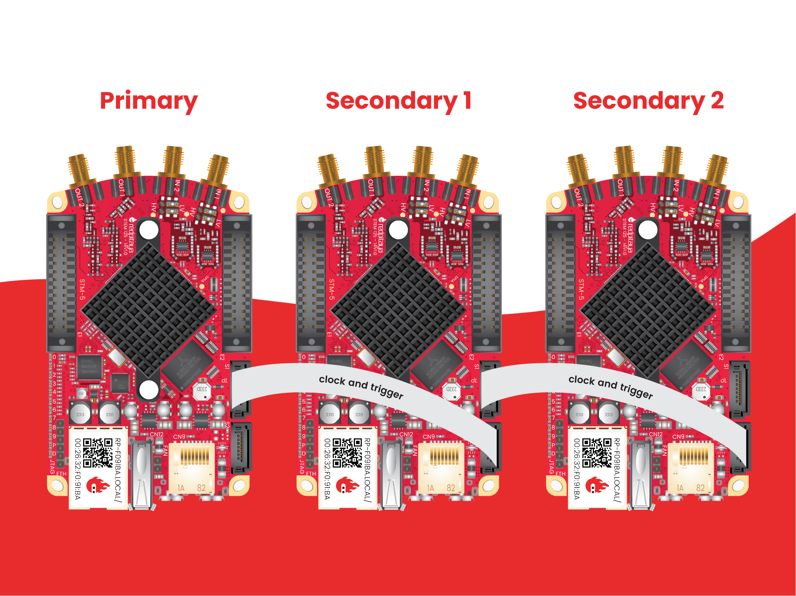

.. _top_125_14_MULTI:

###############################################
STEMlab 125-14 X-Channel System (Discontinued)
###############################################

|

.. contents:: Table of Contents
    :local:
    :depth: 1
    :backlinks: top

|

Overview
========

The Red Pitaya X-Channel system is a multi-board configuration built from :ref:`STEMlab 125-14 LN <top_125_14_LN>` devices connected in a daisy-chain via SATA cables.
One board acts as the **Primary** (unmodified) and provides the master clock and trigger signals. The remaining boards are **Secondary** boards, hardware-modified 
so that their ADC clock is driven from the SATA connector rather than the on-board oscillator, enabling phase-coherent operation across all channels.

.. note::

    This is the original X-channel system configuration. For X-channel 2.0 (Click Shields), see the 

|

System Components
=================

The X-Channel system consists of:

* **One Primary Low-Noise STEMlab 125-14** - A standard Low-Noise STEMlab 125-14 device that provides clock and trigger signals to Secondary devices
* **One or more Secondary Low-Noise STEMlab 125-14 devices** - Modified devices that receive clock and trigger signals from the Primary device and can distribute them to the next Secondary device (marked with an "S" sticker)
* **SATA synchronisation cables** - For connecting boards in a daisy-chain configuration
* **Software** - Supports multi-channel RF signal acquisition and generation

|

Features
========

* **Scalable multi-channel acquisition:** 2 inputs per board (4, 6, 8+ channels possible)
* **Phase-coherent operation:** All boards share the same clock and trigger
* **Linear power supplies:** Reduced noise for high-quality measurements
* **Daisy-chain topology:** Simple connection via SATA cables
* **Software support:** Multi-channel acquisition and generation applications
* Standard STEMlab 125-14 LN specifications per board

|

Quick Reference
===============

.. table::
    :widths: 40 60

    +----------------------------+--------------------------------------------------+
    | **Category**               | **Key Specifications**                           |
    +============================+==================================================+
    | Channels per board         | 2 input + 2 output channels                      |
    +----------------------------+--------------------------------------------------+
    | ADC                        | 2 channels, 14-bit, 125 MS/s (per board)         |
    +----------------------------+--------------------------------------------------+
    | DAC                        | 2 channels, 14-bit, 125 MS/s (per board)         |
    +----------------------------+--------------------------------------------------+
    | Synchronisation            | SATA daisy-chain, shared clock & trigger         |
    +----------------------------+--------------------------------------------------+
    | System scalability         | Multiple boards (4, 6, 8+ channels)              |
    +----------------------------+--------------------------------------------------+
    | Special Features           | Phase coherence, Low noise, Multi-channel        |
    +----------------------------+--------------------------------------------------+

|

Hardware Configuration & Differences
======================================

Primary Board
-------------

The Primary board is a standard :ref:`STEMlab 125-14 LN <top_125_14_LN>` used **without any hardware modification**. It:

* Provides the master clock signal via its on-board oscillator
* Distributes the clock and trigger to Secondary boards via the SATA connectors

Secondary Boards
----------------

Secondary boards are :ref:`STEMlab 125-14 LN <top_125_14_LN>` boards with a single hardware modification (identified by an "S" sticker):

+--------------------------------------+---------------------------------------------+---------------------------------------------+
| **Parameter**                        | **STEMlab 125-14 LN (Primary)**             | **STEMlab 125-14 LN Secondary**             |
+======================================+=============================================+=============================================+
| ADC clock source                     | On-board oscillator (default)               | SATA connector (from Primary/previous board)|
+--------------------------------------+---------------------------------------------+---------------------------------------------+
| Resistors R25, R26                   | In default position                         | Relocated to R27, R28                       |
+--------------------------------------+---------------------------------------------+---------------------------------------------+
| External ADC clock                   | No                                          | Yes (from SATA daisy-chain)                 |
+--------------------------------------+---------------------------------------------+---------------------------------------------+
| Operation without SATA clock input   | Normal (uses on-board oscillator)           | FPGA non-functional; PS boots from 33 MHz   |
+--------------------------------------+---------------------------------------------+---------------------------------------------+
| Identification                       | No marking                                  | "S" sticker on the board                    |
+--------------------------------------+---------------------------------------------+---------------------------------------------+

.. note::

    Secondary boards **cannot be used as standalone boards** without an external clock source or relocating the resistors back to the original positions.

|

Synchronisation
===============

The X-Channel system uses:

* **Shared clock:** Distributed from Primary through SATA daisy-chain
* **Shared trigger:** Synchronized trigger signals via SATA connectors
* **SATA cables:** Up to 500 Mb/s data rate for clock/trigger distribution

For detailed synchronisation information, see:

* :ref:`X-channel synchronisation <x-ch_streaming>`
* :ref:`Multi-board synchronisation examples <examples_multiboard_sync>`

|

Technical Specifications
=========================

Each board in the X-Channel system has the same specifications as the :ref:`STEMlab 125-14 Low Noise <top_125_14_LN>` board.

For full technical specifications, please refer to the :ref:`STEMlab 125-14 LN specifications <top_125_14_LN>`.

.. seealso::

    For more detailed information, please refer to the |Original Gen comparison table|.

|

Performance & Measurements
============================

.. note::

    Although we do not have specific measurements for the STEMlab 125-14 LN boards in X-Channel configuration, 
    the performance of the fast analog inputs is the same as for STEMlab 125-14. 
    The output performance is covered in Leonhard Neuhaus's blog about |Red Pitaya DAC performance| (measurements with added linear power supplies).

.. |Red Pitaya DAC performance| raw:: html

    <a href="https://ln1985blog.wordpress.com/2016/02/07/red-pitaya-dac-performance/" target="_blank">Red Pitaya DAC performance</a>

You can find reference measurements here:

* :ref:`Original Gen - STEMlab 125-14 <measurements_orig_gen>`.

|

FAQs
====

Can a different Red Pitaya STEMlab 125-14 unit be used as a primary device?
----------------------------------------------------------------------------

Yes, you can use any version of the STEMlab 125-14 as the Primary device. This includes:

* STEMlab 125-14 LN
* STEMlab 125-14
* STEMlab 125-14 Z7020

However, for best performance, it is recommended to use the STEMlab 125-14 LN as the Primary device for its improved noise characteristics.

Can I use X-Channel Secondary boards standalone?
-------------------------------------------------

No, Secondary boards are hardware-modified to receive an external clock and cannot operate standalone without:

1. An external clock source, or
2. Relocating the SMD resistors back to the original positions (reversing the modification)

|

Additional Resources
====================

For additional specifications and setup information, please refer to:

* :ref:`STEMlab 125-14 LN <top_125_14_LN>` - Individual board specifications
* |Original Gen hardware specs| - Common Original Gen specifications
* |Original Gen comparison table| - Comparison across all Red Pitaya Original Gen models
* :ref:`X-channel synchronisation documentation <x-ch_streaming>`
* :ref:`Multi-board synchronisation examples <examples_multiboard_sync>`

|

Legal & Disclaimers
===================

.. include:: ../_specs_common/disclaimer.inc

|

.. substitutions

.. |Original Gen hardware specs| replace:: :ref:`Original Gen hardware specifications <hw_specs_orig_gen>`
.. |Original Gen comparison table| replace:: :ref:`Original Gen board comparison table <rp-board-comp-orig_gen>`
