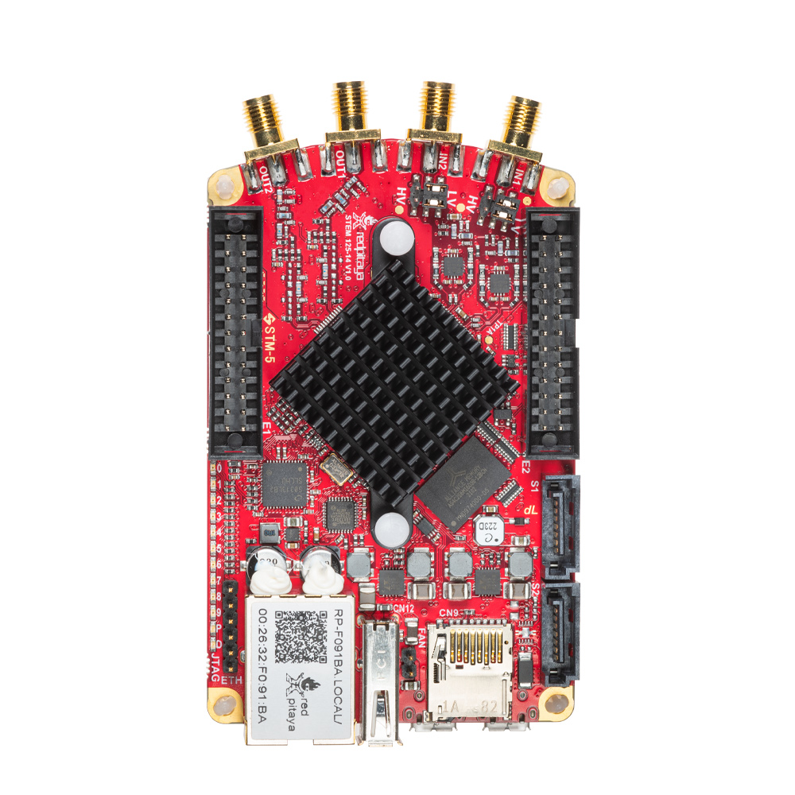

.. _top_125_14_Z7020_LN:

########################
STEMlab 125-14 Z7020-LN
########################

|

.. contents:: Table of Contents
    :local:
    :depth: 1
    :backlinks: top

|

Overview
========

The STEMlab 125-14 Z7020-LN is a variant of the standard :ref:`STEMlab 125-14 <top_125_14>` that combines two hardware changes:

* **Zynq 7020 FPGA** — replaces the Zynq 7010, providing 3x more programmable logic and 22 digital I/Os on the E1 connector (vs 16)
* **Linear analog power supply regulators** — populated linear regulators replace the default switching regulators, reducing noise on the analog power rails and improving ENOB

To find out more about the noise performance improvement from linear power supplies, refer to Leonhard Neuhaus's blog: |Red Pitaya DAC performance|.

.. |Red Pitaya DAC performance| raw:: html

    <a href="https://ln1985blog.wordpress.com/2016/02/07/red-pitaya-dac-performance/" target="_blank">Red Pitaya DAC performance</a>

|

Features
========

* 14-bit, 125 MS/s ADC and DAC
* Dual-core ARM Cortex-A9 processor
* FPGA Xilinx Zynq 7020 SoC (3x more logic than 7010)
* 512 MB RAM
* 22 digital I/Os, 4 analog inputs, 4 analog outputs
* Linear analog power supplies for improved noise performance
* Multiple communication interfaces: I2C, SPI, UART, CAN
* Micro USB connectivity for power and console
* SATA daisy-chain connectors for multi-board synchronisation

|

Quick Reference
===============

.. table::
    :widths: 40 60

    +----------------------------+--------------------------------------------------+
    | **Category**               | **Key Specifications**                           |
    +============================+==================================================+
    | ADC                        | 2 channels, 14-bit, 125 MS/s, DC-50 MHz          |
    +----------------------------+--------------------------------------------------+
    | DAC                        | 2 channels, 14-bit, 125 MS/s, DC-50 MHz          |
    +----------------------------+--------------------------------------------------+
    | Processor                  | Dual-core ARM Cortex-A9                          |
    +----------------------------+--------------------------------------------------+
    | FPGA                       | Xilinx Zynq 7020 SoC                             |
    +----------------------------+--------------------------------------------------+
    | RAM                        | 512 MB                                           |
    +----------------------------+--------------------------------------------------+
    | Digital I/O                | 22 GPIOs @ 3.3V                                  |
    +----------------------------+--------------------------------------------------+
    | Analog I/O                 | 4 inputs (12-bit), 4 outputs (8-bit)             |
    +----------------------------+--------------------------------------------------+
    | Special Features           | Linear power supplies, Zynq 7020                 |
    +----------------------------+--------------------------------------------------+

|

Differences from Standard STEMlab 125-14
==========================================

This board shares the same PCB and analog front-end as the :ref:`STEMlab 125-14 <top_125_14>` with the following changes:

+--------------------------------------+---------------------------------------------+---------------------------------------------+
| **Parameter**                        | **STEMlab 125-14**                          | **STEMlab 125-14 Z7020-LN**                 |
+======================================+=============================================+=============================================+
| FPGA                                 | Xilinx Zynq 7010                            | Xilinx Zynq 7020 (3x more logic)            |
+--------------------------------------+---------------------------------------------+---------------------------------------------+
| Digital I/Os (E1)                    | 16 GPIOs                                    | 22 GPIOs                                    |
+--------------------------------------+---------------------------------------------+---------------------------------------------+
| Analog power supply regulators       | Switching regulators (not populated)        | Linear regulators (populated)               |
+--------------------------------------+---------------------------------------------+---------------------------------------------+
| Analog power supply noise            | Higher (switching artefacts present)        | Lower (clean linear supply)                 |
+--------------------------------------+---------------------------------------------+---------------------------------------------+
| Output ENOB                          | Standard                                    | Improved                                    |
+--------------------------------------+---------------------------------------------+---------------------------------------------+
| Available voltages (E2 pin 2)        | -3.4 V                                      | -4.2 V                                      |
+--------------------------------------+---------------------------------------------+---------------------------------------------+

|

Technical Specifications
=========================

.. table::
    :widths: 30 30 15 15

    +------------------------------------+------------------------------------+-----------+----------------------------------+
    | **Parameter**                      | **Value**                          | **Units** | **Notes**                        |
    +====================================+====================================+===========+==================================+
    | |br|                                                                                                                   |
    | **Basic**                                                                                                              |
    +------------------------------------+------------------------------------+-----------+----------------------------------+
    | Processor                          | Dual core ARM Cortex-A9            | \-        |                                  |
    +------------------------------------+------------------------------------+-----------+----------------------------------+
    | FPGA                               | FPGA AMD (Xilinx) Zynq 7020 SoC    | \-        |                                  |
    +------------------------------------+------------------------------------+-----------+----------------------------------+
    | RAM                                | 512                                | MB        | (4 Gb)                           |
    +------------------------------------+------------------------------------+-----------+----------------------------------+
    | Core clock frequency               | 125                                | MHz       |                                  |
    +------------------------------------+------------------------------------+-----------+----------------------------------+
    | System memory                      | Micro SD up to 32 GB               | \-        |                                  |
    +------------------------------------+------------------------------------+-----------+----------------------------------+
    | Serial console connector           | Micro USB                          | \-        |                                  |
    +------------------------------------+------------------------------------+-----------+----------------------------------+
    | Power connector                    | Micro USB                          | \-        |                                  |
    +------------------------------------+------------------------------------+-----------+----------------------------------+
    | Power consumption                  | 5 V, 2 A                           | \-        | max                              |
    +------------------------------------+------------------------------------+-----------+----------------------------------+
    | |br|                                                                                                                   |
    | **Connectivity**                                                                                                       |
    +------------------------------------+------------------------------------+-----------+----------------------------------+
    | Ethernet                           | 1                                  | Gbit      |                                  |
    +------------------------------------+------------------------------------+-----------+----------------------------------+
    | USB                                | USB-A 2.0                          | \-        |                                  |
    +------------------------------------+------------------------------------+-----------+----------------------------------+
    | Wi-Fi                              | Requires Wi-Fi dongle              | \-        |                                  |
    +------------------------------------+------------------------------------+-----------+----------------------------------+
    | |br|                                                                                                                   |
    | **RF inputs**                                                                                                          |
    +------------------------------------+------------------------------------+-----------+----------------------------------+
    | RF input channels                  | 2                                  | \-        |                                  |
    +------------------------------------+------------------------------------+-----------+----------------------------------+
    | Sampling rate                      | 125                                | MS/s      |                                  |
    +------------------------------------+------------------------------------+-----------+----------------------------------+
    | ADC resolution                     | 14                                 | bit       |                                  |
    +------------------------------------+------------------------------------+-----------+----------------------------------+
    | Input impedance                    | 1 MΩ / 10 pF                       | \-        |                                  |
    +------------------------------------+------------------------------------+-----------+----------------------------------+
    | Full scale voltage range           | | ±1 (LV)                          | V         |                                  |
    |                                    | | ±20 (HV)                         |           |                                  |
    +------------------------------------+------------------------------------+-----------+----------------------------------+
    | Input coupling                     | DC                                 | \-        |                                  |
    +------------------------------------+------------------------------------+-----------+----------------------------------+
    | Absolute max. input voltage        | | ±6 (LV)                          | V         | DC values [#f1]_                 |
    |                                    | | ±30 (HV)                         |           |                                  |
    +------------------------------------+------------------------------------+-----------+----------------------------------+
    | Input ESD protection               | 1500                               | V         | DC                               |
    +------------------------------------+------------------------------------+-----------+----------------------------------+
    | Overload protection                | Protection diodes                  | \-        |                                  |
    +------------------------------------+------------------------------------+-----------+----------------------------------+
    | Bandwidth                          | DC - 50                            | MHz       |                                  |
    +------------------------------------+------------------------------------+-----------+----------------------------------+
    | Connector type                     | SMA                                | \-        |                                  |
    +------------------------------------+------------------------------------+-----------+----------------------------------+
    | |br|                                                                                                                   |
    | **RF outputs**                                                                                                         |
    +------------------------------------+------------------------------------+-----------+----------------------------------+
    | RF output channels                 | 2                                  | \-        |                                  |
    +------------------------------------+------------------------------------+-----------+----------------------------------+
    | Sampling rate                      | 125                                | MS/s      |                                  |
    +------------------------------------+------------------------------------+-----------+----------------------------------+
    | DAC resolution                     | 14                                 | bit       |                                  |
    +------------------------------------+------------------------------------+-----------+----------------------------------+
    | Load impedance                     | 50 Ω                               | \-        |                                  |
    +------------------------------------+------------------------------------+-----------+----------------------------------+
    | Voltage range                      | ±1                                 | V         |                                  |
    +------------------------------------+------------------------------------+-----------+----------------------------------+
    | Output coupling                    | DC                                 | \-        |                                  |
    +------------------------------------+------------------------------------+-----------+----------------------------------+
    | Short circuit protection           | Yes                                | \-        |                                  |
    +------------------------------------+------------------------------------+-----------+----------------------------------+
    | Output slew rate                   | 2 V / 10 ns                        | \-        |                                  |
    +------------------------------------+------------------------------------+-----------+----------------------------------+
    | Bandwidth                          | DC - 50                            | MHz       |                                  |
    +------------------------------------+------------------------------------+-----------+----------------------------------+
    | Connector type                     | SMA                                | \-        |                                  |
    +------------------------------------+------------------------------------+-----------+----------------------------------+
    | |br|                                                                                                                   |
    | **Extension connectors**                                                                                               |
    +------------------------------------+------------------------------------+-----------+----------------------------------+
    | Digital GPIOs                      | 22                                 | \-        |                                  |
    +------------------------------------+------------------------------------+-----------+----------------------------------+
    | Digital voltage levels             | 3.3                                | V         |                                  |
    +------------------------------------+------------------------------------+-----------+----------------------------------+
    | Analog inputs                      | 4                                  | \-        |                                  |
    +------------------------------------+------------------------------------+-----------+----------------------------------+
    | Analog input voltage range         | 0 - 3.5                            | V         |                                  |
    +------------------------------------+------------------------------------+-----------+----------------------------------+
    | Analog input resolution            | 12                                 | bit       |                                  |
    +------------------------------------+------------------------------------+-----------+----------------------------------+
    | Analog input sampling rate         | 100                                | kS/s      |                                  |
    +------------------------------------+------------------------------------+-----------+----------------------------------+
    | Analog outputs                     | 4                                  | \-        |                                  |
    +------------------------------------+------------------------------------+-----------+----------------------------------+
    | Analog output voltage range        | 0 - 1.8                            | V         |                                  |
    +------------------------------------+------------------------------------+-----------+----------------------------------+
    | Analog output resolution           | 8                                  | bit       |                                  |
    +------------------------------------+------------------------------------+-----------+----------------------------------+
    | Analog output sampling rate        | ≲ 3.2                              | MS/s      |                                  |
    +------------------------------------+------------------------------------+-----------+----------------------------------+
    | Analog output bandwidth            | ≈ 160                              | kHz       |                                  |
    +------------------------------------+------------------------------------+-----------+----------------------------------+
    | Communication interfaces           | I2C, SPI, UART, CAN                | \-        |                                  |
    +------------------------------------+------------------------------------+-----------+----------------------------------+
    | Available voltages                 | +5, +3.3, -4.2                     | V         |                                  |
    +------------------------------------+------------------------------------+-----------+----------------------------------+
    | External ADC clock                 | No                                 | \-        | See [#f2]_                       |
    +------------------------------------+------------------------------------+-----------+----------------------------------+
    | |br|                                                                                                                   |
    | **Synchronisation**                                                                                                    |
    +------------------------------------+------------------------------------+-----------+----------------------------------+
    | External trigger input             | DIO0_P                             | \-        | E1 connector                     |
    +------------------------------------+------------------------------------+-----------+----------------------------------+
    | External trigger input impedance   | Hi-Z                               | \-        | Digital input                    |
    +------------------------------------+------------------------------------+-----------+----------------------------------+
    | Trigger output                     | DIO0_N                             | \-        | E1 connector [#f3]_              |
    +------------------------------------+------------------------------------+-----------+----------------------------------+
    | Daisy chain connectors             | SATA connectors                    | \-        |                                  |
    +------------------------------------+------------------------------------+-----------+----------------------------------+
    | Daisy chain connectors speed       | up to 500                          | Mb/s      |                                  |
    +------------------------------------+------------------------------------+-----------+----------------------------------+
    | Ref. clock input                   | N/A                                | \-        |                                  |
    +------------------------------------+------------------------------------+-----------+----------------------------------+
    | Ref. clock frequency               | N/A                                | \-        |                                  |
    +------------------------------------+------------------------------------+-----------+----------------------------------+
    | Ref. clock connector type          | N/A                                | \-        |                                  |
    +------------------------------------+------------------------------------+-----------+----------------------------------+
    | |br|                                                                                                                   |
    | **Boot options**                                                                                                       |
    +------------------------------------+------------------------------------+-----------+----------------------------------+
    | SD card                            | Yes                                | \-        |                                  |
    +------------------------------------+------------------------------------+-----------+----------------------------------+
    | QSPI                               | Not populated                      | \-        |                                  |
    +------------------------------------+------------------------------------+-----------+----------------------------------+
    | eMMC                               | N/A                                | \-        |                                  |
    +------------------------------------+------------------------------------+-----------+----------------------------------+
    | |br|                                                                                                                   |
    | **Environmental Specifications**                                                                                       |
    +------------------------------------+------------------------------------+-----------+----------------------------------+
    | Operating Temperature Range        | 0 to 55                            | ℃         | With default heatsink            |
    +------------------------------------+------------------------------------+-----------+----------------------------------+
    | Operating Humidity Range           | < 90%                              | RH        |                                  |
    +------------------------------------+------------------------------------+-----------+----------------------------------+
    | Automatic Shutdown Temperature     | 85                                 | ℃         |                                  |
    +------------------------------------+------------------------------------+-----------+----------------------------------+
    | |br|                                                                                                                   |
    | **Dimensions**                                                                                                         |
    +------------------------------------+------------------------------------+-----------+----------------------------------+
    | Size (L x W x H)                   | 106.8 x 60.0 x 21.1                | mm        | See `Schematics`_ for details    |
    +------------------------------------+------------------------------------+-----------+----------------------------------+

.. warning::

    **Maximum Input Voltage**
    
    * **LV mode:** ±6 V absolute maximum
    * **HV mode:** ±30 V absolute maximum
    
    Exceeding these values may damage the board permanently.

.. seealso::

    For more detailed information, please refer to the |Original Gen comparison table|.

|

Performance & Measurements
============================

.. note::

    Although we do not have specific measurements for the STEMlab 125-14 Z7020 LN board, the performance of the fast analog inputs is the same as for STEMlab 125-14. The output performance is covered in Leonhard Neuhaus's blog about |Red Pitaya DAC performance| (measurements with added linear power supplies).
    
You can find the measurements of the fast analog frontend here:

* :ref:`Original Gen - STEMlab 125-14 <measurements_orig_gen>`.

|

.. _schematics_125_14_Z7020:

Schematics & 3D Models
========================

Schematics
----------

* :download:`Schematics_STEM_125-14_v1.1_LN_Z7020.pdf <https://downloads.redpitaya.com/doc/Schematics/Schematics_STEM_125-14_v1.1_LN_Z7020.pdf>`.

.. note::

    Full hardware schematics for the Red Pitaya board are not available. Red Pitaya has open-source code but not open hardware schematics. Nonetheless, development schematics are available. This schematic will give you information about hardware configuration, FPGA pin connections, and similar.

Mechanical Specifications & 3D Models
--------------------------------------

* STEP :download:`3D_STEM_125-14_v1.0.zip <https://downloads.redpitaya.com/doc/3D_models/3D_STEM_125-14_v1.0.zip>`.

|

Hardware Details
==================

Components
----------

The STEMlab 125-14 Z7020-LN uses the same ADC, DAC, and oscillator as the standard :ref:`STEMlab 125-14 <top_125_14>`. The two components that differ are:

**FPGA:** Xilinx `Zynq 7020 <https://docs.xilinx.com/v/u/en-US/ds190-Zynq-7000-Overview>`_

    * Dual-core ARM Cortex-A9 @ 667 MHz
    * 3x more programmable logic than Zynq 7010
    * 22 digital I/Os on E1 (vs 16 on 7010)
    * Integrated peripherals and memory controllers

**Analog Power Supplies:**

    * Linear regulators populated for analog power rails (reduced switching noise)

|

Extension Connectors & Interfaces
===================================

Overview
---------

The STEMlab 125-14 Z7020-LN board features the following connectors and interfaces:

* **E1 and E2 connectors:** Primary expansion connectors with digital I/O, analog I/O, and communication interfaces. The E1 connector provides 22 digital I/Os (6 more than the standard 7010 version).
* **S1 and S2 connectors:** Daisy-chain connectors for synchronising multiple Red Pitaya boards. These connectors enable clock and trigger synchronisation between boards.

|

Connector Physical Specifications
----------------------------------

**E1 and E2 Extension Connectors:**

* Connector type: `2 x 13 pins IDC 2.54 mm pitch <https://www.digikey.com/en/products/detail/adam-tech/BHR-26-VUA/9832284>`_
* Pin count: 26 pins each (2x13 configuration)
* Pitch: 2.54 mm (0.1")

**Mating Connectors:**

.. note::

    When looking for mating connectors for custom Red Pitaya shields, `double height elevated sockets <https://www.digikey.com/en/products/detail/samtec-inc/ESW-113-33-T-D/6693225>`_ are needed to clear the heatsink and ethernet connector on the board.
    Any connectors with *insulation height* of 0.635" (16.13 mm) or greater will work. This clearance requirement is based on the tallest components on the Red Pitaya board (heatsink and ethernet connector).

.. note::

    To prevent damage to the board or the shield, when connecting shields to the E1 and E2 connectors, please ensure:
    
    * **Proper alignment of connectors** - ensure the connectors are correctly aligned. The connectors on the Red Pitaya board have additional space in the socket housing, making it possible 
      to misalign the shields by ±1 pin while still appearing physically connected. This can cause damage to the board and/or the shield, so please double-check the alignment before powering on the board.
    * **Tight-fitting counterparts** - use connectors that fit securely to prevent accidental disconnections or damage.

|

E1 Connector - Digital I/O & CAN
----------------------------------

.. include:: ../_specs_common/E1_connector_7020.inc

|

E2 Connector - Analog & Communication
--------------------------------------

The E2 extension connector provides analog I/O and communication interfaces for sensor integration and data acquisition.

**Features:**

* +5 V power source (max 0.5 A, shared with USB devices)
* -3.4 V/-4 V power source (max 0.1 A)
* SPI, UART, I2C communication interfaces
* 4 slow ADCs (12-bit, 100 kS/s)
* 4 slow DACs (8-bit PWM, ≲ 3.2 MS/s)

**E2 Pinout:**

+-----+-----------------------+-------------------+-----------------------------------------------+----------------+
| Pin | Description           | FPGA pin number   | FPGA pin description                          | Voltage levels |
+=====+=======================+===================+===============================================+================+
| 1   | +5V                   |                   |                                               |                |
+-----+-----------------------+-------------------+-----------------------------------------------+----------------+
| 2   | -4.2 V                |                   |                                               |                |
+-----+-----------------------+-------------------+-----------------------------------------------+----------------+
| 3   | SPI (MOSI)            | E9                | PS_MIO10_500                                  | 3V3            |
+-----+-----------------------+-------------------+-----------------------------------------------+----------------+
| 4   | SPI (MISO)            | C6                | PS_MIO11_500                                  | 3V3            |
+-----+-----------------------+-------------------+-----------------------------------------------+----------------+
| 5   | SPI (SCK)             | D9                | PS_MIO12_500                                  | 3V3            |
+-----+-----------------------+-------------------+-----------------------------------------------+----------------+
| 6   | SPI (CS)              | E8                | PS_MIO13_500                                  | 3V3            |
+-----+-----------------------+-------------------+-----------------------------------------------+----------------+
| 7   | UART (TX)             | D5                | PS_MIO8_500                                   | 3V3            |
+-----+-----------------------+-------------------+-----------------------------------------------+----------------+
| 8   | UART (RX)             | B5                | PS_MIO9_500                                   | 3V3            |
+-----+-----------------------+-------------------+-----------------------------------------------+----------------+
| 9   | I2C (SCL)             | B13               | PS_MIO50_501                                  | 3V3            |
+-----+-----------------------+-------------------+-----------------------------------------------+----------------+
| 10  | I2C (SDA)             | B9                | PS_MIO51_501                                  | 3V3            |
+-----+-----------------------+-------------------+-----------------------------------------------+----------------+
| 11  | Ext com. mode (AIN)   |                   |                                               | GND (default)  |
+-----+-----------------------+-------------------+-----------------------------------------------+----------------+
| 12  | GND                   |                   |                                               |                |
+-----+-----------------------+-------------------+-----------------------------------------------+----------------+
| 13  | Analog Input 0        | B19, A20          | IO_L2P_T0_AD8P_35, IO_L2N_T0_AD8N_35          | 0-3.5 V        |
+-----+-----------------------+-------------------+-----------------------------------------------+----------------+
| 14  | Analog Input 1        | C20, B20          | IO_L1P_T0_AD0P_35, IO_L1N_T0_AD0N_35          | 0-3.5 V        |
+-----+-----------------------+-------------------+-----------------------------------------------+----------------+
| 15  | Analog Input 2        | E17, D18          | IO_L3P_T0_DQS_AD1P_35, IO_L3N_T0_DQS_AD1N_35  | 0-3.5 V        |
+-----+-----------------------+-------------------+-----------------------------------------------+----------------+
| 16  | Analog Input 3        | E18, E19          | IO_L5P_T0_AD9P_35, IO_L5N_T0_AD9N_35          | 0-3.5 V        |
+-----+-----------------------+-------------------+-----------------------------------------------+----------------+
| 17  | Analog Output 0       | T10               | IO_L1N_T0_34                                  | 0-1.8 V        |
+-----+-----------------------+-------------------+-----------------------------------------------+----------------+
| 18  | Analog Output 1       | T11               | IO_L1P_T0_34                                  | 0-1.8 V        |
+-----+-----------------------+-------------------+-----------------------------------------------+----------------+
| 19  | Analog Output 2       | P15               | IO_L24P_T3_34                                 | 0-1.8 V        |
+-----+-----------------------+-------------------+-----------------------------------------------+----------------+
| 20  | Analog Output 3       | U13               | IO_L3P_T0_DQS_PUDC_B_34                       | 0-1.8 V        |
+-----+-----------------------+-------------------+-----------------------------------------------+----------------+
| 21  | GND                   |                   |                                               |                |
+-----+-----------------------+-------------------+-----------------------------------------------+----------------+
| 22  | GND                   |                   |                                               |                |
+-----+-----------------------+-------------------+-----------------------------------------------+----------------+
| 23  | NC                    |                   |                                               |                |
+-----+-----------------------+-------------------+-----------------------------------------------+----------------+
| 24  | NC                    |                   |                                               |                |
+-----+-----------------------+-------------------+-----------------------------------------------+----------------+
| 25  | GND                   |                   |                                               |                |
+-----+-----------------------+-------------------+-----------------------------------------------+----------------+
| 26  | GND                   |                   |                                               |                |
+-----+-----------------------+-------------------+-----------------------------------------------+----------------+

.. note::

    **UART TX (PS_MIO08)** is an output only. It must be connected to GND or left floating at power-up (no external pull-ups)!

|

Auxiliary Analog Inputs & Outputs
------------------------------------

.. include:: ../_specs_common/slow_analog_io.inc

|

General Purpose Digital I/O Channels
--------------------------------------

.. table::
    :widths: 30 30 15 15

    +------------------------------------+------------------------------------+-----------+------------------------+
    | **Parameter**                      | **Value**                          | **Units** | **Notes**              |
    +====================================+====================================+===========+========================+
    | Number of GPIOs                    | 22                                 | \-        |                        |
    +------------------------------------+------------------------------------+-----------+------------------------+
    | Digital voltage level              | 3.3                                | V         |                        |
    +------------------------------------+------------------------------------+-----------+------------------------+
    | Abs. min. voltage                  | -0.40                              | V         |                        |
    +------------------------------------+------------------------------------+-----------+------------------------+
    | Abs. max. voltage                  | 3.3 + 0.55                         | V         |                        |
    +------------------------------------+------------------------------------+-----------+------------------------+
    | Current limitation                 | < 8                                | mA        | Drive strength         |
    +------------------------------------+------------------------------------+-----------+------------------------+
    | Direction                          | Configurable                       | \-        |                        |
    +------------------------------------+------------------------------------+-----------+------------------------+
    | Time resolution                    | 8                                  | ns        | (1/125 MHz)            |
    +------------------------------------+------------------------------------+-----------+------------------------+
    | Connector location                 | Extension connector |E1|           | \-        |                        |
    +------------------------------------+------------------------------------+-----------+------------------------+

|

Synchronisation Connectors (S1 & S2)
--------------------------------------

.. include:: ../_specs_common/Sync_connectors_SATA.inc
    
|

Advanced Features
==================

Power Supply
-------------

.. include:: ../_specs_common/power_supply.inc

|

External ADC Clock & X-Channel Configuration
---------------------------------------------

The STEMlab 125-14 Z7020-LN supports the same ADC clock reconfiguration options as the standard STEMlab 125-14. By relocating SMD resistors on the PCB, the board can be converted into:

* **External clock variant** (resistors R25, R26 → R23, R24) — the ADC clock is provided via the Ext. ADC Clk± pins on the E2 connector. Functionally equivalent to the :ref:`STEMlab 125-14 External Clock <top_125_14_EXT>`, but with a Zynq 7020 FPGA and linear power supplies.
* **X-channel Secondary** (resistors R25, R26 → R27, R28) — the ADC clock is received through the SATA connectors from a Primary board. Functionally equivalent to the :ref:`STEMlab 125-14 X-Channel secondary <top_125_14_MULTI>`, but with a Zynq 7020 FPGA and linear power supplies.

For the clock source schematic and full modification instructions, refer to the :ref:`External ADC Clock section <external_125_14>` on the STEMlab 125-14 page.

.. important::

    These hardware configurations are **not available as standard off-the-shelf products**. They are available on **customisation request only**.
    Please contact us at info@redpitaya.com if you require a pre-modified board or need guidance on performing the modification yourself.

|

Calibration
------------

.. include:: ../_specs_common/calibration.inc

|

Additional Resources
====================

For additional specifications and measurements, please refer to:

* |Original Gen hardware specs| - Common Original Gen specifications
* |Original Gen comparison table| - Comparison across all Red Pitaya Original Gen models
* :ref:`STEMlab 125-14 <top_125_14>` - Standard STEMlab 125-14 specifications

|

Legal & Disclaimers
===================

.. include:: ../_specs_common/disclaimer.inc

|

.. rubric:: Footnotes

.. [#f1] The absolute maximum input voltage values are for frequencies below 1 kHz. For higher frequencies, please use the input voltage range specifications as **Absolute maximum**.
.. [#f2] The board can be hardware-modified to support external ADC clock input (R25, R26 → R23, R24) or X-channel secondary configuration (R25, R26 → R27, R28). These variants are available on customisation request only. Contact info@redpitaya.com for more information.
.. [#f3] See the :ref:`X-channel 2.0 (Click Shield) synchronisation <click_shield_sync>` and :ref:`X-channel 2.0 (Click Shield) synchronisation examples <examples_multiboard_sync>` for trigger output configuration.
.. [#f8] The default software enables sampling at a CPU-dependent speed. To acquire data at a 100 kS/s rate, additional FPGA processing must be implemented.
.. [#f9] The output is passed through a first-order low-pass filter. Should additional filtering be required, this can be applied externally in line with the specific requirements of the application.
.. [#f10] Application specific. The output current is shared between the extension connectors and the connected USB devices, and can be higher if other peripheral units are not in use.

|

.. substitutions

.. |E1| replace:: :ref:`E1 connector <E1_orig_gen>`
.. |E2| replace:: :ref:`E2 connector <E2_orig_gen>`
.. |Original Gen hardware specs| replace:: :ref:`Original Gen hardware specifications <hw_specs_orig_gen>`
.. |Original Gen comparison table| replace:: :ref:`Original Gen board comparison table <rp-board-comp-orig_gen>`
