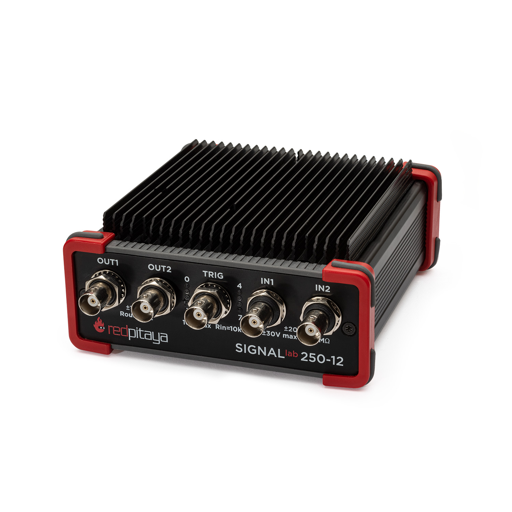
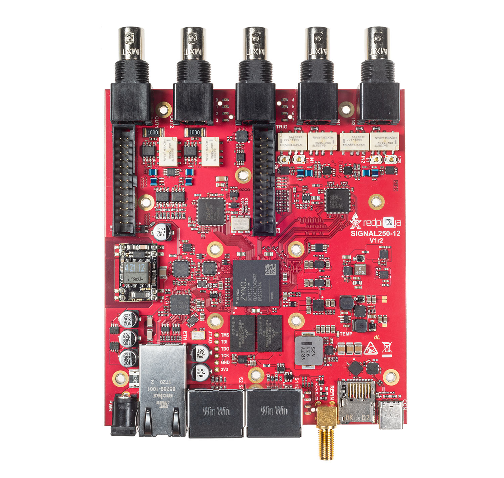

.. _top_250_12:

#################
SIGNALlab 250-12
#################

.. note::

    The SIGNALlab 250-12 OEM board comes without the case, but includes the ribbed black heat sink that can be seen on the top of the first picture.
    The heatsink is mounted on the bottom side of the board.

|

.. contents:: Table of Contents
    :local:
    :depth: 1
    :backlinks: top

|

Overview
========

The SIGNALlab 250-12 is a high-performance variant of the Red Pitaya platform, featuring 250 MS/s sampling rate, 12-bit ADC, 14-bit DAC, software-selectable AC/DC coupling, and BNC connectors.
It is powered by a dual-core ARM Cortex-A9 processor and FPGA Xilinx Zynq 7020 SoC with 1 GB RAM, making it ideal for demanding signal processing and measurement applications.

|

Features
========

* 12-bit, 250 MS/s ADC and 14-bit, 250 MS/s DAC
* Software-selectable AC/DC input coupling
* Software-selectable input/output ranges (±1 V/±20 V for inputs, ±2 V/±10 V for outputs)
* BNC connectors for RF inputs and outputs
* Dual-core ARM Cortex-A9 processor
* FPGA Xilinx Zynq 7020 SoC
* 1 GB RAM
* 19 digital I/Os, 4 analog inputs, 4 analog outputs
* Multiple communication interfaces: I2C, SPI, UART, CAN, USB
* 24 V or PoE power input
* USB-C console connector
* External ADC clock input
* 10 MHz SMA reference clock input

|

Quick Reference
===============

.. table::
    :widths: 40 60

    +----------------------------+--------------------------------------------------+
    | **Category**               | **Key Specifications**                           |
    +============================+==================================================+
    | ADC                        | 2 channels, 12-bit, 250 MS/s, DC-50 MHz          |
    +----------------------------+--------------------------------------------------+
    | DAC                        | 2 channels, 14-bit, 250 MS/s, DC-50 MHz          |
    +----------------------------+--------------------------------------------------+
    | Processor                  | Dual-core ARM Cortex-A9                          |
    +----------------------------+--------------------------------------------------+
    | FPGA                       | Xilinx Zynq 7020 SoC                             |
    +----------------------------+--------------------------------------------------+
    | RAM                        | 1 GB                                             |
    +----------------------------+--------------------------------------------------+
    | Digital I/O                | 19 GPIOs @ 3.3V                                  |
    +----------------------------+--------------------------------------------------+
    | Analog I/O                 | 4 inputs (12-bit), 4 outputs (8-bit)             |
    +----------------------------+--------------------------------------------------+
    | Connectivity               | Ethernet, USB-C, Extension connectors            |
    +----------------------------+--------------------------------------------------+
    | Special Features           | AC/DC coupling, BNC connectors, ±10 V output     |
    +----------------------------+--------------------------------------------------+

|

Board Layout & Pinout
======================

.. figure:: ../125-14/img/Red_Pitaya_pinout.jpg
    :alt: Red Pitaya Extension connector pinout (reference)
    :width: 700
    :align: center

The pinout diagram shows the extension connector layout (E1, E2), which is shared with other Red Pitaya boards.
The SIGNALlab 250-12 uses BNC connectors for RF inputs/outputs (IN1, IN2, OUT1, OUT2) and a dedicated BNC trigger input.
The 10 MHz SMA reference clock input and SATA daisy-chain connectors (S1, S2) are located on the back panel.

|

Technical Specifications
=========================

.. table::
    :widths: 30 30 15 15

    +------------------------------------+------------------------------------+-----------+----------------------------------+
    | **Parameter**                      | **Value**                          | **Units** | **Notes**                        |
    +====================================+====================================+===========+==================================+
    | |br|                                                                                                                   |
    | **Basic**                                                                                                              |
    +------------------------------------+------------------------------------+-----------+----------------------------------+
    | Processor                          | Dual core ARM Cortex-A9            | \-        |                                  |
    +------------------------------------+------------------------------------+-----------+----------------------------------+
    | FPGA                               | FPGA AMD (Xilinx) Zynq 7020 SoC    | \-        |                                  |
    +------------------------------------+------------------------------------+-----------+----------------------------------+
    | RAM                                | 1                                  | GB        | (8 Gb)                           |
    +------------------------------------+------------------------------------+-----------+----------------------------------+
    | Core clock frequency               | 250                                | MHz       |                                  |
    +------------------------------------+------------------------------------+-----------+----------------------------------+
    | System memory                      | Micro SD up to 32 GB               | \-        |                                  |
    +------------------------------------+------------------------------------+-----------+----------------------------------+
    | Serial console connector           | USB-C                              | \-        |                                  |
    +------------------------------------+------------------------------------+-----------+----------------------------------+
    | Power connector                    | Power Jack / RJ45 (PoE)            | \-        |                                  |
    +------------------------------------+------------------------------------+-----------+----------------------------------+
    | Power consumption                  | 24 V, 0.5 A                        | \-        | max                              |
    +------------------------------------+------------------------------------+-----------+----------------------------------+
    | |br|                                                                                                                   |
    | **Connectivity**                                                                                                       |
    +------------------------------------+------------------------------------+-----------+----------------------------------+
    | Ethernet                           | 1                                  | Gbit      |                                  |
    +------------------------------------+------------------------------------+-----------+----------------------------------+
    | USB                                | USB-A 2.0 (2x)                     | \-        |                                  |
    +------------------------------------+------------------------------------+-----------+----------------------------------+
    | Wi-Fi                              | Requires Wi-Fi dongle              | \-        |                                  |
    +------------------------------------+------------------------------------+-----------+----------------------------------+
    | |br|                                                                                                                   |
    | **RF inputs**                                                                                                          |
    +------------------------------------+------------------------------------+-----------+----------------------------------+
    | RF input channels                  | 2                                  | \-        |                                  |
    +------------------------------------+------------------------------------+-----------+----------------------------------+
    | Sampling rate                      | 250                                | MS/s      |                                  |
    +------------------------------------+------------------------------------+-----------+----------------------------------+
    | ADC resolution                     | 12                                 | bit       |                                  |
    +------------------------------------+------------------------------------+-----------+----------------------------------+
    | Input impedance                    | 1 MΩ                               | \-        |                                  |
    +------------------------------------+------------------------------------+-----------+----------------------------------+
    | Full scale voltage range           | | ±1 (LV)                          | V         | SW selectable                    |
    |                                    | | ±20 (HV)                         |           |                                  |
    +------------------------------------+------------------------------------+-----------+----------------------------------+
    | Input coupling                     | AC / DC                            | \-        | SW selectable                    |
    +------------------------------------+------------------------------------+-----------+----------------------------------+
    | Absolute max. input voltage        | | ±6 (LV)                          | V         | DC values [#f1]_                 |
    |                                    | | ±30 (HV)                         |           |                                  |
    +------------------------------------+------------------------------------+-----------+----------------------------------+
    | Input ESD protection               | 1500                               | V         | DC                               |
    +------------------------------------+------------------------------------+-----------+----------------------------------+
    | Overload protection                | Protection diodes                  | \-        |                                  |
    +------------------------------------+------------------------------------+-----------+----------------------------------+
    | Bandwidth                          | DC - 50                            | MHz       |                                  |
    +------------------------------------+------------------------------------+-----------+----------------------------------+
    | Connector type                     | BNC                                | \-        |                                  |
    +------------------------------------+------------------------------------+-----------+----------------------------------+
    | |br|                                                                                                                   |
    | **RF outputs**                                                                                                         |
    +------------------------------------+------------------------------------+-----------+----------------------------------+
    | RF output channels                 | 2                                  | \-        |                                  |
    +------------------------------------+------------------------------------+-----------+----------------------------------+
    | Sampling rate                      | 250                                | MS/s      |                                  |
    +------------------------------------+------------------------------------+-----------+----------------------------------+
    | DAC resolution                     | 14                                 | bit       |                                  |
    +------------------------------------+------------------------------------+-----------+----------------------------------+
    | Load impedance                     | 50 Ω / Hi-Z                        | \-        |                                  |
    +------------------------------------+------------------------------------+-----------+----------------------------------+
    | Voltage range                      | | ±1 @ 50 Ω (x1 scaling)           | V         | SW selectable                    |
    |                                    | | ±2 @ Hi-Z (x1 scaling)           |           |                                  |
    |                                    | | ±5 @ 50 Ω (x5 scaling)           |           |                                  |
    |                                    | | ±10 @ Hi-Z (x5 scaling)          |           |                                  |
    +------------------------------------+------------------------------------+-----------+----------------------------------+
    | Output coupling                    | DC                                 | \-        |                                  |
    +------------------------------------+------------------------------------+-----------+----------------------------------+
    | Short circuit protection           | Yes                                | \-        |                                  |
    +------------------------------------+------------------------------------+-----------+----------------------------------+
    | Output slew rate                   | 10 V / 17 ns                       | \-        |                                  |
    +------------------------------------+------------------------------------+-----------+----------------------------------+
    | Bandwidth                          | DC - 50                            | MHz       |                                  |
    +------------------------------------+------------------------------------+-----------+----------------------------------+
    | Connector type                     | BNC                                | \-        |                                  |
    +------------------------------------+------------------------------------+-----------+----------------------------------+
    | |br|                                                                                                                   |
    | **Extension connectors**                                                                                               |
    +------------------------------------+------------------------------------+-----------+----------------------------------+
    | Digital GPIOs                      | 19                                 | \-        |                                  |
    +------------------------------------+------------------------------------+-----------+----------------------------------+
    | Digital voltage levels             | 3.3                                | V         |                                  |
    +------------------------------------+------------------------------------+-----------+----------------------------------+
    | Analog inputs                      | 4                                  | \-        |                                  |
    +------------------------------------+------------------------------------+-----------+----------------------------------+
    | Analog input voltage range         | 0 - 3.5                            | V         |                                  |
    +------------------------------------+------------------------------------+-----------+----------------------------------+
    | Analog input resolution            | 12                                 | bit       |                                  |
    +------------------------------------+------------------------------------+-----------+----------------------------------+
    | Analog input sampling rate         | 100                                | kS/s      |                                  |
    +------------------------------------+------------------------------------+-----------+----------------------------------+
    | Analog outputs                     | 4                                  | \-        |                                  |
    +------------------------------------+------------------------------------+-----------+----------------------------------+
    | Analog output voltage range        | 0 - 1.8                            | V         |                                  |
    +------------------------------------+------------------------------------+-----------+----------------------------------+
    | Analog output resolution           | 8                                  | bit       |                                  |
    +------------------------------------+------------------------------------+-----------+----------------------------------+
    | Analog output sampling rate        | ≲ 3.2                              | MS/s      |                                  |
    +------------------------------------+------------------------------------+-----------+----------------------------------+
    | Analog output bandwidth            | ≈ 160                              | kHz       |                                  |
    +------------------------------------+------------------------------------+-----------+----------------------------------+
    | Communication interfaces           | I2C, SPI, UART, CAN, USB           | \-        |                                  |
    +------------------------------------+------------------------------------+-----------+----------------------------------+
    | Available voltages                 | +5, +3.3, -5.4                     | V         |                                  |
    +------------------------------------+------------------------------------+-----------+----------------------------------+
    | External ADC clock                 | Yes                                | \-        |                                  |
    +------------------------------------+------------------------------------+-----------+----------------------------------+
    | |br|                                                                                                                   |
    | **Synchronisation**                                                                                                    |
    +------------------------------------+------------------------------------+-----------+----------------------------------+
    | External trigger input             | BNC                                | \-        |                                  |
    +------------------------------------+------------------------------------+-----------+----------------------------------+
    | External trigger input impedance   | | 10 (HW_rev 1.0-1.2a)             | kΩ        |                                  |  
    |                                    | | 1 (HW_rev 1.2b)                  |           |                                  |
    +------------------------------------+------------------------------------+-----------+----------------------------------+
    | Trigger output                     | DIO0_N                             | \-        | E1 connector [#f2]_              |
    +------------------------------------+------------------------------------+-----------+----------------------------------+
    | Daisy chain connectors (S1 & S2)   | Yes                                | \-        |                                  |
    +------------------------------------+------------------------------------+-----------+----------------------------------+
    | Daisy chain connectors speed       | up to 500                          | Mb/s      |                                  |
    +------------------------------------+------------------------------------+-----------+----------------------------------+
    | Daisy chain connectors type        | eSATA                              | \-        |                                  |
    +------------------------------------+------------------------------------+-----------+----------------------------------+
    | Ref. clock input                   | Yes                                | \-        |                                  |
    +------------------------------------+------------------------------------+-----------+----------------------------------+
    | Ref. clock frequency               | 10                                 | MHz       |                                  |
    +------------------------------------+------------------------------------+-----------+----------------------------------+
    | Ref. clock connector type          | SMA                                | \-        | On the backpannel                |
    +------------------------------------+------------------------------------+-----------+----------------------------------+
    | |br|                                                                                                                   |
    | **Boot options**                                                                                                       |
    +------------------------------------+------------------------------------+-----------+----------------------------------+
    | SD card                            | Yes                                | \-        |                                  |
    +------------------------------------+------------------------------------+-----------+----------------------------------+
    | QSPI                               | N/A                                | \-        |                                  |
    +------------------------------------+------------------------------------+-----------+----------------------------------+
    | eMMC                               | N/A                                | \-        |                                  |
    +------------------------------------+------------------------------------+-----------+----------------------------------+
    | |br|                                                                                                                   |
    | **Environmental Specifications**                                                                                       |
    +------------------------------------+------------------------------------+-----------+----------------------------------+
    | Operating Temperature Range        | 0 to 55                            | ℃         | With default heatsink            |
    +------------------------------------+------------------------------------+-----------+----------------------------------+
    | Operating Humidity Range           | < 90%                              | RH        |                                  |
    +------------------------------------+------------------------------------+-----------+----------------------------------+
    | Automatic Shutdown Temperature     | 85                                 | ℃         |                                  |
    +------------------------------------+------------------------------------+-----------+----------------------------------+
    | |br|                                                                                                                   |
    | **Dimensions**                                                                                                         |
    +------------------------------------+------------------------------------+-----------+----------------------------------+
    | Size (L x W x H)                   | 157.3 x 125.0 x 36.0               | mm        | See `Schematics`_ for details    |
    +------------------------------------+------------------------------------+-----------+----------------------------------+

.. seealso::

    For more detailed information, please refer to the |Original Gen comparison table|.

.. warning::

    **Maximum Input Voltage**
    
    * **LV mode:** ±6 V absolute maximum
    * **HV mode:** ±30 V absolute maximum
    
    Exceeding these values may damage the board permanently.

|

Performance & Measurements
============================

.. note::

    We do not have specific measurements for the SIGNALlab 250-12 board.
    
You can find reference measurements of the fast analog frontend here:

* :ref:`Original Gen - STEMlab 125-14 <measurements_orig_gen>`.

|

.. _schematics_250_12:

Schematics & 3D Models
========================

Schematics
----------

* :download:`Schematics_SIGNAL_250-12_V1r1.pdf <https://downloads.redpitaya.com/doc/Schematics/Schematics_SIGNAL_250-12_V1r1.pdf>`

.. note::

    Full hardware schematics for the Red Pitaya board are not available. Red Pitaya has open-source code but not open hardware schematics. Nonetheless, development schematics are available. This schematic will give you information about hardware configuration, FPGA pin connections, and similar.

Mechanical Specifications & 3D Models
--------------------------------------

* PDF :download:`3D_SIGNAL_250-12_V1r2.pdf.zip <https://downloads.redpitaya.com/doc/3D_models/3D_SIGNAL_250-12_V1r2.pdf.zip>`
* STEP :download:`3D_SIGNAL_250-12_V1r2.zip <https://downloads.redpitaya.com/doc/3D_models/3D_SIGNAL_250-12_V1r2.zip>`

|

Hardware Details
==================

Components
----------

**ADC:** Analog Devices `AD9613 <https://www.analog.com/en/products/AD9613.html>`_

    * Dual 12-bit, 250 MS/s ADC
    * High dynamic range

**DAC:** Analog Devices `AD9746 <https://www.analog.com/en/products/ad9746.html>`_

    * Single 14-bit, 250 MS/s DAC
    * High SFDR performance

**FPGA:** Xilinx `Zynq 7020 <https://docs.xilinx.com/v/u/en-US/ds190-Zynq-7000-Overview>`_

    * Dual-core ARM Cortex-A9 @ 667 MHz
    * Programmable logic fabric

**Current Feedback Op. Amp.:** Analog Devices `AD8000 <https://www.analog.com/en/products/AD8000.html>`_

    * 1.5 GHz bandwidth
    * Used in the signal chain

**Voltage Feedback FastFET Op. Amp.:** Analog Devices `ADA4817-1 <https://www.analog.com/en/products/ada4817-1.html>`_

    * 1 GHz bandwidth
    * Low power differential ADC driver

|

Extension Connectors & Interfaces
===================================

Overview
---------

The SIGNALlab 250-12 board features the following connectors and interfaces:

* **E1 and E2 connectors:** Primary expansion connectors with digital I/O, analog I/O, and communication interfaces. These connectors allow users to interface with additional hardware, sensors, or peripherals, enhancing the board's capabilities.
* **S1 and S2 connectors:** SATA connectors connected directly to the FPGA. Unlike the STEMlab 125-14, this board does not support multi-board clock synchronisation through these connectors — the shared 
  clock signal does not propagate to the ADC and DAC. They can still be used to exchange clock, trigger, or data signals between boards or external devices. Note that the voltage levels are 1V8, 
  which is non-standard for SATA connections.

.. note::

    The SIGNALlab 250-12 board, with the exception of "bare OEM" boards, is enclosed in an aluminium housing which should be removed to allow access to the E1 and E2 extension connectors.

|

Connector Physical Specifications
----------------------------------

**E1 and E2 Extension Connectors:**

* Connector type: `2 x 13 pins IDC 2.54 mm pitch <https://www.digikey.com/en/products/detail/adam-tech/BHR-26-VUA/9832284>`_
* Pin count: 26 pins each (2x13 configuration)
* Pitch: 2.54 mm (0.1")

|

.. _E1_signal:

E1 Connector - Digital I/O & CAN
----------------------------------

The E1 extension connector provides digital I/O and CAN bus interfaces for control and communication applications.

**Features:**

* Two +3V3 power sources (max 0.5 A of current)
* 19 single-ended or 9 differential digital I/Os with 3.3 V logic levels
* Two CAN buses (configurable via software)
* USB 2.0 port (pins 22-24)

**Electrical Specifications:**

All DIOx_y pins are LVCMOS33, with the following absolute maximum ratings:

* Min. voltage: -0.40 V
* Max. voltage: 3.3 V + 0.55 V
* Drive strength: < 8 mA

**E1 Pinout:**

+-----+-----------------------+-------------------+-----------------------------------------------+----------------+
| Pin | Description           | FPGA pin number   | FPGA pin description                          | Voltage levels |
+=====+=======================+===================+===============================================+================+
| 1   | 3V3                   |                   |                                               |                |
+-----+-----------------------+-------------------+-----------------------------------------------+----------------+
| 2   | 3V3                   |                   |                                               |                |
+-----+-----------------------+-------------------+-----------------------------------------------+----------------+
| 3   | DIO0_P / EXT TRIG     | W10               | IO_L16P_T2_13                                 | 3.3V           |
+-----+-----------------------+-------------------+-----------------------------------------------+----------------+
| 4   | DIO0_N / TRIG OUT     | W9                | IO_L16N_T2_13                                 | 3.3V           |
+-----+-----------------------+-------------------+-----------------------------------------------+----------------+
| 5   | DIO1_P                | T9                | IO_L12P_T1_MRCC_13                            | 3.3V           |
+-----+-----------------------+-------------------+-----------------------------------------------+----------------+
| 6   | DIO1_N                | U10               | IO_L12N_T1_MRCC_13                            | 3.3V           |
+-----+-----------------------+-------------------+-----------------------------------------------+----------------+
| 7   | DIO2_P                | Y9                | IO_L14P_T2_SRCC_13                            | 3.3V           |
+-----+-----------------------+-------------------+-----------------------------------------------+----------------+
| 8   | DIO2_N                | Y8                | IO_L14N_T2_SRCC_13                            | 3.3V           |
+-----+-----------------------+-------------------+-----------------------------------------------+----------------+
| 9   | DIO3_P                | U9                | IO_L17P_T2_13                                 | 3.3V           |
+-----+-----------------------+-------------------+-----------------------------------------------+----------------+
| 10  | DIO3_N                | U8                | IO_L17N_T2_13                                 | 3.3V           |
+-----+-----------------------+-------------------+-----------------------------------------------+----------------+
| 11  | DIO4_P                | V8                | IO_L15P_T2_DQS_13                             | 3.3V           |
+-----+-----------------------+-------------------+-----------------------------------------------+----------------+
| 12  | DIO4_N                | W8                | IO_L15N_T2_DQS_13                             | 3.3V           |
+-----+-----------------------+-------------------+-----------------------------------------------+----------------+
| 13  | DIO5_P                | V11               | IO_L21P_T3_DQS_13                             | 3.3V           |
+-----+-----------------------+-------------------+-----------------------------------------------+----------------+
| 14  | DIO5_N                | V10               | IO_L21N_T3_DQS_13                             | 3.3V           |
+-----+-----------------------+-------------------+-----------------------------------------------+----------------+
| 15  | DIO6_P / CAN1_RX      | W11               | IO_L18P_T2_13                                 | 3.3V           |
+-----+-----------------------+-------------------+-----------------------------------------------+----------------+
| 16  | DIO6_N / CAN1_TX      | Y11               | IO_L18N_T2_13                                 | 3.3V           |
+-----+-----------------------+-------------------+-----------------------------------------------+----------------+
| 17  | DIO7_P / CAN0_RX      | Y12               | IO_L20P_T3_13                                 | 3.3V           |
+-----+-----------------------+-------------------+-----------------------------------------------+----------------+
| 18  | DIO7_N / CAN0_TX      | Y13               | IO_L20N_T3_13                                 | 3.3V           |
+-----+-----------------------+-------------------+-----------------------------------------------+----------------+
| 19  | DIO8_P                | Y7                | IO_L13P_T2_MRCC_13                            | 3.3V           |
+-----+-----------------------+-------------------+-----------------------------------------------+----------------+
| 20  | DIO8_N                | Y6                | IO_L13N_T2_MRCC_13                            | 3.3V           |
+-----+-----------------------+-------------------+-----------------------------------------------+----------------+
| 21  | DIO9_P                | U5                | IO_L19N_T3_VREF_13                            | 3.3V           |
+-----+-----------------------+-------------------+-----------------------------------------------+----------------+
| 22  | +5VUSB3               |                   |                                               | 3.3V           |
+-----+-----------------------+-------------------+-----------------------------------------------+----------------+
| 23  | USB2_P                |                   |                                               | 3.3V           |
+-----+-----------------------+-------------------+-----------------------------------------------+----------------+
| 24  | USB2_N                |                   |                                               | 3.3V           |
+-----+-----------------------+-------------------+-----------------------------------------------+----------------+
| 25  | GND                   |                   |                                               |                |
+-----+-----------------------+-------------------+-----------------------------------------------+----------------+
| 26  | GND                   |                   |                                               |                |
+-----+-----------------------+-------------------+-----------------------------------------------+----------------+

.. note::
        
    To change the functionality of DIO6_P, DIO6_N, DIO7_P and DIO7_N from GPIO to CAN, please modify the **housekeeping** register value at **address 0x34**. For further details, please refer to the :ref:`FPGA register section <fpga_registers>`.
        
    The change can also be performed with the appropriate SCPI or API command. Please refer to the :ref:`CAN commands section <commands_can>` for further details.

|

.. _E2_signal:

E2 Connector - Analog & Communication
---------------------------------------

The E2 extension connector provides analog I/O and communication interfaces for sensor integration and data acquisition.

**Features:**

* +5 V power source (max 0.5 A, shared with USB devices)
* -5.4 V power source (max 0.05 A)
* SPI, UART, I2C communication interfaces
* 4 slow ADCs (12-bit, 100 kS/s)
* 4 slow DACs (8-bit PWM, ≲ 3.2 MS/s)
* External clock input capability for fast ADC (LVDS, pins 23/24)

**E2 Pinout:**

+-----+-----------------------+-------------------+-----------------------------------------------+----------------+
| Pin | Description           | FPGA pin number   | FPGA pin description                          | Voltage levels |
+=====+=======================+===================+===============================================+================+
| 1   | +5V                   |                   |                                               |                |
+-----+-----------------------+-------------------+-----------------------------------------------+----------------+
| 2   | -5.4V                 |                   |                                               |                |
+-----+-----------------------+-------------------+-----------------------------------------------+----------------+
| 3   | SPI (MOSI)            | E9                | PS_MIO10_500                                  | 3V3            |
+-----+-----------------------+-------------------+-----------------------------------------------+----------------+
| 4   | SPI (MISO)            | C6                | PS_MIO11_500                                  | 3V3            |
+-----+-----------------------+-------------------+-----------------------------------------------+----------------+
| 5   | SPI (SCK)             | D9                | PS_MIO12_500                                  | 3V3            |
+-----+-----------------------+-------------------+-----------------------------------------------+----------------+
| 6   | SPI (CS)              | E8                | PS_MIO13_500                                  | 3V3            |
+-----+-----------------------+-------------------+-----------------------------------------------+----------------+
| 7   | UART (TX)             | D5                | PS_MIO8_500                                   | 3V3            |
+-----+-----------------------+-------------------+-----------------------------------------------+----------------+
| 8   | UART (RX)             | B5                | PS_MIO9_500                                   | 3V3            |
+-----+-----------------------+-------------------+-----------------------------------------------+----------------+
| 9   | I2C (SCL)             | B13               | PS_MIO50_501                                  | 3V3            |
+-----+-----------------------+-------------------+-----------------------------------------------+----------------+
| 10  | I2C (SDA)             | B9                | PS_MIO51_501                                  | 3V3            |
+-----+-----------------------+-------------------+-----------------------------------------------+----------------+
| 11  | Ext com. mode (AIN)   |                   |                                               | GND (default)  |
+-----+-----------------------+-------------------+-----------------------------------------------+----------------+
| 12  | GND                   |                   |                                               |                |
+-----+-----------------------+-------------------+-----------------------------------------------+----------------+
| 13  | Analog Input 0        | B19, A20          | IO_L2P_T0_AD8P_35, IO_L2N_T0_AD8N_35          | 0-3.5 V        |
+-----+-----------------------+-------------------+-----------------------------------------------+----------------+
| 14  | Analog Input 1        | C20, B20          | IO_L1P_T0_AD0P_35, IO_L1N_T0_AD0N_35          | 0-3.5 V        |
+-----+-----------------------+-------------------+-----------------------------------------------+----------------+
| 15  | Analog Input 2        | E17, D18          | IO_L3P_T0_DQS_AD1P_35, IO_L3N_T0_DQS_AD1N_35  | 0-3.5 V        |
+-----+-----------------------+-------------------+-----------------------------------------------+----------------+
| 16  | Analog Input 3        | E18, E19          | IO_L5P_T0_AD9P_35, IO_L5N_T0_AD9N_35          | 0-3.5 V        |
+-----+-----------------------+-------------------+-----------------------------------------------+----------------+
| 17  | Analog Output 0       | T10               | IO_L1N_T0_34                                  | 0-1.8 V        |
+-----+-----------------------+-------------------+-----------------------------------------------+----------------+
| 18  | Analog Output 1       | T11               | IO_L1P_T0_34                                  | 0-1.8 V        |
+-----+-----------------------+-------------------+-----------------------------------------------+----------------+
| 19  | Analog Output 2       | P15               | IO_L24P_T3_34                                 | 0-1.8 V        |
+-----+-----------------------+-------------------+-----------------------------------------------+----------------+
| 20  | Analog Output 3       | U13               | IO_L3P_T0_DQS_PUDC_B_34                       | 0-1.8 V        |
+-----+-----------------------+-------------------+-----------------------------------------------+----------------+
| 21  | GND                   |                   |                                               |                |
+-----+-----------------------+-------------------+-----------------------------------------------+----------------+
| 22  | GND                   |                   |                                               |                |
+-----+-----------------------+-------------------+-----------------------------------------------+----------------+
| 23  | Ext. ADC Clk+         |                   |                                               | LVDS           |
+-----+-----------------------+-------------------+-----------------------------------------------+----------------+
| 24  | Ext. ADC Clk-         |                   |                                               | LVDS           |
+-----+-----------------------+-------------------+-----------------------------------------------+----------------+
| 25  | GND                   |                   |                                               |                |
+-----+-----------------------+-------------------+-----------------------------------------------+----------------+
| 26  | GND                   |                   |                                               |                |
+-----+-----------------------+-------------------+-----------------------------------------------+----------------+

.. note::

    **UART TX (PS_MIO08)** is an output only. It must be connected to GND or left floating at power-up (no external pull-ups)!

|

Auxiliary Analog Inputs & Outputs
------------------------------------

Auxiliary Analog Input Channels
~~~~~~~~~~~~~~~~~~~~~~~~~~~~~~~~

The E2 connector provides 4 auxiliary analog inputs for slow-speed measurements and sensor interfacing.

.. table::
    :widths: 30 30 15 15

    +------------------------------------+------------------------------------+-----------+------------------------+
    | **Parameter**                      | **Value**                          | **Units** | **Notes**              |
    +====================================+====================================+===========+========================+
    | Number of channels                 | 4                                  | \-        |                        |
    +------------------------------------+------------------------------------+-----------+------------------------+
    | ADC resolution                     | 12                                 | bit       |                        |
    +------------------------------------+------------------------------------+-----------+------------------------+
    | Sampling rate                      | 100                                | kS/s      | [#f8]_                 |
    +------------------------------------+------------------------------------+-----------+------------------------+
    | Input voltage range                | 0 - 3.5                            | V         |                        |
    +------------------------------------+------------------------------------+-----------+------------------------+
    | Input coupling                     | DC                                 | \-        |                        |
    +------------------------------------+------------------------------------+-----------+------------------------+
    | Connector                          | Extension connector |E2|           | \-        | Pins 13, 14, 15, 16    |
    +------------------------------------+------------------------------------+-----------+------------------------+

|

Auxiliary Analog Output Channels 
~~~~~~~~~~~~~~~~~~~~~~~~~~~~~~~~~

The E2 connector provides 4 auxiliary analog outputs using PWM with low-pass filtering.

.. table::
    :widths: 30 30 15 15

    +------------------------------------+------------------------------------+-----------+------------------------+
    | **Parameter**                      | **Value**                          | **Units** | **Notes**              |
    +====================================+====================================+===========+========================+
    | Number of channels                 | 4                                  | \-        |                        |
    +------------------------------------+------------------------------------+-----------+------------------------+
    | Output resolution                  | 8                                  | bit       |                        |
    +------------------------------------+------------------------------------+-----------+------------------------+
    | Sampling rate                      | ≲ 3.2                              | MS/s      |                        |
    +------------------------------------+------------------------------------+-----------+------------------------+
    | Output bandwidth                   | ≈ 160                              | kHz       |                        |
    +------------------------------------+------------------------------------+-----------+------------------------+
    | Output voltage range               | 0 - 1.8                            | V         |                        |
    +------------------------------------+------------------------------------+-----------+------------------------+
    | Output coupling                    | DC                                 | \-        |                        |
    +------------------------------------+------------------------------------+-----------+------------------------+
    | Output type                        | Low pass filtered PWM              | \-        | [#f9]_                 |
    +------------------------------------+------------------------------------+-----------+------------------------+
    | PWM time resolution                | 4                                  | ns        | (1/250 MHz)            |
    +------------------------------------+------------------------------------+-----------+------------------------+
    | Connector                          | Extension connector |E2|           | \-        | Pins 17, 18, 19, 20    |
    +------------------------------------+------------------------------------+-----------+------------------------+

|

General Purpose Digital I/O Channels
--------------------------------------

.. table::
    :widths: 30 30 15 15

    +------------------------------------+------------------------------------+-----------+------------------------+
    | **Parameter**                      | **Value**                          | **Units** | **Notes**              |
    +====================================+====================================+===========+========================+
    | Number of GPIOs                    | 19                                 | \-        |                        |
    +------------------------------------+------------------------------------+-----------+------------------------+
    | Digital voltage level              | 3.3                                | V         |                        |
    +------------------------------------+------------------------------------+-----------+------------------------+
    | Abs. min. voltage                  | -0.40                              | V         |                        |
    +------------------------------------+------------------------------------+-----------+------------------------+
    | Abs. max. voltage                  | 3.3 + 0.55                         | V         |                        |
    +------------------------------------+------------------------------------+-----------+------------------------+
    | Current limitation                 | < 8                                | mA        | Drive strength         |
    +------------------------------------+------------------------------------+-----------+------------------------+
    | Direction                          | Configurable                       | \-        |                        |
    +------------------------------------+------------------------------------+-----------+------------------------+
    | Time resolution                    | 4 ns                               | ns        | (1/250 MHz)            |
    +------------------------------------+------------------------------------+-----------+------------------------+
    | Connector location                 | Extension connector |E1|           | \-        |                        |
    +------------------------------------+------------------------------------+-----------+------------------------+

|

Synchronisation Connectors (S1 & S2)
-------------------------------------

.. include:: ../_specs_common/Sync_connectors_SATA_nosync.inc

|

Advanced Features
==================

External ADC Clock
-------------------

.. include:: ../_specs_common/ext_adc_clk_250-12.inc

|

External 10 MHz Reference Clock
---------------------------------

.. include:: ../_specs_common/ext_ref_clk_250-12.inc

|

Multi-board Synchronisation
-----------------------------

Multiple SIGNALlab 250-12 boards can be synchronised by following these three steps:

#. Connect an external **10 MHz reference clock** to the SMA connector on the back panel of each board.
#. Connect the **external trigger signal** to the middle BNC connector on each board.
#. Start the PLL synchronisation on the boards using the SCPI or API commands. See :ref:`Phase-Locked Loop (PLL) commands <commands_pll>` for details.

.. tip::

    The easiest way to run the PLL synchronisation automatically at startup is to add the C++ or Python API call to the ``startup.sh`` script.
    See :ref:`Running applications at boot <API_commands>` for details.

|

Calibration
------------

.. include:: ../_specs_common/calibration.inc

|

Additional Resources
====================

For additional specifications and measurements, please refer to:

* |Original Gen hardware specs| - Common Original Gen specifications
* |Original Gen comparison table| - Comparison across all Red Pitaya Original Gen models

|

Legal & Disclaimers
===================

.. include:: ../_specs_common/disclaimer.inc

|

.. rubric:: Footnotes

.. [#f1] The absolute maximum input voltage values are for frequencies below 1 kHz. For higher frequencies, please use the input voltage range specifications as **Absolute maximum**.
.. [#f2] See the :ref:`X-channel 2.0 (Click Shield) synchronisation <click_shield_sync>` and :ref:`X-channel 2.0 (Click Shield) synchronisation examples <examples_multiboard_sync>`.
.. [#f8] The default software enables sampling at a CPU-dependent speed. To acquire data at a 100 kS/s rate, additional FPGA processing must be implemented.
.. [#f9] The output is passed through a first-order low-pass filter. Should additional filtering be required, this can be applied externally in line with the specific requirements of the application.  

|

.. substitutions

.. |Original Gen hardware specs| replace:: :ref:`Original Gen hardware specifications <hw_specs_orig_gen>`
.. |Original Gen comparison table| replace:: :ref:`Original Gen board comparison table <rp-board-comp-orig_gen>`
.. |E1| replace:: :ref:`E1 connector <E1_signal>`
.. |E2| replace:: :ref:`E2 connector <E2_signal>`
