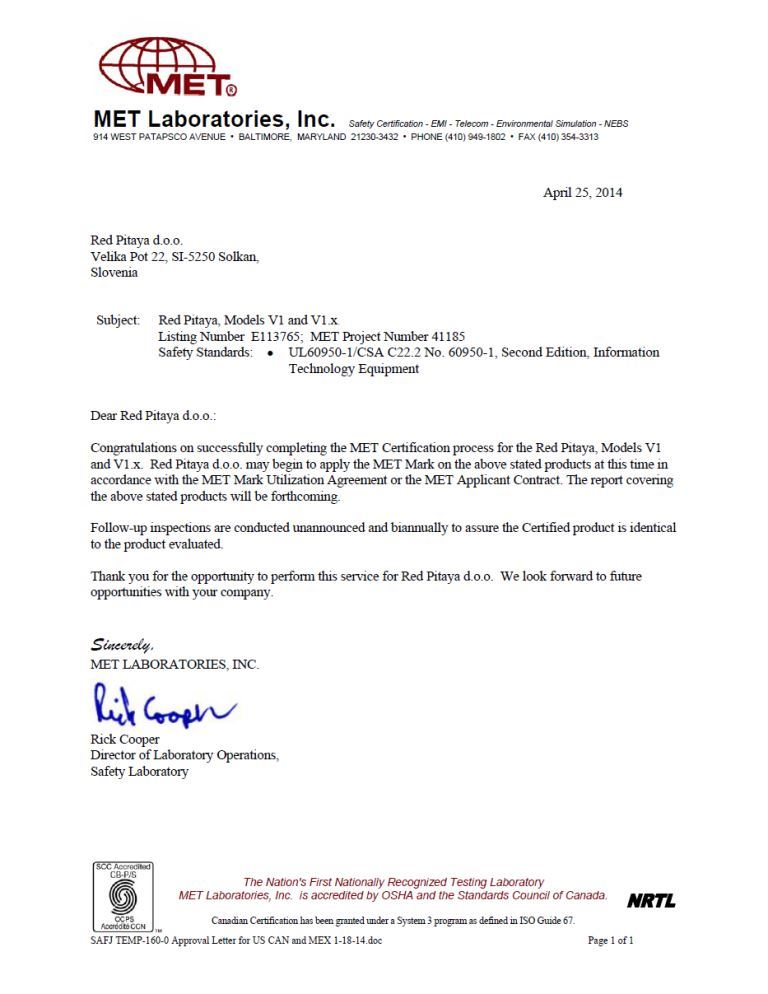
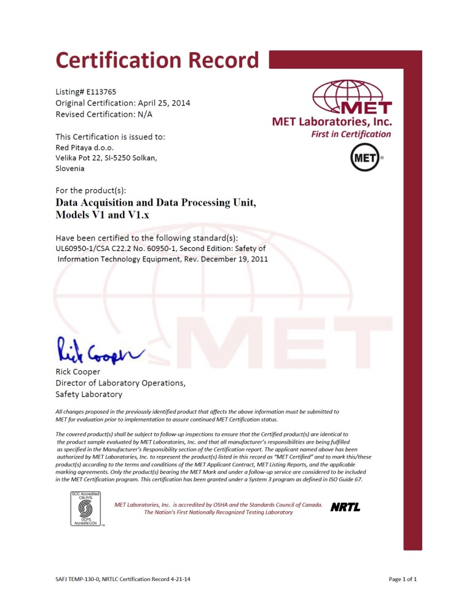

.. _certificates:

##############
Certificates
##############

Red Pitaya passed the safety and electromagnetic compatibility (EMC) and functioning tests at an external `testing and certification institute <https://www.siq.si/en/>`_.

CE, FCC - Declaration of conformity
====================================

* :rp-download:`Red Pitaya FCC Declaration of Conformity <doc/Certificates/CE-Declaration_of_conformity_2023.pdf>`

CB Test certificate - EMC
===========================

* :download:`Red Pitaya CB test certificate - EMC <certificates/CB_certificate_EMC_SI-4169.pdf>`

This certificate complies with the following standards:

* IEC CISPR22:2008 Sixth Edition.
* IEC CISPR 24:2010 (Second Edition).

CB test certificate - Safety
==============================

* :download:`Red Pitaya CB test certificate - Safety <certificates/CB_certificate_safety_SI-4208.pdf>`

This certificate complies with the following standards:

* IEC 60950-1:2005 (Second Edition) + A1:2009 + A2:2013.

ROHS, REACH and Conflict Mineral Policy
========================================

* :download:`Red Pitaya REACH <certificates/REACH_20261805.pdf>`
* :download:`Red Pitaya PFAS statement <certificates/PFAS_20260114.pdf>`

.. * :download:`Red Pitaya ROHS, REACH and Conflict Mineral Policy <certificates/Cicor_Arad_ROHS_REACH_Conflict_Minerals.pdf>`

This certificate complies with the following standards:

* ROHS 2011/65.
* EU 2015/863.
* REACH 1907/2006.
* Dodd-Frank Wall Street Reform Act Section 1502 (Conflict Minerals).

For more information about the Red Pitaya ROHS, REACH and Conflict Mineral Policy, please contact support@redpitaya.com.

PCB material and flammability rating
=====================================

* PCB material: FR4 (S1000H/S1000HB)
* Flammability rating: UL94V-0

The materials are tested under C-48/23/50 and E-24/125 conditions.

This information is provided for reference purposes. For more details about the PCB material and flammability rating, please contact support@redpitaya.com

MET Approval Letter
=====================

NRTLC Certification Record
===========================

Letter of Volatility (LoV)
=============================

To get a letter of volatility for any of our products, please contact support@redpitaya.com.

|

Additional information
==========================

For additional information on the certifications, please contact support@redpitaya.com.
