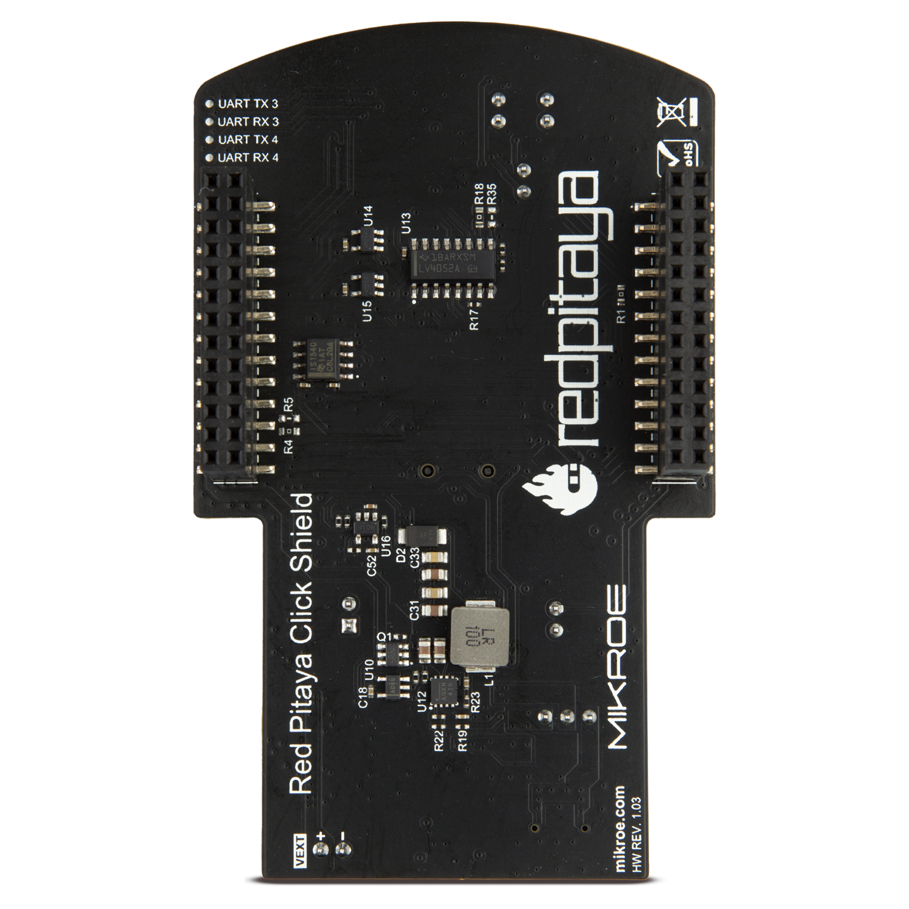
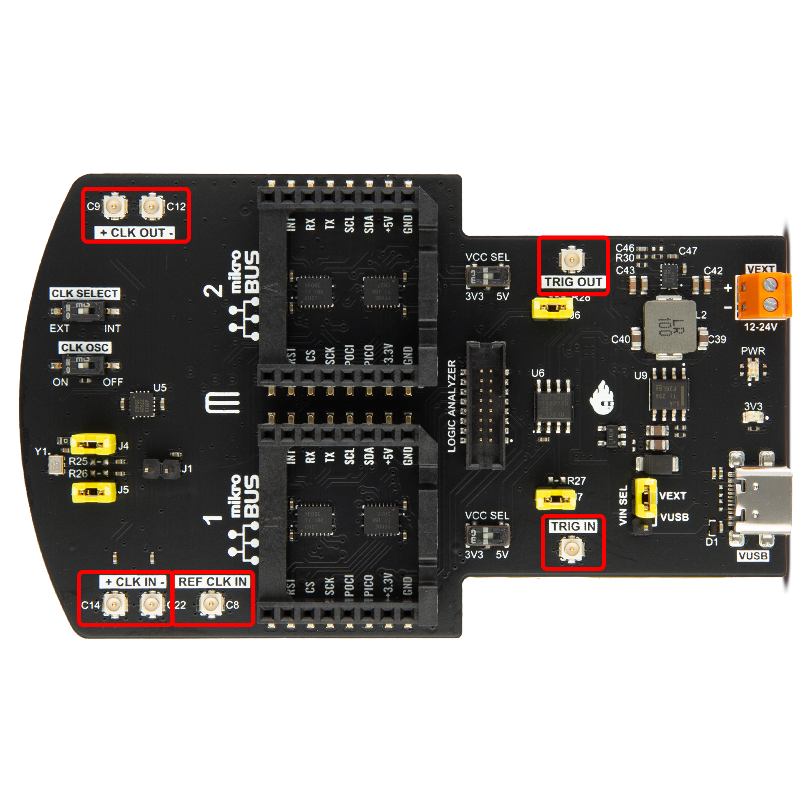
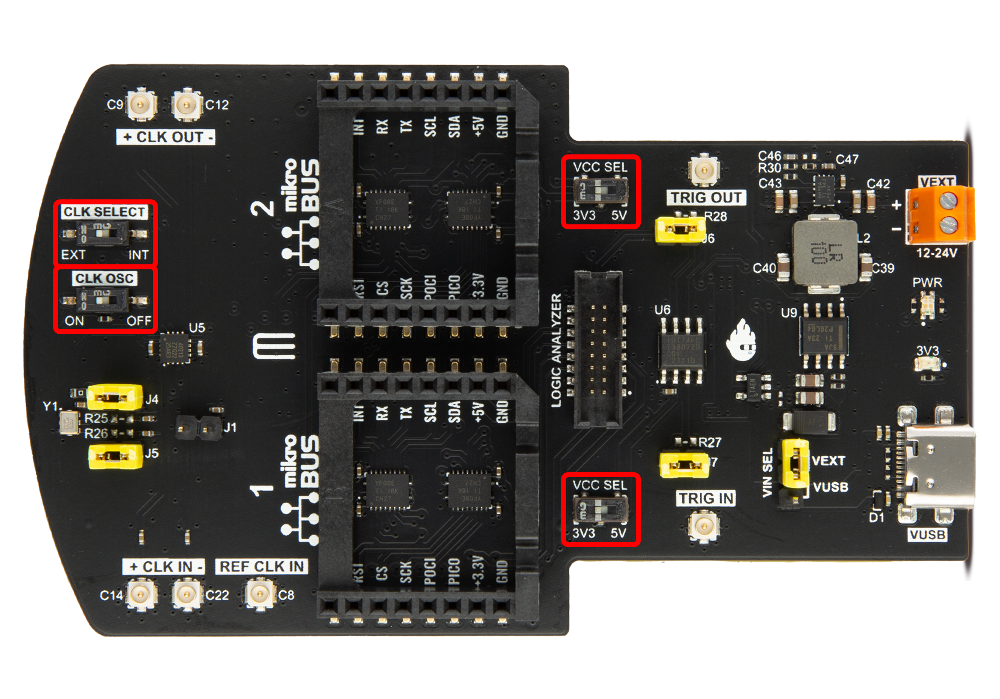
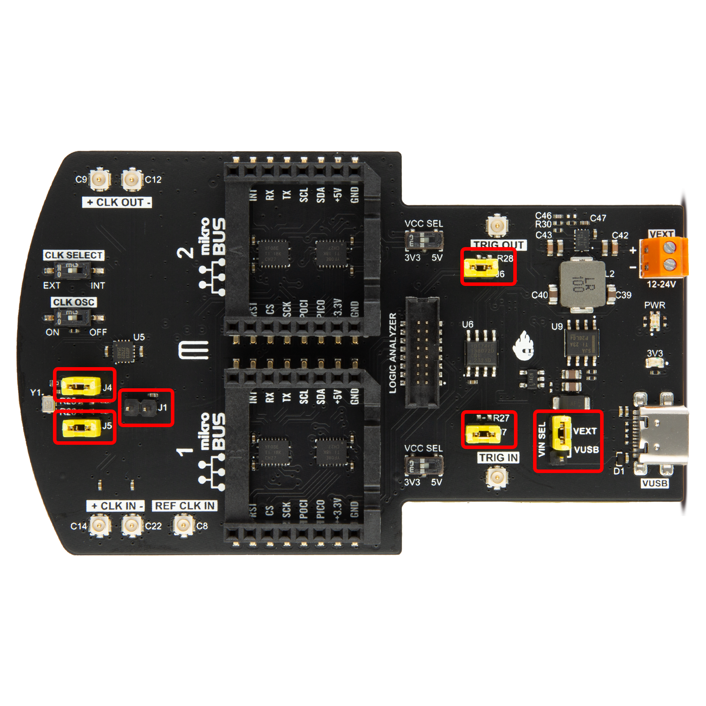
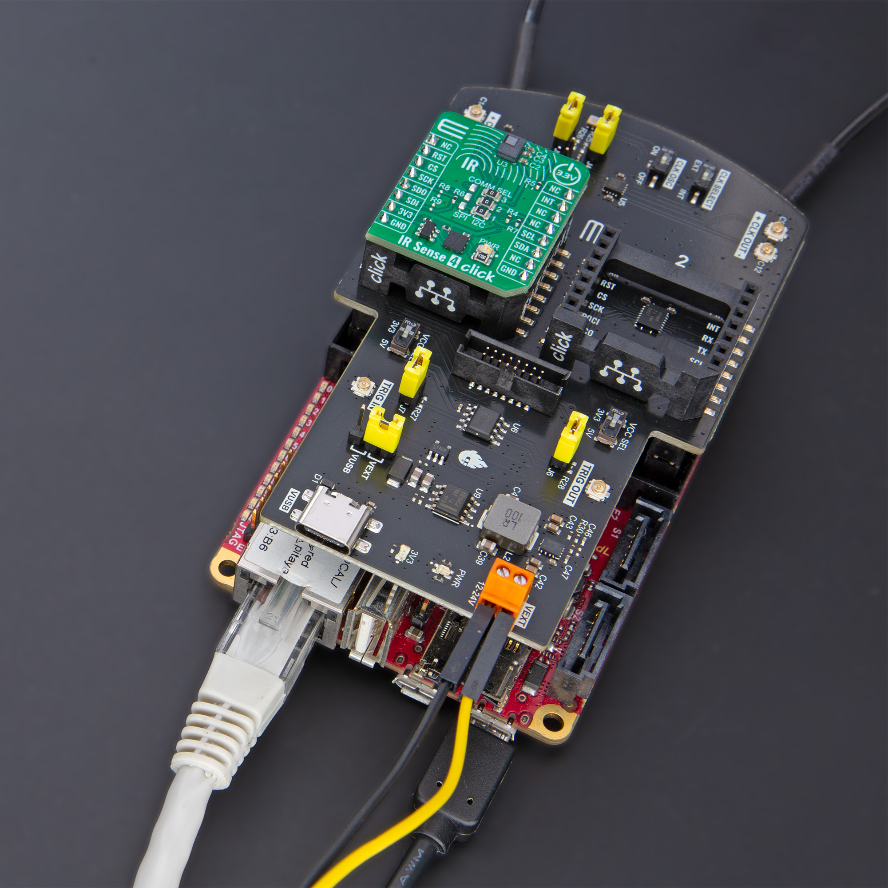

 .. _click_shield:

##############
Click Shield
##############

.. figure:: img/red-pitaya-click-shield-banner.jpg
    :width: 900
    :align: center

The Red Pitaya Click Shield extension module enables users to extend Red Pitaya hardware with two |Click Boards| and power them and the Red Pitaya from either an external USB C power adapter or a 12-24 Volt external power supply. Using U.FL patch cables, the shield can also be utilised for high-performance clock and trigger synchronisation between multiple Red Pitaya units and/or other devices. An external reference clock can also be connected to the shield through the U.FL connector.

**Highlights:**

- Two |mikroBUS| sockets, allowing interface with more than 1500 |Click Boards| devices. 
- High-performance clock and trigger synchronisation between multiple Red Pitaya units or other devices.
- Powering Red Pitaya through an external power supply (12-24 V or via USB-C connector). 

|click_shield_front| |click_shield_back|

.. |click_shield_front| image:: img/red-pitaya-click-shield-front.png
    :width: 450

|

What is in the box?
=====================

- 1x Red Pitaya Click Shield
- 3x U.FL to U.FL patch cable for trigger and clock synchronisation

Compatibility
===============

.. note::

   Depending on which Red Pitaya board model you are using, some features of the Red Pitaya Click Shield might not be applicable.

The clock synchronisation is compatible only with the following board models (and their Low-Noise versions):

- STEMlab 125-14 External Clock
- SDRlab 122-16 External Clock
- STEMlab 125-14 4-Input

Switching between the External and Internal clock is available only on the STEMlab 125-14 4-Input (CLK SEL pin) but will be compatible with all future Red Pitaya board redesigns.

Trigger synchronisation and |Click Boards| are compatible with all board models.

What are Click Boards?
=======================

|Click Boards| by |MIKROE| are small add-on boards designed to simplify the process of developing electronic projects by providing a pre-built and tested module with specific functionality. Currently, over 1500 click boards are available in different categories, including communication, display, sensors, storage, motor control, mixed signals, and others.

.. figure:: img/click-boards-header-banner.jpg
    :width: 450

These Click Boards are an innovative and efficient way to develop hardware projects, whether for beginners or experienced developers. MikroElektronika Click Boards are very easy to use. They come with a standard |mikroBUS| socket connector that can be easily plugged into the Red Pitaya Click Shield.

.. |MIKROE| raw:: html

  <a href="https://www.mikroe.com/" target="_blank">MirkoElektronika</a>

.. |Click Boards| raw:: html

  <a href="https://www.mikroe.com/click" target="_blank">MIKROE Click Board™</a>

.. |mikroBUS| raw:: html

  <a href="https://www.mikroe.com/mikrobus" target="_blank">mikroBUS™</a>

Technical specifications
==========================

.. figure:: img/red-pitaya-click-shield-logo.jpg
    :width: 900
    :align: center

|

Connectors
-------------

+-------------------------+--------------------+----------------------------------------+
| **Click Shield Label**  | **Red Pitaya Pin** | **Notes**                              |
+-------------------------+--------------------+----------------------------------------+
| CLK IN+                 | ADC CLK+           | One-cable clock                        |
+-------------------------+--------------------+----------------------------------------+
| CLK IN-                 | ADC CLK-           |                                        |
+-------------------------+--------------------+----------------------------------------+
| CLK OUT+                | ADC CLK+           | One-cable clock                        |
+-------------------------+--------------------+----------------------------------------+
| CLK OUT-                | ADC CLK-           |                                        |
+-------------------------+--------------------+----------------------------------------+
| REF CLK IN              | DIO10_P            | Reference clock Input                  |
+-------------------------+--------------------+----------------------------------------+
| TRIG IN                 | DIO0_P             | External trigger Input                 |
+-------------------------+--------------------+----------------------------------------+
| TRIG OUT                | DIO0_N             | External trigger Output                |
+-------------------------+--------------------+----------------------------------------+

|
 

Switches
---------

+-------------------------+--------------------+------------------------------------------------------------+
| **Click Shield Label**  | **Red Pitaya Pin** | **Notes**                                                  |
+-------------------------+--------------------+------------------------------------------------------------+
| Clock Select            | ADC CLK Select     | External (LOW) or internal clock (HIGH)                    |
+-------------------------+--------------------+------------------------------------------------------------+
| CLK OSC                 | NA                 | Turn the 125 MHz Oscillator on the Click Shield ON/OFF     |
+-------------------------+--------------------+------------------------------------------------------------+
| VCC Select (2x)         | NA                 | Select the digital logic levels for mikroBUS™ 3V3/5V       |
+-------------------------+--------------------+------------------------------------------------------------+

|

**Click board logic:**
If a specific Click Board requires 5V logic levels, please switch the *VCC Select* switch to the **5V** position.

Jumpers
---------

+-------------------------+-----------------------------------------------------------------+
| **Click Shield Label**  | **Notes**                                                       |
+-------------------------+-----------------------------------------------------------------+
| J1                      | Connect CLK IN- to Virtual GND (one-cable clock only)           |
+-------------------------+-----------------------------------------------------------------+
| J4                      | Connect Oscillator CLK- to CLK IN-                              |
+-------------------------+-----------------------------------------------------------------+
| J5                      | Connect Oscillator CLK+ to CLK IN+                              |
+-------------------------+-----------------------------------------------------------------+
| J6                      | Connect DIO0_N (EXT TRIG OUT) pin to TRIG IN                    |
+-------------------------+-----------------------------------------------------------------+
| J7                      | Trigger sync.: Connect DIO0_P (EXT TRIG IN) pin to TRIG OUT     |
+-------------------------+-----------------------------------------------------------------+
| VIN SEL                 | Select the external power between VEXT and VUSB                 |
+-------------------------+-----------------------------------------------------------------+

|

Power supply
--------------

.. TODO add documentation on this (how much current and power do they need)

|pow_img_usb| |pow_img_ext|

.. |pow_img_usb| image:: img/red-pitaya-click-shield-power.png
    :width: 500

The Click Shields provide two alternative ways to power the Red Pitaya: 

- USB-C external power supply 
- 2-pin screw Terminal Block (12-24 V)

If the power is supplied through the Red Pitaya Click Shield, the microUSB power connector on the Red Pitaya board can be disconnected.
In short, you do not have to rely on the original Red Pitaya power supply but can use a better power supply if available.

Pinout
--------

Here you will find the interconnections between Click Boards (|mikroBUS| pinout) and Red Pitaya pins.

.. figure:: img/mikrobus.png
    :width: 300
    :align: center

**Short pin descriptions:**

- Digital pins: *PWM, RST, INT*
- Analog pins: *AN*
- UART pins: *RX, TX*
- SPI pins: *CS, SCK, MISO, MOSI*
- I2C pins: *SCL, SDA*

.. note::

   Red Pitaya only has one set of UART and SPI pins, to achieve the functionality of two click boards, some of the digital pins are used for switching SPI and UART between the two click boards:

   - DIO1_N  ==  Chip Select 1 (Click board 1)
   - DIO3_N  ==  Chip Select 2 (Click board 2)
   - DIO5_N  ==  Switching between UART0 (Click board 1)/UART1 (Click board 2)

Click Board 1
~~~~~~~~~~~~~~~

Closer to **+CLK OUT- pins**.

+--------------------+--------------------+--------------------+--------------------+--------------------+--------------------+
| **Notes**          | **mikroBUS Pin**   | **Red Pitaya Pin** | **Red Pitaya Pin** | **mikroBUS Pin**   | **Notes**          |
+--------------------+------+-------------+--------------------+--------------------+--------------+-----+--------------------+
| Analog input       | 1    | AN          |  AIN0              | DIO1_P             | PWM          | 16  | PWM                |
+--------------------+------+-------------+--------------------+--------------------+--------------+-----+--------------------+
| Reset              | 2    | RST         |  DIO2_N            | DIO2_P             | INT          | 15  | Interrupt          |
+--------------------+------+-------------+--------------------+--------------------+--------------+-----+--------------------+
| SPI Chip select 1  | 3    | CS          |  DIO1_N            | RX                 | RX           | 14  | UART0 RX           |
+--------------------+------+-------------+--------------------+--------------------+--------------+-----+--------------------+
| SPI Serial clock   | 4    | SCK         |  SCK               | TX                 | TX           | 13  | UART0 TX           |
+--------------------+------+-------------+--------------------+--------------------+--------------+-----+--------------------+
| SPI MISO (SDO)     | 5    | MISO        |  MISO              | SCL                | SCL          | 12  | I2C Clock          |
+--------------------+------+-------------+--------------------+--------------------+--------------+-----+--------------------+
| SPI MOSI (SDI)     | 6    | MOSI        |  MOSI              | SDA                | SDA          | 11  | I2C Data           |
+--------------------+------+-------------+--------------------+--------------------+--------------+-----+--------------------+
| Power supply       | 7    | 3V3         |  3V3               | 5V                 | 5V           | 10  | Power supply       |
+--------------------+------+-------------+--------------------+--------------------+--------------+-----+--------------------+
| Ground             | 8    | GND         |  GND               | GND                | GND          | 9   | Ground             |
+--------------------+------+-------------+--------------------+--------------------+--------------+-----+--------------------+

|

Click Board 2
~~~~~~~~~~~~~~~

Closer to **+CLK IN- pins**.

+--------------------+--------------------+--------------------+--------------------+--------------------+--------------------+
| **Notes**          | **mikroBUS Pin**   | **Red Pitaya Pin** | **Red Pitaya Pin** | **mikroBUS Pin**   | **Notes**          |
+--------------------+------+-------------+--------------------+--------------------+--------------+-----+--------------------+
| Analog input       | 1    | AN          |  AIN1              | DIO3_P             | PWM          | 16  | PWM                |
+--------------------+------+-------------+--------------------+--------------------+--------------+-----+--------------------+
| Reset              | 2    | RST         |  DIO4_N            | DIO4_P             | INT          | 15  | Interrupt          |
+--------------------+------+-------------+--------------------+--------------------+--------------+-----+--------------------+
| SPI Chip select 2  | 3    | CS          |  DIO3_N            | RX                 | RX           | 14  | UART1 RX           |
+--------------------+------+-------------+--------------------+--------------------+--------------+-----+--------------------+
| SPI Serial clock   | 4    | SCK         |  SCK               | TX                 | TX           | 13  | UART1 TX           |
+--------------------+------+-------------+--------------------+--------------------+--------------+-----+--------------------+
| SPI MISO (SDO)     | 5    | MISO        |  MISO              | SCL                | SCL          | 12  | I2C Clock          |
+--------------------+------+-------------+--------------------+--------------------+--------------+-----+--------------------+
| SPI MOSI (SDI)     | 6    | MOSI        |  MOSI              | SDA                | SDA          | 11  | I2C Data           |
+--------------------+------+-------------+--------------------+--------------------+--------------+-----+--------------------+
| Power supply       | 7    | 3V3         |  3V3               | 5V                 | 5V           | 10  | Power supply       |
+--------------------+------+-------------+--------------------+--------------------+--------------+-----+--------------------+
| Ground             | 8    | GND         |  GND               | GND                | GND          | 9   | Ground             |
+--------------------+------+-------------+--------------------+--------------------+--------------+-----+--------------------+

|

Logic Analyzer Connector
~~~~~~~~~~~~~~~~~~~~~~~~~~

.. add connectors picture (topdown of click shield, LA connector marked)

Pin 1 is marked with a small white dot. On the bottom-left side of the connector when the shield is oriented according to the *LOGIC ANALYZER* text.

+--------------------+-------------------------+--------------------+--------------------+-------------------------+--------------------+
| **Notes**          | **LA Connector Pin**    | **Red Pitaya Pin** | **Red Pitaya Pin** | **LA Connector Pin**    | **Notes**          |
+--------------------+-------------------------+--------------------+--------------------+-------------------------+--------------------+
| Not Connected      | 1                       | NC                 | NC                 | 2                       | Not Connected      |
+--------------------+-------------------------+--------------------+--------------------+-------------------------+--------------------+
| Not Connected      | 3                       | NC                 | NC                 | 4                       | Not Connected      |
+--------------------+-------------------------+--------------------+--------------------+-------------------------+--------------------+
| DIN7               | 5                       | DIO7_P             | DIO3_P             | 6                       | DIN3               |
+--------------------+-------------------------+--------------------+--------------------+-------------------------+--------------------+
| DIN6               | 7                       | DIO6_P             | DIO2_P             | 8                       | DIN2               |
+--------------------+-------------------------+--------------------+--------------------+-------------------------+--------------------+
| DIN5               | 9                       | DIO5_P             | DIO1_P             | 10                      | DIN1               |
+--------------------+-------------------------+--------------------+--------------------+-------------------------+--------------------+
| DIN4               | 11                      | DIO4_P             | DIO0_P             | 12                      | DIN0               |
+--------------------+-------------------------+--------------------+--------------------+-------------------------+--------------------+
| Not Connected      | 13                      | NC                 | NC                 | 14                      | Not Connected      |
+--------------------+-------------------------+--------------------+--------------------+-------------------------+--------------------+
| Ground             | 15                      | GND                | GND                | 16                      | Ground             |
+--------------------+-------------------------+--------------------+--------------------+-------------------------+--------------------+

|

Other
~~~~~~~

Red Pitaya only has one set of UART pins, to achieve the functionality of two click boards, the following pins are used for switching UART between the two click boards:

+--------------------+------------------------------------------------------------+
| **Red Pitaya Pin** | **Notes**                                                  |
+--------------------+------------------------------------------------------------+
| DIO5_N             | Switching UART0/UART1 (output set to LOW/HIGH)             |
+--------------------+------------------------------------------------------------+
| DIO6_N             | Switching UART2/UART3 (Possible future expansion)          |
+--------------------+------------------------------------------------------------+

|

Components
===============

- |ZL40213| LVDS clock fanout buffer.

.. |ZL40213| raw:: html

  <a href="https://www.digikey.si/en/htmldatasheets/production/1239190/0/0/1/zl40213" target="_blank">ZL40213</a>

.. Schematics
.. ================

.. add final Click shield schematics when available

**Coming Soon...**

Examples of use
================

Synchronisation
----------------

The Red Pitaya Click Shield can synchronise multiple Red Pitaya units together. As U.FL cables are used for clock and trigger synchronisation, other external clock devices can also be included in the chain.
The connection provides minimal clock signal delay between multiple Red Pitaya units, as there is only a single ZL40213 LVDS clock fanout buffer between two units.

To synchronise two or more Red Pitaya units, establish the following connections with U.FL cables between the primary board (transmitting clock and trigger signals) and the secondary board (receiving the clock and trigger signals). Use one of the two schemes depending on whether you want to connect an external clock or use the oscillator on the Red Pitaya Click Shields.

Oscillator
~~~~~~~~~~~~

.. figure:: img/Click_Shield_Oscillator_Sync.png
    :width: 700
    :align: center

When using the oscillator, the first Red Pitaya Click Shield transmits the clock and trigger signals to all devices in the chain. Here are the most important things to check:

**Primary board:**

- Jumpers J4 and J5 connected. Connect the oscillator to the clocking transmission line.
- Jumpers J6 and J7 connected. Connect the Red Pitaya trigger to the trigger transmission line.
- Jumper J1 disconnected (unless using a single wire clock).
- CLK OSC switch in ON position.
- CLK SELECT switch in EXT position.

**Secondary board:**

- Jumper J6 connected. Connect the trigger to the Ext. Trigger pin.
- Jumper J1 disconnected (unless using a single wire clock).
- CLK OSC switch in OFF position.
- CLK SELECT switch in EXT position.

If an external trigger signal is used, copy the secondary board's trigger connections to the primary board (disconnect J7 and connect the external trigger U.FL cable). 
Otherwise, DIO0_N acts as external trigger output (on the primary board), and DIO0_P acts as external trigger input.

External Clock
~~~~~~~~~~~~~~~~

.. figure:: img/Click_Shield_Ext_Clock_Sync.png
    :width: 700
    :align: center

When using an external clock and external trigger, the clock and trigger signals are transmitted to all devices in the chain. All the Click Shields share the same configuration:

**Primary and Secondary boards:**

- Jumper J6 connected. Connect the trigger to the Ext. Trigger pin.
- Jumper J1 disconnected (unless using a single wire clock).
- CLK OSC switch in OFF position.
- CLK SELECT switch in EXT position.

Synchronisation example
--------------------------

Here are examples for synchronising two Red Pitayas with Click Shields through SCPI commands.

* :ref:`Synchronised Click Shield Generation and Acquisition <click_shield_sync_exam1>`

Click Boards
--------------

Here are some examples of how to use click boards together with Click Shield and Red Pitaya.

.. toctree::
  :maxdepth: 2

   ../../../../../appsFeatures/examples/click_shield_examples/click_board_examples/click_examples

