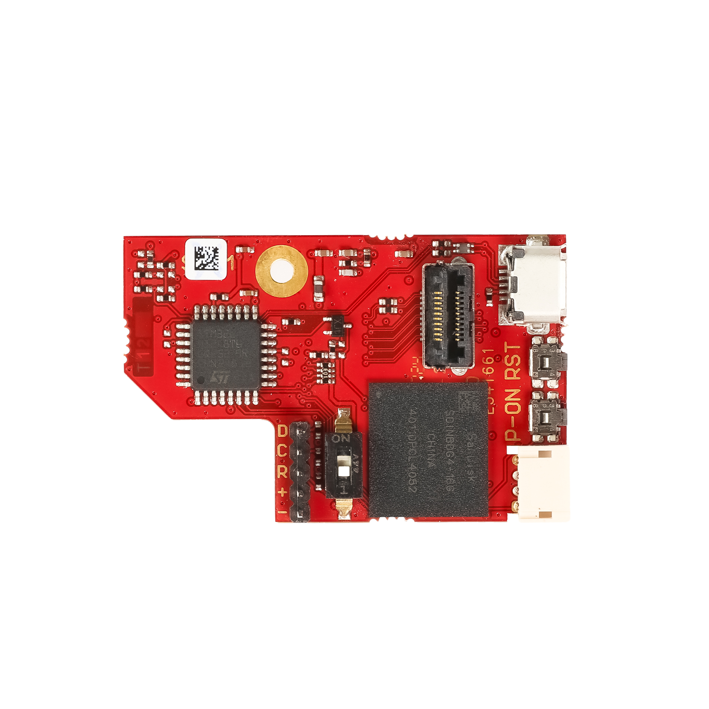
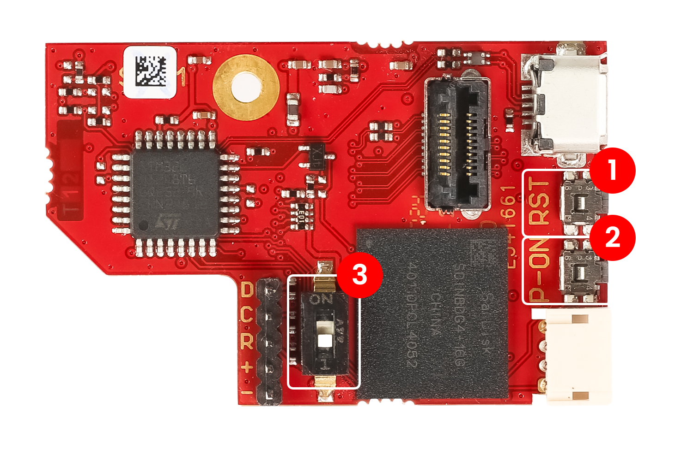
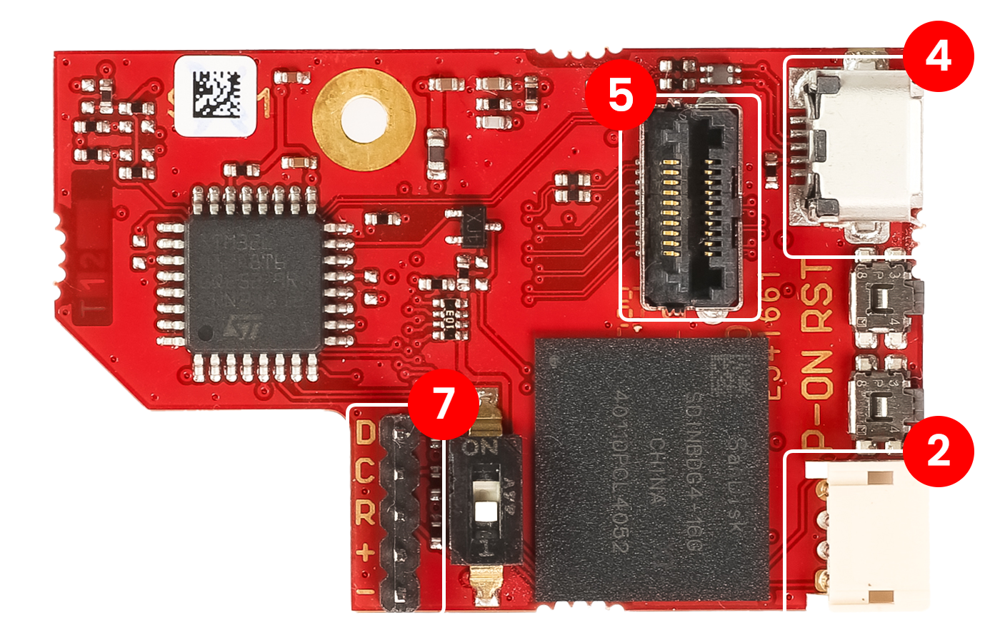
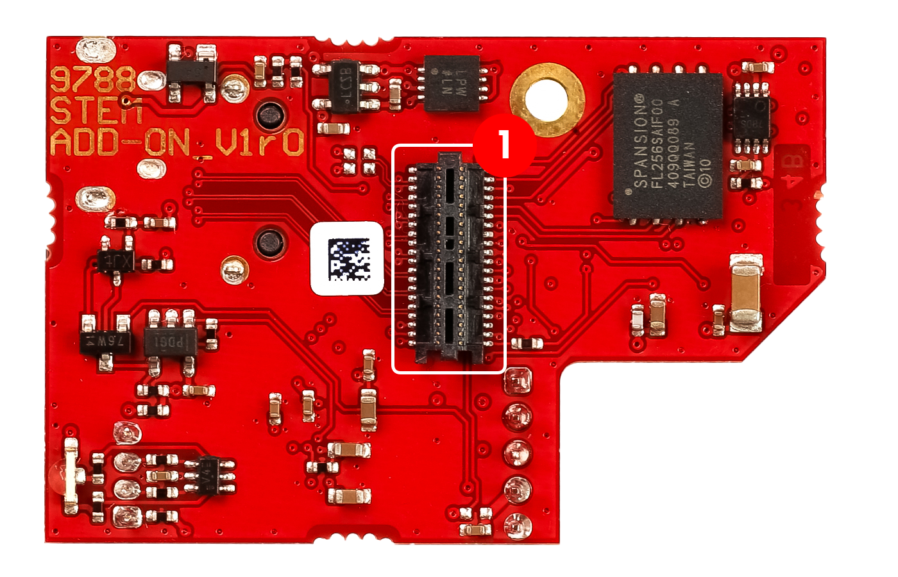

.. _E3_QSPI_eMMC_module_HW:

QSPI eMMC module - Hardware
#############################

The QSPI eMMC module module provides secure and robust Red Pitaya boot and shutdown options.

|e3_top| |e3_bottom|

.. |e3_bottom| image:: img/QSPI_eMMC_module_Gen2_bottom.png
   :width: 600

.. contents:: **Index**
    :local:
    :backlinks: none

|

Features
========

* Single button power on/off of Red Pitaya board.
* QSPI and eMMC boot options.
* On-board STM microcontroller that provides.

    * Red Pitaya power up.
    * Safe Red Pitaya shutdown.
    * Watchdog timer functionality.
    * Boot media selection (SD card/eMMC).

* Arduino (C++) firmware with open source code.
* Connector for 8 high-speed differential pairs directly connected to the Zynq 7020 FPGA (16 GPIOs).

The QSPI eMMC module module is powered by the Red Pitaya board, so no additional power supply is needed.

Hardware requirements
======================

The QSPI eMMC module module is compatible with the following Red Pitaya board modules:

* STEMlab 125-14 Pro Gen 2.
* STEMlab 125-14 Pro Z7020 Gen 2.

.. note::

    The high speed differential paris are only supported on the STEMlab 125-14 Pro Z7020 Gen 2 board model.

Installing the QSPI eMMC module
================================

You can find the QSPI eMMC module installation guide in the :ref:`E3 QSPI eMMC module installation guide <QSPI_eMMC_board>`.

Buttons and switches
=====================

The QSPI eMMC module has two buttons and one switch:

1. **P-ON** - Power button. Press and hold to power on or off the Red Pitaya board. The functionality of the button is defined in the microcontroller firmware.
2. **RST** - Reset button. Press to reset the microcontroller and the eMMC.
3. **eMMC switch** - Drives the SDIO_SEL pin low in ON position and forces the Red Pitaya board to boot from the eMMC.

Connectors
==========

In this section we will describe the connectors on the QSPI eMMC module. For more detailed information regarding the functionality
and connector part numbers, please refer to the QSPI eMMC module schematics.

CN1
---

**Type:** 40-pin 2 row 0.5 mm pitch connector

Connects QSPI eMMC module to Red Pitaya board. It has the following pins:

    * QSPI pins.
    * eMMC pins.
    * I2C.
    * 8 LVDS differential pair lines (16 GPIOs) (only for :ref:`STEMlab 125-14 Pro Z7020 Gen 2 <top_125_14_pro_z7020_gen2>`).
    * Power and control signals.

+-----+------------------------------------+-----------------+------------------------+----------------+----------------+------------------------+-----------------+------------------------------------+-----+
| Pin | Description                        | FPGA pin number | FPGA pin description   | Voltage levels | Voltage levels | FPGA pin description   | FPGA pin number | Description                        | Pin |
+=====+====================================+=================+========================+================+================+========================+=================+====================================+=====+
| 1   | I2C0_SCL                           |                 |                        | 3V3            | 3V3            | PS_MIO0_500            | E6              | E3_SHDN                            | 2   |
+-----+------------------------------------+-----------------+------------------------+----------------+----------------+------------------------+-----------------+------------------------------------+-----+
| 3   | PS_POR#                            | C7              | PS_POR_B_500           | 3V3            | 3V3            | PS_MIO7_500            | D8              | E3_WDT_KICK                        | 4   |
+-----+------------------------------------+-----------------+------------------------+----------------+----------------+------------------------+-----------------+------------------------------------+-----+
| 5   | PWR_ON                             |                 |                        | 3V3            | 3V3            | PS_MIO46_501           | D16             | SDIO_SEL [#f2]_                    | 6   |
+-----+------------------------------------+-----------------+------------------------+----------------+----------------+------------------------+-----------------+------------------------------------+-----+
| 7   | DIO17_P                            | T5              | IO_L19P_T3_13          | LVDS           | 3V3            |                        |                 | I2C0_SDA                           | 8   |
+-----+------------------------------------+-----------------+------------------------+----------------+----------------+------------------------+-----------------+------------------------------------+-----+
| 9   | DIO17_N                            | U5              | IO_L19N_T3_VREF_13     | LVDS           | 3V3            | PS_MIO41_501           | C17             | EMMC_CMD                           | 10  |
+-----+------------------------------------+-----------------+------------------------+----------------+----------------+------------------------+-----------------+------------------------------------+-----+
| 11  | DIO11_P                            | U7              | IO_L11P_T1_SRCC_13     | LVDS           | 3V3            | PS_MIO45_501           | B15             | EMMC_DAT3                          | 12  |
+-----+------------------------------------+-----------------+------------------------+----------------+----------------+------------------------+-----------------+------------------------------------+-----+
| 13  | DIO11_N                            | V7              | IO_L11N_T1_SRCC_13     | LVDS           | 3V3            | PS_MIO44_501           | F13             | EMMC_DAT2                          | 14  |
+-----+------------------------------------+-----------------+------------------------+----------------+----------------+------------------------+-----------------+------------------------------------+-----+
| 15  | DIO13_P                            | V8              | IO_L15P_T2_DQS_13      | LVDS           |                |                        |                 | GND                                | 16  |
+-----+------------------------------------+-----------------+------------------------+----------------+----------------+------------------------+-----------------+------------------------------------+-----+
| 17  | DIO13_N                            | W8              | IO_L15N_T2_DQS_13      | LVDS           | 3V3            | PS_MIO43_501           | A9              | EMMC_DAT1                          | 18  |
+-----+------------------------------------+-----------------+------------------------+----------------+----------------+------------------------+-----------------+------------------------------------+-----+
| 19  | DIO15_P                            | U9              | IO_L17P_T2_13          | LVDS           | 3V3            | PS_MIO42_501           | E12             | EMMC_DAT0                          | 20  |
+-----+------------------------------------+-----------------+------------------------+----------------+----------------+------------------------+-----------------+------------------------------------+-----+
| 21  | DIO15_N                            | U8              | IO_L17N_T2_13          | LVDS           |                |                        |                 | GND                                | 22  |
+-----+------------------------------------+-----------------+------------------------+----------------+----------------+------------------------+-----------------+------------------------------------+-----+
| 23  | DIO14_P                            | W10             | IO_L16P_T2_13          | LVDS           | 3V3            | PS_MIO40_501           | D14             | EMMC_CLK                           | 24  |
+-----+------------------------------------+-----------------+------------------------+----------------+----------------+------------------------+-----------------+------------------------------------+-----+
| 25  | DIO14_N                            | W9              | IO_L16N_T2_13          | LVDS           |                |                        |                 | GND                                | 26  |
+-----+------------------------------------+-----------------+------------------------+----------------+----------------+------------------------+-----------------+------------------------------------+-----+
| 27  | DIO16_P                            | W11             | IO_L18P_T2_13          | LVDS           | 3V3            | PS_MIO5_500            | A6              | SFSPI_IO3                          | 28  |
+-----+------------------------------------+-----------------+------------------------+----------------+----------------+------------------------+-----------------+------------------------------------+-----+
| 29  | DIO16_N                            | Y11             | IO_L18N_T2_13          | LVDS           | 3V3            | PS_MIO4_500            | B7              | SFSPI_IO2                          | 30  |
+-----+------------------------------------+-----------------+------------------------+----------------+----------------+------------------------+-----------------+------------------------------------+-----+
| 31  | DIO18_P                            | V11             | IO_L21P_T3_DQS_13      | LVDS           | 3V3            | PS_MIO3_500            | D6              | SFSPI_IO1                          | 32  |
+-----+------------------------------------+-----------------+------------------------+----------------+----------------+------------------------+-----------------+------------------------------------+-----+
| 33  | DIO18_N                            | V10             | IO_L21N_T3_DQS_13      | LVDS           | 3V3            | PS_MIO2_500            | B8              | SFSPI_IO0                          | 34  |
+-----+------------------------------------+-----------------+------------------------+----------------+----------------+------------------------+-----------------+------------------------------------+-----+
| 35  | DIO12_P (I2C1_SCL/UART_TX) [#f1]_  | T9              | IO_L12P_T1_MRCC_13     | LVDS           | 3V3            | PS_MIO1_500            | A7              | SFSPI_CS#                          | 36  |
+-----+------------------------------------+-----------------+------------------------+----------------+----------------+------------------------+-----------------+------------------------------------+-----+
| 37  | DIO12_N (I2C1_SDA/UART_RX) [#f1]_  | U10             | IO_L12N_T1_MRCC_13     | LVDS           | 3V3            | PS_MIO6_500            | A5              | SFSPI_SCK                          | 38  |
+-----+------------------------------------+-----------------+------------------------+----------------+----------------+------------------------+-----------------+------------------------------------+-----+
| 39  | +5V                                |                 |                        |                |                |                        |                 | +5V                                | 40  |
+-----+------------------------------------+-----------------+------------------------+----------------+----------------+------------------------+-----------------+------------------------------------+-----+

Changing the functionality of DIO12 differential pair
~~~~~~~~~~~~~~~~~~~~~~~~~~~~~~~~~~~~~~~~~~~~~~~~~~~~~~

By configuring the resistors on the QSPI eMMC module it is possible to change the functionality of the DIO12 differential pair to either IC21 or UART.

**I2C1**

1. Change the positions of the resistors R5 and R6 to positions R3 and R4.

    .. TODO add picture

**UART**

1. Change the positions of the resistors R5 and R6 to positions R3 and R4.

    .. TODO add picture

#. Populate 0R0 resistors R17 and R18.

    .. TODO add picture

#. Remove 10k0 resistors R19 and R21 as well as 2k2 resistors R1 and R2.

    .. TODO add picture

CN2
---

**Type:** 4-pin 1 row 1.5 mm pitch connector

CN2 connector provides a possiblity for external control of status LEDs and power pin (PWR_ON_CN). The microcontroller code accepts signals 
from either PWR_ON_CN pin or the P_ON button, which are effectively AND-ed together in the code.

+-----+-----------------+
| Pin | Description     |
+=====+=================+
| 1   | PWR_ON_CN       |
+-----+-----------------+
| 2   | LED GREEN       |
+-----+-----------------+
| 3   | LED RED         |
+-----+-----------------+
| 4   | GND             |
+-----+-----------------+

CN4
---

**Type:** micro USB connector

Connector CN4 is used to program the STM microcontroller on the QSPI eMMC module. It provides a USB connection to the STM microcontroller.

+-----+-----------------+
| Pin | Description     |
+=====+=================+
| 1   | VCC             |
+-----+-----------------+
| 2   | D-              |
+-----+-----------------+
| 3   | D+              |
+-----+-----------------+
| 4   | ID              |
+-----+-----------------+
| 5   | GND             |
+-----+-----------------+
| 6   | SHIELD          |
+-----+-----------------+

CN5
---

* **Type:** 20-pin 2 row 0.5 mm pitch connector.
* **Example cable:** `HLCD-10-06.00-TR-TR-1 <https://www.digikey.com/en/products/detail/samtec-inc/HLCD-10-06-00-TR-TR-1/13683996>`_

The CN5 connector is directly connected to the 8 high-speed differential pairs on the Zynq FPGA. It can be used to connect to external devices.

+-----+-----------------+-----------------+-----+
| Pin | Description     | Description     | Pin |
+=====+=================+=================+=====+
| 1   | DIO15_P         | DIO17_P         | 2   |
+-----+-----------------+-----------------+-----+
| 3   | DIO15_N         | DIO17_N         | 4   |
+-----+-----------------+-----------------+-----+
| 5   | DIO14_P         | DIO11_P         | 6   |
+-----+-----------------+-----------------+-----+
| 7   | DIO14_N         | DIO11_N         | 8   |
+-----+-----------------+-----------------+-----+
| 9   | DIO16_P         | DIO13_P         | 10  |
+-----+-----------------+-----------------+-----+
| 11  | DIO16_N         | DIO13_N         | 12  |
+-----+-----------------+-----------------+-----+
| 13  | DIO18_P         | GND             | 14  |
+-----+-----------------+-----------------+-----+
| 15  | DIO18_N         | GND             | 16  |
+-----+-----------------+-----------------+-----+
| 17  | DIO12_P         | GND             | 18  |
+-----+-----------------+-----------------+-----+
| 19  | DIO12_N         | GND             | 20  |
+-----+-----------------+-----------------+-----+

The shield pin is connected to the ground plane on the QSPI eMMC module.

CN7
---

**Type:** 5-pin 1 row 2.00 mm pitch connector

Serial Wire Debug connector for programming the STM microcontroller.

+-----+--------------+-----------------+
| Pin | Label        | Description     |
+=====+==============+=================+
| 1   | D            | SWDIO           |
+-----+--------------+-----------------+
| 2   | C            | SWCLK           |
+-----+--------------+-----------------+
| 3   | R            | SWD_RES         |
+-----+--------------+-----------------+
| 4   | Plus (+)     | VCC             |
+-----+--------------+-----------------+
| 5   | Minus (-)    | GND             |
+-----+--------------+-----------------+

Components
==========

The QSPI eMMC module is equipped with the following components:

* `STM32L412K8T6 <https://www.st.com/en/microcontrollers-microprocessors/stm32l412k8.html>`_
* `eMMC <https://shop.sandisk.com/en-sg/products/embedded-flash/industrial-inand-emmc-drives?sku=SDINBDG4-16G-XI2>`_ - 16 GB eMMC memory.
* `QSPI <https://www.infineon.com/part/S25FL256SAGNFI001>`_

Schematics
==============

.. TODO add schematics

Mechanical Specifications and 3D Models
=========================================

.. TODO add mechanical specifications and 3D models

Software specifications
=======================

For software specifications, please refer to the :ref:`E3 software documentation <E3_QSPI_eMMC_module_SW>`.

Examples of use
===============

.. TODO Link to software configuration and installation guide

.. rubric:: Footnotes

.. [#f1] DIO12 differential pin pair is connected by default. The I2C1 and UART pins can be connected by changing the position of 
        the resistors on the QSPI eMMC module.

.. [#f2] negative logic in the FPGA.

.. substitutions
