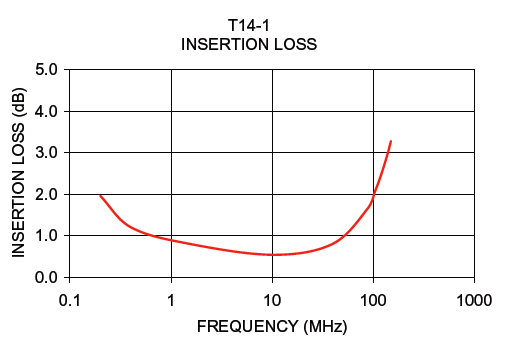
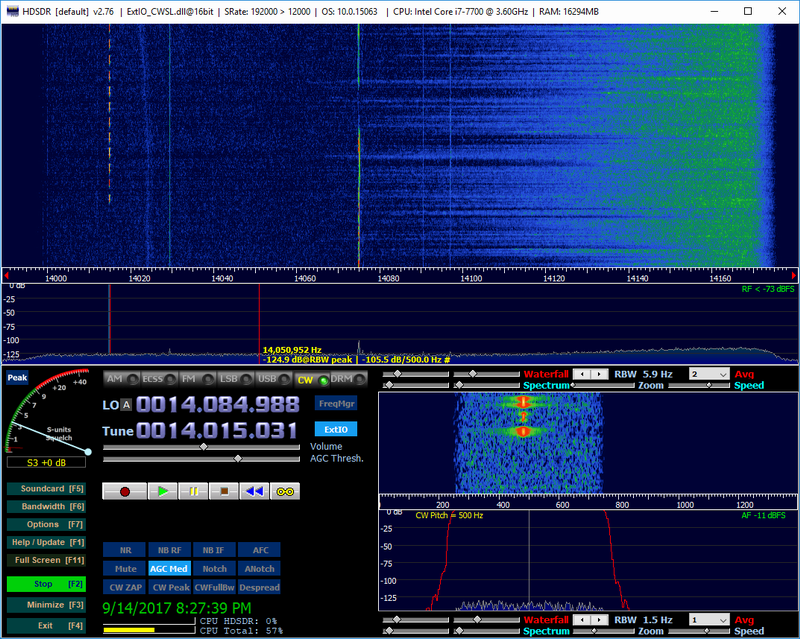
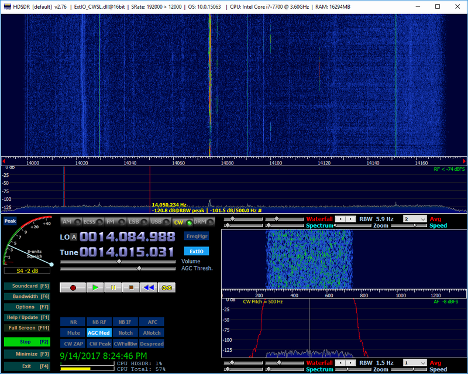

.. _impedance_transformer_external_module:

#######################
Impedance Transformer
#######################

The Red Pitaya 14:1 Impedance Transformer is optimized for connecting 50-Ω HF antennas and pre-amps to the high impedance Red Pitaya inputs. It improves sensitivity and overall receives performance.

Hardware compatibility
========================

Impedance transformer is compatible with the following Red Pitaya boards:

* All STEMlab 125-14 board models.
* STEMlab 125-10 (discontinued).

Features
==========

* 14:1 impedance transformer.
* Steps up 50-ohm antennas and pre-amps to the high impedance inputs.
* Improves sensitivity and performance. Less than 1 dB insertion loss from 2-50 MHz.
* Small and compact, room for one on each of the two antenna inputs.
* Shrink-wrap insulation.
* Gold-plated male and female SMA connectors.

The Impedance Transformer module uses a `MiniCircuits® T14-1 <https://www.minicircuits.com/pdfs/T14-1+.pdf>`_ wideband step-up RF transformer with the following characteristics.
    

    Insertion loss of the MiniCircuits® T14-1 transformer.

Setup
==========

1. Connect the impedance transformer to one of the fast analog inputs.
#. Change the positions on the jumper pins. Place a jumper across pins 2 and 5 to bypass the internal attenuators, then connect the transformer

    .. figure:: img/RedPitayaBypassJumper.jpg
        :width: 400

        Bypass input attenuators on the Red Pitaya board.

    .. note::

        The other jumper should be stored separately and not placed across other pins to avoid the risk of damaging the board in the future by thinking the jumpers are already in HV or LV position, 
        when they are in fact bypassing the input attenuators. The absolute maximum voltage of the inputs with the bypassed attenuators is ±0.5 V.

Usecase example
===============

Using a passive antenna (VE3DO loop) with a Clifton Labs Z10042 11 dB Norton amplifier connected directly to a Red Pitaya at N6TV, strong intermodulation from two nearby FM broadcast stations on 92.3 and 106.5 MHz was clearly visible (106.5 - 92.3 = 14.2 MHz).

Inserting the 14:1 transformer between the pre-amp and the Red Pitaya reduced the intermodulation significantly, and atmospheric band noise (wideband sensitivity) improved by about 4 dB.

