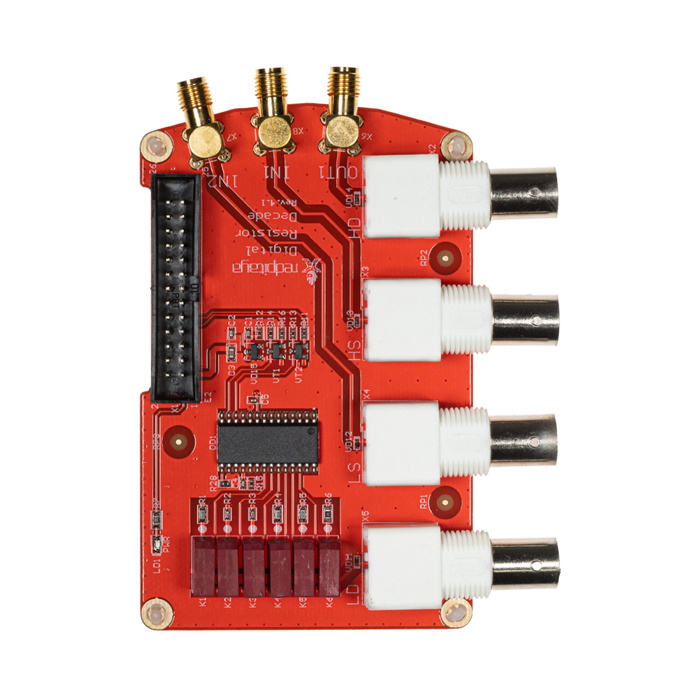
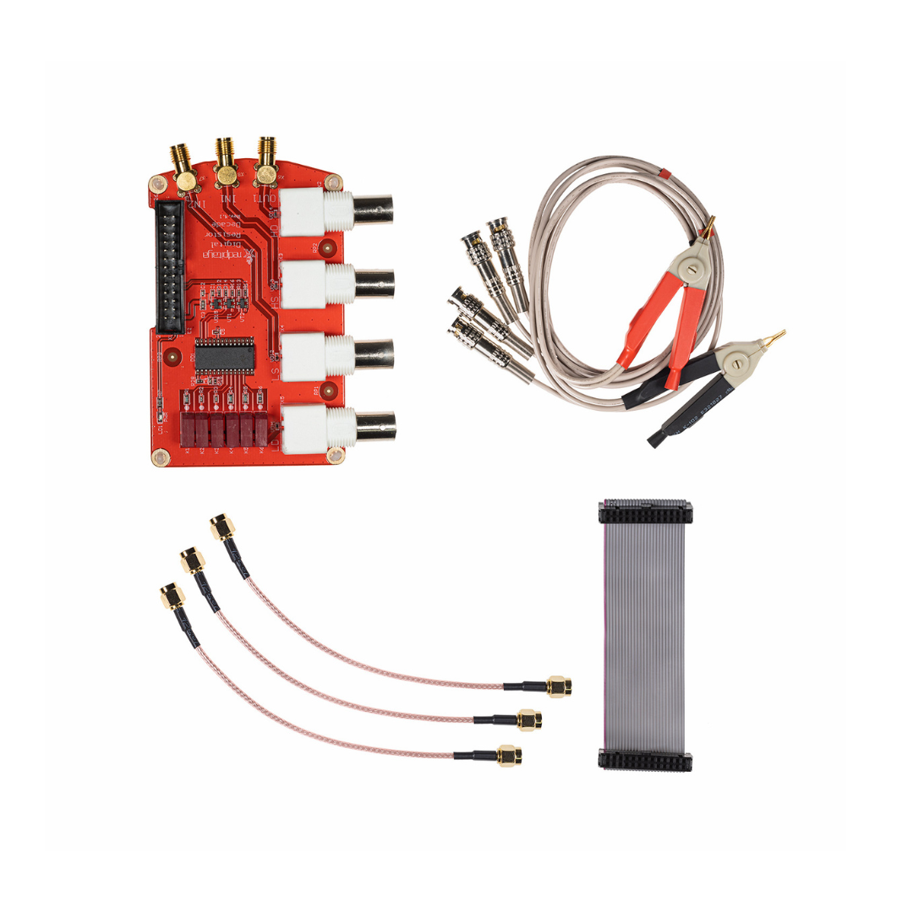

.. _lcr_extension_module:

###########################
LCR meter extension module
###########################

    LCR meter extension module.

|

What is in the box?
=====================

    LCR meter extension module accessories.

* 1x Red Pitaya LCR meter extension module.
* 3x SMA cables,
* 2x Test clips (alligator clips, red and black),
* 1x 26 header pin cable connector.

Description
=============

**Coming soon**

Applicable applications
========================

The LCR meter extension module can be used with the following applications:

* :ref:`LCR meter application <lrc_app>`
* :ref:`Impedance analyzer <impedance_app>`

Code Examples
===============

Example code of how to perform measurements using the LCR meter extension module is available here:

* :ref:`LCR example <examples_lcr>`
