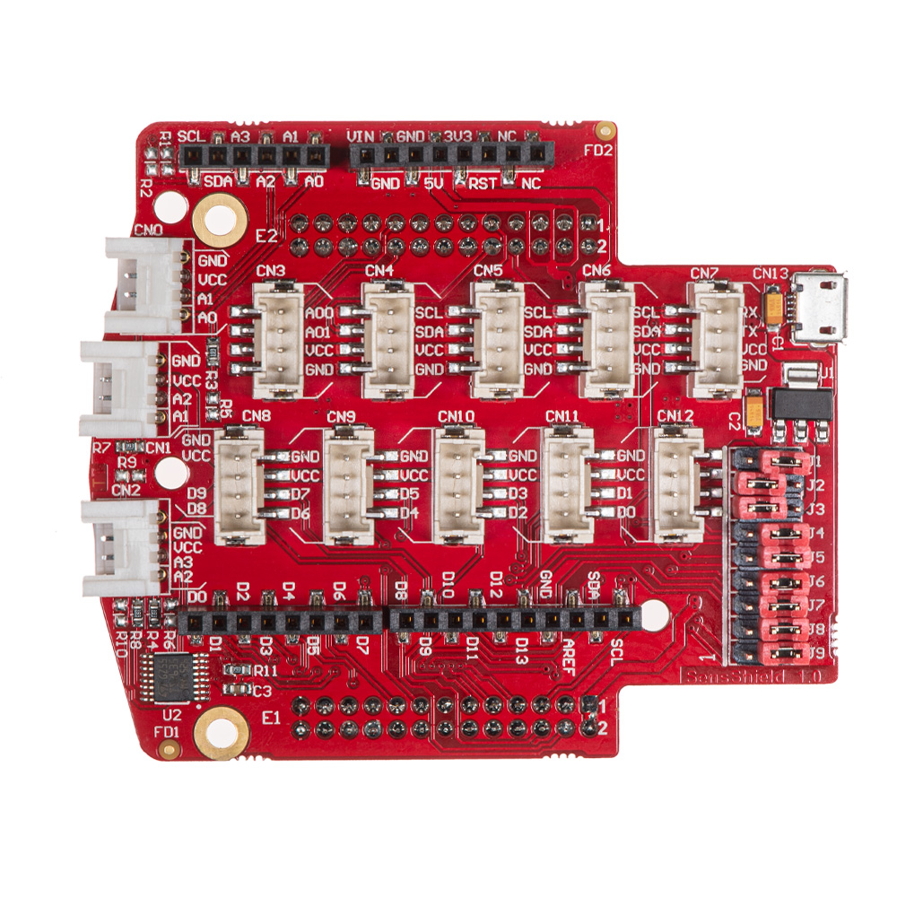

#########################
Sensor extension module
#########################

Description
=============

The Sensor extension board redirects the digital and analog pins of the Red Pitaya so that Groove sensors are easily connected. It also has the same pinout as Arduino shields.

Each Groove connector connects to the power (3V3), ground, and two digital or analog pins. As Red Pitaya only has four analog inputs, some pins overlap. You can control the connector pins and the sensors attached by reading data from either digital or analog pins.

Code examples of controlling the digital and analog inputs and outputs are available :ref:`here <examples>`.

Getting started with electronics is way more fun and engaging when you have loads of sensors you can use straight away. Whether you want to measure temperature, vibration, movement, etc., we have an extension module compatible with **Grove** modules from |Seeed®|. All you need to do is select the desired module, find the correct connector, and get going with your project.

.. figure:: img/extension_module_and_sensors.png
  :width: 500

Want to use an Arduino Uno shield? They can be plugged directly into the Sensor extension board. The extension module can also be powered from the external power supply using a micro USB cable.

A set of nine Jumpers can reconnect certain extension module connectors to different :ref:`E1 <E1>` or :ref:`E2 <E2>` pins or change power supply settings. For example, with J1 and J3, you can set the shield power source (VCC) to either an external power supply or get the power from Red Pitaya. A full schematic of the extension module is available below.

.. note:: 

    The extension module is available for purchase from the Red Pitaya |store|.

.. |Seeed®| raw:: html

    <a href="https://wiki.seeedstudio.com/Grove_System/" target="_blank">Seeed®</a>

.. |store| raw:: html

    <a href="https://redpitaya.com/shop/" target="_blank">store</a>

Connectors and Jumpers
=========================

The black connectors on the sides are compatible with Arduino. The white connectors on the front provide analog inputs, and there are two rows of biege connectors at the centre which provide digital I/O, UART, I2C, or analog outputs. On the bottom, there are connectors to the Red Pitaya board.

.. figure:: img/extension_module.png

Grove module connectors
--------------------------

These are dedicated connectors compatible with |Grove modules|.

.. |Grove modules| raw:: html

    <a href="https://wiki.seeedstudio.com/Grove_System/" target="_blank">Grove modules</a>

There are six connector types available:

* **AI** Analog input (0 - 3.3 V)
* **AO** Analog output
* **I2C** (3.3 V)
* **UART** (3.3 V)
* **DIO** Digital input/output (3.3 V, not 5 V tolerant)

+---------------------+-----------+-----------+-----------+-----------+-----------+-----------+-----------+-----------+-----------+-----------+-----------+-----------+-----------+
| **Connector**       | CN0       | CN1       | CN2       | CN3       | CN4       | CN5       | CN6       | CN7       | CN8       | CN9       | CN10      | CN11      | CN12      |
+---------------------+-----------+-----------+-----------+-----------+-----------+-----------+-----------+-----------+-----------+-----------+-----------+-----------+-----------+
| **Groove Pin\Type** | AI        | AI        | AI        | AO        | I2C       | I2C       | I2C       | UART      | DIO       | DIO       | DIO       | DIO       | DIO       |
+=====================+===========+===========+===========+===========+===========+===========+===========+===========+===========+===========+===========+===========+===========+
| ``1``               | AI0       | AI1       | AI2       | AO0       | SCL       | SCL       | SCL       | RX        | IO8       | IO6       | IO4       | IO2       | IO0       |
+---------------------+-----------+-----------+-----------+-----------+-----------+-----------+-----------+-----------+-----------+-----------+-----------+-----------+-----------+
| ``2``               | AI1       | AI2       | AI3       | AO1       | SDA       | SDA       | SDA       | TX        | IO9       | IO7       | IO5       | IO3       | IO1       |
+---------------------+-----------+-----------+-----------+-----------+-----------+-----------+-----------+-----------+-----------+-----------+-----------+-----------+-----------+
| ``3``               | VCC       | VCC       | VCC       | VCC       | VCC       | VCC       | VCC       | VCC       | VCC       | VCC       | VCC       | VCC       | VCC       |
+---------------------+-----------+-----------+-----------+-----------+-----------+-----------+-----------+-----------+-----------+-----------+-----------+-----------+-----------+
| ``4``               | GND       | GND       | GND       | GND       | GND       | GND       | GND       | GND       | GND       | GND       | GND       | GND       | GND       |
+---------------------+-----------+-----------+-----------+-----------+-----------+-----------+-----------+-----------+-----------+-----------+-----------+-----------+-----------+

Arduino shield compatible connectors
--------------------------------------

This set of connectors is partially compatible with the Arduino shield connector.

+----------+-------+---------------+
| function |  pin  | comment       |
+==========+=======+===============+
| IO0      | ``1`` | D[0]          |
+----------+-------+---------------+
| IO1      | ``2`` | D[1]          |
+----------+-------+---------------+
| IO2      | ``3`` | D[2]          |
+----------+-------+---------------+
| IO3      | ``4`` | D[3]          |
+----------+-------+---------------+
| IO4      | ``5`` | D[4]          |
+----------+-------+---------------+
| IO5      | ``6`` | D[5]          |
+----------+-------+---------------+
| IO6      | ``7`` | D[6]          |
+----------+-------+---------------+
| IO7      | ``8`` | D[7]          |
+----------+-------+---------------+

+----------+--------+---------------+
| function |   pin  | comment       |
+==========+========+===============+
| IO8      |  ``1`` | D[8]          |
+----------+--------+---------------+
| IO9      |  ``2`` | D[9]          |
+----------+--------+---------------+
| IO10     |  ``3`` | D[10]         |
+----------+--------+---------------+
| IO11     |  ``4`` | D[11]         |
+----------+--------+---------------+
| IO12     |  ``5`` | D[12]         |
+----------+--------+---------------+
| IO13     |  ``6`` | D[13]         |
+----------+--------+---------------+
| GND      |  ``7`` |               |
+----------+--------+---------------+
| AREF     |  ``8`` | not connected |
+----------+--------+---------------+
| SDA      |  ``9`` | I2C_SDA       |
+----------+--------+---------------+
| SCL      | ``10`` | I2C_SCL       |
+----------+--------+---------------+

+----------+-------+---------------+
| function |  pin  | comment       |
+==========+=======+===============+
| A6       | ``1`` | not connected |
+----------+-------+---------------+
| A7       | ``2`` | not connected |
+----------+-------+---------------+
| Reset    | ``3`` | not connected |
+----------+-------+---------------+
| +3.3 V   | ``4`` |               |
+----------+-------+---------------+
| +5.0 V   | ``5`` |               |
+----------+-------+---------------+
| GND      | ``6`` |               |
+----------+-------+---------------+
| GND      | ``7`` |               |
+----------+-------+---------------+
| +VIN     | ``8`` | not connected |
+----------+-------+---------------+

Jumpers
---------

+----------------+------------------+---------------------+--------------------+
| **Jumper Num** |  **Output Pin**  | **Position 1**      | **Position 2**     |
+================+==================+=====================+====================+
| J1              | +5V_SEL         | +5V_EXT             | +5V (Red Pitaya)   |
+----------------+------------------+---------------------+--------------------+
| J2              | VCC             | +3V3_SEL            | +5V_SEL            |
+----------------+------------------+---------------------+--------------------+
| J3              | +3V3_SEL        | +3V3 (Red Pitaya)   | +3V3_LDO           |
+----------------+------------------+---------------------+--------------------+
| J4              | IO13            | SPI_SCK             | DIO5_N             |
+----------------+------------------+---------------------+--------------------+
| J5              | IO12            | SPI_MISO            | DIO4_N             |
+----------------+------------------+---------------------+--------------------+
| J6              | IO11            | SPI_MOSI            | DIO3_N             |
+----------------+------------------+---------------------+--------------------+
| J7              | IO6             | SPI_CS              | DIO2_N             |
+----------------+------------------+---------------------+--------------------+
| J8              | IO1             | UART_TX             | DIO1_P             |
+----------------+------------------+---------------------+--------------------+
| J9              | IO0             | UART_RX             | DIO0_P             |
+----------------+------------------+---------------------+--------------------+

Schematics
============

* `Red_Pitaya_Sensor_Shield_Schematics.pdf <https://downloads.redpitaya.com/doc/STEMlab_ArduinoSensorShieldSch.PDF>`_.

