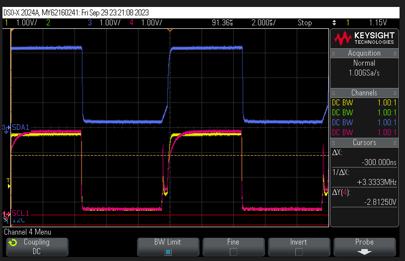

.. _known_issues_hw:

##############
Known Issues
##############

In this section is a list of known hardware issues with the Red Pitaya platforms.

Potentital I2C system failures
================================

Red Pitaya uses a |TCA9406DCUR| level translator between PS I2C pins and the I2C pins on the extension connector.
|TCA9406DCUR| has a rise time accelerator built into it that is a non-standard feature of a level translator.

A combination of physical design (i.e. bus capacitance) and interaction between the two buffer's rise time accelerators may cause I2C system failures. See the pink trace in the image below for the behavior-interaction effect due to 2 rise time accelerators on the bus.

.. |TCA9406DCUR| raw:: html

    <a href="https://www.digikey.com/en/products/detail/texas-instruments/TCA9406DCUR/2510728" target="_blank">TCA9406DCUR</a>

