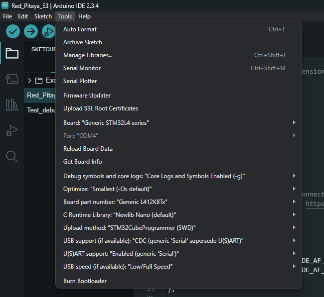

.. _E3_SW:

E3 Extension board - software
##############################

Also known as the STEMlab 125-14 Pro Gen 2 add-on module, it provides secure and robust Red Pitaya boot and shutdown options.

Features
========

- Single button power on/off of Red Pitaya board
- QSPI and eMMC boot options
- An on-board STM microcontroller that provides
    - Red Pitaya power up
    - Safe Red Pitaya shutdown
    - Watchdog timer functionality
    - Boot media selection (SD card/eMMC)
- Arduino firmware with open source code
- Connector for 16 high-speed differential lines directly connected to the Zynq FPGA

More information about the E3 board can be found in the `hardware section <E3_HW>`_.

Hardware requirements
=====================

The E3 add-on module is designed to be used with the Red Pitaya STEMlab 125-14 Pro Gen 2 board. It is connected to the Red Pitaya board via the E3 connector. The E3 connector provides power and communication between the two boards.
The E3 board is powered by the Red Pitaya board, so no additional power supply is needed. To program the E3 board you will need the following hardware:

- Red Pitaya STEMlab 125-14 Pro Gen 2 board
- E3 add-on module

And one of the following:

- ST-Link/V2 programmer and 5 wire 2.54mm pitch to 2.0mm pitch cable
- USB to micro USB cable
- USB to Serial cable (3.3 V) - for example TTL-232R-3V3

The ST-Link/V2 programmer is the recommended way to program the E3 board. It is a versatile programmer that can be used to program a wide range of STM32 microcontrollers. The USB to micro USB cable can be used to program the E3 board via the USB port.
The USB to Serial cable can be used to program the E3 board via the UART port.

ST-Link/V2 programmer
---------------------

1. Connect the ST-Link/V2 to the computer via the supplied USB cable. A red LED should light up on the programmer.
#. If the drivers are not installed automatically, download and install the drivers from the `ST official website <https://www.st.com/en/development-tools/stsw-link009.html>`_.
#. Connect the 5-wire 2.54mm pitch to 2.0mm pitch cable between the CN7 connector on the E3 board and the ST-Link/V2 programmer.

    .. figure:: img/ST-LinkV2_connections.png
       :alt: ST-Link/V2 programmer connections
       :align: center
       :width: 800px

USB connection
--------------

Connect the USB to micro USB cable between the micro USB port (CN4 connector) on the E3 board and the computer.

UART connection ???
----------------------

1. Connect the USB to Serial cable between the UART port (CN? connector) on the E3 board and the computer. Make sure that the TX and RX pins are connected correctly.

   .. .. figure:: img/USB_to_Serial_cable.png
       :alt: USB to Serial cable
       :align: center
       :width: 800px

Software requirements
=====================

The E3 add-on module featureas an STM32 microcontroller (STM32L412K8T6) which can be programmed in multiple different ways, which include:

- Arduino IDE + STM32 cube programer
- STM32CubeIDE
- Visual Studio Code + PlatformIO
- Visual Studio Code + various STM32 libraries & plugins

The options listed above are just some of the most common ways to program any STM32 microcontroller. Here we will use the Arduino IDE and STM32 cube programer, but you are free to pick your favourite method.

Installation steps
==================

Here is a detailed guide on how to install the necessary software to program the E3 board.

1. **Arduino IDE**

    - Download the latest version of the Arduino IDE from the `Arduino official website <https://www.arduino.cc/en/software>`_.
    - Open the Arduino IDE and go to *File -> Preferences*.
    - In the Additional Boards Manager URLs field, add the following link:
      ``https://github.com/stm32duino/BoardManagerFiles/raw/main/package_stmicroelectronics_index.json``
    - Click OK to close the Preferences window.
    - Go to *Tools -> Board -> Boards Manager*.
    - In the Boards Manager window, type "STM32" in the search bar.
    - Install the latest version of the "STM32 MCU based boards" package by STMicroelectronics.
    - Restart Arduino IDE.

2. **STM32 cube programer**

    - Download the STM32 cube programer from the `official website <https://www.st.com/en/development-tools/stm32cubeprog.html>`_. You will need to create an STM account to download the software.
    - Install the program and open it. During installation make sure you install all the necessary drivers.

Arduino IDE setup
=================

1. Open the Arduino IDE and go to *Tools -> Board*.
#. Select *STM32 MCU based boards -> Generic STM32L4 series*.

    .. figure:: img/Arduino_IDE_board.png
       :alt: Arduino IDE board selection
       :align: center
       :width: 1000px

#. Under *Tools -> Board Part Number*, select *Generic L412K8Tx*.

    .. figure:: img/Arduino_IDE_board_part_num.png
       :alt: Arduino IDE board part number selection
       :align: center
       :width: 1000px

#. Under *Tools -> USB Support*, select *CDC (generic 'Serial' supersede U(S)ART)*.
#. Under *Tools -> Upload Method*, select the preferred upload method:
        
    - *STM32CubeProgrammer (SWD)* for ST-Link V2 programmer
    - *STM32CubeProgrammer (Serial)* for USB to Serial cable
    - *STM32CubeProgrammer (DFU)* for USB to micro USB cable

Here are the recommended *Tools* settings:

6. Open the Arduino sketch for the E3 board. You can find the sketch in the `Red Pitaya GitHub repository <>`_.
.. TODO add the link to the script 

Arduino script setup
------------------------

When programming the E3 board we need to be careful to perform the following steps:

1. **Create a new file named "build.opt" in the same directory as the Arduino sketch.** This file should contain the following lines:

    .. code-block:: bash

        -HAL_I2C_MODULE_ENABLED
        -HAL_UART_MODULE_ENABLED
        -HAL_PCD_MODULE_ENABLED
        -HAL_HCD_MODULE_ENABLED

    The definitions in the "build.opt" file are used to enable certain features in the STM32L412K8T6 microcontroller. The definitions above are used to enable the I2C, UART, USB pin configurations. 
    The presence of *build.opt* file is automatically checked during the project build, so we don't need to worry about including it in the project.

#. **Include libraries:** 

    - **PeripheralPins.h** - this library provides the pin definitions for the STM32L412K8T6 microcontroller. It includes the pin definitions for all the peripherals on the microcontroller.
    - **Wire.h** - this library provides the I2C communication functions.

#. **Redefine the default weak pinmap declarations.** The pin declarations are defined in the *PeripheralPins.h* library, but we need to redefine them in the arduino sketch to get the correct pinout. Add the following lines at the beginning of the arduino sketch:

   .. code-block:: c

        /* REDEFINE DEFAUL PINMAP */

        const PinMap PinMap_I2C_SDA[] = {
        {PB_4,  I2C3, STM_PIN_DATA(STM_MODE_AF_OD, GPIO_NOPULL, GPIO_AF4_I2C3)},
        {PB_7,  I2C1, STM_PIN_DATA(STM_MODE_AF_OD, GPIO_NOPULL, GPIO_AF4_I2C1)},
        {NC,    NP,   0}
        };

        const PinMap PinMap_I2C_SCL[] = {
        {PA_7, I2C3, STM_PIN_DATA(STM_MODE_AF_OD, GPIO_NOPULL, GPIO_AF4_I2C3)},
        {PB_6, I2C1, STM_PIN_DATA(STM_MODE_AF_OD, GPIO_NOPULL, GPIO_AF4_I2C1)},
        {NC,   NP,   0}
        };

        const PinMap PinMap_UART_TX[] = {
        {PA_2, USART2,  STM_PIN_DATA(STM_MODE_AF_PP, GPIO_PULLUP, GPIO_AF7_USART2)},
        {NC,        NP,      0}
        };

        const PinMap PinMap_UART_RX[] = {
        {PA_3, USART2,  STM_PIN_DATA(STM_MODE_AF_PP, GPIO_PULLUP, GPIO_AF7_USART2)},
        {NC,        NP,      0}
        };

        const PinMap PinMap_USB[] = {
        { PA_11, USB, STM_PIN_DATA(STM_MODE_AF_PP, GPIO_NOPULL, GPIO_AF10_USB_FS) },  // USB_DM
        { PA_12, USB, STM_PIN_DATA(STM_MODE_AF_PP, GPIO_NOPULL, GPIO_AF10_USB_FS) },  // USB_DP
        { NC, NP, 0 }
        };

#. **Redefine the pin names:**

    .. code-block:: c

        /* PIN DEFINITIONS */

        // Power on control (same functionality)
        #define PWR_ON_CN_PIN (PA0)       // Power On signal from CN7
        #define PWR_ON_PB_PIN (PA1)       // Controlled with P-ON button

        // UART
        // R17, R18 Not populated (connect to I2C1)
        #define UART_TX_PIN (PA2)         // Shares the bus with I2C1
        #define UART_RX_PIN (PA3)         // Connected to DIO12_N, DIO12_P (R3, R4 not populated)

        // Power communication with Red Pitaya
        #define E3_WDT_KICK_PIN (PA4)     // Watchdog timer kick signal
        #define E3_SHDN_PIN (PA5)         // Shutdown signal
        #define PS_POR_PIN (PA6)          // Read only the PS signal (Power-On reset)
        #define PWR_ON_PIN (PB1)          // Power Red Pitaya signal

        // LEDs
        #define LED_RED_PIN (PA8)         // Red LED
        #define LED_GREEN_PIN (PA9)       // Green LED

        // USB connector
        #define USB_N_PIN (PA11)
        #define USB_P_PIN (PA12)

        // ST-LINK SWD communication
        #define UC_SWDIO_PIN (PA13)
        #define UC_SWCLK_PIN (PA14)

        // I2C0
        #define I2C0_SCL_PIN (PB6)        // I2C0 bus connected to Red Pitaya I2C
        #define I2C0_SDA_PIN (PB7)

        // I2C1
        #define I2C1_SCL_PIN (PA7)        // Shares the bus with UART 
        #define I2C1_SDA_PIN (PB4)        // Connected to DIO12_N, DIO12_P (R3, R4 not populated)

#. **Decleare UART and I2C buses:**

    .. code-block:: c

        //                      RX           TX
        HardwareSerial Serial1(UART_RX_PIN, UART_TX_PIN);

        //             SDA           SCL
        TwoWire Wire0(I2C0_SDA_PIN, I2C0_SCL_PIN);    // I2C 0
        TwoWire Wire1(I2C1_SDA_PIN, I2C1_SCL_PIN);    // I2C 1

#. **Configure the pins inside the setup() function:**

    .. code-block:: c

        void setup() {
            // Initialize pin IO
            pinMode(PWR_ON_CN_PIN, INPUT);      // Connector Power ON signal
            pinMode(PWR_ON_PB_PIN, INPUT);      // Button Power ON signal
            pinMode(E3_WDT_KICK_PIN, INPUT);    // Watchdog timer kick from Red Pitaya
            pinMode(E3_SHDN_PIN, OUTPUT);       // Shutdown signal for Red Pitaya            
            pinMode(PS_POR_PIN, INPUT);         // Monitor Power Supply Ready activity from Red Pitaya (Power ON Reset)
            pinMode(PWR_ON_PIN, OUTPUT);        // Power ON signal for Red Pitaya
            pinMode(LED_GREEN_PIN, OUTPUT);     // Green LED
            pinMode(LED_RED_PIN, OUTPUT);       // Red LED

            Serial1.begin(9600);              // Start UART interface 
            Wire0.begin(I2C_ADDR);            // Start I2C0 - available at address I2C_ADDR
            Wire1.begin(I2C_ADDR);            // Start I2C1
            Wire0.setClock(400000);           // Set I2C speed
            Wire1.setClock(400000);
            Wire0.onReceive(I2C0_recieve_handler);  // On I2C recieve and request from master execute a handler function
            Wire1.onReceive(I2C1_recieve_handler);
            Wire0.onRequest(I2C0_request_handler);
            Wire1.onRequest(I2C1_request_handler);
        }
    
.. note::

    The steps above are necessary for proper operation of the microcontroller. If anything is missing, the microcontroller will not work as expected.

Programming the board
=====================

Add the opt script

Link the pin declarations at the beginning of the .ide file.

Link relevant resources.

Pinout of the STM32 controller.

Registers used

Basic program/explanation.

Ways to program the board

Board must have power.
SWD - ST-linkV2
UART - hit reset button during the uploading stage, select Cube programmer - Serial
USB - make sure USB is detected, select Cube programmer - DFU

.. TODO add installation instructions for Arduino IDE, STM32 cube programer, drivers and other stuff necessary for programming the E3 board
.. Linked to E3_HW section, add instructions and explanation of the basic program 