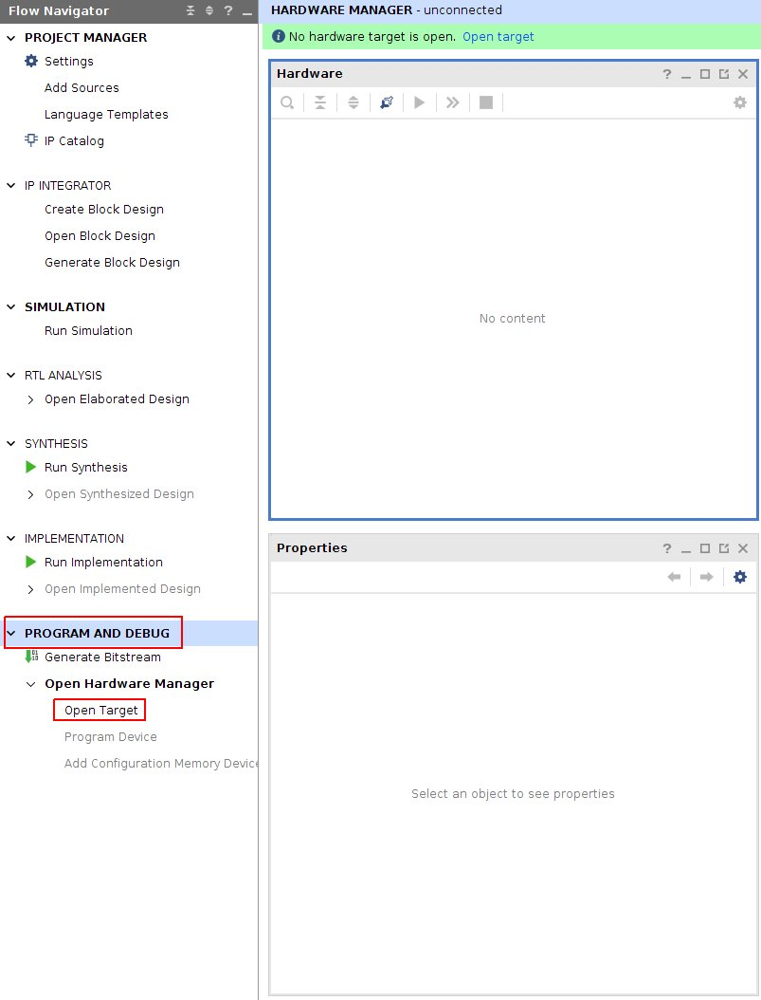

################
Build FPGA image
################

.. contents:: **Index**
   :local:
   :backlinks: none

|
|

The following build instructions were tested on Ubuntu 20.04.
It is important to install the correct Vivado and SDK versions as the projects and scripts are made for those versions and may return errors during the build.

.. note::

   Please note that the FPGA code is located in a separate repository from the ecosystem on our GitHub page:

   - Ecosystem: |ecosystem| 
   - FPGA: |FPGA|

   Running the ":ref:`Makefile.x86 <dev_tree_xil>`" will download the necessary files from the RedPitaya/RedPitaya-FPGA repository.

   For building the FPGA image for different boards please see the :ref:`Buildprocess <buildprocess>`.

.. |ecosystem| raw:: html

   <a href="https://github.com/RedPitaya/RedPitaya" target="_blank">RedPitaya/RedPitaya</a>

.. |FPGA| raw:: html

   <a href="https://github.com/RedPitaya/RedPitaya-FPGA" target="_blank">RedPitaya/RedPitaya-FPGA</a>

|
|

*************
Prerequisites
*************

Libraries used by ModelSim-Altera
=====================================

Install libraries:

.. code-block:: shell-session

    # apt-get install unixodbc unixodbc-dev libncurses-dev libzmq3-dev libxext6 libasound2 libxml2 libx11-6 libxtst6 libedit-dev libxft-dev libxi6 libx11-6:i386 libxau6:i386 libxdmcp6:i386 libxext6:i386 libxft-dev:i386 libxrender-dev:i386 libxt6:i386 libxtst6:i386

|

Xilinx Vivado 2020.1
====================

Xilinx Vivado is available from the |Vivado download page|.

.. note::

   Please note that it might be necessary to download the **Full installer** as the **Web installer** might give an *Installer outdated* warning and refuse to proceed with the installation process.

   Additionally, on officially unsupported versions of **Linux**, the installer gives you a warning, but Vivado should work fine, for example running it on Ubuntu 20.04 or 22.04 instead of 18.04.

If the installer glitches out anyway, your /etc/os-release file needs to be changed to "fake" the OS version.
First, backup the file and then open it as a superuser with a text editor such as nano:

.. code-block:: shell-session

    $ sudo nano /etc/os-release

and change the VERSION line to ``VERSION=”18.04.4 LTS (Bionic Beaver)"`` and save the file. The edited file should look something like this:

.. figure:: os_release.png

|

Afterward, you can either run the **Xilinx_Unified_2020.1_0602_1208_Lin64.bin** (Linux web installer) or the xsetup file from the extracted folder (unified installer).
After the installation finishes replace the modified file with the one you backed up – failure to do so might cause some problems with other programs.

For more information on Vivado installation `click here <https://redpitaya-knowledge-base.readthedocs.io/en/latest/learn_fpga/3_vivado_env/tutorfpga1.html>`_.

.. |Vivado download page| raw:: html

   <a href="https://www.xilinx.com/support/download/index.html/content/xilinx/en/downloadNav/vivado-design-tools/archive.html" target="_blank">Xilinx downloads page</a>

|

Xilinx SDK development environments 2019.1
=============================================

.. note::

   Please note that it might be necessary to download the **Full installer** as the **Web installer** might give an *Installer outdated* warning and refuse to proceed with the installation process.

Xilinx SDK is available from the |SDK download page|.

.. |SDK download page| raw:: html

   <a href="https://www.xilinx.com/support/download/index.html/content/xilinx/en/downloadNav/vitis/archive-sdk.html" target="_blank">Xilinx downloads page</a>

|

.. _dev_tree_xil:

Device Tree Xilinx
==================

FPGA build requires a repository with a device tree from Xilinx.
You can prepare it by running the command:

.. code-block:: shell-session

    $ make -f Makefile.x86 devicetree

.. note::

   The file can be manually uploaded.

   .. code-block:: shell-session

       curl -L https://github.com/Xilinx/device-tree-xlnx/archive/xilinx-v2017.2.tar.gz/ -o device-tree-xlnx-xilinx-v2017.2.tar.gz

   Extract the .tar.gz to */<redpitaya path>/tmp/device-tree-xlnx-xilinx-v2017.2*.

|
|

*******************
Directory structure
*******************

There are multiple FPGA projects, some with generic functionality, some with specific functionality for an application.
Common code for all projects is placed directly into the ``FPGA`` directory. Common codes are mostly reusable modules.
Project-specific code is placed inside the ``fpga/prj/name/`` directories and is similarly organized as common code.

.. |ug895| replace:: Vivado System-Level Design Entry
.. _ug895: https://www.xilinx.com/support/documentation/sw_manuals/xilinx2017_2/ug895-vivado-system-level-design-entry.pdf

.. tabularcolumns:: |p{30mm}|p{120mm}|

+-------------------+------------------------------------------------------------------+
|  path             | contents                                                         |
+===================+==================================================================+
| ``fpga/Makefile`` | main Makefile, used to run FPGA-related tools                    |
+-------------------+------------------------------------------------------------------+
| ``fpga/*.tcl``    | TCL scripts to be run inside FPGA tools                          |
+-------------------+------------------------------------------------------------------+
| ``fpga/archive/`` | archive of XZ compressed FPGA bit files                          |
+-------------------+------------------------------------------------------------------+
| ``fpga/doc/``     | documentation (block diagrams, address space, ...)               |
+-------------------+------------------------------------------------------------------+
| ``fpga/brd/``     | board files |ug895|_                                             |
+-------------------+------------------------------------------------------------------+
| ``fpga/ip/``      | third party IP, for now, Zynq block diagrams                     |
+-------------------+------------------------------------------------------------------+
| ``fpga/rtl/``     | Verilog (SystemVerilog) *Register-Transfer Level*                |
+-------------------+------------------------------------------------------------------+
| ``fpga/sdc/``     | *Synopsys Design Constraints* contains Xilinx design constraints |
+-------------------+------------------------------------------------------------------+
| ``fpga/sim/``     | simulation scripts                                               |
+-------------------+------------------------------------------------------------------+
| ``fpga/tbn/``     | Verilog (SystemVerilog) *test bench*                             |
+-------------------+------------------------------------------------------------------+
| ``fpga/dts/``     | device tree source include files                                 |
+-------------------+------------------------------------------------------------------+
| ``fpga/prj/name`` | project `name` specific code                                     |
+-------------------+------------------------------------------------------------------+
| ``fpga/hsi/``     | *Hardware Software Interface* contains                           |
|                   | FSBL (First Stage Boot Loader) and                               |
|                   | DTS (Design Tree) builds                                         |
+-------------------+------------------------------------------------------------------+

|
|

*****************
FPGA sub-projects
*****************

There are multiple FPGA sub-projects they mostly contain incremental changes
on the first Red Pitaya release.

.. note::

   If unsure which FPGA project to use for you project, please look at the "Application" column, where examples of use are presented.

   It is recommended to use the **0.94** release as the *default project*.

+-------------------+------------------------------------------------------------------------+------------------------+
| prj/name          | Description                                                            | Application            |
+===================+========================================================================+========================+
| 0.93              | This is the original Red Pitaya release including all bugs.            |                        |
|                   | For deprecated application backward compatibility only.                |                        |
+-------------------+------------------------------------------------------------------------+------------------------+
| 0.94              | 1. The CDC (clock domain crossing) code on the custom CPU bus |br|     | Oscilloscope |br|      |
|                   |    was removed. Instead CDC for GP0 port already available in |br|     | Signal generator |br|  |
|                   |    PS was used. This improves speed and reliability and reduces |br|   | Spectrum analyzer |br| |
|                   |    RTL complexity.                                              |br|   | Bode analyzer |br|     |
|                   | 2. A value increment bug in the generator was fixed, this should |br|  | LCR meter |br|         |
|                   |    improve generated frequencies near half sampling rate.       |br|   |                        |
|                   | 3. XADC custom RTL wrapper was replaced with Xilinx AXI XADC.  |br|    |                        |
|                   |    This enables the use of the Linux driver with IIO streaming |br|    |                        |
|                   |    support.                                                            |                        |
+-------------------+------------------------------------------------------------------------+------------------------+
| stream_app        | 1. Streaming ADC and DAC data to/from DDR3 memory buffers. |br|        | Streaming manager      |
|                   | 2. Streaming GPIO inputs and outputs to/from DDR3 memory buffers.      |                        |
+-------------------+------------------------------------------------------------------------+------------------------+
| classic           | 1. A lot of the code was rewritten in SystemVerilog. |br|              |                        |
|                   | 2. Removed GPIO and LED registers from housekeeping, instead the |br|  |                        |
|                   |    GPIO controller inside PL is used. This enables the use of |br|     |                        |
|                   |    Linux kernel features for GPIO (IRQ, SPI, I2C, 1-wire) and |br|     |                        |
|                   |    LED (triggers).                                                     |                        |
+-------------------+------------------------------------------------------------------------+------------------------+
| logic             | This image is used by the logic analyzer, it is using DMA to |br|      | Logic analyzer         |
|                   | transfer data to main DDR3 RAM. ADC and DAS code is unfinished.        |                        |
+-------------------+------------------------------------------------------------------------+------------------------+
| axi4lite          | Image intended for testing various AXI4 bus implementations. |br|      |                        |
|                   | It contains a Vivado ILA (integrated logic analyzer) to |br|           |                        |
|                   | observe and review the performance of the bus implementation.          |                        |
+-------------------+------------------------------------------------------------------------+------------------------+

|
|

.. _buildprocess:

****************
Building process
****************

The following table shows which projects are available on which boards.

+-------------------+---------------------+---------------------------+-------------------+---------------------------+---------------------------+
| Build name        | Build Project Flag  | STEMlab 125-10 |br|       | SIGNALlab 250-12  | SDRlab 122-16             | STEMlab 125-14 4-Input    |
|                   |                     | STEMlab 125-14 |br|       |                   |                           |                           |
|                   |                     | STEMlab 125-14-Z7020 |br| |                   |                           |                           |
|                   |                     |                           |                   |                           |                           |
+===================+=====================+===========================+===================+===========================+===========================+
| 0.94              | v0.94               | X                         |                   | X                         | X                         |
+-------------------+---------------------+---------------------------+-------------------+---------------------------+---------------------------+
| 0.94_250          | v0.94_250           |                           | X                 |                           |                           |
+-------------------+---------------------+---------------------------+-------------------+---------------------------+---------------------------+
| stream_app        | stream_app          | X                         |                   | X                         |                           |
+-------------------+---------------------+---------------------------+-------------------+---------------------------+---------------------------+
| stream_app_250    | stream_app_250      |                           | X                 |                           |                           |
+-------------------+---------------------+---------------------------+-------------------+---------------------------+---------------------------+
| logic             | logic               | X                         |                   |                           |                           |
+-------------------+---------------------+---------------------------+-------------------+---------------------------+---------------------------+
| logic_250         | logic_250           |                           | X                 |                           |                           |
+-------------------+---------------------+---------------------------+-------------------+---------------------------+---------------------------+
| tft               | tft                 | X                         |                   |                           |                           |
+-------------------+---------------------+---------------------------+-------------------+---------------------------+---------------------------+
| axi4lite          | axi4lite            | X                         |                   |                           |                           |
+-------------------+---------------------+---------------------------+-------------------+---------------------------+---------------------------+
| classic           | classic             | X                         |                   |                           |                           |
+-------------------+---------------------+---------------------------+-------------------+---------------------------+---------------------------+
| mercury           | mercury             | X                         |                   |                           |                           |
+-------------------+---------------------+---------------------------+-------------------+---------------------------+---------------------------+

|

Table of required build flags for FPGA projects per board

+------------------------------+---------------------+
| Model                        | Build Model flag    |
+==============================+=====================+
| STEMlab 125-10 |br|          | MODEL=Z10           |
| STEMlab 125-14 |br|          |                     |
+------------------------------+---------------------+
| STEMlab 125-14-Z7020         | MODEL=Z20_14        |
+------------------------------+---------------------+
| SDRlab 122-16                | MODEL=Z20           |
+------------------------------+---------------------+
| SIGNALlab 250-12             | MODEL=Z20_250       |
+------------------------------+---------------------+
| STEMlab 125-14 4-Input       | MODEL=Z20_125_4CH   |
+------------------------------+---------------------+

|

1.  On the PC that has Vivado installed run the following commands to properly configure system variables (needs to be done every time you open a new terminal window).
    Alternatively, you can add the following lines to your .bashrc file using a text editor – this will ensure that they are run at the system startup:

    .. code-block:: shell-session

        source <path to Xilinx installation directory>/Xilinx/Vivado/2020.1/settings64.sh
        source <path to Xilinx installation directory>/Xilinx/SDK/2019.1/settings64.sh
   
    |

.. _xilinx_path:

2.  The Xilinx installation directory should be located in */opt* directory (or */tools*, if you used the default Vivado installation directory).
    These two commands will set up the $PATH environment variable.
    It might also be necessary to add the SDK bin folder to the $PATH environment variable:

    .. code-block:: shell-session

        export PATH=<path to Xilinx installation directory>/Xilinx/SDK/2019.1/bin:$PATH

    On Windows, please check |windows_path| or search the web. Add the path to the */bin* directory for Vivado and SDK.

    |

.. |windows_path| raw:: html

   <a href="https://www.computerhope.com/issues/ch000549.htm" target="_blank">this link</a>

3.  Check if you have Git command line tools installed on your computer:

    .. code-block:: shell-session

        sudo apt update
        sudo apt install git   

    |

4.  Create a new directory for the Red Pitaya code. Then download the code by running the following command in the newly created directory:

    .. code-block:: shell-session

        git clone https://github.com/RedPitaya/RedPitaya.git

    .. note::

       For an alternative way to create an FPGA project plese check |FPGA_tutorial|. If following the FPGA tutorial you can reffer to **step 6 and later** in this section, please note that all paths in the following section start with *<Red Pitaya repository>/RedPitaya-FPGA/prj* instead of *<Red Pitaya repository>/fpga/prj*.

    |

.. |FPGA_tutorial| raw:: html

      <a href="https://redpitaya-knowledge-base.readthedocs.io/en/latest/learn_fpga/3_vivado_env/tutorfpga2.html#programming-the-fpga" target="_blank">Red Pitaya FPGA tutorial</a>

5.  The devicetree sources must also be downloaded and extracted by running

    .. code-block:: shell-session

        make -f Makefile.x86 devicetree

    |

The default mode for building the FPGA is to run a TCL script inside Vivado.
Non-project mode is used, to avoid the generation of project files,
which are too many and difficult to handle.
This allows us to only place source files and scripts under version control.

The following scripts perform various tasks:

.. tabularcolumns:: |p{60mm}|p{60mm}|

+-----------------------------------+------------------------------------------------+
| TCL script                        | action                                         |
+===================================+================================================+
| ``red_pitaya_vivado.tcl``         | creates the bitstream and reports              |
+-----------------------------------+------------------------------------------------+
| ``red_pitaya_vivado_project.tcl`` | creates a Vivado project for graphical editing |
+-----------------------------------+------------------------------------------------+
| ``red_pitaya_hsi_fsbl.tcl``       | creates FSBL executable binary                 |
+-----------------------------------+------------------------------------------------+
| ``red_pitaya_hsi_dts.tcl``        | creates device tree sources                    |
+-----------------------------------+------------------------------------------------+

|

6.  **Non-project mode:** First, change your directory to *<path to Red Pitaya repository>/RedPitaya/fpga*.
    To generate a bit file, reports, device tree, and FSBL, run (replace ``name`` with project name and ``model`` with model flag):

    .. code-block:: shell-session

        $ make PRJ=name MODEL=model

    For example, build v0.94 for STEMlab 125-14:

    .. code-block:: shell-session

        $ make PRJ=v0.94 MODEL=Z10

    .. note::

       Running the commands above will automatically generate the whole project without openning Vivado in the process (non-project mode).

       To open the project inside Vivado and edit the FPGA code there please check **step 8**.

    |

7.  The resulting .bit file is located in */prj/<project name>/out/redpitaya.bit*
    This file must be copied to */opt/redpitaya/fpga* on the Red Pitaya itself.

|

.. note:: 

   If the script returns the following error:
   
   .. code-block:: shell-session
   
       BD_TCL-109" "ERROR" "This script was generated using Vivado 2020.1 ...
   
   First, find the line containing
   
   .. code-block:: shell-session
   
       set scripts_vivado_version 2020.1
   
   and change 2020.1 to your version.
   This is a quick and dirty way to get the build working in other versions of Vivado.
   However, solving the problem this way could be problematic if some of the IPs used are different in your version.

   To update the script properly, open the project GUI (see below), and go to the menu **Reports-> Report IP Status**. A new tab opens below the code window.
   If all IPs are not up-to-date, they need to be updated.
   Before doing this, the TCL script must still be manually modified to your Vivado version, or the block design will not be created when Vivado starts.

   .. figure:: IPupdate.png

   |

   When IPs are up-to-date, go to the tab Tcl console and run the command:

   .. code-block:: shell-session

       write_bd_tcl systemZ10.tcl

   Of course, the script may also be named *systemZ20.tcl* or *systemZ20_14.tcl*, depending on your board.

   This generates a new tcl script that replaces the old script in *fpga/prj/<project name>/ip*.

|

8.  **Project mode:** To generate and open a Vivado project using **GUI**, run:

    .. code-block:: shell-session

        $ make project PRJ=name MODEL=model

    For example, the v0.94 project for STEMlab 125-14:

    .. code-block:: shell-session

        $ make project PRJ=v0.94 MODEL=Z10

    .. figure:: project_make.png
   
    A new, blank project will automatically be built and all the necessary files associated with Red Pitaya will be added.
    You can add/write your Verilog module at the end of *red_pitaya_top.sv* file (or add a new source by right-clicking the *Design Sources* folder and *Add Source*):
   
    .. figure:: vivado_project.png

    |

    You can connect newly added sources in the Diagram (Block Design) section (If it is not open: *Window => Design => double click system*).
    Add them to the design by right click => Add Module in the design window (for more information check the *Learn FPGA programming => FPGA lessons section*)
    https://redpitaya-knowledge-base.readthedocs.io/en/latest/learn_fpga/4_lessons/top.html

|

.. note::

   Before you try to Run Synthesis, Run Implementation, or Write Bitstream, you should check *Language and Region settings* on your Ubuntu/Linux computer –
   make sure you have a **Format** that uses **a dot (“.”) as a decimal separator** (the United Kingdom or the United States will work).
   Otherwise, the Synthesis might fail as some parts of **Vivado demand a dot as the decimal separator**, which will, in turn, cause Vivado not to recognize certain parts of the model.

|

9.  The resulting .bit file is located in **<Red Pitaya repository>/fpga/prj/<project name>/project/redpitaya.runs/impl_1/red_pitaya_top.bit**
    This file must be copied to the Red Pitaya Linux OS into the **/opt/redpitaya/fpga** directory.

    .. figure:: vivadoGUI.png

    |

    1. Run Synthesis
    2. Run Implementation
    3. Generate Bitstream

    The resulting .bit file is located in **<Red Pitaya repository>/fpga/prj/<project name>/project/redpitaya.runs/impl_1/** as **red_pitaya_top.bit** (the name of the .bit file is the same as the top module of the design).

|

Reprogramming the FPGA with a custom image
============================================

How the FPGA is reprogrammed depends on the OS version as well as whether the project has been executed in project mode (GUI) or non-project mode.

Please make sure that the PATH environment variable is set correctly. See :ref:`Step 2 <xilinx_path>` in the chapter above.

.. note::

   On Windows, the process can also be done through a standard Command Prompt, but any ``echo`` commands must be executed inside the Windows Subsystem for Linux (WSL) Terminal (The output file encoding is a problem with Windows ``echo``). For more information, refer to the following forum topics:
   
      - |batch_file_topic_1|
      - |batch_file_topic_2|

.. |batch_file_topic_1| raw:: html

      <a href="https://superuser.com/questions/601282/%cc%81-is-not-recognized-as-an-internal-or-external-command" target="_blank">́╗┐' is not recognized as an internal or external command</a>

.. |batch_file_topic_2| raw:: html

      <a href="https://devblogs.microsoft.com/oldnewthing/20210726-00/?p=105483" target="_blank">Diagnosing why your batch file prints a garbage character, one character, and nothing more</a>

.. tabs::

   .. tab:: OS version 1.04 or older

      Please note that you need to change the forward slashes to backward slashes on Windows.

      1.  Open Terminal or CMD and go to the .bit file location.

          .. code-block:: bash
    
              cd <Path/to/RedPitaya/repository>/prj/v0.94/project/repitaya.runs/impl_1

      2.  Send the file .bit (*red_pitaya_top.bit* is the default name) to the Red Pitaya with the ``scp`` command.

          .. code-block:: bash

              scp red_pitaya_top.bit root@rp-xxxxxx.local:/root

      3.  Now establish an :ref:`SSH communication <ssh>` with your Red Pitaya and check if you have the copy *red_pitaya_top.bit* in the root directory.

          .. code-block:: bash

              redpitaya> ls

      4.  Load the *red_pitaya_top.bit* to **xdevcfg** with

          .. code-block:: bash

              redpitaya> cat red_pitaya_top.bit > /dev/xdevcfg

   .. tab:: OS version 2.00

      The 2.00 OS uses a new mechanism of loading the FPGA. The process will depend on whether you are using Linux or Windows as the ``echo`` command functinality differs bewteen the two.

      Please note that you need to change the forward slashes to backward slashes on Windows.
        
      **Non-project mode:** Skip to *step 3*.

      1.  On Windows, open **Vivado HSL Command Prompt** and go to the *.bit* file location.

          On Linux, open the **Terminal** and go to the *.bit* file location.

          .. code-block:: bash

              cd <Path/to/RedPitaya/repository>/prj/v0.94/project/repitaya.runs/impl_1

      2.  Create *.bif* file (for example, *red_pitaya_top.bif*) and use it to generate a binary bitstream file (*red_pitaya_top.bit.bin*)

          **Windows (Vivado HSL Command Prompt):**

          .. code-block:: bash

              echo all:{ path/to/bitfile/fpga.bit } >  path/to/biffile/fpga.bif
              bootgen -image path/to/biffile/fpga.bif -arch zynq -process_bitstream bin -o path/to/binfile/red_pitaya.bit.bin -w

          Example code:

          .. code-block:: bash

              echo all:{ red_pitaya_top.bit } >  red_pitaya_top.bif
              bootgen -image red_pitaya_top.bif -arch zynq -process_bitstream bin -o red_pitaya_top.bit.bin -w

          **Linux and Windows (WSL + Normal CMD):**

          .. code-block:: bash

              echo -n "all:{ red_pitaya_top.bit }" >  red_pitaya_top.bif
              bootgen -image red_pitaya_top.bif -arch zynq -process_bitstream bin -o red_pitaya_top.bit.bin -w

      3.  Send the file *.bit.bin* to the Red Pitaya with the ``scp`` command.

          .. code-block:: bash
   
              scp red_pitaya_top.bit.bin root@rp-xxxxxx.local:/root

      4.  Now establish an :ref:`SSH communication <ssh>` with your Red Pitaya and check if you have the copy *red_pitaya_top.bit.bin* in the root directory.

          .. code-block:: bash

              redpitaya> ls

      5.  Load the *red_pitaya_top.bit.bin* image into the FPGA:

          .. code-block:: bash

              redpitaya> /opt/redpitaya/bin/fpgautil -b red_pitaya_top.bit.bin

|

Reverting to original FPGA image
==================================

If you want to roll back to the official Red Pitaya FPGA program, run the following command:

.. tabs::

   .. group-tab:: OS version 1.04 or older

      .. code-block:: shell-session

          redpitaya> cat /opt/redpitaya/fpga/fpga_0.94.bit > /dev/xdevcfg

   .. group-tab:: OS version 2.00

      .. code-block:: shell-session

          redpitaya> overlay.sh v0.94

or simply restart your Red Pitaya.

|
|

********************
Programming via JTAG
********************

These instructions show how to use a JTAG cable to program a Red Pitaya directly from Xilinx Vivado.
To do so we use *Red Pitaya STEMlab 125-14*, *Ubuntu 20.04*, *Vivado 2020.1*, *Digilent JTAG-HS3 cable with a 14 to 6-pin adapter*, and *Digilent Adept 2 software*.

To start, get an appropriate JTAG cable. In these instructions, we use a Digilent JTAG-HS3 cable with a 14 to 6-pin adapter.
Digilent JTAG-HS2 may be used as well and might be more appropriate, as it uses a 6-pin connector that can connect directly to Red Pitaya's JTAG.
For a complete list of JTAG cables, supported by Vivado, see Xilinx UG908 - Programming and Debugging, appendix D.
https://www.xilinx.com/content/dam/xilinx/support/documentation/sw_manuals/xilinx2021_2/ug908-vivado-programming-debugging.pdf

See if the JTAG cable is detected. In Ubuntu, that is done with:

.. code-block:: shell-session

    $ lsusb

JTAG-HS3 is displayed as an FTDI device.

.. figure:: lsusb.jpg

|

Now, install Digilent Adept 2 software from https://digilent.com/reference/software/adept/start.
You will need both Utilities and Runtime. These are both available as .deb packages. If installing from GUI does not work, they can be installed using:

.. code-block:: shell-session

    $ sudo dpkg -i <path to package>

Once these packages are installed, you can check if the driver detects your adapter (only applies to Digilent cables):

.. code-block:: shell-session

    $ djtgcfg enum

.. figure:: driver_check.jpg

|

Now, open Vivado 2020.1, click *Program and Debug -> Open Target -> Auto Connect*.

|

This will display a Xilinx-compatible JTAG cable in the Hardware window, under localhost.

.. figure:: cable.jpg

|

Now plug your cable into Red Pitaya's JTAG connector. The pins are marked on the bottom side of Red Pitaya's PCB.

.. figure:: JTAG_pins.jpg

|

A Xilinx device should now appear in Vivado (on the detected cable). In this case, it's an xc7z010_1.

.. figure:: program.jpg

|

Now, you can click Program Device.

.. figure:: connected.jpg

|

A bitfile selector prompt appears and when a valid file is selected, Red Pitaya can be programmed.

.. figure:: file_select.jpg

|
|

**********
Simulation
**********

ModelSim as provided for free from Altera is used to run simulations.
Scripts expect the default install location.
On Ubuntu, the install process fails to create an appropriate path to executable files,
so this path must be created:

.. code-block:: shell-session

    $ ln -s $HOME/intelFPGA/16.1/modelsim_ase/linux $HOME/intelFPGA/16.1/modelsim_ase/linux_rh60
    $ sudo apt install libxft2:i386

To run the simulation, Vivado tools have to be installed.
There is no need to source ``settings.sh``.
For now, the path to the ModelSim simulator is hard coded into the simulation ``Makefile``.

.. code-block:: shell-session

    $ cd fpga/sim

Simulations can be run by running ``make`` with the bench file name as target:

.. code-block:: shell-session

    $ make top_tb

Some simulations have a waveform window configuration script like ``top_tb.tcl``
which will prepare an organized waveform window.

.. code-block:: shell-session

    $ make top_tb WAV=1

|
|

.. _devicetree:

***********
Device tree
***********

The device tree is used by Linux to describe features and address the space of memory-mapped hardware attached to the CPU.

Running ``make`` of a project will create a device tree source and some include files in the directory ``dts``:

+------------------+------------------------------------------------------------------------+
| device tree file | contents                                                               |
+==================+========================================================================+
| `zynq-7000.dtsi` | Description of peripherals inside PS (processing system)               |
+------------------+------------------------------------------------------------------------+
| `pl.dtsi`        | description of AXI attached peripherals inside PL (programmable logic) |
+------------------+------------------------------------------------------------------------+
| `system.dts`     | description of all peripherals, includes the above ``*.dtsi`` files    |
+------------------+------------------------------------------------------------------------+

To enable some Linux drivers (Ethernet, XADC, I2C EEPROM, SPI, GPIO, and LED) additional configuration files.
Generic device tree files can be found in ``fpga/dts`` while project-specific code is in ``fpga/prj/name/dts/``.

|
|

**************
Signal mapping
**************

XADC inputs
===========

XADC input data can be accessed through the Linux IIO (Industrial IO) driver interface.

+--------+-----------+----------+---------+-----------------------+--------------------+------------------+
| E2 con | schematic | ZYNQ p/n | XADC in | IIO filename          | Measurement target | Full scale range |
+========+===========+==========+=========+=======================+====================+==================+
| AI0    | AIF[PN]0  | B19/A20  | AD8     | in_voltage11_raw      | general purpose    | 3.50 V           |
+--------+-----------+----------+---------+-----------------------+--------------------+------------------+
| AI1    | AIF[PN]1  | C20/B20  | AD0     | in_voltage9_raw       | general purpose    | 3.50 V           |
+--------+-----------+----------+---------+-----------------------+--------------------+------------------+
| AI2    | AIF[PN]2  | E17/D18  | AD1     | in_voltage10_raw      | general purpose    | 3.50 V           |
+--------+-----------+----------+---------+-----------------------+--------------------+------------------+
| AI3    | AIF[PN]3  | E18/E19  | AD9     | in_voltage12_raw      | general purpose    | 3.50 V           |
+--------+-----------+----------+---------+-----------------------+--------------------+------------------+
|        | AIF[PN]4  | K9 /L10  | AD      | in_voltage8_vpvn_raw  | 5V power supply    | 6.10 V           |
+--------+-----------+----------+---------+-----------------------+--------------------+------------------+

|

Input range
-----------

The default mounting intends for unipolar XADC inputs, which allow for observing only positive signals with a saturation range of **0 V ~ 0.5 V**.
There are additional voltage dividers use to extend this range to **0 V ~ 3.5 V**.

It is possible to configure XADC inputs into a bipolar mode with a range of **-0.5 V ~ +0.5 V**, but it requires removing R273 and providing a **0.5 V ~ 1 V** common voltage on the :ref:`E2 <E2>` connector. Please consult the :ref:`schematics <schematics_125_14>` for more details.

5V power supply
~~~~~~~~~~~~~~~

.. code-block:: none

                          ------------------0  Vout
             -----------  |  -----------
   Vin  0----| 56.0 kΩ |-----| 4.99 kΩ |----0  GND
             -----------     -----------

.. math::

   ratio = \frac{4.99 k\Omega}{56.0 k\Omega +4.99 k\Omega} = 0.0818

   range = \frac{0.5 V}{ratio} = 6.11 V

General purpose inputs
~~~~~~~~~~~~~~~~~~~~~~

.. code-block:: none

                          ------------------0  Vout
             -----------  |  -----------
   Vin  0----| 30.0 kΩ |-----| 4.99 kΩ |----0  GND
             -----------     -----------

.. math::

   ratio = \frac{4.99 k\Omega}{30.0 k\Omega + 4.99  k\Omega} = 0.143

   range = \frac{0.5 V}{ratio} = 3.50 V

|

GPIO and LEDs
=============

Handling of GPIO and LED signals depends on whether they are connected to Zynq-7000 PS (MIO) or PL (EMIO or FPGA) block.

MIO pins signals are controlled by the PS block.
Each pin has a few multiplexed functions.
The multiplexer, slew rate, and pull-up resistor enable can be controlled using software usually with device tree `pinctrl` code.
Xilinx also provides Linux drivers for all PS based peripherals, so all MIO signals can be managed using Linux drivers.

Pins connected to the PL block require FPGA code to function.
If the pin signals are wired directly (in the FPGA sources) from PS-based EMIO signals to the FPGA pads, then they can be managed using Linux drivers intended for the PS block.

The default pin assignment for GPIO is described in the next table.

+--------+------------+--------------------+------------------+------------------------------+-------------------------------------------+
| FPGA   | Connector  | GPIO               | MIO/EMIO index   | ``sysfs`` index              | Comments, LED color, dedicated meaning    |
+========+============+====================+==================+==============================+===========================================+
|        |            |                    |                  |                              | green, *Power Good* status                |
+--------+------------+--------------------+------------------+------------------------------+-------------------------------------------+
|        |            |                    |                  |                              | blue, FPGA programming *DONE*             |
+--------+------------+--------------------+------------------+------------------------------+-------------------------------------------+
|        |            | ``exp_p_io [7:0]`` | ``EMIO[15: 8]``  | ``906+54+[15: 8]=[975:968]`` |                                           |
+--------+------------+--------------------+------------------+------------------------------+-------------------------------------------+
|        |            | ``exp_n_io [7:0]`` | ``EMIO[23:16]``  | ``906+54+[23:16]=[983:976]`` |                                           |
+--------+------------+--------------------+------------------+------------------------------+-------------------------------------------+
|        |            | LED ``[7:0]``      | ``EMIO[ 7: 0]``  | ``906+54+[ 7: 0]=[967:960]`` | yellow                                    |
+--------+------------+--------------------+------------------+------------------------------+-------------------------------------------+
|        |            | LED ``  [8]``      |  ``MIO[ 0]``     | ``906+   [ 0]   = 906``      | yellow = SD card access  (user defined)   |
+--------+------------+--------------------+------------------+------------------------------+-------------------------------------------+
|        |            | LED ``  [9]``      |  ``MIO[ 7]``     | ``906+   [ 7]   = 913``      | red    = CPU heartbeat (user defined)     |
+--------+------------+--------------------+------------------+------------------------------+-------------------------------------------+
| ``D5`` | ``E2[ 7]`` | UART1_TX           |  ``MIO[ 8]``     | ``906+   [ 8]   = 914``      | output only                               |
+--------+------------+--------------------+------------------+------------------------------+-------------------------------------------+
| ``B5`` | ``E2[ 8]`` | UART1_RX           |  ``MIO[ 9]``     | ``906+   [ 9]   = 915``      | requires ``pinctrl`` changes to be active |
+--------+------------+--------------------+------------------+------------------------------+-------------------------------------------+
| ``E9`` | ``E2[ 3]`` | SPI1_MOSI          |  ``MIO[10]``     | ``906+   [10]   = 916``      | requires ``pinctrl`` changes to be active |
+--------+------------+--------------------+------------------+------------------------------+-------------------------------------------+
| ``C6`` | ``E2[ 4]`` | SPI1_MISO          |  ``MIO[11]``     | ``906+   [11]   = 917``      | requires ``pinctrl`` changes to be active |
+--------+------------+--------------------+------------------+------------------------------+-------------------------------------------+
| ``D9`` | ``E2[ 5]`` | SPI1_SCK           |  ``MIO[12]``     | ``906+   [12]   = 918``      | requires ``pinctrl`` changes to be active |
+--------+------------+--------------------+------------------+------------------------------+-------------------------------------------+
| ``E8`` | ``E2[ 6]`` | SPI1_CS#           |  ``MIO[13]``     | ``906+   [13]   = 919``      | requires ``pinctrl`` changes to be active |
+--------+------------+--------------------+------------------+------------------------------+-------------------------------------------+
| ``B13``| ``E2[ 9]`` | I2C0_SCL           |  ``MIO[50]``     | ``906+   [50]   = 956``      | requires ``pinctrl`` changes to be active |
+--------+------------+--------------------+------------------+------------------------------+-------------------------------------------+
| ``B9`` | ``E2[10]`` | I2C0_SDA           |  ``MIO[51]``     | ``906+   [51]   = 957``      | requires ``pinctrl`` changes to be active |
+--------+------------+--------------------+------------------+------------------------------+-------------------------------------------+

|

Linux access to LED
===================

This document is used as a reference: `http://www.wiki.xilinx.com/Linux+GPIO+Driver <http://www.wiki.xilinx.com/Linux+GPIO+Driver>`_

By providing GPIO/LED details in the device tree, it is possible to access LEDs using a dedicated kernel interface.

To show CPU load on LED 9 use:

.. code-block:: shell-session

    $ echo heartbeat > /sys/class/leds/led0/trigger

To switch LED 8 ON use:

.. code-block:: shell-session

    $ echo 1 > /sys/class/leds/led0/brightness

|

PS pinctrl for MIO signals
============================

It is possible to modify MIO pin functionality using device tree files during Linux bootup.
The listed files should be included in the main device tree.

These files can be modified into device tree overlays, which can be used to modify MIO functionality at runtime.

+--------------------+------------------------------------------------------+
| device tree file   | description                                          |
+====================+======================================================+
| ``spi2gpio.dtsi``  | E2 connector, SPI1 signals are repurposed as GPIO    |
+--------------------+------------------------------------------------------+
| ``i2c2gpio.dtsi``  | E2 connector, I2C0 signals are repurposed as GPIO    |
+--------------------+------------------------------------------------------+
| ``uart2gpio.dtsi`` | E2 connector, UART1 signals are repurposed as GPIO   |
+--------------------+------------------------------------------------------+
| ``miso2gpio.dtsi`` | E2 connector, SPI1 MISO signal is repurposed as GPIO |
|                    | SPI can then only be used for writing (maybe 3-wire) |
+--------------------+------------------------------------------------------+

|
|

.. _fpga_registers:

**********
Registers
**********

.. toctree::
   :maxdepth: 1

   regset/2.00-15/list.rst
   regset/2.00-18/list.rst
   regset/2.00-23/list.rst
   regset/in_dev/list.rst

.. |br| raw:: html

    
